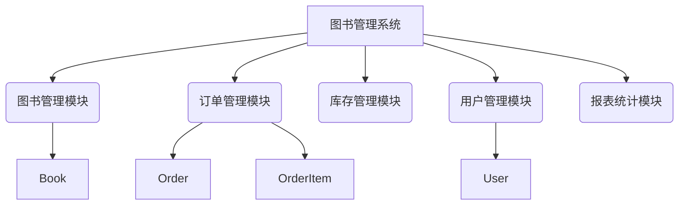

# 书店图书管理系统详细设计与具体代码实现

## 1.背景介绍

在当今时代,图书仍然是传播知识和文化的重要载体。书店作为图书的销售渠道,对于促进阅读和推广优秀作品发挥着重要作用。然而,传统的手工管理方式已经无法满足现代书店的运营需求。因此,开发一个高效、实用的图书管理系统对于提高书店运营效率、优化用户体验至关重要。

本文将详细介绍一个基于Java语言开发的书店图书管理系统,包括系统设计、核心算法、数据模型、代码实现等方面的内容。通过对该系统的深入探讨,读者可以掌握图书管理系统的核心概念和实现技术,为将来开发类似系统奠定坚实基础。

## 2.核心概念与联系

### 2.1 系统用户角色

书店图书管理系统主要包括以下三种用户角色:

1. **管理员(Admin)**: 拥有最高权限,可以管理整个系统,包括添加、修改、删除图书信息、查看销售数据、管理用户账号等。
2. **员工(Staff)**: 具有中级权限,可以查询图书信息、处理订单、管理库存等日常操作。
3. **顾客(Customer)**: 拥有最低权限,可以浏览图书目录、下单购买、查看订单状态等。

### 2.2 核心功能模块

系统的核心功能模块包括:

1. **图书管理模块**: 用于管理图书信息,包括添加、修改、删除、查询等操作。
2. **订单管理模块**: 用于处理顾客下单、支付、发货等流程。
3. **库存管理模块**: 用于跟踪图书库存量,并根据需求进行补货。
4. **用户管理模块**: 用于管理系统用户账号,包括创建、修改、删除等操作。
5. **报表统计模块**: 用于生成各种统计报表,如销售额、热销图书排行等。

### 2.3 数据模型

系统的核心数据模型包括:

1. **Book**: 表示图书信息,包括书名、作者、出版社、价格等属性。
2. **Order**: 表示订单信息,包括订单号、下单时间、顾客信息、订单状态等属性。
3. **OrderItem**: 表示订单明细,记录每个订单包含的图书及数量。
4. **User**: 表示系统用户信息,包括用户名、密码、角色等属性。

这些核心概念和模块之间存在紧密的联系,共同构成了图书管理系统的基本框架。



## 3.核心算法原理具体操作步骤

### 3.1 图书搜索算法

为了提高图书搜索的效率,系统采用了基于关键字的模糊搜索算法。该算法的核心思想是将图书标题、作者、出版社等信息拆分为多个关键字,然后根据用户输入的关键字进行匹配。具体步骤如下:

1. 将图书信息拆分为多个关键字,并建立倒排索引。
2. 用户输入搜索关键字。
3. 根据用户输入的关键字,在倒排索引中查找匹配的图书记录。
4. 对匹配结果进行排序,按照匹配度从高到低输出。

该算法的优势在于可以实现模糊搜索,即使用户输入的关键字与图书信息不完全匹配,也能返回相关结果。同时,由于使用了倒排索引,搜索效率较高。

### 3.2 库存管理算法

为了有效管理图书库存,系统采用了基于阈值的补货算法。具体步骤如下:

1. 为每种图书设置最小库存阈值。
2. 定期扫描所有图书的库存量。
3. 如果某种图书的库存量低于阈值,则自动向供应商发出补货请求。
4. 收到新货后,更新该图书的库存量。

该算法可以确保热门图书的库存量始终保持在一定水平,从而满足顾客的需求。同时,也避免了库存积压导致资金占用过多的问题。

### 3.3 订单处理算法

订单处理是图书管理系统的核心流程之一。系统采用了状态机模型来管理订单的生命周期。具体步骤如下:

1. 顾客下单,系统创建一个新订单,初始状态为"待付款"。
2. 顾客完成支付,订单状态变更为"待发货"。
3. 员工从库存中挑选图书,并安排发货,订单状态变更为"已发货"。
4. 顾客收货后,订单状态变更为"已完成"。

在整个流程中,订单的状态会随着操作的进行而发生变化。系统会根据订单状态,决定可执行的后续操作。例如,只有在"待付款"状态下,顾客才能进行支付;只有在"待发货"状态下,员工才能安排发货。这种状态机模型可以有效地控制订单流程,避免出现状态混乱的情况。

## 4.数学模型和公式详细讲解举例说明

在图书管理系统中,我们需要处理一些数学计算,例如计算订单总金额、统计销售额等。下面将介绍一些常用的数学模型和公式。

### 4.1 订单总金额计算

订单总金额是指顾客需要支付的总价格,它等于所有订单项目价格的总和。假设一个订单包含 $n$ 个订单项目,第 $i$ 个订单项目的单价为 $p_i$,数量为 $q_i$,则订单总金额 $T$ 可以用下式表示:

$$T = \sum_{i=1}^{n} p_i \times q_i$$

例如,如果一个订单包含两个订单项目,第一个订单项目的单价为 25 元,数量为 2 本;第二个订单项目的单价为 35 元,数量为 1 本,则订单总金额为:

$$T = 25 \times 2 + 35 \times 1 = 85 \text{ 元}$$

### 4.2 销售额统计

销售额是书店运营的关键指标之一。假设在一个时间段内,书店共处理了 $m$ 个订单,第 $j$ 个订单的总金额为 $T_j$,则该时间段的总销售额 $S$ 可以用下式表示:

$$S = \sum_{j=1}^{m} T_j$$

例如,如果在一天内书店处理了 3 个订单,第一个订单的总金额为 100 元,第二个订单的总金额为 80 元,第三个订单的总金额为 120 元,则当天的总销售额为:

$$S = 100 + 80 + 120 = 300 \text{ 元}$$

### 4.3 库存管理模型

在库存管理中,我们需要确定合理的补货时机和补货量。假设一种图书的初始库存量为 $Q_0$,每天的销售量服从均值为 $\mu$ 的泊松分布,则在第 $t$ 天结束时的库存量 $Q_t$ 可以用下式表示:

$$Q_t = Q_{t-1} - X_t$$

其中 $X_t$ 为第 $t$ 天的销售量,服从参数为 $\mu$ 的泊松分布。

我们可以设置一个库存阈值 $Q_{\min}$,当库存量低于该阈值时,就需要进行补货。补货量 $R$ 可以根据未来一段时间内的预期销售量来确定,例如:

$$R = d \times \mu$$

其中 $d$ 表示补货周期(天数)。通过这种方式,我们可以确保在补货到货之前,库存量不会耗尽。

## 5.项目实践:代码实例和详细解释说明

### 5.1 数据模型实现

下面是核心数据模型的实现代码:

```java
// Book.java
public class Book {
    private String isbn;
    private String title;
    private String author;
    private String publisher;
    private double price;
    // 构造函数和getter/setter方法
}

// Order.java
public class Order {
    private String orderId;
    private Date orderDate;
    private String customerName;
    private double totalAmount;
    private OrderStatus status;
    private List<OrderItem> items;
    // 构造函数和getter/setter方法
}

// OrderItem.java
public class OrderItem {
    private Book book;
    private int quantity;
    private double itemTotal;
    // 构造函数和getter/setter方法
}

// User.java
public class User {
    private String username;
    private String password;
    private UserRole role;
    // 构造函数和getter/setter方法
}
```

这些类分别对应于系统的核心数据实体。`Book`类用于存储图书信息;`Order`类用于存储订单信息,它包含了多个`OrderItem`对象,表示订单中包含的图书明细;`User`类用于存储用户信息,包括用户名、密码和角色。

### 5.2 图书搜索功能实现

下面是图书搜索功能的实现代码:

```java
public List<Book> searchBooks(String keyword) {
    List<Book> results = new ArrayList<>();
    
    // 构建倒排索引
    Map<String, List<Book>> invertedIndex = buildInvertedIndex();
    
    // 拆分关键字
    String[] keywords = keyword.split("\\s+");
    
    // 查找匹配的图书
    for (String kw : keywords) {
        List<Book> books = invertedIndex.get(kw);
        if (books != null) {
            results.addAll(books);
        }
    }
    
    // 去重和排序
    results = new ArrayList<>(new HashSet<>(results));
    results.sort((b1, b2) -> b1.getTitle().compareTo(b2.getTitle()));
    
    return results;
}

private Map<String, List<Book>> buildInvertedIndex() {
    Map<String, List<Book>> index = new HashMap<>();
    
    // 遍历所有图书
    for (Book book : bookRepository.findAll()) {
        String[] keywords = getKeywords(book);
        for (String keyword : keywords) {
            keyword = keyword.toLowerCase();
            List<Book> books = index.get(keyword);
            if (books == null) {
                books = new ArrayList<>();
                index.put(keyword, books);
            }
            books.add(book);
        }
    }
    
    return index;
}

private String[] getKeywords(Book book) {
    String title = book.getTitle().replaceAll("[^a-zA-Z0-9]", " ");
    String author = book.getAuthor().replaceAll("[^a-zA-Z0-9]", " ");
    String publisher = book.getPublisher().replaceAll("[^a-zA-Z0-9]", " ");
    return (title + " " + author + " " + publisher).split("\\s+");
}
```

在`searchBooks`方法中,我们首先构建了一个倒排索引,将图书信息拆分为多个关键字,并将每个关键字与对应的图书列表存储在`Map`中。然后,我们根据用户输入的关键字在倒排索引中查找匹配的图书,将结果汇总并进行去重和排序。

`buildInvertedIndex`方法用于构建倒排索引。它遍历所有图书,将每本书的标题、作者和出版社信息拆分为多个关键字,并将这些关键字与对应的图书存储在`Map`中。

`getKeywords`方法用于从图书信息中提取关键字。它将标题、作者和出版社信息中的非字母数字字符替换为空格,然后将整个字符串拆分为多个关键字。

### 5.3 订单处理功能实现

下面是订单处理功能的实现代码:

```java
public void placeOrder(Order order) {
    order.setStatus(OrderStatus.PENDING_PAYMENT);
    order.setOrderDate(new Date());
    orderRepository.save(order);
}

public void payOrder(String orderId) {
    Order order = orderRepository.findById(orderId);
    if (order.getStatus() == OrderStatus.PENDING_PAYMENT) {
        order.setStatus(OrderStatus.PENDING_SHIPMENT);
        orderRepository.update(order);
    } else {
        throw new IllegalStateException("Order is not in PENDING_PAYMENT state");
    }
}

public void shipOrder(String orderId) {
    Order order = orderRepository.findById(orderId);
    if (order.getStatus() == OrderStatus.PENDING_SHIPMENT) {
        order.setStatus(OrderStatus.SHIPPED);
        orderRepository.update(order);
    } else {
        throw new IllegalStateException("Order is not in PENDING_SHIPMENT state");
    }
}

public void receiveOrder(String orderId) {
    Order order = orderRepository.findById(orderId);
    