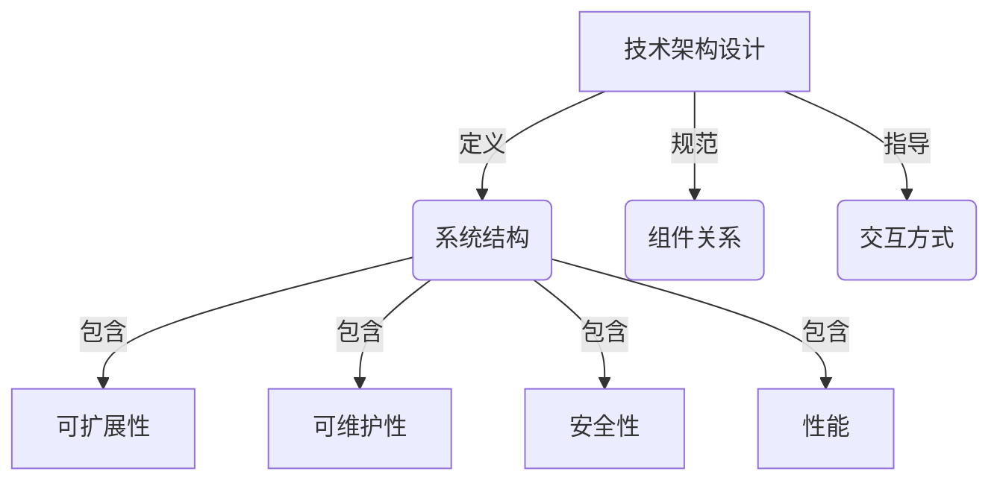
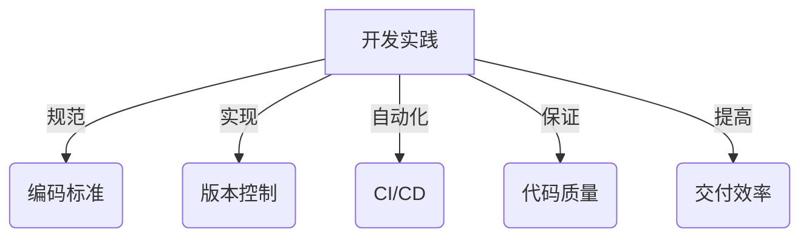
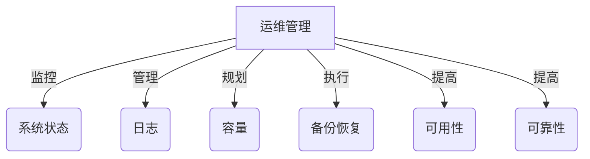
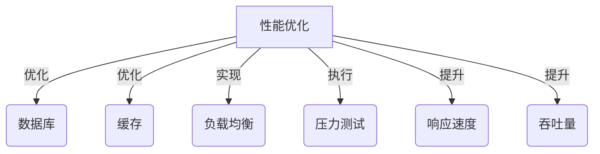
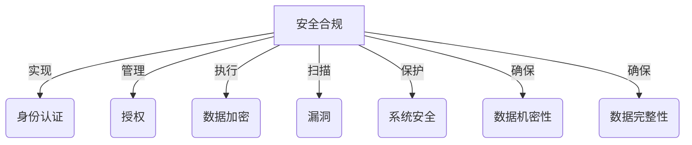
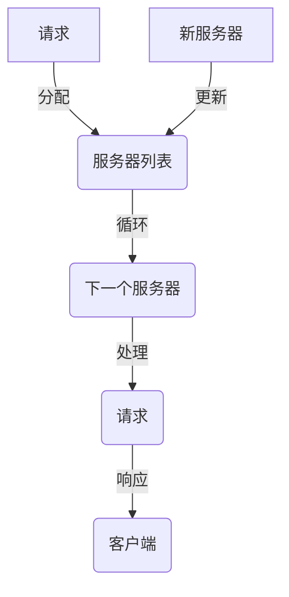
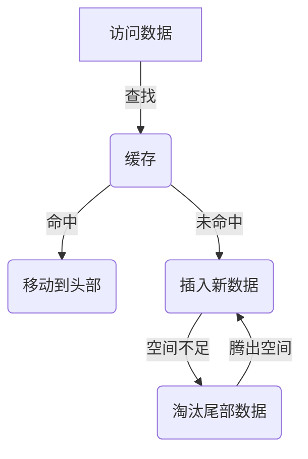
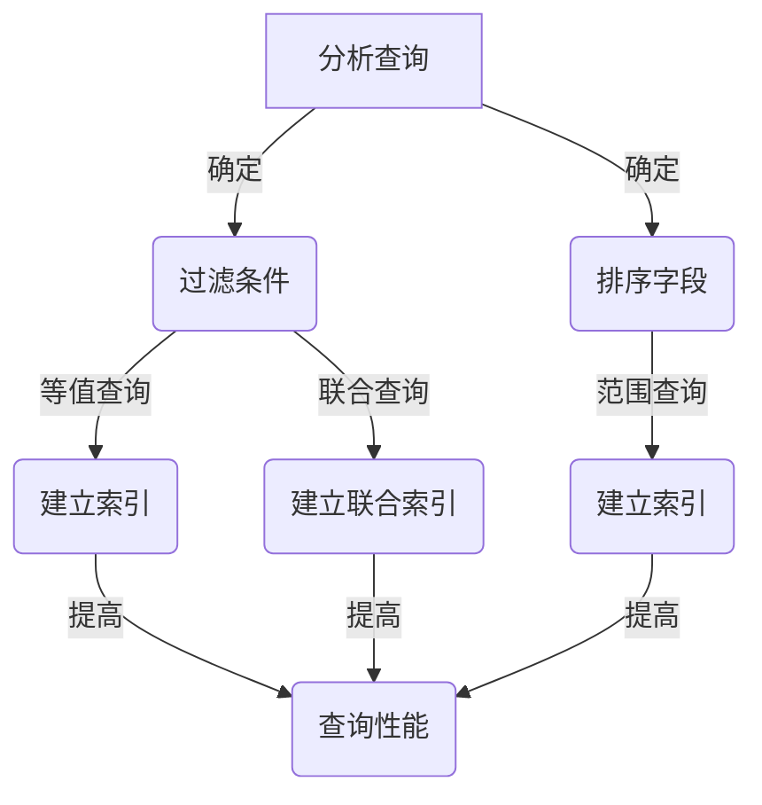

# 互联网技术架构全栈技术管理核心能力

## 1.背景介绍

在当今快节奏的数字时代,互联网技术已经无处不在,渗透到了我们生活和工作的方方面面。随着业务需求的不断扩展和技术创新的日新月异,构建一个健壮、可扩展、高效的技术架构已经成为企业保持竞争力的关键。全栈技术管理正是应运而生,旨在系统地管理和优化整个技术栈,确保各个层面的技术能够高效协同,为业务创造价值。

作为一名资深的技术专家和架构师,我将分享在全栈技术管理方面的核心能力和经验,帮助读者更好地理解和掌握这一领域。我们将探讨技术架构的设计原则、开发实践、运维管理、性能优化等多个维度,并介绍相关的工具和资源。

## 2.核心概念与联系

全栈技术管理涵盖了从前端到后端,从网络到基础设施的整个技术栈。其核心概念包括:

### 2.1 技术架构设计

技术架构设计是全栈技术管理的基石,它定义了系统的整体结构、组件之间的关系以及交互方式。良好的架构设计需要考虑可扩展性、可维护性、安全性和性能等多个方面。常见的架构模式包括微服务架构、事件驱动架构、serverless架构等。

### 2.2 开发实践

开发实践关注于如何高效地编写、测试和部署代码。它包括编码标准、版本控制、持续集成/持续交付(CI/CD)、自动化测试等方面。良好的开发实践可以提高代码质量,加快交付速度,减少人为错误。

### 2.3 运维管理

运维管理确保系统的稳定运行,包括监控、日志管理、容量规划、备份和恢复等方面。良好的运维管理有助于提高系统的可用性和可靠性,快速发现和解决问题。

### 2.4 性能优化

性能优化旨在提高系统的响应速度和吞吐量,包括数据库优化、缓存优化、负载均衡、压力测试等方面。良好的性能优化可以提升用户体验,支撑更大的业务规模。

### 2.5 安全合规

安全合规是全栈技术管理中不可或缺的一环,它包括身份认证、授权管理、数据加密、漏洞扫描等方面。良好的安全合规措施可以保护系统免受各种攻击,确保数据的机密性和完整性。

上述核心概念相互关联,共同构建了全栈技术管理的框架。它们需要在架构设计、开发、运维、优化和安全等多个层面协同工作,才能实现技术栈的高效运转和业务价值的最大化。

## 3.核心算法原理具体操作步骤

全栈技术管理中涉及到多种算法和原理,包括负载均衡算法、缓存淘汰算法、数据库索引优化算法等。这些算法和原理是实现高性能、高可用和高扩展性系统的关键。

### 3.1 负载均衡算法

负载均衡是一种将网络流量分发到多个服务器的技术,以实现高可用性和高性能。常见的负载均衡算法包括:

1. 轮询算法(Round Robin)
2. 最少连接算法(Least Connections)
3. 源地址哈希算法(Source IP Hash)
4. 最短响应时间算法(Shortest Response Time)

以轮询算法为例,其具体操作步骤如下:

1. 维护一个服务器列表,按顺序循环访问。
2. 每次有新的请求到来,将其分配给列表中的下一个服务器。
3. 如果列表中的所有服务器都处于繁忙状态,则等待一个服务器空闲。
4. 如果有新的服务器加入或退出,动态更新服务器列表。

### 3.2 缓存淘汰算法

缓存是提高系统性能的关键手段之一,但缓存空间有限,因此需要采用合理的缓存淘汰算法来管理缓存。常见的缓存淘汰算法包括:

1. 先进先出(FIFO)
2. 最近最少使用(LRU)
3. 最频繁使用(LFU)
4. 随机淘汰(Random)

以LRU算法为例,其具体操作步骤如下:

1. 维护一个双向链表,表头表示最近使用的数据,表尾表示最久未使用的数据。
2. 每次访问一个数据,将其移动到链表头部。
3. 当缓存空间不足时,淘汰链表尾部的数据。
4. 新插入的数据放在链表头部。

### 3.3 数据库索引优化

索引是提高数据库查询性能的重要手段,但索引的设计和维护需要遵循一定的原理和策略。常见的索引优化策略包括:

1. 选择合适的索引字段
2. 使用联合索引
3. 避免冗余索引
4. 维护索引统计信息

以选择合适的索引字段为例,其具体操作步骤如下:

1. 分析查询语句,确定常用的过滤条件和排序字段。
2. 对于等值查询,可以在过滤字段上建立索引。
3. 对于范围查询,可以在过滤字段和排序字段上建立索引。
4. 对于频繁使用的联合查询条件,可以建立联合索引。

上述算法和原理只是全栈技术管理中的一小部分,还有许多其他算法和原理需要掌握,如分布式系统的一致性算法、数据库分库分表算法、服务发现算法等。掌握这些核心算法和原理,对于构建高性能、高可用和高扩展性的系统至关重要。

## 4.数学模型和公式详细讲解举例说明

全栈技术管理中涉及到多种数学模型和公式,用于描述和优化系统的各个方面。这些数学模型和公式为我们提供了量化分析和优化的工具,有助于更好地理解和管理复杂的技术系统。

### 4.1 小世界网络模型

小世界网络模型是描述复杂网络结构的重要模型之一,它可以用于分析和优化分布式系统的拓扑结构。该模型的核心思想是,在一个网络中,任意两个节点之间的平均最短路径长度都很小,但同时也存在一些高度聚集的局部结构。

小世界网络模型可以用以下公式表示:

$$
C(G) = \frac{1}{n}\sum_{i=1}^{n}C_i
$$

其中,$$C(G)$$表示整个网络的聚集系数,$$n$$表示网络中节点的数量,$$C_i$$表示第$$i$$个节点的局部聚集系数。

局部聚集系数$$C_i$$的计算公式如下:

$$
C_i = \frac{2E_i}{k_i(k_i-1)}
$$

其中,$$E_i$$表示第$$i$$个节点邻居之间的实际边数,$$k_i$$表示第$$i$$个节点的度数(邻居数)。

通过分析网络的聚集系数和平均最短路径长度,我们可以优化分布式系统的拓扑结构,提高系统的容错性和效率。例如,在设计微服务架构时,可以根据服务之间的调用关系构建小世界网络,从而实现高效的服务通信和故障隔离。

### 4.2 队列模型

队列模型是描述和优化系统中并发请求处理的重要工具。在全栈技术管理中,我们经常需要处理大量的并发请求,如Web请求、消息队列等。合理的队列模型可以帮助我们分析系统的吞吐量、响应时间和资源利用率,从而优化系统性能。

队列模型通常可以用生产者-消费者模型来描述,其中生产者代表请求的到达过程,消费者代表请求的处理过程。我们可以使用泊松分布来描述请求到达的随机过程,使用指数分布来描述请求处理时间的随机分布。

对于单服务器队列模型,我们可以使用下面的公式来计算系统的平均响应时间:

$$
W = \frac{\rho}{1-\rho}\cdot\frac{1}{\mu}
$$

其中,$$W$$表示平均响应时间,$$\rho$$表示系统的利用率($$\rho = \lambda/\mu$$),$$\lambda$$表示请求到达率,$$\mu$$表示服务率。

当$$\rho < 1$$时,队列是稳定的,平均响应时间是有限的。当$$\rho \geq 1$$时,队列是不稳定的,平均响应时间将无限增长。

通过队列模型,我们可以分析系统的瓶颈,并采取相应的优化措施,如增加服务器资源、优化请求处理逻辑、引入缓存等。同时,队列模型也可以用于容量规划和资源调度,确保系统在高负载情况下仍能提供可接受的响应时间。

### 4.3 一致性哈希算法

一致性哈希算法是一种分布式哈希算法,常用于实现分布式缓存、负载均衡和分布式存储等场景。它的核心思想是将节点和数据映射到同一个哈希环上,从而实现数据的均匀分布和节点的动态添加或删除。

一致性哈希算法的核心公式如下:

$$
hash(key) = f(key)\ \bmod\ 2^{32}
$$

其中,$$f(key)$$是一个哈希函数,用于将键值映射到一个32位整数。

在一致性哈希环上,我们将所有节点和数据都映射到环上的不同位置。当需要查找某个键值对应的节点时,我们计算该键值的哈希值,并在环上顺时针