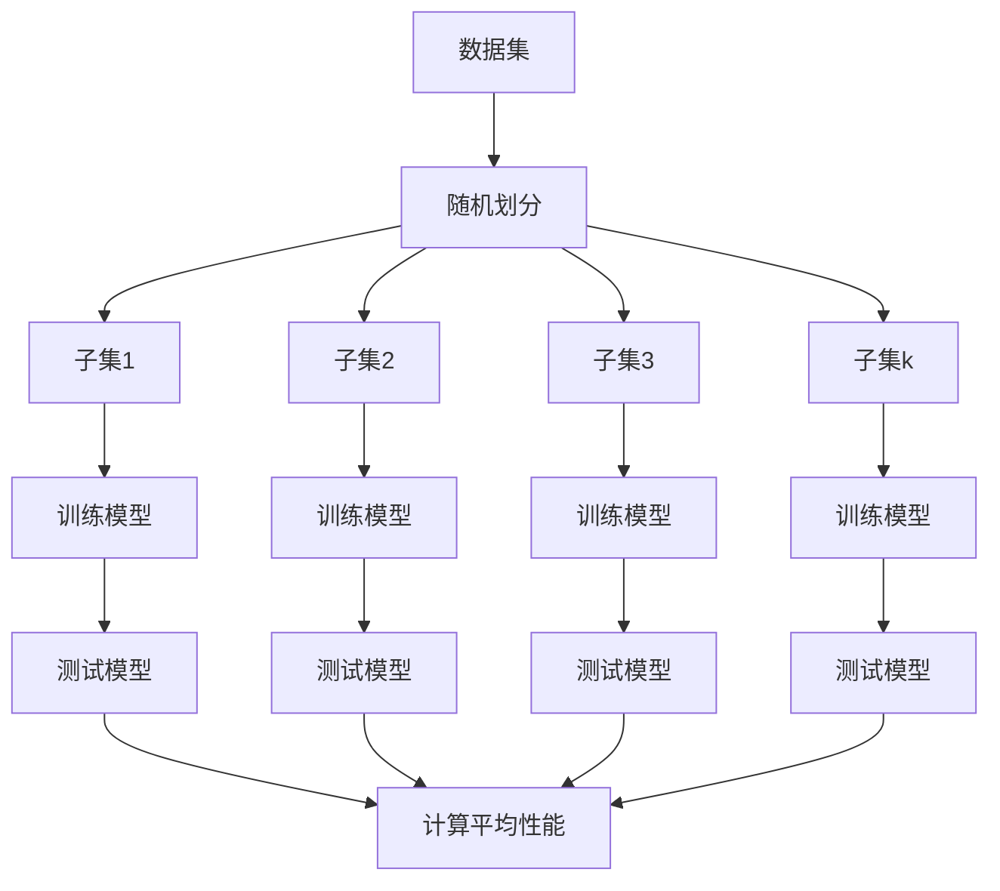

# 交叉验证的未来发展方向

## 1.背景介绍

交叉验证(Cross-Validation)是一种评估机器学习模型性能的统计学方法,通过将数据集划分为训练集和测试集,并反复交换训练集和测试集,从而获得模型性能的可靠估计。交叉验证在现代机器学习和数据挖掘中扮演着重要角色,被广泛应用于模型选择、参数调优和评估模型的泛化能力。

### 1.1 交叉验证的重要性

在实际应用中,我们通常无法获得足够大的独立测试数据集来评估模型的泛化性能。交叉验证提供了一种有效的方法,利用有限的数据资源,获得模型性能的可靠估计。此外,交叉验证还有助于减少过拟合风险,提高模型的鲁棒性。

### 1.2 交叉验证的基本思想

交叉验证的基本思想是将数据集划分为k个互斥的子集,每次使用其中一个子集作为测试集,剩余的k-1个子集作为训练集。这个过程重复k次,每个子集都会被用作测试集一次。最终,将k次测试结果取平均值,作为模型性能的估计值。

## 2.核心概念与联系

### 2.1 k折交叉验证(k-Fold Cross-Validation)

k折交叉验证是最常用的交叉验证方法。它将数据集随机划分为k个大小相等的互斥子集(fold),每次使用一个子集作为测试集,其余k-1个子集作为训练集。这个过程重复k次,每个子集都会被用作测试集一次。



### 2.2 留一交叉验证(Leave-One-Out Cross-Validation)

留一交叉验证是k折交叉验证的一个特殊情况,其中k等于数据集的样本数量。每次将一个样本作为测试集,其余样本作为训练集。这种方法计算量较大,但对于小数据集来说,可以获得较为可靠的性能估计。

### 2.3 留p交叉验证(Leave-P-Out Cross-Validation)

留p交叉验证是一种更一般的交叉验证方法。它将数据集划分为k个大小相等的互斥子集,每次使用p个子集作为测试集,其余k-p个子集作为训练集。这个过程重复执行k次,直到所有子集都被用作测试集。

### 2.4 蒙特卡罗交叉验证(Monte Carlo Cross-Validation)

蒙特卡罗交叉验证是一种随机化的交叉验证方法。它通过随机抽样的方式,将数据集划分为训练集和测试集,并重复多次这个过程。这种方法可以减少由于数据划分造成的偏差,但计算量较大。

## 3.核心算法原理具体操作步骤

### 3.1 k折交叉验证算法步骤

1. 将数据集随机打乱顺序。
2. 将数据集划分为k个大小相等的互斥子集(fold)。
3. 对于i=1,2,...,k:
   a. 使用除第i个子集之外的所有子集作为训练集,训练模型。
   b. 使用第i个子集作为测试集,评估模型性能。
4. 计算k次模型性能的平均值,作为最终的性能估计。

### 3.2 留一交叉验证算法步骤

1. 将数据集随机打乱顺序。
2. 对于i=1,2,...,n(n为数据集样本数量):
   a. 使用除第i个样本之外的所有样本作为训练集,训练模型。
   b. 使用第i个样本作为测试集,评估模型性能。
3. 计算n次模型性能的平均值,作为最终的性能估计。

### 3.3 留p交叉验证算法步骤

1. 将数据集随机打乱顺序。
2. 将数据集划分为k个大小相等的互斥子集。
3. 对于i=1,2,...,k:
   a. 使用除第i个子集之外的所有子集作为训练集,训练模型。
   b. 使用第i个子集作为测试集,评估模型性能。
4. 计算k次模型性能的平均值,作为最终的性能估计。

### 3.4 蒙特卡罗交叉验证算法步骤

1. 设置迭代次数m。
2. 对于i=1,2,...,m:
   a. 从数据集中随机抽样,构建训练集和测试集。
   b. 使用训练集训练模型,使用测试集评估模型性能。
3. 计算m次模型性能的平均值,作为最终的性能估计。

## 4.数学模型和公式详细讲解举例说明

### 4.1 k折交叉验证的数学模型

假设数据集$D=\{(x_1,y_1),(x_2,y_2),...,(x_n,y_n)\}$,其中$x_i$表示输入特征,而$y_i$表示相应的标签或目标值。我们将$D$划分为k个互斥的子集$D_1,D_2,...,D_k$,使得$\bigcup_{i=1}^{k}D_i=D$且$D_i\bigcap D_j=\emptyset(i\neq j)$。

对于第j次迭代,我们使用$D\backslash D_j$作为训练集,训练模型$f_j$,使用$D_j$作为测试集,计算模型性能指标$\epsilon_j$。k折交叉验证的性能估计为:

$$\hat{\epsilon}_{cv}=\frac{1}{k}\sum_{j=1}^{k}\epsilon_j$$

其中$\epsilon_j$可以是任何合适的性能指标,如准确率、精确率、召回率或F1分数等。

### 4.2 留一交叉验证的数学模型

留一交叉验证是k折交叉验证的特殊情况,其中k等于数据集的样本数量n。对于第i次迭代,我们使用$D\backslash \{(x_i,y_i)\}$作为训练集,训练模型$f_i$,使用$\{(x_i,y_i)\}$作为测试集,计算模型性能指标$\epsilon_i$。留一交叉验证的性能估计为:

$$\hat{\epsilon}_{loo}=\frac{1}{n}\sum_{i=1}^{n}\epsilon_i$$

### 4.3 留p交叉验证的数学模型

留p交叉验证是一种更一般的交叉验证方法。我们将数据集$D$划分为k个大小相等的互斥子集$D_1,D_2,...,D_k$,对于第j次迭代,我们使用$\bigcup_{i=1,i\neq j}^{k}D_i$作为训练集,训练模型$f_j$,使用$D_j$作为测试集,计算模型性能指标$\epsilon_j$。留p交叉验证的性能估计为:

$$\hat{\epsilon}_{lpo}=\frac{1}{k}\sum_{j=1}^{k}\epsilon_j$$

### 4.4 蒙特卡罗交叉验证的数学模型

蒙特卡罗交叉验证通过随机抽样的方式,将数据集划分为训练集和测试集。假设我们进行m次迭代,对于第i次迭代,我们从数据集$D$中随机抽样,构建训练集$D_i^{train}$和测试集$D_i^{test}$,训练模型$f_i$,计算模型性能指标$\epsilon_i$。蒙特卡罗交叉验证的性能估计为:

$$\hat{\epsilon}_{mc}=\frac{1}{m}\sum_{i=1}^{m}\epsilon_i$$

## 5.项目实践:代码实例和详细解释说明

以下是使用Python中的scikit-learn库实现k折交叉验证的示例代码:

```python
from sklearn.model_selection import KFold
from sklearn.linear_model import LogisticRegression
from sklearn.datasets import load_iris
from sklearn.metrics import accuracy_score

# 加载iris数据集
iris = load_iris()
X, y = iris.data, iris.target

# 创建K折交叉验证迭代器
kf = KFold(n_splits=5, shuffle=True, random_state=42)

# 初始化逻辑回归模型
model = LogisticRegression()

# 进行K折交叉验证
scores = []
for train_index, test_index in kf.split(X):
    X_train, X_test = X[train_index], X[test_index]
    y_train, y_test = y[train_index], y[test_index]
    
    # 训练模型
    model.fit(X_train, y_train)
    
    # 评估模型
    y_pred = model.predict(X_test)
    score = accuracy_score(y_test, y_pred)
    scores.append(score)

# 计算平均准确率
avg_score = sum(scores) / len(scores)
print(f"Average accuracy: {avg_score:.2f}")
```

在这个示例中,我们首先加载了iris数据集。然后,我们创建了一个KFold对象,将数据集划分为5个互斥的子集。接下来,我们初始化了一个逻辑回归模型,并进行5折交叉验证。

在每次迭代中,我们使用除当前子集之外的所有子集作为训练集,训练逻辑回归模型。然后,我们使用当前子集作为测试集,评估模型的准确率。最后,我们计算5次准确率的平均值,作为模型性能的估计。

### 5.1 留一交叉验证代码示例

```python
from sklearn.model_selection import LeaveOneOut
from sklearn.linear_model import LogisticRegression
from sklearn.datasets import load_iris
from sklearn.metrics import accuracy_score

# 加载iris数据集
iris = load_iris()
X, y = iris.data, iris.target

# 创建留一交叉验证迭代器
loo = LeaveOneOut()

# 初始化逻辑回归模型
model = LogisticRegression()

# 进行留一交叉验证
scores = []
for train_index, test_index in loo.split(X):
    X_train, X_test = X[train_index], X[test_index]
    y_train, y_test = y[train_index], y[test_index]
    
    # 训练模型
    model.fit(X_train, y_train)
    
    # 评估模型
    y_pred = model.predict(X_test)
    score = accuracy_score(y_test, y_pred)
    scores.append(score)

# 计算平均准确率
avg_score = sum(scores) / len(scores)
print(f"Average accuracy: {avg_score:.2f}")
```

这个示例与k折交叉验证的代码类似,只是我们使用了LeaveOneOut对象来实现留一交叉验证。在每次迭代中,我们使用除当前样本之外的所有样本作为训练集,训练逻辑回归模型,并使用当前样本作为测试集,评估模型的准确率。最后,我们计算所有准确率的平均值,作为模型性能的估计。

### 5.2 留p交叉验证代码示例

```python
from sklearn.model_selection import LeavePOut
from sklearn.linear_model import LogisticRegression
from sklearn.datasets import load_iris
from sklearn.metrics import accuracy_score

# 加载iris数据集
iris = load_iris()
X, y = iris.data, iris.target

# 创建留p交叉验证迭代器
lpo = LeavePOut(p=20)

# 初始化逻辑回归模型
model = LogisticRegression()

# 进行留p交叉验证
scores = []
for train_index, test_index in lpo.split(X):
    X_train, X_test = X[train_index], X[test_index]
    y_train, y_test = y[train_index], y[test_index]
    
    # 训练模型
    model.fit(X_train, y_train)
    
    # 评估模型
    y_pred = model.predict(X_test)
    score = accuracy_score(y_test, y_pred)
    scores.append(score)

# 计算平均准确率
avg_score = sum(scores) / len(scores)
print(f"Average accuracy: {avg_score:.2f}")
```

在这个示例中,我们使用LeavePOut对象实现留p交叉验证。我们将p设置为20,表示