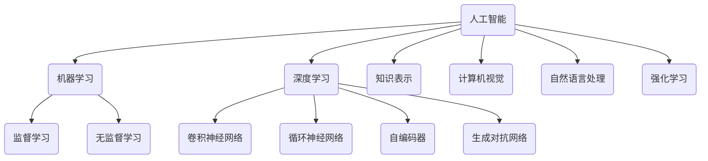

# 人工智能 原理与代码实例讲解

## 1.背景介绍

人工智能(Artificial Intelligence, AI)是当代科技发展的热点领域,旨在通过使用算法和软件来模拟人类的认知功能,如学习、推理、感知、规划和问题解决等。人工智能技术的发展为各行业带来了革命性的变革,推动了智能系统的广泛应用。

### 1.1 人工智能的发展历程

人工智能的概念可以追溯到20世纪40年代,当时一些先驱者提出了"智能机器"的设想。1956年,约翰·麦卡锡在达特茅斯学院主持了一个关于"人工智能"的研讨会,从此人工智能这个术语正式被引入。

人工智能的发展经历了几个阶段:

- 20世纪50年代至70年代:探索阶段,人工智能研究主要集中在博弈、逻辑推理和机器翻译等领域。
- 20世纪80年代:知识工程时期,专家系统和知识库得到广泛应用。
- 20世纪90年代:机器学习和神经网络的兴起,数据驱动的人工智能方法开始流行。
- 21世纪初:深度学习的突破,大数据和强大的计算能力推动了人工智能的飞速发展。

### 1.2 人工智能的重要性

人工智能技术在各个领域都有广泛的应用前景,包括但不限于:

- 自动驾驶和智能交通系统
- 医疗诊断和药物研发
- 金融风险管理和投资决策
- 智能家居和机器人技术
- 自然语言处理和人机交互
- 计算机视觉和图像识别

人工智能不仅能提高工作效率,还能帮助人类解决复杂的问题,促进科技创新和社会进步。

## 2.核心概念与联系

人工智能涉及多个核心概念,这些概念相互关联,构成了人工智能的理论基础。

### 2.1 机器学习(Machine Learning)

机器学习是人工智能的核心部分,它使计算机能够从数据中自动学习和改进,而无需显式编程。机器学习可分为监督学习、无监督学习和强化学习等。

### 2.2 深度学习(Deep Learning)

深度学习是机器学习的一个子领域,它基于人工神经网络,通过构建深层次的网络结构来模拟人脑的工作原理。深度学习在计算机视觉、自然语言处理等领域取得了突破性进展。

### 2.3 知识表示(Knowledge Representation)

知识表示是指在计算机系统中表示和存储知识的方法,包括逻辑规则、语义网络、框架等。知识表示是构建智能系统的基础。

### 2.4 计算机视觉(Computer Vision)

计算机视觉是人工智能的一个重要分支,旨在使计算机能够获取、处理、分析和理解数字图像或视频。它在图像识别、目标检测、视频监控等领域有广泛应用。

### 2.5 自然语言处理(Natural Language Processing)

自然语言处理是人工智能的另一个重要分支,旨在使计算机能够理解和生成人类语言。它在机器翻译、语音识别、问答系统等领域有广泛应用。

### 2.6 强化学习(Reinforcement Learning)

强化学习是机器学习的一种范式,它通过与环境交互并获得奖励或惩罚来学习策略,在无需人工标注数据的情况下实现智能决策。强化学习在游戏AI、机器人控制等领域有重要应用。

## 3.核心算法原理具体操作步骤

人工智能领域涉及多种核心算法,这些算法是实现智能系统的关键。下面将介绍几种常见算法的原理和具体操作步骤。

### 3.1 线性回归

线性回归是监督学习中最基本的算法之一,它试图找到一条最佳拟合直线,使得数据点到直线的距离之和最小。

算法步骤:

1. 准备数据集,包括自变量(特征)和因变量(标签)
2. 定义代价函数(如均方误差)
3. 使用梯度下降法优化代价函数,迭代更新模型参数
4. 评估模型性能,进行预测

### 3.2 逻辑回归

逻辑回归是一种用于分类问题的算法,它将输入映射到0到1之间的概率值,可用于二分类或多分类任务。

算法步骤:

1. 准备数据集,包括特征和标签
2. 定义逻辑回归模型和代价函数
3. 使用梯度下降法优化代价函数,迭代更新模型参数
4. 评估模型性能,进行分类预测

### 3.3 决策树

决策树是一种基于树形结构的监督学习算法,它根据特征的条件对数据进行递归分割,直到达到某个终止条件。

算法步骤:

1. 准备数据集,包括特征和标签
2. 选择最优特征,根据特征值将数据集分割成子集
3. 对子集递归构建决策树,直到满足终止条件
4. 使用构建的决策树进行分类或回归预测

### 3.4 支持向量机(SVM)

支持向量机是一种监督学习模型,通过构建最大间隔超平面将不同类别的数据分开,常用于分类和回归任务。

算法步骤:

1. 准备数据集,包括特征和标签
2. 将数据映射到更高维空间
3. 构建最大间隔超平面,将不同类别数据分开
4. 使用构建的SVM模型进行分类或回归预测

### 3.5 K-均值聚类

K-均值聚类是一种无监督学习算法,通过迭代优化将数据划分为K个簇,使得簇内数据点相似度高,簇间相似度低。

算法步骤:

1. 准备数据集
2. 随机初始化K个聚类中心
3. 将每个数据点分配到最近的聚类中心
4. 重新计算每个簇的中心
5. 重复步骤3和4,直到聚类中心不再变化

### 3.6 主成分分析(PCA)

主成分分析是一种无监督学习算法,通过线性变换将高维数据投影到低维空间,实现降维和数据可视化。

算法步骤:

1. 准备数据集
2. 计算数据的协方差矩阵
3. 计算协方差矩阵的特征值和特征向量
4. 选择最大的K个特征向量作为主成分
5. 将原始数据投影到主成分空间,得到降维后的数据

## 4.数学模型和公式详细讲解举例说明

人工智能算法通常涉及大量数学模型和公式,下面将详细讲解一些常见的数学模型和公式。

### 4.1 线性回归模型

线性回归模型试图找到一条最佳拟合直线,使得数据点到直线的距离之和最小。模型可表示为:

$$y = \theta_0 + \theta_1x_1 + \theta_2x_2 + ... + \theta_nx_n$$

其中:
- $y$是因变量(标签)
- $x_1, x_2, ..., x_n$是自变量(特征)
- $\theta_0, \theta_1, ..., \theta_n$是模型参数

我们定义代价函数(如均方误差)来衡量模型的拟合程度:

$$J(\theta) = \frac{1}{2m}\sum_{i=1}^m(h_\theta(x^{(i)}) - y^{(i)})^2$$

其中:
- $m$是训练样本数量
- $h_\theta(x)$是模型的预测值
- $y$是实际值

通过梯度下降法优化代价函数,可以迭代更新模型参数$\theta$,直到找到最优解。

### 4.2 逻辑回归模型

逻辑回归模型将输入映射到0到1之间的概率值,可用于二分类或多分类任务。模型可表示为:

$$h_\theta(x) = \sigma(\theta^Tx) = \frac{1}{1 + e^{-\theta^Tx}}$$

其中:
- $x$是输入特征向量
- $\theta$是模型参数向量
- $\sigma(z)$是sigmoid函数,将线性组合$\theta^Tx$映射到(0,1)范围内

我们定义交叉熵代价函数:

$$J(\theta) = -\frac{1}{m}\sum_{i=1}^m[y^{(i)}\log(h_\theta(x^{(i)})) + (1 - y^{(i)})\log(1 - h_\theta(x^{(i)}))]$$

通过梯度下降法优化代价函数,可以迭代更新模型参数$\theta$,直到找到最优解。

### 4.3 决策树模型

决策树模型通过构建树形结构来对数据进行分类或回归预测。每个内部节点代表一个特征,每个分支代表该特征的一个取值,叶节点代表最终的预测结果。

在构建决策树时,我们需要选择最优特征进行数据分割。常用的特征选择标准包括:

- 信息增益(Information Gain)
- 信息增益比(Information Gain Ratio)
- 基尼系数(Gini Index)

以信息增益为例,它衡量了使用某个特征进行分割后,数据的不确定性减少的程度:

$$\text{Gain}(D, a) = \text{Entropy}(D) - \sum_{v=1}^V\frac{|D^v|}{|D|}\text{Entropy}(D^v)$$

其中:
- $D$是当前数据集
- $a$是特征
- $V$是特征$a$的取值集合
- $D^v$是特征$a$取值为$v$的子集
- $\text{Entropy}(D)$是数据集$D$的信息熵

通过递归地选择最优特征进行分割,直到满足终止条件,就可以构建出决策树模型。

### 4.4 支持向量机(SVM)模型

支持向量机模型试图找到一个最大间隔超平面,将不同类别的数据分开。对于线性可分的情况,超平面可表示为:

$$w^Tx + b = 0$$

其中:
- $w$是法向量,决定了超平面的方向
- $b$是位移项,决定了超平面与原点的距离

我们希望找到一个最大化边界距离的超平面,这相当于求解以下优化问题:

$$\begin{aligned}
\min_w & \frac{1}{2}||w||^2 \\
\text{s.t. } & y^{(i)}(w^Tx^{(i)} + b) \geq 1, i = 1, 2, ..., m
\end{aligned}$$

其中:
- $m$是训练样本数量
- $x^{(i)}$是第$i$个样本的特征向量
- $y^{(i)} \in \{-1, 1\}$是第$i$个样本的标签

对于线性不可分的情况,我们可以引入核技巧(kernel trick)将数据映射到更高维空间,从而使数据线性可分。

### 4.5 K-均值聚类模型

K-均值聚类模型试图将数据划分为K个簇,使得簇内数据点相似度高,簇间相似度低。我们定义簇内平方和作为目标函数:

$$J(c^{(1)}, c^{(2)}, ..., c^{(K)}) = \sum_{i=1}^m\sum_{k=1}^K1\{x^{(i)} \in S_k\}||x^{(i)} - \mu_k||^2$$

其中:
- $m$是数据点的个数
- $K$是簇的个数
- $c^{(k)}$是第$k$个簇的中心
- $\mu_k$是第$k$个簇的均值向量
- $S_k$是第$k$个簇的数据点集合
- $1\{\cdot\}$是指示函数,如果$x^{(i)}$属于$S_k$,则取值为1,否则为0

我