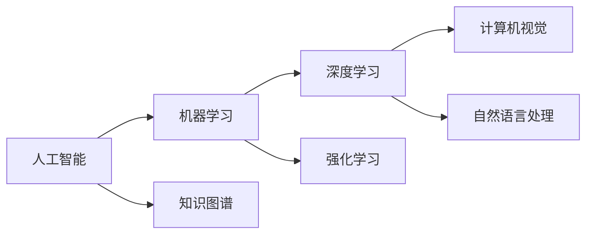

# 人工智能前沿研究热点与发展趋势原理与代码实战案例讲解

## 1.背景介绍
### 1.1 人工智能的定义与发展历程
人工智能(Artificial Intelligence,AI)是计算机科学的一个重要分支,它研究如何让计算机模拟人类的某些思维过程和智能行为,如学习、推理、思考、规划等,以实现更加智能化的人机交互。人工智能的概念最早由约翰·麦卡锡(John McCarthy)在1956年提出。经过几十年的发展,人工智能已经取得了长足的进步,尤其是近年来,得益于大数据、算力和算法的突破,人工智能进入了快速发展的新阶段。

### 1.2 人工智能的分类
人工智能可以分为以下几类:
- 符号主义人工智能:通过抽象符号表示知识,利用逻辑推理实现智能。代表性的有专家系统。
- 连接主义人工智能:模拟大脑神经元连接,通过神经网络实现智能。代表性的有深度学习。  
- 行为主义人工智能:通过感知-动作映射实现智能行为。代表性的有强化学习。
- 混合智能:综合运用以上几种方法,构建更加强大的人工智能系统。

### 1.3 人工智能的应用领域
人工智能已经在许多领域得到广泛应用,主要包括:
- 自然语言处理:机器翻译、智能问答、情感分析等
- 计算机视觉:图像分类、目标检测、人脸识别等  
- 语音识别:语音转文本、说话人识别等
- 无人驾驶:环境感知、路径规划、车辆控制等
- 智能机器人:工业机器人、服务机器人等
- 智能医疗:医学影像分析、辅助诊断、药物发现等

## 2.核心概念与联系
### 2.1 机器学习
机器学习是人工智能的核心,它研究如何让计算机从数据中自动分析获得规律,并利用规律对未知数据进行预测。常见的机器学习任务包括分类、回归、聚类、降维等。根据学习方式的不同,机器学习可分为监督学习、无监督学习、半监督学习、强化学习等。

### 2.2 深度学习
深度学习是机器学习的一个重要分支,它模仿人脑的结构和机制,使用包含多个隐层的人工神经网络,从大规模数据中学习多层次的特征表示,显著提升了图像识别、语音识别等任务的性能。常见的深度学习模型包括卷积神经网络(CNN)、循环神经网络(RNN)、生成对抗网络(GAN)等。

### 2.3 强化学习 
强化学习是一种通过智能体与环境的交互来学习最优策略的机器学习方法。智能体根据当前状态采取行动,得到环境的奖励反馈,不断调整策略以获得最大累积奖励。强化学习在智能控制、机器人、游戏AI等领域有广泛应用。代表性算法包括Q学习、策略梯度、蒙特卡洛树搜索等。

### 2.4 知识图谱
知识图谱以结构化的形式表示客观世界中的实体、概念及其关系,通过知识的链接构建起一张巨大的语义网络。知识图谱在智能问答、个性化推荐等任务中发挥重要作用。构建知识图谱的关键技术包括实体链接、关系抽取、知识融合等。

### 2.5 计算机视觉
计算机视觉让计算机从图像或视频中获取对世界的感知和理解能力,涉及图像处理、特征提取、目标检测与跟踪、语义分割等技术。计算机视觉在无人驾驶、医学影像、安防监控等领域有广泛应用。近年来,深度学习极大地推动了计算机视觉的发展。

### 2.6 自然语言处理  
自然语言处理(NLP)让计算机理解、生成和处理人类语言,涉及分词、词性标注、句法分析、语义理解、机器翻译等任务。NLP在智能客服、舆情分析、知识挖掘等领域发挥重要作用。深度学习中的注意力机制、Transformer等模型极大地提升了NLP的性能。

以下是这些核心概念之间关系的Mermaid流程图:

## 3.核心算法原理具体操作步骤
本节介绍几个人工智能的核心算法,包括BP神经网络、卷积神经网络、Q学习等。

### 3.1 BP神经网络
BP(Back Propagation)神经网络是一种多层前馈神经网络,可以通过反向传播算法训练网络参数。其基本步骤如下:

1. 初始化:随机初始化网络权重和偏置。
2. 前向传播:根据输入计算每一层的输出,直到得到网络的最终输出。
3. 计算损失:比较网络输出与真实标签,计算损失函数。
4. 反向传播:从输出层开始,反向逐层计算每个参数的梯度。
5. 更新参数:根据梯度下降算法更新网络权重和偏置。 
6. 迭代训练:重复步骤2-5,直到损失函数收敛或达到预设的迭代次数。

### 3.2 卷积神经网络
卷积神经网络(CNN)常用于图像识别等任务,由卷积层、池化层、全连接层组成。其基本步骤如下:

1. 卷积层:使用卷积核对输入进行卷积操作,提取局部特征。
2. 激活函数:对卷积结果使用非线性激活函数,如ReLU。
3. 池化层:对激活后的特征图进行下采样,减小数据维度。
4. 全连接层:将池化层输出展平为一维向量,送入全连接网络进行分类。
5. Softmax层:使用Softmax函数将全连接层输出转化为概率分布。  

CNN的训练过程与BP神经网络类似,使用反向传播算法优化网络参数。

### 3.3 Q学习
Q学习是一种常用的强化学习算法,通过不断更新状态-动作值函数Q来学习最优策略。其基本步骤如下:

1. 初始化Q表:随机初始化状态-动作值函数Q。
2. 选择动作:根据ε-贪婪策略选择动作,以一定概率随机探索。 
3. 执行动作:执行所选动作,观察下一状态和即时奖励。
4. 更新Q值:根据贝尔曼方程更新Q(s,a)。
$$Q(s,a) \leftarrow Q(s,a)+\alpha[r+\gamma \max_{a'}Q(s',a')-Q(s,a)]$$
其中$\alpha$为学习率,$\gamma$为折扣因子。
5. 更新状态:将下一状态$s'$作为新的当前状态$s$。
6. 重复迭代:重复步骤2-5,直到Q值收敛或达到预设的迭代次数。

## 4.数学模型和公式详细讲解举例说明
本节对几个重要的人工智能数学模型和公式进行详细讲解。

### 4.1 感知机模型
感知机是一种二分类的线性分类模型,由输入层和输出层组成。假设输入向量为$\boldsymbol{x}=[x_1,x_2,\cdots,x_n]^T$,权重向量为$\boldsymbol{w}=[w_1,w_2,\cdots,w_n]^T$,偏置为$b$,则感知机的输出为:
$$
y=f(\boldsymbol{w}^T\boldsymbol{x}+b)=\begin{cases}
1, & \boldsymbol{w}^T\boldsymbol{x}+b\geq0 \\
0, & \boldsymbol{w}^T\boldsymbol{x}+b<0
\end{cases}
$$
其中$f$为阶跃函数。感知机的学习目标是找到一个超平面$\boldsymbol{w}^T\boldsymbol{x}+b=0$将不同类别的样本正确分开。

例如,对于如下训练集:
$$
\begin{array}{c|ccc}
\boldsymbol{x} & x_1 & x_2 & y \\
\hline
\boldsymbol{x}_1 & 3 & 3 & 1 \\
\boldsymbol{x}_2 & 4 & 3 & 1 \\
\boldsymbol{x}_3 & 1 & 1 & 0
\end{array}
$$
假设初始权重$\boldsymbol{w}=[0,0]^T$,偏置$b=0$,学习率$\eta=1$,根据感知机学习规则迭代更新参数:
$$
\boldsymbol{w} \leftarrow \boldsymbol{w}+\eta(y-\hat{y})\boldsymbol{x} \\
b \leftarrow b+\eta(y-\hat{y})
$$
最终可得到$\boldsymbol{w}=[1,1]^T$,$b=-3$,此时超平面$x_1+x_2-3=0$可以将正负样本完全分开。

### 4.2 支持向量机
支持向量机(SVM)是一种二分类模型,目标是在特征空间中找到一个最大间隔超平面,对样本进行分类。SVM的数学模型可表示为以下优化问题:
$$
\begin{aligned}
\min_{\boldsymbol{w},b} & \quad \frac{1}{2}\|\boldsymbol{w}\|^2 \\
\text{s.t.} & \quad y_i(\boldsymbol{w}^T\boldsymbol{x}_i+b) \geq 1, \quad i=1,2,\cdots,m
\end{aligned}
$$
其中$\boldsymbol{x}_i$为第$i$个样本,$y_i$为其对应的类别标签,取值为1或-1。上述优化问题可以通过拉格朗日乘子法和对偶技巧求解,得到分类决策函数:
$$
f(\boldsymbol{x})=\text{sign}(\sum_{i=1}^m \alpha_i y_i \boldsymbol{x}_i^T\boldsymbol{x}+b)
$$
其中$\alpha_i$为拉格朗日乘子,$\boldsymbol{x}_i$为支持向量。对于线性不可分问题,可以引入松弛变量和核函数将样本映射到高维空间,再进行分类。

例如,对于如下训练集:
$$
\begin{array}{c|cc|c}
\boldsymbol{x} & x_1 & x_2 & y \\
\hline
\boldsymbol{x}_1 & 3 & 3 & 1 \\
\boldsymbol{x}_2 & 4 & 3 & 1 \\
\boldsymbol{x}_3 & 1 & 1 & -1
\end{array}
$$
可以求得最大间隔超平面为$x_1+x_2-3=0$,支持向量为$\boldsymbol{x}_1$和$\boldsymbol{x}_3$,分类决策函数为:
$$
f(\boldsymbol{x})=\text{sign}(\boldsymbol{x}_1^T\boldsymbol{x}-\boldsymbol{x}_3^T\boldsymbol{x})=\text{sign}(x_1+x_2-3)
$$

### 4.3 马尔可夫决策过程  
马尔可夫决策过程(MDP)是强化学习的基本数学模型,由状态集合$\mathcal{S}$、动作集合$\mathcal{A}$、状态转移概率$\mathcal{P}$、奖励函数$\mathcal{R}$和折扣因子$\gamma$组成。MDP的目标是寻找一个最优策略$\pi^*$使得期望累积奖励最大化:
$$
\pi^*=\arg\max_{\pi} \mathbb{E}_{\pi}[\sum_{t=0}^{\infty}\gamma^t r_t]
$$
其中$r_t$为在时刻$t$获得的奖励。求解最优策略的经典算法包括值迭代、策略迭代等。值迭代基于贝尔曼最优方程更新状态值函数:
$$
V^*(s) = \max_a \sum_{s'\in\mathcal{S}} \mathcal{P}_{ss'}^a [r_{ss'}^a+\gamma V^*(s')]
$$
直到值函数收敛,然后根据$Q^