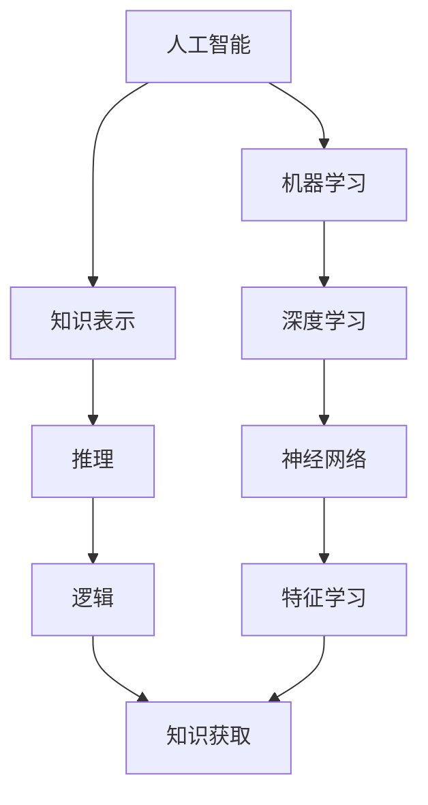

# 人工智能原理与代码实例讲解

## 1. 背景介绍

### 1.1 人工智能的定义与发展历程

人工智能(Artificial Intelligence, AI)是计算机科学的一个重要分支,它致力于研究如何让计算机模拟甚至超越人类的智能。人工智能的概念最早由约翰·麦卡锡(John McCarthy)在1956年的达特茅斯会议上提出。自那时起,人工智能经历了起起伏伏的发展历程,大致可分为三个阶段:

1. 早期阶段(1956-1974):这一阶段的研究主要集中在符号主义方法,即利用逻辑推理和知识表示来解决问题。代表性成果有"通用问题求解器"等。

2. 中期阶段(1980-1987):这一阶段兴起了连接主义方法,即利用人工神经网络来模拟大脑的信息处理过程。代表性成果有反向传播算法等。

3. 新阶段(2006至今):得益于大数据、高性能计算和深度学习等技术的进步,人工智能迎来了新的春天。这一阶段涌现出了大量实用化的应用,如图像识别、语音识别、自然语言处理等。

### 1.2 人工智能的分类

按照实现方式和应用领域,人工智能可分为以下几类:

1. 符号主义人工智能:基于逻辑推理和知识表示,适合解决定义明确的结构化问题,如定理证明、专家系统等。

2. 连接主义人工智能:基于人工神经网络,通过训练数据来学习特征,适合解决模式识别等感知类问题。

3. 行为主义人工智能:通过感知-动作映射来实现智能系统与环境的交互,如强化学习、进化计算等。 

4. 混合式人工智能:综合利用以上多种方法,构建更加强大的智能系统。

5. 通用人工智能(AGI):具有与人类相当的认知与学习能力,能够解决各种类型的问题。目前仍是一个长远的目标。

### 1.3 人工智能的应用现状与前景展望

如今,人工智能已经在许多领域得到广泛应用,给人们的生活和工作带来了极大便利。一些代表性的应用包括:

- 智能搜索与推荐:个性化信息过滤,电商推荐等
- 智能语音交互:语音助手,智能客服,语音输入等  
- 计算机视觉:人脸识别,自动驾驶,医学影像分析等
- 自然语言处理:机器翻译,情感分析,智能问答等
- 决策优化:智能调度,金融投资决策,能源管理等

未来,随着人工智能技术的不断进步,将会有更多创新性的应用涌现。同时,通用人工智能的实现也将成为一个重要的发展方向。不过,我们也要警惕人工智能可能带来的风险,如隐私泄露、算法偏见、失业等问题。因此,在大力发展人工智能的同时,也要加强对其的管理和规范。

## 2. 核心概念与联系

### 2.1 机器学习

机器学习是人工智能的核心,它研究如何让计算机从数据中自动学得知识。根据学习范式的不同,机器学习可分为监督学习、无监督学习和强化学习三大类:

- 监督学习:从标注数据中学习预测模型,代表算法有决策树、支持向量机、神经网络等。
- 无监督学习:从无标注数据中发现内在结构和规律,代表算法有聚类、降维、关联分析等。
- 强化学习:通过奖励反馈来学习最优决策序列,代表算法有Q学习、策略梯度等。

### 2.2 深度学习

深度学习是机器学习的一个分支,它利用多层人工神经网络来自动学习数据的层次化特征表示。与传统的浅层学习方法相比,深度学习能够学习更加抽象和鲁棒的特征,在语音识别、图像理解等领域取得了突破性进展。深度学习的代表模型包括:

- 卷积神经网络(CNN):善于处理网格拓扑的数据,广泛用于图像识别等。
- 循环神经网络(RNN):善于处理序列数据,广泛用于自然语言处理等。
- 生成对抗网络(GAN):由生成器和判别器组成,可用于生成逼真的图像等。

### 2.3 知识表示与推理

知识表示旨在将人类的知识转化为计算机可理解和处理的形式,是符号主义人工智能的基础。常见的知识表示方法包括:

- 一阶逻辑:用谓词和量词来表示事实和规则,推理时利用演绎定理证明。
- 产生式规则:用IF-THEN形式表示启发式知识,推理时利用正向或反向链接。
- 语义网络:用图的节点和边来表示概念及其关系,推理时利用图匹配和传播。

在知识表示的基础上,还需要利用推理机制来进行知识的推导和问题求解。常见的推理方法包括:

- 演绎推理:从一般性知识出发,推导出具体的结论。
- 归纳推理:从具体的事实出发,总结出一般性规律。 
- 类比推理:根据两个领域的相似性,从一个领域的知识推导另一个领域的结论。

### 2.4 核心概念之间的联系

机器学习、深度学习和知识表示是人工智能的三大支柱,它们相互依存又各有侧重:

- 机器学习侧重于从数据中归纳出知识,但也需要利用知识来指导特征工程等。
- 深度学习是机器学习的延伸,利用神经网络来自动学习特征表示。
- 知识表示侧重于对已有知识的表示和组织,但也需要利用机器学习来获取知识。

下图展示了三者之间的关系:

总的来说,人工智能是一个涵盖广泛的领域,需要机器学习、深度学习和知识表示等多种技术的协同发展,才能不断接近人类智能的理想目标。

## 3. 核心算法原理与具体操作步骤

本节将以监督学习中的决策树算法为例,介绍其核心原理与具体操作步骤。

### 3.1 决策树的基本原理

决策树是一种树形结构的分类器,由内部节点和叶节点组成:

- 内部节点:表示一个特征或属性的判断条件。
- 叶节点:表示一个分类标签。

决策树的构建过程就是递归地选择最优划分属性,生成相应的子树,直到满足某个停止条件。在预测时,则根据实例的属性值,从根节点开始,沿着树的分支下降,直到达到叶节点,得到相应的分类标签。

### 3.2 决策树的构建算法

常用的决策树构建算法有ID3、C4.5和CART等,它们的主要区别在于划分属性的选择准则。以ID3为例,其核心是利用信息增益来选择最优划分属性。具体步骤如下:

1. 计算当前数据集D的经验熵:

$$
H(D) = -\sum_{k=1}^K p_k \log_2 p_k
$$

其中,K是类别数,$p_k$是第k类样本的比例。

2. 计算每个属性a对数据集D的经验条件熵:

$$
H(D|a) = \sum_{v=1}^V \frac{|D^v|}{|D|} H(D^v)
$$

其中,V是属性a的取值个数,$D^v$是a=v的样本子集。 

3. 计算每个属性a的信息增益:

$$
g(D,a) = H(D) - H(D|a)
$$

4. 选择信息增益最大的属性$a_*$作为最优划分属性,生成相应的子树。

5. 递归地对每个子树重复步骤1-4,直到满足停止条件(如所有样本属于同一类别,或没有可用属性等)。

### 3.3 决策树的剪枝处理

为了避免过拟合,在决策树构建完成后,通常还需要进行剪枝处理。常用的剪枝方法有:

- 预剪枝:在决策树生成过程中,对每个节点在划分前先进行估计,若当前节点的划分不能带来泛化性能提升,则停止划分并将当前节点标记为叶节点。
- 后剪枝:先从训练集生成一棵完整的决策树,然后自底向上地对非叶节点进行考察,若将该节点对应的子树替换为叶节点能带来泛化性能提升,则将该子树剪枝。

剪枝可以看作是正则化的一种形式,它在拟合训练数据和模型复杂度之间进行折中,以期获得更好的泛化性能。

### 3.4 决策树的优缺点分析

决策树的主要优点包括:

- 可解释性强,生成的规则易于理解。
- 能够同时处理离散和连续属性。
- 对缺失值不敏感,可以处理不完整数据。
- 计算复杂度低,构建和预测速度快。

决策树的主要缺点包括:

- 容易过拟合,泛化性能不如一些其他模型。
- 对连续属性的处理较弱,容易产生复杂的划分。
- 对不相关属性敏感,容易受到噪声数据的影响。
- 难以处理特征之间的交互关系。

## 4. 数学模型与公式详解

本节将详细讲解决策树中的几个关键数学概念,并给出相应的公式推导。

### 4.1 信息熵与条件熵

信息熵(Information Entropy)衡量了一个随机变量的不确定性,其定义为:

$$
H(X) = -\sum_{i=1}^n p(x_i) \log_2 p(x_i)
$$

其中,$p(x_i)$是随机变量X取值为$x_i$的概率。可以证明,当X服从均匀分布时,熵最大;当X只取一个值时,熵最小。

条件熵(Conditional Entropy)衡量了在已知随机变量Y的条件下,随机变量X的不确定性,其定义为:

$$
H(X|Y) = \sum_{j=1}^m p(y_j) H(X|Y=y_j) 
$$

$$
= -\sum_{j=1}^m p(y_j) \sum_{i=1}^n p(x_i|y_j) \log_2 p(x_i|y_j)
$$

其中,$p(y_j)$是Y取值为$y_j$的概率,$p(x_i|y_j)$是在Y=$y_j$的条件下X取值为$x_i$的概率。可以证明,条件熵小于等于无条件熵,当X和Y独立时取等号。

### 4.2 信息增益与增益率

信息增益(Information Gain)衡量了一个属性a对数据集D的分类不确定性的减少程度,即:

$$
g(D,a) = H(D) - H(D|a)
$$

其中,H(D)是数据集D的经验熵,H(D|a)是属性a对数据集D的经验条件熵。可以证明,信息增益越大,则属性a对分类的贡献越大。

但是,信息增益偏好取值数多的属性。为了校正这种偏好,引入了增益率(Gain Ratio):

$$
gr(D,a) = \frac{g(D,a)}{IV(a)}
$$

其中,IV(a)是属性a的固有值(Intrinsic Value),定义为:

$$
IV(a) = -\sum_{v=1}^V \frac{|D^v|}{|D|} \log_2 \frac{|D^v|}{|D|}
$$

可以看出,增益率在信息增益的基础上,除以了属性a的IV值,从而对属性取值数进行了惩罚。C4.5算法就是用增益率代替了信息增益作为划分准则。

### 4.3 基尼指数

基尼指数(Gini Index)也常用于决策树的属性选择,它衡量了数据集D的纯度