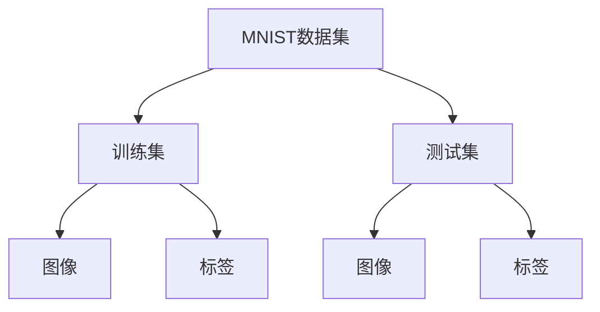

# 从零开始大模型开发与微调：MNIST数据集的特征和标签介绍

## 1.背景介绍

在人工智能和机器学习领域，MNIST数据集是一个经典的入门数据集。它包含了手写数字的图像和对应的标签，广泛用于图像分类任务的研究和教学。MNIST数据集的简单性和易用性使其成为初学者和研究人员的首选。本文将详细介绍MNIST数据集的特征和标签，并探讨如何从零开始进行大模型开发与微调。

## 2.核心概念与联系

### 2.1 MNIST数据集简介

MNIST数据集由Yann LeCun等人创建，包含60,000张训练图像和10,000张测试图像。每张图像是28x28像素的灰度图，表示0到9的手写数字。

### 2.2 特征与标签

- **特征**：图像的像素值，范围从0到255。
- **标签**：对应的数字，范围从0到9。

### 2.3 数据集的结构

MNIST数据集的结构如下：



## 3.核心算法原理具体操作步骤

### 3.1 数据预处理

数据预处理是机器学习模型开发的第一步。对于MNIST数据集，常见的预处理步骤包括：

1. **归一化**：将像素值从0-255缩放到0-1。
2. **数据增强**：通过旋转、平移等操作增加数据的多样性。

### 3.2 模型选择

常用的模型包括：

- **全连接神经网络（FNN）**
- **卷积神经网络（CNN）**
- **递归神经网络（RNN）**

### 3.3 模型训练

模型训练的步骤包括：

1. **定义损失函数**：常用的损失函数是交叉熵损失。
2. **选择优化器**：如SGD、Adam等。
3. **训练模型**：通过反向传播算法更新模型参数。

### 3.4 模型评估

使用测试集评估模型的性能，常用的评估指标包括准确率、精确率、召回率等。

## 4.数学模型和公式详细讲解举例说明

### 4.1 交叉熵损失函数

交叉熵损失函数用于衡量预测值与真实值之间的差异。公式如下：

$$
L = -\sum_{i=1}^{N} y_i \log(\hat{y}_i)
$$

其中，$y_i$ 是真实标签，$\hat{y}_i$ 是预测概率。

### 4.2 反向传播算法

反向传播算法用于计算损失函数相对于模型参数的梯度，并更新参数。公式如下：

$$
\theta = \theta - \eta \frac{\partial L}{\partial \theta}
$$

其中，$\theta$ 是模型参数，$\eta$ 是学习率。

## 5.项目实践：代码实例和详细解释说明

### 5.1 数据加载与预处理

```python
import tensorflow as tf
from tensorflow.keras.datasets import mnist

# 加载数据
(x_train, y_train), (x_test, y_test) = mnist.load_data()

# 归一化
x_train, x_test = x_train / 255.0, x_test / 255.0
```

### 5.2 构建模型

```python
from tensorflow.keras.models import Sequential
from tensorflow.keras.layers import Dense, Flatten

model = Sequential([
    Flatten(input_shape=(28, 28)),
    Dense(128, activation='relu'),
    Dense(10, activation='softmax')
])
```

### 5.3 编译与训练模型

```python
model.compile(optimizer='adam',
              loss='sparse_categorical_crossentropy',
              metrics=['accuracy'])

model.fit(x_train, y_train, epochs=5)
```

### 5.4 模型评估

```python
test_loss, test_acc = model.evaluate(x_test, y_test)
print(f'测试准确率: {test_acc}')
```

## 6.实际应用场景

MNIST数据集的应用场景包括但不限于：

- **手写数字识别**：用于银行支票处理、邮政编码识别等。
- **图像分类**：作为图像分类任务的基准数据集。
- **模型验证**：用于验证新算法和模型的性能。

## 7.工具和资源推荐

### 7.1 开发工具

- **TensorFlow**：一个开源的机器学习框架，适用于大规模数据处理。
- **Keras**：一个高层神经网络API，能够快速构建和训练模型。

### 7.2 学习资源

- **《深度学习》**：Yann LeCun、Ian Goodfellow和Aaron Courville合著的经典教材。
- **Coursera上的深度学习课程**：由Andrew Ng教授讲授，涵盖了深度学习的基础知识和实践。

## 8.总结：未来发展趋势与挑战

### 8.1 未来发展趋势

- **更大规模的数据集**：未来将有更多更大规模的数据集用于训练更复杂的模型。
- **自动化机器学习（AutoML）**：通过自动化工具简化模型选择和超参数调优过程。

### 8.2 挑战

- **数据隐私**：如何在保护用户隐私的前提下使用数据进行训练。
- **模型解释性**：如何解释复杂模型的决策过程。

## 9.附录：常见问题与解答

### 9.1 MNIST数据集的图像为什么是28x28像素？

MNIST数据集的图像尺寸为28x28像素是为了简化计算和存储，同时保证足够的分辨率来识别手写数字。

### 9.2 为什么要进行数据归一化？

数据归一化可以加速模型的收敛速度，提高训练效果。

### 9.3 如何选择合适的优化器？

优化器的选择取决于具体的任务和数据集。常用的优化器包括SGD、Adam等。

---

作者：禅与计算机程序设计艺术 / Zen and the Art of Computer Programming