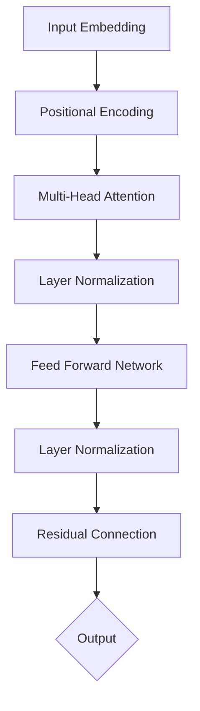

# 从零开始大模型开发与微调：PyTorch 2.0中的模块工具

## 1. 背景介绍

### 1.1 大语言模型的发展历程

近年来,大语言模型(Large Language Model, LLM)在自然语言处理(Natural Language Processing, NLP)领域取得了突破性进展。从2018年的BERT[1]、GPT[2]到最新的GPT-4[3]、PaLM[4]等模型,LLM展现出了惊人的语言理解和生成能力,在问答、对话、文本分类、机器翻译等任务上取得了超越人类的表现。这些模型通过在海量语料上进行无监督预训练,学习到了丰富的语言知识和常识,具备强大的迁移学习能力。

### 1.2 大模型训练面临的挑战

尽管LLM取得了瞩目的成就,但训练这些模型仍然面临巨大挑战:

1. **计算资源需求大**:动辄数百亿、上千亿参数的模型对算力和内存提出了极高要求,训练一个LLM动辄需要数周甚至数月的时间,以及数百张高端GPU的支持。
2. **训练效率低下**:传统的数据并行训练方式在模型超大规模时遇到了瓶颈,梯度通信开销大大降低了训练效率。模型并行虽然能缓解内存压力,但编程复杂度高,且并行度受限。  
3. **微调难度大**:在下游任务上微调预训练模型时,完整的模型微调(Full Fine-tuning)需要巨大的算力,且容易发生灾难性遗忘(Catastrophic Forgetting)[5]。而参数高效微调如Adapter[6]、LoRA[7]等方法虽然大幅降低了微调开销,但牺牲了一定的性能。

### 1.3 PyTorch 2.0带来的新机遇

2023年3月,PyTorch发布了2.0版本[8],带来了一系列面向大模型开发的新特性和优化:

1. **torch.compile**:即时编译工具,可将PyTorch代码编译为高效的机器代码,显著提升训练和推理性能。
2. **torch.distributed**:增强的分布式训练支持,引入了FSDP(Fully Sharded Data Parallel)[9]等新的并行策略,可实现千亿规模模型的高效训练。 
3. **torch.fx**:机器学习编译(Machine Learning Compilation, MLC)框架,支持对模型进行图级别优化和转换。
4. **TorchDynamo**:基于Python字节码和FX的编译器,可在不修改代码的情况下加速PyTorch程序。

这些新特性为从零开始构建大模型提供了更多可能性。本文将重点介绍如何基于PyTorch 2.0,从头开发和微调一个LLM。我们将详细讲解模型结构设计、数据准备、分布式训练、推理优化等关键技术,并给出完整的代码实现。

## 2. 核心概念与联系

### 2.1 Transformer结构

Transformer[10]是当前大语言模型的核心结构。它抛弃了此前NLP模型中常用的RNN(Recurrent Neural Network)和CNN(Convolutional Neural Network),完全依赖注意力机制(Attention Mechanism)来学习文本表示。一个基本的Transformer由编码器(Encoder)和解码器(Decoder)组成,核心组件包括:

- 输入嵌入(Input Embedding):将输入token映射为连续向量表示。
- 位置编码(Positional Encoding):为每个token的位置信息添加可学习的嵌入。
- 多头注意力(Multi-Head Attention):通过多个注意力头并行计算不同位置之间的关联性。
- 前馈网络(Feed Forward Network):由两层全连接网络组成,对注意力输出进行非线性变换。
- 层归一化(Layer Normalization):对每一层的输入进行归一化,加速收敛并提高泛化性能。
- 残差连接(Residual Connection):将前一层的输出与当前层的输出相加,缓解梯度消失问题。

下图展示了Transformer的整体架构:



### 2.2 自回归语言模型

大多数LLM都采用了自回归(Autoregressive)语言建模的范式,即模型根据之前生成的token来预测下一个token的概率分布。形式化地,给定一个长度为T的文本序列$X=(x_1,x_2,...,x_T)$,自回归语言模型的目标是最大化如下条件概率:

$$P(X)=\prod_{t=1}^TP(x_t|x_1,x_2,...,x_{t-1})$$

其中$P(x_t|x_1,x_2,...,x_{t-1})$表示在给定前t-1个token的条件下,第t个token为$x_t$的概率。这个概率通过Softmax归一化得到:

$$P(x_t|x_1,x_2,...,x_{t-1})=\frac{\exp(e(x_t))}{\sum_{x'\in V}\exp(e(x'))}$$

其中$e(x)$是token $x$的嵌入向量,$V$是词表的大小。

在训练时,模型通过最小化负对数似然损失函数来学习上述条件概率分布:

$$L=-\frac{1}{T}\sum_{t=1}^T\log P(x_t|x_1,x_2,...,x_{t-1})$$

而在生成/预测时,模型根据当前已生成的token序列,使用贪心搜索(Greedy Search)、波束搜索(Beam Search)等策略来逐步采样下一个token,直到遇到终止符如<eos>。

### 2.3 预训练与微调范式

大模型通常遵循"预训练-微调"(Pre-training and Fine-tuning)的范式。在第一阶段,模型在大规模无标注语料上进行自监督预训练,学习通用的语言表示。主要的预训练任务包括:

- 语言模型:通过自回归或者BERT的Masked Language Modeling(MLM)任务来学习上下文相关的词嵌入。
- 对比学习:通过最大化正样本对的相似度和最小化负样本对的相似度,来学习语义一致的句子表示,如SimCSE[11]。
- 序列到序列:通过Encoder-Decoder结构,同时建模输入文本和输出文本,如T5[12]、BART[13]。

在第二阶段,我们将预训练模型应用到下游任务中,通过微调特定任务的损失函数,使模型适应具体应用场景。根据任务类型的不同,微调可以分为以下几类:

- 分类任务:在Encoder的输出上添加分类头,如情感分析、文本蕴含等。
- 生成任务:使用Decoder生成目标文本,如摘要、机器翻译、对话等。
- 提示学习:通过设计自然语言提示模版,将各类任务统一为文本生成问题,如GPT-3[14]。

## 3. 核心算法原理与具体操作步骤

本节我们将详细介绍如何从头开发一个支持上百亿参数的自回归语言模型。我们将从模型结构设计、数据准备、训练流程三个方面展开。

### 3.1 模型结构设计

我们采用经典的Transformer Decoder结构,其主要组成部分包括:

1. **Token Embedding**:将输入token映射为d_model维度的向量。
2. **Position Embedding**:学习每个位置的d_model维嵌入向量,与Token Embedding相加。
3. **Transformer Block**:由多头注意力、前馈网络、层归一化等组件组成,可以堆叠N个Block。
   - **Multi-Head Attention**:并行计算多个注意力头,每个头的维度为d_head。
   - **Feed Forward Network**:由两个线性变换和一个非线性激活函数(如GeLU)组成。
4. **Layer Normalization**:对每一层的输入进行归一化。
5. **Residual Connection**:将前一层的输出与归一化后的结果相加。
6. **Final Layer Norm**:在所有Transformer Block之后再做一次归一化。
7. **Language Model Head**:输出词表大小的Logits,用于计算下一个token的概率。

下面是使用PyTorch实现的GPT模型代码:

```python
import torch
import torch.nn as nn
from torch.nn import functional as F

class GPTConfig:
    def __init__(self, vocab_size, max_len, n_layer, n_head, d_model, 
                 d_head, d_inner, dropout, **kwargs):
        self.vocab_size = vocab_size
        self.max_len = max_len
        self.n_layer = n_layer
        self.n_head = n_head
        self.d_model = d_model
        self.d_head = d_head
        self.d_inner = d_inner
        self.dropout = dropout

def gelu(x):
    return 0.5 * x * (1 + torch.tanh(math.sqrt(2 / math.pi) * (x + 0.044715 * torch.pow(x, 3))))

class LayerNorm(nn.Module):
    def __init__(self, hidden_size, eps=1e-5):
        super(LayerNorm, self).__init__()
        self.weight = nn.Parameter(torch.ones(hidden_size))
        self.bias = nn.Parameter(torch.zeros(hidden_size))
        self.eps = eps

    def forward(self, x):
        mean = x.mean(-1, keepdim=True)
        std = x.std(-1, keepdim=True)
        return self.weight * (x - mean) / (std + self.eps) + self.bias

class CausalSelfAttention(nn.Module):
    def __init__(self, config):
        super().__init__()
        assert config.d_model % config.n_head == 0
        self.n_head = config.n_head
        self.d_head = config.d_head
        self.d_model = config.d_model
        self.c_attn = nn.Linear(config.d_model, 3 * config.d_model)
        self.c_proj = nn.Linear(config.d_model, config.d_model)
        self.dropout = nn.Dropout(config.dropout)

    def forward(self, x):
        B, T, C = x.shape

        q, k ,v  = self.c_attn(x).split(self.d_model, dim=2)
        k = k.view(B, T, self.n_head, self.d_head).transpose(1, 2)
        q = q.view(B, T, self.n_head, self.d_head).transpose(1, 2)
        v = v.view(B, T, self.n_head, self.d_head).transpose(1, 2)

        att = (q @ k.transpose(-2, -1)) * (1.0 / math.sqrt(k.size(-1)))
        att = att.masked_fill(self.bias[:,:,:T,:T] == 0, float('-inf'))
        att = F.softmax(att, dim=-1)
        att = self.dropout(att)
        y = att @ v 
        y = y.transpose(1, 2).contiguous().view(B, T, self.d_model)

        y = self.c_proj(y)
        return y

class MLP(nn.Module):
    def __init__(self, config):
        super().__init__()
        self.c_fc = nn.Linear(config.d_model, config.d_inner)
        self.c_proj = nn.Linear(config.d_inner, config.d_model)
        self.dropout = nn.Dropout(config.dropout)

    def forward(self, x):
        x = self.c_fc(x)
        x = gelu(x)
        x = self.c_proj(x)
        x = self.dropout(x)
        return x

class TransformerBlock(nn.Module):
    def __init__(self, config):
        super().__init__()

        self.ln_1 = LayerNorm(config.d_model)
        self.attn = CausalSelfAttention(config)
        self.ln_2 = LayerNorm(config.d_model)
        self.mlp = MLP(config)

    def forward(self, x):
        x = x + self.attn(self.ln_1(x))
        x = x + self.mlp(self.ln_2(x))
        return x

class GPT(nn.Module):
    def __init__(self, config):
        super().__init__()
        self.config = config

        self.wte = nn.Embedding(config.vocab_size, config.d_model)
        self.wpe = nn.Embedding(config.max_len, config.d_model)
        
        self.drop = nn.Dropout(config.dropout)
        self.h = nn.ModuleList([TransformerBlock(config) for _ in range(config.n_layer)])
        self.ln_f = LayerNorm(config.d_model)

        self.lm_head = nn.Linear(config.d_model, config.vocab_size, bias=False)

    def forward(self, x):
        B, T = x.shape
        pos = torch.arange(0, T, dtype=torch.long, device=x.device).unsqueeze(0)

        tok_emb = self.wte(x) 
        pos_emb = self.wpe(pos) 
        x = self.drop(tok_