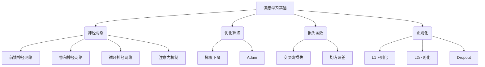
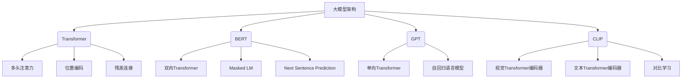
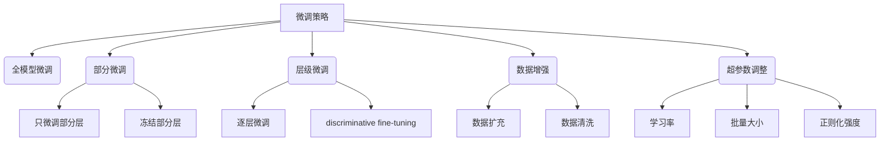

# 从零开始大模型开发与微调：一学就会的深度学习基础算法详解

## 1. 背景介绍

### 1.1 人工智能的兴起

人工智能(AI)是当代科技发展的核心驱动力,其影响力已经渗透到我们生活的方方面面。从语音助手到自动驾驶汽车,从推荐系统到医疗诊断,AI无处不在。随着算力和数据的快速增长,深度学习作为AI的核心技术,正在催生着一场前所未有的技术革命。

### 1.2 大模型的崛起

近年来,大规模预训练语言模型(如GPT、BERT等)和大规模视觉模型(如CLIP、Stable Diffusion等)的出现,标志着AI发展进入了一个新的里程碑。这些大模型通过在海量数据上预训练,学习到了丰富的知识表示,展现出惊人的泛化能力,可以应用于广泛的下游任务。

### 1.3 微调的重要性

虽然大模型具有强大的能力,但直接将其应用于特定任务仍存在一些局限性。因此,微调(Fine-tuning)便成为了充分发挥大模型潜力的关键环节。通过在特定任务数据上进行进一步训练,可以使模型更好地适应目标任务,提高性能表现。

## 2. 核心概念与联系

### 2.1 深度学习基础

深度学习的核心概念包括神经网络、优化算法、损失函数和正则化等。神经网络是深度学习模型的基础架构,包括前馈神经网络、卷积神经网络、循环神经网络和注意力机制等。优化算法如梯度下降和Adam用于训练神经网络,而损失函数如交叉熵损失和均方误差用于衡量模型的预测效果。正则化技术如L1、L2正则化和Dropout则有助于防止过拟合。

### 2.2 大模型架构

大模型架构主要基于Transformer结构,包括多头注意力、位置编码和残差连接等关键组件。BERT采用双向Transformer编码器,通过Masked LM和Next Sentence Prediction任务进行预训练。GPT则使用单向Transformer解码器,作为自回归语言模型进行预训练。CLIP则将视觉和文本编码器对接,通过对比学习学习视觉-文本表示。

### 2.3 微调策略

微调策略包括全模型微调、部分微调、层级微调、数据增强和超参数调整等。部分微调可以只微调部分层或冻结部分层。层级微调包括逐层微调和discriminative fine-tuning等。数据增强可以通过数据扩充和数据清洗来提高模型性能。超参数调整则涉及学习率、批量大小和正则化强度等超参数的选择。

## 3. 核心算法原理具体操作步骤

### 3.1 Transformer架构

Transformer是大模型的核心架构,其主要组成部分包括:

1. **多头注意力机制(Multi-Head Attention)**

$$
\begin{aligned}
\text{MultiHead}(Q, K, V) &= \text{Concat}(\text{head}_1, \dots, \text{head}_h)W^O\\
\text{where\ head}_i &= \text{Attention}(QW_i^Q, KW_i^K, VW_i^V)
\end{aligned}
$$

多头注意力机制将查询(Q)、键(K)和值(V)通过不同的线性投影得到多组表示,然后并行计算注意力,最后将所有头的注意力输出拼接起来并经过线性变换得到最终输出。

2. **位置编码(Positional Encoding)**

$$\text{PE}_{(pos, 2i)} = \sin(pos / 10000^{2i / d_\text{model}})$$
$$\text{PE}_{(pos, 2i+1)} = \cos(pos / 10000^{2i / d_\text{model}})$$

位置编码将序列的位置信息编码为一个向量,并添加到输入的嵌入中,使Transformer能够捕获序列的位置信息。

3. **前馈网络(Feed-Forward Network)**

$$\text{FFN}(x) = \max(0, xW_1 + b_1)W_2 + b_2$$

前馈网络是一个简单的多层感知机,用于对每个位置的表示进行非线性变换。

4. **残差连接(Residual Connection)和层归一化(Layer Normalization)**

残差连接和层归一化用于缓解梯度消失/爆炸问题,提高模型的训练稳定性。

Transformer的核心操作步骤包括:

1. 输入嵌入和位置编码相加,得到初始序列表示。
2. 通过多头注意力机制捕获序列内部的依赖关系。
3. 对注意力输出进行残差连接和层归一化。
4. 通过前馈网络对每个位置的表示进行非线性变换。
5. 再次进行残差连接和层归一化,得到该层的最终输出。
6. 重复2-5步骤,构建编码器或解码器的多层结构。

### 3.2 BERT预训练

BERT(Bidirectional Encoder Representations from Transformers)是一种基于Transformer的双向编码器模型,通过以下两个预训练任务学习通用的语言表示:

1. **Masked Language Model(MLM)**

   - 在输入序列中随机掩码15%的词元。
   - 使用双向Transformer编码器对整个序列建模。
   - 最大化掩码位置的词元的预测概率。

2. **Next Sentence Prediction(NSP)**

   - 将两个句子拼接作为输入序列。
   - 判断第二个句子是否为第一个句子的下一句。
   - 最大化二分类标签的预测概率。

BERT预训练的核心步骤包括:

1. 构建掩码输入和下一句预测的训练样本。
2. 通过双向Transformer编码器对输入序列建模。
3. 计算MLM和NSP的损失函数。
4. 使用优化算法(如Adam)更新模型参数。
5. 重复2-4步骤,直至收敛。

### 3.3 GPT预训练

GPT(Generative Pre-trained Transformer)是一种基于Transformer的单向解码器模型,通过语言模型预训练任务学习通用的语言表示:

1. 构建自回归语言模型的训练样本。
2. 使用单向Transformer解码器对输入序列建模。
3. 最大化每个位置的词元预测概率。
4. 使用优化算法(如Adam)更新模型参数。
5. 重复2-4步骤,直至收敛。

GPT预训练的核心在于利用自回归语言模型的目标函数,通过单向解码器学习序列的概率分布,捕获语言的先验知识。

### 3.4 CLIP预训练

CLIP(Contrastive Language-Image Pre-training)是一种通过对比学习的方式,同时预训练视觉和文本编码器的模型。其核心思想是:

1. 构建视觉-文本对的训练样本。
2. 使用视觉Transformer编码器对图像建模,得到视觉表示。
3. 使用文本Transformer编码器对文本描述建模,得到文本表示。
4. 计算视觉表示和文本表示的相似度得分。
5. 最大化正样本对的相似度得分,最小化负样本对的相似度得分。
6. 使用对比损失函数和优化算法(如Adam)更新模型参数。
7. 重复2-6步骤,直至收敛。

CLIP预训练的关键在于通过对比学习的方式,同时学习视觉和文本的统一表示空间,捕获视觉-文本的对应关系。

## 4. 数学模型和公式详细讲解举例说明

### 4.1 注意力机制

注意力机制是Transformer的核心组件,它使模型能够自适应地为不同的输入分配不同的注意力权重,从而更好地捕获长距离依赖关系。

在标准的注意力机制中,给定一个查询向量$\boldsymbol{q}$,键向量的集合$\boldsymbol{K} = \{\boldsymbol{k}_1, \boldsymbol{k}_2, \dots, \boldsymbol{k}_n\}$和值向量的集合$\boldsymbol{V} = \{\boldsymbol{v}_1, \boldsymbol{v}_2, \dots, \boldsymbol{v}_n\}$,注意力输出向量$\boldsymbol{o}$计算如下:

$$\boldsymbol{o} = \sum_{i=1}^{n} \alpha_i \boldsymbol{v}_i$$

其中,注意力权重$\alpha_i$由查询向量$\boldsymbol{q}$和键向量$\boldsymbol{k}_i$计算得到:

$$\alpha_i = \text{softmax}\left(\frac{\boldsymbol{q}^\top \boldsymbol{k}_i}{\sqrt{d_k}}\right)$$

$d_k$是键向量的维度,用于缩放点积的值,从而避免过大或过小的值导致梯度消失或爆炸。

注意力机制的核心思想是,通过计算查询向量和每个键向量的相似性得分,然后使用softmax函数将其转换为注意力权重,最后将注意力权重与对应的值向量加权求和,得到注意力输出。

例如,在机器翻译任务中,注意力机制可以帮助模型自适应地关注源语言序列中与当前目标词元相关的部分,从而更好地捕获长距离依赖关系,提高翻译质量。

### 4.2 Transformer中的残差连接和层归一化

在训练深度神经网络时,常常会遇到梯度消失或梯度爆炸的问题,这会导致模型收敛缓慢或无法收敛。为了缓解这个问题,Transformer引入了残差连接和层归一化。

**残差连接(Residual Connection)**

残差连接的思想是,将输入直接添加到层的输出中,形成一条"捷径",使梯度能够更直接地传递到较浅层。具体来说,如果$\boldsymbol{x}$是层的输入,$F(\boldsymbol{x})$是层的输出,那么残差连接后的输出为:

$$\boldsymbol{y} = F(\boldsymbol{x}) + \boldsymbol{x}$$

通过这种方式,即使$F(\boldsymbol{x})$的梯度较小,也可以通过$\boldsymbol{x}$的梯度进行有效的更新,从而缓解梯度消失问题。

**层归一化(Layer Normalization)**

层归一化是一种对输入进行归一化的操作,它可以加速模型的收敛并提高模型的稳定性。具体来说,对于一个输入向量$\boldsymbol{x} = (x_1, x_2, \dots, x_n)$,层归一化的计算过程如下:

$$\mu = \frac{1}{n}\sum_{i=1}^{n}x_i$$
$$\sigma^2 = \frac{1}{n}\sum_{i=1}^{n}(x