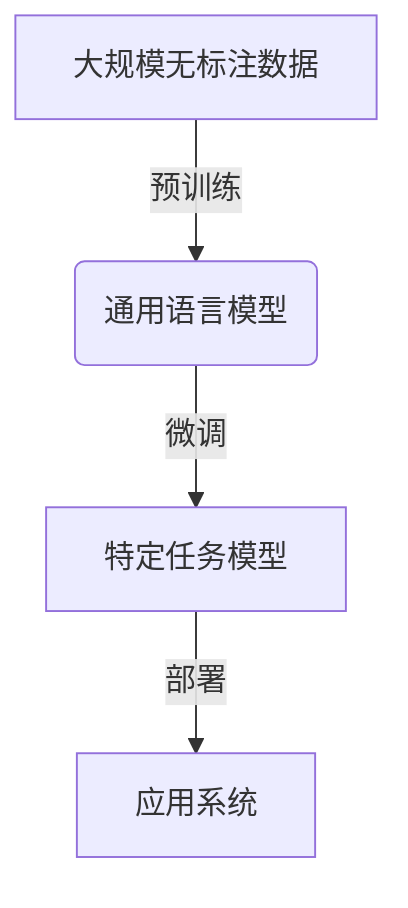

# 从零开始大模型开发与微调：人工智能的历史与未来

## 1.背景介绍

### 1.1 人工智能的兴起

人工智能(Artificial Intelligence, AI)是当代科技领域最具变革性的力量之一。自20世纪中叶诞生以来,AI技术不断突破,在语音识别、图像处理、自然语言处理等领域取得了长足进展,深刻影响着人类社会的方方面面。

### 1.2 大模型的崛起

近年来,随着算力、数据和算法的飞速发展,大规模预训练语言模型(Large Pre-trained Language Models, LLMs)成为AI领域的新热点。这些模型通过在海量数据上预训练,掌握了丰富的知识,展现出惊人的泛化能力。GPT-3、PanGu-Alpha、BLOOM等大模型在自然语言处理、代码生成等任务上取得了突破性进展,引发了学术界和工业界的广泛关注。

### 1.3 微调技术的重要性

尽管大模型具有强大的能力,但直接将其应用于特定任务并不理想。这就需要利用微调(Fine-tuning)技术,在大模型的基础上,使用与目标任务相关的数据进行进一步训练,从而提高模型在特定领域的性能表现。微调技术已成为大模型开发和应用的关键环节。

## 2.核心概念与联系

### 2.1 预训练与微调

预训练(Pre-training)是指在大规模无标注数据上训练模型,使其学习到通用的语言表示能力。而微调(Fine-tuning)则是在预训练模型的基础上,使用与目标任务相关的标注数据进行进一步训练,使模型更加专注于特定的任务。

预训练和微调是一种"先粗后细"的策略,可以有效利用大规模无标注数据和少量标注数据,提高模型的性能表现。



### 2.2 迁移学习

微调技术本质上是一种迁移学习(Transfer Learning)方法。迁移学习旨在将在源域(Source Domain)学习到的知识迁移到目标域(Target Domain),从而提高目标任务的性能。

在大模型开发中,预训练模型可视为源域模型,而微调则是将其知识迁移到目标任务领域。通过迁移学习,可以充分利用预训练模型掌握的丰富知识,降低目标任务的数据需求和计算成本。


### 2.3 领域自适应

由于预训练数据与目标任务数据存在分布差异,直接微调可能会导致性能下降。领域自适应(Domain Adaptation)技术旨在缩小预训练数据与目标任务数据之间的分布差异,提高模型的泛化能力。

常见的领域自适应方法包括数据增强、特征映射、对抗训练等。通过领域自适应,可以进一步提升微调效果,使模型更好地适应目标任务领域。

## 3.核心算法原理具体操作步骤

### 3.1 预训练阶段

预训练阶段的目标是在大规模无标注数据上训练模型,使其学习到通用的语言表示能力。常见的预训练算法包括:

1. **Masked Language Modeling (MLM)**:随机掩蔽部分输入词,模型需要根据上下文预测被掩蔽的词。
2. **Next Sentence Prediction (NSP)**:判断两个句子是否连续出现。
3. **Permutation Language Modeling (PLM)**:预测打乱顺序的词序列的原始顺序。

以BERT为例,其预训练过程包括以下步骤:

1. 准备大规模无标注文本数据。
2. 对输入序列进行词元化(Tokenization)和位置编码(Position Encoding)。
3. 随机掩蔽部分词元,作为MLM任务的输入。
4. 构建NSP任务的输入对。
5. 使用Transformer编码器计算掩蔽词元和NSP的损失函数。
6. 使用梯度下降优化模型参数。

### 3.2 微调阶段

微调阶段的目标是在预训练模型的基础上,使用与目标任务相关的标注数据进行进一步训练,提高模型在特定领域的性能表现。常见的微调方法包括:

1. **全模型微调**:对预训练模型的所有参数进行微调。
2. **部分微调**:仅对部分层(如输出层)进行微调,其余层参数保持不变。
3. **层级微调**:分层进行微调,先微调高层参数,再逐层微调低层参数。
4. **并行微调**:同时在多个任务上进行微调,提高模型的泛化能力。

以BERT的序列标注任务为例,微调步骤如下:

1. 准备与目标任务相关的标注数据。
2. 对输入序列进行词元化和位置编码。
3. 使用BERT编码器计算输入序列的表示。
4. 在BERT之上添加一个序列标注层。
5. 计算序列标注层的损失函数。
6. 使用梯度下降优化BERT和序列标注层的参数。

### 3.3 领域自适应算法

领域自适应算法旨在缩小预训练数据与目标任务数据之间的分布差异,提高模型的泛化能力。常见的领域自适应算法包括:

1. **数据增强**:通过对目标数据进行变换(如翻译、噪声注入等)生成更多样的数据。
2. **特征映射**:学习一个映射函数,将源域和目标域的特征映射到一个共享的空间。
3. **对抗训练**:训练一个域分类器,使得源域和目标域的特征分布无法被区分。

以对抗训练为例,其算法步骤如下:

1. 准备源域数据和目标域数据。
2. 使用预训练模型计算源域数据和目标域数据的特征表示。
3. 训练一个域分类器,以最大化源域和目标域特征的可分性。
4. 训练特征提取器,使得源域和目标域特征的可分性最小化。
5. 特征提取器和域分类器进行对抗训练,直至达到平衡。
6. 使用对抗训练后的特征提取器进行微调。

## 4.数学模型和公式详细讲解举例说明

### 4.1 Transformer模型

Transformer是大模型的核心模块,其数学模型如下:

$$\begin{aligned}
&\text{MultiHead}(Q, K, V) = \text{Concat}(\text{head}_1, \ldots, \text{head}_h)W^O\\
&\text{where} \; \text{head}_i = \text{Attention}(QW_i^Q, KW_i^K, VW_i^V)
\end{aligned}$$

其中,Attention计算如下:

$$\text{Attention}(Q, K, V) = \text{softmax}(\frac{QK^T}{\sqrt{d_k}})V$$

这里$Q$、$K$、$V$分别表示Query、Key和Value。MultiHead Attention通过并行计算多个Attention,捕获不同的关系。

### 4.2 掩蔽语言模型

掩蔽语言模型(Masked Language Modeling, MLM)是预训练的核心任务之一,其目标是根据上下文预测被掩蔽的词元。

设输入序列为$\boldsymbol{x} = (x_1, x_2, \ldots, x_n)$,其中$x_m$为被掩蔽的词元。模型需要最大化如下条件概率:

$$\mathcal{L}_\text{MLM} = -\log P(x_m | \boldsymbol{x} \backslash x_m; \theta)$$

其中$\theta$为模型参数,通过最大化$\mathcal{L}_\text{MLM}$来学习参数$\theta$。

### 4.3 对抗训练

对抗训练旨在使源域和目标域的特征分布无法被区分。设$D_s$和$D_t$分别为源域和目标域的数据分布,$\phi$为特征提取器,$\psi$为域分类器。对抗训练的目标函数为:

$$\begin{aligned}
\min_\phi \max_\psi \mathcal{L}_\text{adv}(\phi, \psi) &= \mathbb{E}_{x \sim D_s}[\log \psi(\phi(x))] \\
&+ \mathbb{E}_{x \sim D_t}[\log (1 - \psi(\phi(x)))]
\end{aligned}$$

通过最小化$\mathcal{L}_\text{adv}$,可以使得$\phi$提取的源域和目标域特征无法被$\psi$区分,从而实现域自适应。

## 5.项目实践:代码实例和详细解释说明

以下是一个使用Hugging Face Transformers库进行BERT微调的Python代码示例:

```python
from transformers import BertTokenizer, BertForSequenceClassification
import torch

# 加载预训练模型和分词器
tokenizer = BertTokenizer.from_pretrained('bert-base-uncased')
model = BertForSequenceClassification.from_pretrained('bert-base-uncased')

# 准备数据
train_texts = [...] # 训练数据文本
train_labels = [...] # 训练数据标签

# 对数据进行编码
train_encodings = tokenizer(train_texts, truncation=True, padding=True)
train_dataset = torch.utils.data.TensorDataset(
    torch.tensor(train_encodings['input_ids']),
    torch.tensor(train_encodings['attention_mask']),
    torch.tensor(train_labels)
)

# 定义训练参数
batch_size = 16
epochs = 3
learning_rate = 2e-5

# 定义优化器和学习率调度器
optimizer = torch.optim.AdamW(model.parameters(), lr=learning_rate)
scheduler = torch.optim.lr_scheduler.LinearLR(optimizer)

# 训练循环
for epoch in range(epochs):
    model.train()
    for batch in train_dataset:
        # 准备输入
        input_ids, attention_mask, labels = batch
        
        # 前向传播
        outputs = model(input_ids, attention_mask=attention_mask, labels=labels)
        loss = outputs.loss
        
        # 反向传播
        loss.backward()
        optimizer.step()
        scheduler.step()
        optimizer.zero_grad()

# 保存微调后的模型
model.save_pretrained('bert-finetuned')
```

上述代码首先加载预训练的BERT模型和分词器。然后,将训练数据进行编码,构建`TensorDataset`。接下来,定义训练参数、优化器和学习率调度器。

在训练循环中,对每个批次的数据进行前向传播,计算损失函数。然后进行反向传播,更新模型参数。最后,保存微调后的模型。

需要注意的是,上述代码仅为示例,在实际应用中还需要进行数据预处理、模型评估等步骤。

## 6.实际应用场景

大模型微调技术在自然语言处理、计算机视觉等多个领域都有广泛的应用,例如:

1. **文本分类**:利用微调后的BERT等模型,对新闻、评论等文本进行主题分类、情感分析等。
2. **机器翻译**:在大规模平行语料上预训练序列到序列模型,再针对特定语言对进行微调,提高翻译质量。
3. **对话系统**:基于GPT-3等大模型,结合领域知识进行微调,构建具有一定理解和推理能力的对话系统。
4. **代码生成**:利用Codex等代码大模型,通过微调生成特定编程语言的代码,提高开发效率。
5. **医疗影像分析**:在医疗影像数据上微调视觉大模型,辅助医生进行疾病诊断和治疗方案制定。

## 7.工具和资源推荐

1. **Hugging Face Transformers**:提供了丰富的预训练模型和微调工具,是大模型开发的利器。
2. **AllenNLP**:一个强大的NLP开源框架,支持多种预训练模型的微调。
3. **fast.ai**:提供了简洁的API和教程,适合入门级用户使用。
4. **OpenAI API**:提供了GPT-3等大模型的API接口,方便开发者调用。
5. **PaddleNLP**:百度开源的自然语言处理框架,提供了多种预训练模型和微调工具。
6. **MLOps工具**:如Weights & Biases、Tensorboard等,用于大模型训练的可视化和管理。

## 8.