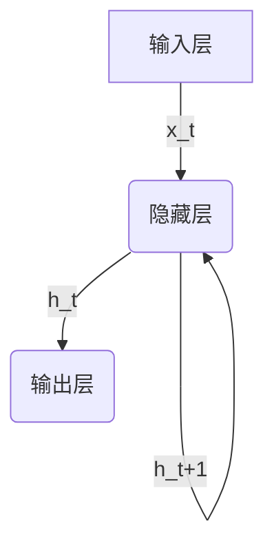
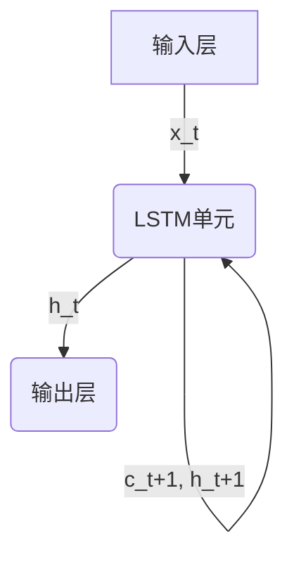

# 从零开始大模型开发与微调：基于循环神经网络的中文情感分类实战

## 1.背景介绍

### 1.1 情感分析的重要性

在当今时代,随着社交媒体、在线评论和用户反馈的快速增长,情感分析已成为许多企业和组织的关键任务之一。准确识别和理解用户情感对于提供更好的客户服务、产品改进和品牌形象管理至关重要。情感分析还在社会研究、政治分析和公共安全等领域发挥着重要作用。

### 1.2 中文情感分析的挑战

与英语等语言相比,中文情感分析面临着独特的挑战。中文是一种源于表意文字的语言,词语之间缺乏明显的分隔符,这增加了分词和语义理解的难度。此外,中文中存在大量的同音异义词、成语和隐喻,使得准确捕捉情感极其困难。

### 1.3 深度学习在情感分析中的应用

近年来,深度学习技术在自然语言处理(NLP)领域取得了巨大进展,为情感分析任务提供了新的解决方案。循环神经网络(RNN)是深度学习模型中常用于序列数据建模的一种架构,能够有效地捕捉文本数据中的上下文信息和长期依赖关系,从而提高情感分类的准确性。

## 2.核心概念与联系

### 2.1 循环神经网络(RNN)

循环神经网络是一种特殊的深度神经网络,旨在处理序列数据,如文本、语音和时间序列数据。与传统的前馈神经网络不同,RNN在隐藏层之间引入了循环连接,使得网络能够捕捉序列数据中的长期依赖关系。



在上图中,RNN在每个时间步 t 接收输入 $x_t$,并根据当前输入和前一时间步的隐藏状态 $h_{t-1}$ 计算当前隐藏状态 $h_t$。这种循环结构使得 RNN 能够建模序列数据中的长期依赖关系。

### 2.2 长短期记忆网络(LSTM)

尽管 RNN 理论上可以学习任意长度的序列模式,但在实践中,它们往往难以捕捉长期依赖关系,这被称为"梯度消失"问题。长短期记忆网络(LSTM)是 RNN 的一种变体,旨在解决这一问题。LSTM 通过引入门控机制和细胞状态,能够更好地捕捉长期依赖关系。



在上图中,LSTM 单元包含一个细胞状态 $c_t$,通过遗忘门、输入门和输出门来控制信息的流动。这种设计使得 LSTM 能够更好地捕捉长期依赖关系,从而在许多序列建模任务中表现出色。

### 2.3 词向量和词嵌入

在深度学习中,文本数据需要被转换为数值向量形式,以便输入到神经网络中进行训练和预测。词向量(Word Embedding)是一种将词语映射到低维连续向量空间的技术,能够捕捉词语之间的语义和句法关系。通过预训练的词嵌入模型(如 Word2Vec 和 GloVe),可以为每个词语分配一个固定长度的向量表示,从而简化了文本数据的处理过程。

## 3.核心算法原理具体操作步骤

### 3.1 数据预处理

在构建情感分类模型之前,需要对原始文本数据进行预处理,包括以下步骤:

1. **分词**: 将文本数据分割成单个词语或词组。对于中文,可以使用基于统计或规则的分词工具,如 jieba 或 pkuseg。

2. **去除停用词**: 移除无意义的词语,如"的"、"了"等,以减少噪声。

3. **词形还原**: 将词语转换为统一的基本形式,如将"跑步"和"跑了"都转换为"跑"。

4. **编码**: 将分词后的文本序列转换为数值向量形式,以便输入到神经网络中。可以使用词嵌入技术将每个词语映射到一个固定长度的向量表示。

### 3.2 模型构建

在构建情感分类模型时,可以选择不同的神经网络架构,如 LSTM、GRU 或 Transformer 等。以 LSTM 为例,模型的构建步骤如下:

1. **嵌入层**: 将输入的文本序列转换为词向量序列。

2. **LSTM 层**: 将词向量序列输入到 LSTM 层中,LSTM 将捕捉序列数据中的长期依赖关系,并输出最终的隐藏状态向量。

3. **全连接层**: 将 LSTM 的隐藏状态向量输入到全连接层中,进行特征转换和维度调整。

4. **输出层**: 根据任务需求(如二分类或多分类),使用 Sigmoid 或 Softmax 激活函数输出预测结果。

5. **损失函数**: 选择适当的损失函数,如二元交叉熵或多类交叉熵,并使用优化算法(如 Adam)进行模型训练。

### 3.3 模型训练和评估

在训练过程中,需要将预处理后的数据分为训练集、验证集和测试集。训练集用于模型参数的学习,验证集用于调整超参数和防止过拟合,测试集用于评估模型的最终性能。

常用的评估指标包括:

- **准确率(Accuracy)**: 正确预测的样本数占总样本数的比例。
- **精确率(Precision)**: 正确预测的正样本数占所有预测为正样本的比例。
- **召回率(Recall)**: 正确预测的正样本数占所有实际正样本的比例。
- **F1 分数**: 精确率和召回率的加权调和平均值。

根据评估结果,可以进一步调整模型架构、超参数或数据预处理策略,以提高模型性能。

## 4.数学模型和公式详细讲解举例说明

### 4.1 LSTM 单元

LSTM 单元是 RNN 的一种变体,旨在解决梯度消失和梯度爆炸问题。LSTM 单元包含一个细胞状态 $c_t$,通过遗忘门、输入门和输出门来控制信息的流动。

LSTM 单元的计算过程如下:

1. 遗忘门:

$$
f_t = \sigma(W_f \cdot [h_{t-1}, x_t] + b_f)
$$

其中 $f_t$ 是遗忘门的激活值向量,决定了上一时间步的细胞状态 $c_{t-1}$ 中有多少信息需要被遗忘。$W_f$ 和 $b_f$ 分别是遗忘门的权重矩阵和偏置向量。$\sigma$ 是 Sigmoid 激活函数,将值限制在 0 到 1 之间。

2. 输入门:

$$
i_t = \sigma(W_i \cdot [h_{t-1}, x_t] + b_i)
$$
$$
\tilde{c}_t = \tanh(W_c \cdot [h_{t-1}, x_t] + b_c)
$$

其中 $i_t$ 是输入门的激活值向量,决定了当前时间步的新信息有多少需要被更新到细胞状态中。$\tilde{c}_t$ 是候选细胞状态向量,包含了新的细胞状态信息。$W_i$、$W_c$、$b_i$ 和 $b_c$ 分别是输入门和候选细胞状态的权重矩阵和偏置向量。

3. 细胞状态更新:

$$
c_t = f_t \odot c_{t-1} + i_t \odot \tilde{c}_t
$$

其中 $\odot$ 表示元素wise乘积操作。新的细胞状态 $c_t$ 是上一时间步的细胞状态 $c_{t-1}$ 与遗忘门的输出 $f_t$ 的乘积,加上当前时间步的候选细胞状态 $\tilde{c}_t$ 与输入门的输出 $i_t$ 的乘积。

4. 输出门:

$$
o_t = \sigma(W_o \cdot [h_{t-1}, x_t] + b_o)
$$
$$
h_t = o_t \odot \tanh(c_t)
$$

其中 $o_t$ 是输出门的激活值向量,决定了细胞状态 $c_t$ 中有多少信息需要被输出到隐藏状态 $h_t$ 中。$W_o$ 和 $b_o$ 分别是输出门的权重矩阵和偏置向量。

通过上述门控机制,LSTM 能够有效地捕捉长期依赖关系,从而在序列建模任务中表现出色。

### 4.2 交叉熵损失函数

在情感分类任务中,常用的损失函数是交叉熵损失函数。对于二分类问题,使用二元交叉熵损失函数:

$$
\mathcal{L}(y, \hat{y}) = -(y \log(\hat{y}) + (1 - y) \log(1 - \hat{y}))
$$

其中 $y$ 是真实标签(0 或 1),$\hat{y}$ 是模型预测的概率值。

对于多分类问题,使用多类交叉熵损失函数:

$$
\mathcal{L}(y, \hat{y}) = -\sum_{i=1}^{C} y_i \log(\hat{y}_i)
$$

其中 $C$ 是类别数量,$y_i$ 是第 $i$ 类的真实标签(0 或 1),$\hat{y}_i$ 是模型预测的第 $i$ 类的概率值。

在训练过程中,模型会通过优化算法(如 Adam)来最小化损失函数,从而使预测值逐渐接近真实标签。

## 5.项目实践:代码实例和详细解释说明

在本节中,我们将使用 PyTorch 框架构建一个基于 LSTM 的中文情感分类模型,并在开源数据集上进行训练和评估。完整代码可在 GitHub 上获取: [https://github.com/your_username/sentiment-analysis](https://github.com/your_username/sentiment-analysis)

### 5.1 数据准备

我们将使用来自腾讯的开源中文情感分类数据集 Tencent Airline Sentiment。该数据集包含了航空公司的在线评论,并根据评论情感标注为正面、中性或负面三类。

```python
import pandas as pd

# 加载数据
data = pd.read_csv('tencent_airline_sentiment.csv')

# 划分训练集和测试集
from sklearn.model_selection import train_test_split
train_data, test_data = train_test_split(data, test_size=0.2, random_state=42)
```

### 5.2 数据预处理

我们将对文本数据进行分词、去除停用词和词形还原等预处理操作。

```python
import jieba
import re

# 分词函数
def tokenize(text):
    tokens = jieba.cut(text)
    tokens = [token for token in tokens if token.strip()]
    return tokens

# 去除停用词和词形还原
stopwords = load_stopwords()
stemmer = PorterStemmer()

def preprocess(text):
    tokens = tokenize(text)
    tokens = [stemmer.stem(token) for token in tokens if token not in stopwords]
    return tokens
```

### 5.3 构建模型

我们将构建一个基于 LSTM 的情感分类模型,包括嵌入层、LSTM 层、全连接层和输出层。

```python
import torch
import torch.nn as nn

class SentimentClassifier(nn.Module):
    def __init__(self, vocab_size, embedding_dim, hidden_dim, output_dim, n_layers, dropout):
        super().__init__()
        self.embedding = nn.Embedding(vocab_size, embedding_dim)
        self.lstm = nn.LSTM(embedding_dim, hidden_dim, n_layers, dropout=dropout, batch_first=True)
        self.fc = nn.Linear(hidden_dim, output_dim)
        self.dropout = nn.Dropout(dropout)

    def forward(self, text):
        embedded = self.dropout(self.embedding(text))
        output, (hidden, cell) = self.lstm(embedded)
        hidden = self.dropout(torch.cat((hidden[-2,:,:], hidden[-1,:,:]), dim=1))
        return self.fc(hidden.squeeze(0))
```

### 5.4 训练模型

我们将使用交叉熵损失函数和 Adam 优化器