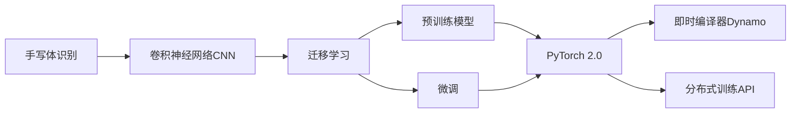

# 从零开始大模型开发与微调：实战基于PyTorch 2.0的手写体识别模型

## 1.背景介绍
### 1.1 手写体识别的重要性与挑战
在当今数字化时代,手写体识别技术在各个领域都有着广泛的应用前景,如邮政编码识别、银行支票识别、历史文献数字化等。然而,由于手写体的多样性、复杂性和非规范性,实现高精度的手写体识别一直是一个具有挑战性的任务。传统的基于模板匹配和特征工程的方法难以有效应对手写体的变异性。

### 1.2 深度学习在手写体识别中的突破
近年来,随着深度学习技术的飞速发展,特别是卷积神经网络(CNN)在计算机视觉领域取得的巨大成功,为手写体识别问题提供了新的解决思路。CNN能够自动学习和提取图像中的层次化特征,克服了手工设计特征的局限性,大大提升了手写体识别的性能。一系列基于CNN的手写体识别模型,如LeNet、AlexNet、VGGNet等,展现出了优异的识别效果。

### 1.3 大模型与迁移学习的应用价值
尽管CNN在手写体识别任务上取得了长足进步,但训练一个高精度的识别模型仍然需要大量的标注数据和计算资源。为了降低训练成本,研究者们开始探索利用预训练的大模型进行迁移学习。这些大模型通常在大规模数据集上进行预训练,学习到了丰富的视觉特征表示。通过在特定任务上微调这些大模型,能够以较小的数据量和训练周期实现出色的性能,极大地提高了模型开发的效率。

### 1.4 PyTorch 2.0 带来的新机遇
PyTorch作为一个灵活、高效的深度学习框架,受到了学术界和工业界的广泛青睐。2023年3月发布的PyTorch 2.0 进一步增强了框架的性能和易用性,为开发者提供了更加友好的开发体验。PyTorch 2.0 引入了即时编译器(Dynamo)、新的分布式训练API(torch.distributed)等创新特性,有力地促进了模型训练和部署效率的提升。

本文将基于PyTorch 2.0框架,详细讲解如何从零开始开发一个手写体识别模型,并利用预训练的大模型进行迁移学习和微调。通过实战案例,读者将掌握手写体识别模型的核心概念、算法原理和开发流程,了解如何利用PyTorch 2.0的新特性加速模型开发,并探索模型在实际场景中的应用。

## 2.核心概念与联系
### 2.1 手写体识别的任务定义
手写体识别是指将手写字符的图像转化为计算机可编码的文本信息的过程。给定一张包含手写字符的图像,模型需要正确识别出图像中的每个字符,并将其转换为相应的数字或字符编码。手写体识别可以细分为在线识别和离线识别两种模式,其中离线识别更具挑战性,因为它仅依赖于静态的图像信息。

### 2.2 卷积神经网络(CNN)的基本原理
CNN是一种专门用于处理网格拓扑结构数据(如图像)的神经网络。它通过卷积层和池化层交替堆叠的方式,逐层提取图像的局部特征,并最终生成高层语义表示。卷积层利用卷积核对图像进行滑动窗口操作,提取局部模式信息;池化层对卷积层的输出进行下采样,增大感受野并提供平移不变性。CNN能够自动学习数据中的层次化特征,避免了手工设计特征的繁琐过程。

### 2.3 迁移学习与微调技术
迁移学习是指将一个模型在源任务上学习到的知识迁移到目标任务,以提高目标任务的性能或加速训练过程。在深度学习中,迁移学习通常采用预训练-微调的范式。首先在大规模数据集上预训练一个基础模型,学习通用的特征表示;然后在目标任务的数据集上微调预训练模型,调整模型参数以适应新的任务。微调可以固定预训练模型的部分层,只更新顶层或全部层的参数。迁移学习能够显著减少目标任务所需的标注数据量和训练时间。

### 2.4 PyTorch 2.0的新特性
PyTorch 2.0引入了多项创新特性,为模型开发带来了效率和性能的提升。其中最引人注目的是即时编译器Dynamo,它能够自动优化PyTorch程序,加速模型训练和推理。Dynamo 在运行时分析程序的执行轨迹,识别出可优化的计算图,并应用编译优化生成高效的机器码。此外,PyTorch 2.0还提供了新的分布式训练API torch.distributed,简化了多机多卡训练的开发流程,增强了分布式训练的性能和灵活性。

下图展示了手写体识别模型开发的核心概念与技术之间的关联:



## 3.核心算法原理具体操作步骤
### 3.1 数据准备与预处理
- 收集和标注手写体数据集,如MNIST、EMNIST等
- 对图像进行尺寸归一化、中心化等预处理操作
- 划分训练集、验证集和测试集

### 3.2 搭建CNN模型结构
- 设计CNN模型的层次结构,包括卷积层、池化层、全连接层等
- 选择合适的激活函数,如ReLU、Sigmoid等
- 添加正则化技术,如Dropout、L2正则化,防止过拟合

### 3.3 加载预训练模型
- 选择适合的预训练模型,如ResNet、MobileNet等
- 去除预训练模型的最后一层,替换为适配手写体识别任务的全连接层
- 冻结预训练模型的部分层参数,准备进行微调

### 3.4 定义损失函数和优化器
- 针对手写体识别任务,选择合适的损失函数,如交叉熵损失
- 初始化优化器,如Adam、SGD等,设置学习率和其他超参数

### 3.5 训练模型
- 加载训练数据,将数据传入模型进行前向传播
- 计算损失函数,进行反向传播,更新模型参数
- 在验证集上评估模型性能,调整超参数

### 3.6 模型测试与部署
- 在测试集上评估模型的泛化性能
- 将训练好的模型进行部署,提供实时的手写体识别服务

## 4.数学模型和公式详细讲解举例说明
### 4.1 卷积操作
卷积操作是CNN的核心组件,它通过卷积核对输入特征图进行滑动窗口计算,提取局部特征。假设输入特征图为$X$,卷积核为$W$,卷积操作可以表示为:

$$Y[i,j] = \sum_{m}\sum_{n} X[i+m,j+n] \cdot W[m,n]$$

其中,$Y$为输出特征图,$i,j$为输出特征图上的位置索引,$m,n$为卷积核的尺寸。

例如,假设输入特征图$X$和卷积核$W$分别为:

$$X = \begin{bmatrix}
1 & 2 & 3\\
4 & 5 & 6\\
7 & 8 & 9
\end{bmatrix},
W = \begin{bmatrix}
1 & 0\\
0 & 1
\end{bmatrix}$$

则卷积操作的结果$Y$为:

$$Y = \begin{bmatrix}
1\times1+2\times0+4\times0+5\times1 & 2\times1+3\times0+5\times0+6\times1\\
4\times1+5\times0+7\times0+8\times1 & 5\times1+6\times0+8\times0+9\times1
\end{bmatrix} = \begin{bmatrix}
6 & 8\\
12 & 14
\end{bmatrix}$$

### 4.2 池化操作
池化操作对卷积层的输出进行下采样,减小特征图的尺寸,增大感受野。常见的池化操作包括最大池化和平均池化。以最大池化为例,假设输入特征图为$X$,池化核大小为$k \times k$,步长为$s$,则最大池化操作可以表示为:

$$Y[i,j] = \max_{0 \leq m,n < k} X[i\cdot s+m, j\cdot s+n]$$

其中,$Y$为输出特征图,$i,j$为输出特征图上的位置索引。

例如,对于输入特征图$X$:

$$X = \begin{bmatrix}
1 & 2 & 3 & 4\\
5 & 6 & 7 & 8\\
9 & 10 & 11 & 12\\
13 & 14 & 15 & 16
\end{bmatrix}$$

假设池化核大小为$2 \times 2$,步长为2,则最大池化操作的结果$Y$为:

$$Y = \begin{bmatrix}
\max(1,2,5,6) & \max(3,4,7,8)\\
\max(9,10,13,14) & \max(11,12,15,16)
\end{bmatrix} = \begin{bmatrix}
6 & 8\\
14 & 16
\end{bmatrix}$$

### 4.3 交叉熵损失函数
在手写体识别任务中,常用交叉熵损失函数来衡量模型预测结果与真实标签之间的差异。假设模型的预测概率向量为$\hat{y}$,真实标签的one-hot编码为$y$,则交叉熵损失可以表示为:

$$L = -\sum_{i} y_i \log(\hat{y}_i)$$

其中,$i$为类别索引。

例如,假设真实标签为"2",模型的预测概率向量为$\hat{y} = [0.1, 0.2, 0.5, 0.2]$,则真实标签的one-hot编码为$y = [0, 0, 1, 0]$,交叉熵损失为:

$$L = -(0 \times \log(0.1) + 0 \times \log(0.2) + 1 \times \log(0.5) + 0 \times \log(0.2)) \approx 0.693$$

## 5.项目实践：代码实例和详细解释说明
下面通过PyTorch 2.0实现一个基于ResNet18的手写体识别模型,并进行迁移学习和微调。

### 5.1 导入所需的库
```python
import torch
import torch.nn as nn
import torch.optim as optim
from torchvision import datasets, transforms, models
```

### 5.2 数据准备与预处理
```python
# 定义数据预处理
transform = transforms.Compose([
    transforms.Resize((224, 224)),
    transforms.ToTensor(),
    transforms.Normalize((0.5,), (0.5,))
])

# 加载MNIST数据集
train_dataset = datasets.MNIST(root='./data', train=True, download=True, transform=transform)
test_dataset = datasets.MNIST(root='./data', train=False, download=True, transform=transform)

# 创建数据加载器
train_loader = torch.utils.data.DataLoader(train_dataset, batch_size=64, shuffle=True)
test_loader = torch.utils.data.DataLoader(test_dataset, batch_size=64, shuffle=False)
```

### 5.3 加载预训练模型并进行微调
```python
# 加载预训练的ResNet18模型
model = models.resnet18(pretrained=True)

# 冻结模型的基础层参数
for param in model.parameters():
    param.requires_grad = False
    
# 替换最后一层全连接层
num_features = model.fc.in_features
model.fc = nn.Linear(num_features, 10)  # MNIST有10个类别

# 将模型移动到GPU上
device = torch.device("cuda" if torch.cuda.is_available() else "cpu")
model = model.to(device)
```

### 5.4 定义损失函数和优化器
```python
# 定义损失函数
criterion = nn.CrossEntropyLoss()

# 定义优化器,只优化最后一层的参数
optimizer = optim.Adam(model.fc.parameters(), lr=0.001)
```

### 5.5 训练模型
```python
# 训练模型
num_epochs = 10
for epoch in range(num_epochs):
    model.