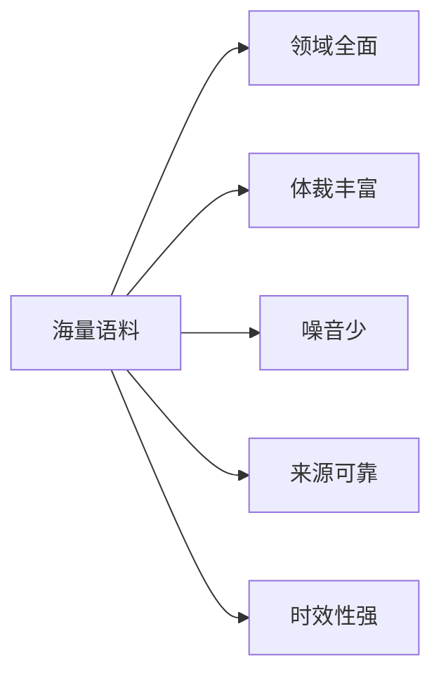

# 从零开始大模型开发与微调：数据集的获取与处理

## 1. 背景介绍
### 1.1 大模型的兴起与应用
近年来,随着深度学习技术的飞速发展,大规模预训练语言模型(Large Pre-trained Language Models,PLMs)在自然语言处理(NLP)领域取得了突破性的进展。从ELMo、BERT到GPT-3,这些大模型展示了在各种NLP任务上的卓越表现,引领了NLP技术的新浪潮。大模型不仅在学术研究中备受关注,在工业界也得到了广泛应用,如智能客服、语音助手、机器翻译等。

### 1.2 大模型开发面临的挑战
尽管大模型取得了瞩目的成就,但从零开始开发一个高质量的大模型仍然面临诸多挑战:
- 大规模高质量训练数据的获取与处理
- 模型架构设计与优化
- 海量计算资源的配置与调度
- 模型训练过程的监控与调优
- 模型部署与推理优化

其中,数据是大模型的核心驱动力,直接决定了模型的上限。如何高效获取、清洗、处理大规模的训练数据,是大模型开发的首要问题。

### 1.3 本文的主要内容
本文将重点探讨从零开始开发大模型过程中数据集的获取与处理。内容涵盖:
- 训练数据的来源与采集方法
- 数据清洗、过滤、去重等预处理技术
- 领域数据构建与数据增强
- 数据集的组织与管理
- 数据处理流程自动化与效率优化

通过系统梳理数据处理的关键技术,为从业者提供可操作的思路与最佳实践,助力高质量大模型的开发。

## 2. 核心概念与联系
### 2.1 大模型的定义与特点
大模型泛指参数量在亿级别以上,并在大规模语料上预训练得到的语言模型。相比普通的NLP模型,大模型具有以下特点:
- 参数量大:动辄上亿、数十亿甚至上千亿的参数规模
- 训练数据量大:需要在TB甚至PB级的海量语料上训练
- 训练成本高:需要大量的算力资源和较长的训练周期
- 泛化能力强:可以通过少量微调快速适应下游任务
- 知识储备丰富:从海量语料中学习到了广泛的世界知识

### 2.2 大模型训练数据的特点与要求
大模型对训练数据有着苛刻的要求,既要数量巨大,又要质量上乘。理想的训练数据应具备:
- 领域全面:覆盖语言应用的各个领域,如新闻、科技、法律、金融等
- 体裁丰富:包含各种文本形式,如书籍、文章、对话、问答等
- 噪音少:尽量减少低质、重复、无意义的文本
- 来源可靠:数据来源应该合法合规,最好有权威机构提供
- 时效性强:数据应该与时俱进,覆盖最新的话题与知识

下图展示了大模型训练数据的构成要素:



### 2.3 数据处理的主要环节
为满足大模型的训练要求,从原始数据到最终的训练集,需要经过一系列的处理环节:
- 数据采集:从各种渠道获取原始文本数据
- 数据清洗:去除噪音、格式化、断句、分词等
- 数据过滤:根据质量、长度、重复度等指标筛选数据
- 数据增强:引入外部知识库、回译、文本变换等方式扩充数据
- 数据整理:将处理后的数据划分为训练集、验证集、测试集
- 数据存储:将数据转换为适合训练的格式,并持久化存储

数据处理流程如下图所示:


## 3. 核心算法原理与操作步骤
### 3.1 数据采集技术
#### 3.1.1 爬虫技术
爬虫是数据采集的主要手段之一。通过编写爬虫程序,可以自动访问网页并提取其中的文本内容。爬虫的基本原理是:
1. 给定一批种子URL
2. 爬虫程序访问这些URL,并解析网页内容
3. 从当前网页中提取目标文本和新的URL
4. 将新的URL加入待爬取队列,重复步骤2-4直至爬取足够的数据

Python的Scrapy、requests等库提供了方便的爬虫编写工具。

#### 3.1.2 公开数据集
除了主动爬取,还可以利用已有的公开数据集。一些常用的NLP数据集有:
- Wikipedia:多语言的百科全书,覆盖各个领域的知识
- Common Crawl:定期爬取的网页数据快照,数据量巨大
- Project Gutenberg:免费的电子书库,包含大量文学作品
- 新闻语料:路透社语料、新浪新闻等
- 科研文献:arXiv、PubMed等学术论文数据库

这些公开数据集质量较高,专业性强,是很好的数据来源。

#### 3.1.3 数据交换与购买
对于一些垂直领域,可以与数据提供商合作,定期交换或购买数据。如法律文书、医疗病例、金融报告等。通过专业渠道获取的数据,质量有保障,但成本较高。

### 3.2 数据清洗与预处理
原始采集得到的文本数据,往往夹杂着大量的噪音与冗余信息,必须经过一系列的清洗处理,才能用于模型训练。

#### 3.2.1 文本清理
文本清理主要任务是去除原始文本中的各种噪音成分,如:
- HTML标签、JavaScript代码等
- 特殊字符、乱码、Emoji等
- URL、Email地址、电话号码等
- 广告、导航栏、版权声明等无关文本

可以采用正则表达式匹配、字符黑名单过滤等方法实现。

#### 3.2.2 文本格式化
不同来源的文本,格式可能五花八门。需要将其转换为统一的、结构化的格式,方便后续处理。如:
- 将所有文本转为UTF-8编码
- 规范化标点符号的使用
- 将全角字符转为半角
- 统一换行符、空白符等

#### 3.2.3 中文分词
对于中文文本,需要进行分词处理,将连续的文本切分为有意义的词汇单元。常见的分词工具有:
- jieba:基于前缀词典+HMM的分词器
- THULAC:清华大学自然语言处理与社会人文计算实验室研制
- LTP:哈工大社会计算与信息检索研究中心的语言技术平台
- HanLP:支持简繁全半角和大量分词算法的多语种NLP工具包

分词的目的是为了更好地表示文本语义,便于后续的特征提取与建模。

#### 3.2.4 文本断句
文本断句即将一篇完整的文章切分为独立的句子。英文可以根据标点符号划分句子,如句号、问号等。中文断句相对复杂,需要考虑分句歧义消解。如:

```
小明说:"今天天气真好。"小红点点头。
```

应断句为:

```
小明说:"今天天气真好。"
小红点点头。
```

### 3.3 数据过滤与筛选
数据清洗完成后,并非所有文本都是高质量可用的。需要进一步过滤低质数据,筛选出优质文本。

#### 3.3.1 长度过滤
过长或过短的文本段落,往往信息不完整或者冗余,需要过滤掉。可以设置文本长度的上下界,如50-500个字符。

#### 3.3.2 低质文本过滤
一些无意义、重复、拼凑的文本也应该去除。可采用规则或模型打分,识别并过滤低质文本。如:
- 重复字符过多的文本
- 同义词、近义词堆砌的文本
- 机器翻译痕迹明显的文本
- 句法结构混乱的文本
- 新闻正文以外的引用、版权声明等

#### 3.3.3 敏感内容过滤
包含色情、暴力、政治敏感内容的文本要严格过滤。可基于敏感词典、分类模型等手段识别。

#### 3.3.4 领域相关性过滤
对于特定领域的语言模型,还需要筛选出与目标领域相关的文本。可基于主题模型、关键词匹配等方法,计算文本与目标领域的相关性,设置阈值过滤。

### 3.4 训练集构建与数据增强
#### 3.4.1 数据集划分
将过滤后的优质文本数据,按照一定比例划分为训练集、验证集和测试集。通常采用8:1:1或9:0.5:0.5的比例。需要注意保持数据分布一致性,随机采样。

#### 3.4.2 数据增强
数据增强是扩充训练数据,提高模型泛化性的重要手段。常用的文本数据增强方法有:
- 回译:将文本翻译成另一种语言,再翻译回来,引入表达多样性
- 同义词替换:用同义词替换句中的部分词汇
- 词序打乱:在保持语法正确性的前提下,随机调整句中词序
- 插入、删除:随机在句中插入或删除一些无关紧要的词
- 文本混合:将两个句子拼接,生成一个新句子

增强要以不改变原意为前提。过度增强反而会引入噪音,损害模型效果。

### 3.5 数据存储与管理
#### 3.5.1 数据格式
将最终的训练语料组织为适合模型读取的格式。常见的有:
- TXT:纯文本格式,一行一个样本
- CSV:表格形式,每行是一个样本,列用逗号分隔
- JSON:半结构化数据,以键值对形式存储
- TFRecord:TensorFlow的二进制序列化格式

需要在存储效率、可读性、可扩展性间权衡。 

#### 3.5.2 数据存储
大规模训练数据动辄TB、PB级,需要合理规划存储:
- 本地磁盘:便于访问,但容量有限,适合小数据量
- 分布式文件系统:如HDFS,可存储PB级数据,但读取延迟高
- 对象存储:如亚马逊S3,具有很好的扩展性和持久性
- 数据库:支持结构化数据的高效读写与管理

#### 3.5.3 元数据管理
对每个数据集,除了文本内容,还需记录以下元数据:
- 数据源:标识数据的原始来源
- 数据版本:标识数据的版本号
- 领域标签:标识数据所属的领域
- 质量打分:对数据质量进行评分
- 更新时间:标识数据的最后更新时间

元数据有助于数据溯源、版本管理与质量控制。通常采用数据库进行元数据管理。

## 4. 数学模型与公式讲解
### 4.1 文本长度分布建模
文本长度是评估文本质量的重要指标。一般认为,太短或太长的文本都是低质的。我们可以对语料库中文本长度的分布进行建模,从而确定合理的长度过滤阈值。

设语料库中共有$N$个文本样本,第$i$个文本的长度为$l_i$。我们可以用正态分布 $\mathcal{N}(\mu,\sigma^2)$ 来近似建模文本长度分布,其中:

- 均值 $\mu=\frac{1}{N}\sum_{i=1}^N l_i$
- 方差 $\sigma^2=\frac{1}{N}\sum_{i=1}^N (l_i-\mu)^2$

根据正态分布的3$\sigma$原