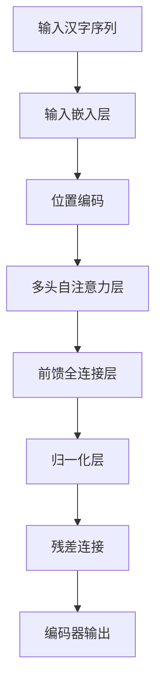
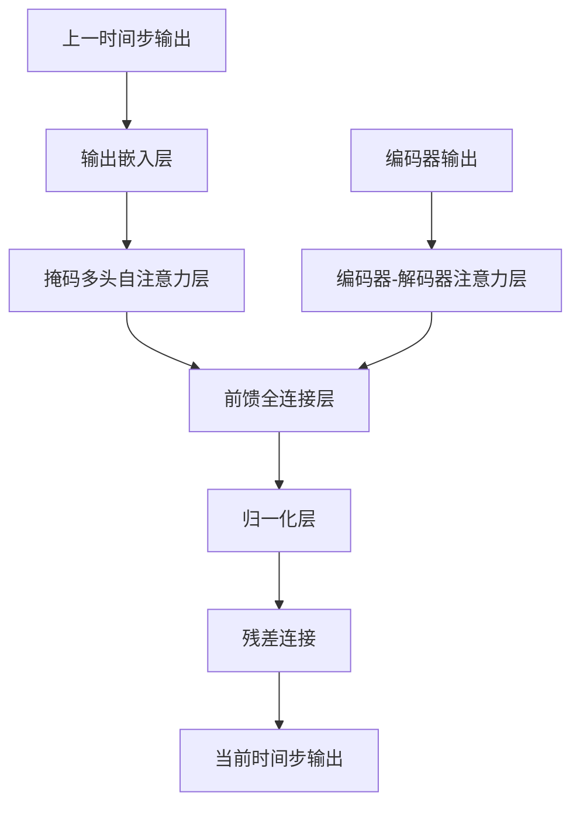

# 从零开始大模型开发与微调：汉字拼音转化模型的确定

## 1.背景介绍

### 1.1 汉字拼音转化的重要性

在当今信息时代,自然语言处理(NLP)技术在各个领域都扮演着越来越重要的角色。其中,汉字拼音转化是中文NLP的一个基础任务,广泛应用于输入法、语音识别、机器翻译等领域。准确高效的汉字拼音转化模型,不仅能够提高用户体验,还能为更高层次的NLP任务提供坚实的基础。

### 1.2 汉字拼音转化的挑战

虽然汉字拼音转化看似简单,但实际上存在诸多挑战:

- 多音字问题:同一个汉字可能有多种读音,如"重"字可读作"zhong"或"chong"。
- 同音字问题:不同的汉字可能有相同的读音,如"香"和"响"都读作"xiang"。
- 语境依赖性:汉字的读音往往受上下文语境的影响,如"重视"中的"重"读作"zhong",而"重来"中的"重"读作"chong"。

传统的基于规则的方法很难完全解决上述问题,因此需要引入更加智能的数据驱动模型。

## 2.核心概念与联系

### 2.1 序列到序列模型

汉字拼音转化可以看作是一个序列到序列(Sequence-to-Sequence,Seq2Seq)的任务,即将一个汉字序列映射为对应的拼音序列。Seq2Seq模型最早被成功应用于机器翻译领域,后来也被广泛用于其他NLP任务,如文本摘要、对话系统等。

### 2.2 注意力机制

在传统的Seq2Seq模型中,编码器将输入序列编码为一个固定长度的向量,解码器根据该向量生成输出序列。但这种做法存在信息瓶颈的问题。注意力机制(Attention Mechanism)的引入,使得解码器在生成每个输出时,都可以关注输入序列的不同部分,从而更好地捕捉输入与输出之间的对应关系。

### 2.3 transformer模型

Transformer是一种全新的基于注意力机制的Seq2Seq模型,它完全抛弃了RNN(循环神经网络)结构,使用多头自注意力层来捕捉序列中的长程依赖关系。Transformer模型在多个NLP任务上取得了卓越的成绩,也成为了当前主流的NLP模型架构。

## 3.核心算法原理具体操作步骤

### 3.1 transformer编码器

Transformer编码器的主要组成部分包括:

1. **输入嵌入层**:将输入的汉字序列转换为向量表示。
2. **位置编码**:由于Transformer没有循环结构,因此需要显式地引入位置信息。
3. **多头自注意力层**:允许每个位置的输入向量与其他位置的输入向量相互关注,捕捉长程依赖关系。
4. **前馈全连接层**:对自注意力层的输出进行进一步的非线性变换。

编码器通过堆叠多个编码器层,最终将输入序列编码为一系列向量表示。



### 3.2 transformer解码器

Transformer解码器的结构与编码器类似,但多了一个对编码器输出的注意力子层,用于捕捉输入和输出序列之间的依赖关系。解码器的主要组成部分包括:

1. **输出嵌入层**:将上一时间步的输出(或起始符号)转换为向量表示。
2. **掩码多头自注意力层**:与编码器的自注意力层类似,但引入了掩码机制,确保每个位置只能关注之前的输出。
3. **编码器-解码器注意力层**:使解码器能够关注编码器的输出,捕捉输入与输出之间的依赖关系。
4. **前馈全连接层**:对注意力层的输出进行进一步的非线性变换。

解码器通过自回归(Autoregressive)的方式,每次生成一个输出拼音,直到生成终止符号。



### 3.3 模型训练

Transformer模型的训练过程如下:

1. **数据预处理**:将原始的汉字序列和对应的拼音序列进行分词、编码等预处理操作。
2. **构建数据管道**:将预处理后的数据划分为训练集、验证集和测试集,并构建数据加载器(DataLoader)。
3. **定义模型**:根据任务需求,定义Transformer编码器和解码器的具体结构。
4. **选择损失函数和优化器**:常用的损失函数包括交叉熵损失(Cross Entropy Loss)等,优化器可选用Adam、SGD等。
5. **模型训练**:使用训练集对模型进行训练,并使用验证集监控模型性能,防止过拟合。
6. **模型评估**:在测试集上评估模型的性能,常用的评估指标包括准确率(Accuracy)、BLEU分数等。
7. **模型微调**:根据评估结果,对模型进行进一步的微调和优化。

## 4.数学模型和公式详细讲解举例说明

### 4.1 自注意力机制

自注意力机制是Transformer模型的核心,它允许每个位置的输入向量与其他位置的输入向量进行关注,捕捉长程依赖关系。具体来说,对于一个长度为n的输入序列$X = (x_1, x_2, \dots, x_n)$,自注意力机制计算每个位置$i$的输出向量$y_i$如下:

$$y_i = \sum_{j=1}^{n} \alpha_{ij}(x_jW^V)$$

其中,$W^V$是一个可学习的值向量(Value Vector),用于线性变换输入向量$x_j$。$\alpha_{ij}$是注意力分数(Attention Score),表示位置$i$对位置$j$的关注程度,计算方式如下:

$$\alpha_{ij} = \frac{e^{s_{ij}}}{\sum_{k=1}^{n}e^{s_{ik}}}$$

$$s_{ij} = (x_iW^Q)(x_jW^K)^T$$

$W^Q$和$W^K$分别是可学习的查询向量(Query Vector)和键向量(Key Vector),用于线性变换输入向量$x_i$和$x_j$。通过计算查询向量和键向量的点积,我们可以得到位置$i$和$j$之间的相关性分数$s_{ij}$,进而计算注意力分数$\alpha_{ij}$。

多头自注意力机制(Multi-Head Attention)是将多个注意力机制的结果进行拼接,以捕捉不同的子空间信息:

$$\text{MultiHead}(X) = \text{Concat}(head_1, \dots, head_h)W^O$$

$$head_i = \text{Attention}(XW_i^Q, XW_i^K, XW_i^V)$$

其中,$W_i^Q$、$W_i^K$和$W_i^V$分别是第$i$个注意力头的查询向量、键向量和值向量的线性变换矩阵。$W^O$是一个可学习的输出权重矩阵,用于将多个注意力头的结果进行线性组合。

### 4.2 transformer解码器掩码机制

在解码器的自注意力层中,我们需要确保每个位置只能关注之前的输出,而不能关注未来的输出。这是因为在实际应用中,我们只能获得之前的输出,而无法预知未来的输出。为了实现这一点,Transformer解码器引入了掩码机制(Masking Mechanism)。

具体来说,对于一个长度为n的输出序列$Y = (y_1, y_2, \dots, y_n)$,我们计算位置$i$的注意力分数$\alpha_{ij}$时,需要对未来的位置$j > i$进行掩码,即将其注意力分数设置为一个很小的值(如负无穷)。这样,在计算位置$i$的输出向量$y_i$时,就只会关注之前的输出$y_1, \dots, y_{i-1}$,而不会关注未来的输出$y_{i+1}, \dots, y_n$。

### 4.3 编码器-解码器注意力机制

编码器-解码器注意力机制(Encoder-Decoder Attention)允许解码器关注编码器的输出,捕捉输入与输出之间的依赖关系。具体来说,对于编码器的输出序列$H = (h_1, h_2, \dots, h_m)$和解码器的当前输出$y_i$,我们计算解码器对编码器输出的注意力向量$c_i$如下:

$$c_i = \sum_{j=1}^{m} \beta_{ij}h_j$$

其中,$\beta_{ij}$是注意力分数,表示解码器当前输出$y_i$对编码器输出$h_j$的关注程度,计算方式如下:

$$\beta_{ij} = \frac{e^{t_{ij}}}{\sum_{k=1}^{m}e^{t_{ik}}}$$

$$t_{ij} = (y_iW^Q)(h_jW^K)^T$$

$W^Q$和$W^K$分别是可学习的查询向量和键向量的线性变换矩阵。通过计算查询向量和键向量的点积,我们可以得到当前输出$y_i$和编码器输出$h_j$之间的相关性分数$t_{ij}$,进而计算注意力分数$\beta_{ij}$。

最终,解码器的输出$y_i$不仅依赖于之前的输出$y_1, \dots, y_{i-1}$,还依赖于编码器的注意力向量$c_i$,从而捕捉输入与输出之间的依赖关系。

## 5.项目实践:代码实例和详细解释说明

为了更好地理解Transformer模型在汉字拼音转化任务中的应用,我们将提供一个基于PyTorch实现的代码示例。该示例包括数据预处理、模型定义、训练和评估等核心模块。

### 5.1 数据预处理

```python
import re
import unicodedata
from zhon import hanzi

# 定义字符集
CHAR_TO_ID = {}
ID_TO_CHAR = {}

# 定义拼音字符集
PINYIN_TO_ID = {}
ID_TO_PINYIN = {}

# 加载数据
with open('data.txt', 'r', encoding='utf-8') as f:
    lines = f.readlines()

# 构建字符集和拼音字符集
chars = set()
pinyins = set()
for line in lines:
    line = line.strip().split('\t')
    chars.update(line[0])
    pinyins.update(line[1].split())

# 构建字符映射
for i, char in enumerate(sorted(chars)):
    CHAR_TO_ID[char] = i
    ID_TO_CHAR[i] = char

# 构建拼音映射
for i, pinyin in enumerate(sorted(pinyins)):
    PINYIN_TO_ID[pinyin] = i
    ID_TO_PINYIN[i] = pinyin

# 编码数据
encoded_data = []
for line in lines:
    line = line.strip().split('\t')
    chars = [CHAR_TO_ID[char] for char in line[0]]
    pinyins = [PINYIN_TO_ID[pinyin] for pinyin in line[1].split()]
    encoded_data.append((chars, pinyins))
```

在这个示例中,我们首先定义了字符集和拼音字符集,然后从原始数据中构建了这两个字符集。接下来,我们为每个字符和拼音分配了一个唯一的ID,并将原始数据编码为ID序列。

### 5.2 模型定义

```python
import torch
import torch.nn as nn

class TransformerEncoder(nn.Module):
    # 编码器实现...

class TransformerDecoder(nn.Module):
    # 解码器实现...

class Transformer(nn.Module):
    def __init__(self, src_vocab_size, tgt_vocab_size, d_model=512, nhead=8, num_encoder_layers=6, num_decoder_layers=6):
        