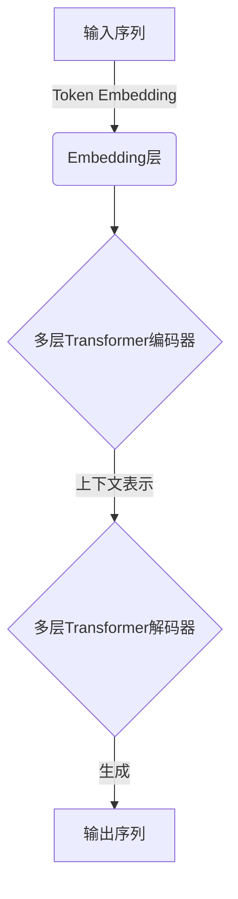

# 从零开始大模型开发与微调：汉字的文本处理

## 1. 背景介绍

### 1.1 大模型的兴起

近年来,大型语言模型(Large Language Models, LLMs)在自然语言处理(NLP)领域掀起了一场革命。这些模型通过在海量文本数据上进行预训练,学习了丰富的语言知识和上下文信息,从而在各种NLP任务上展现出了令人惊叹的性能表现。

代表性的大模型包括GPT-3、PaLM、Chinchilla等,它们不仅在生成任务(如文本生成、摘要、问答等)上表现出色,而且在理解任务(如文本分类、关系抽取等)也能给出令人满意的结果。这些大模型的出现,极大地推动了NLP技术的发展和应用。

### 1.2 大模型面临的挑战

尽管大模型在NLP领域取得了巨大的成功,但它们在处理汉字文本时仍然面临着一些挑战:

1. **数据不足**:与英文相比,高质量的中文语料库数量和规模都相对较小,这限制了大模型在汉字文本上的训练效果。
2. **语言复杂性**:汉语是一种形态学和语法结构都较为复杂的语言,给模型的理解和生成带来了额外的困难。
3. **标记granularity**:汉字本身就是一个相对粗粒度的标记单元,这可能会影响模型对细粒度语义的捕捉能力。

为了更好地应对这些挑战,我们需要针对汉字文本,进行专门的大模型开发和微调工作。

## 2. 核心概念与联系

### 2.1 大模型架构

大型语言模型通常采用基于Transformer的编码器-解码器架构或仅编码器架构。其中:

- **编码器**负责将输入序列(如文本)映射为上下文表示; 
- **解码器**则根据上下文表示和前缀生成目标序列(如文本续写)。



对于仅编码器架构(如BERT),输出是上下文表示,可用于下游任务微调;对于编码器-解码器架构(如GPT),输出则是生成的序列。

### 2.2 预训练目标

大模型通常在大规模无监督语料上进行预训练,以捕捉语言的统计规律。常见的预训练目标包括:

- **Mask Language Modeling(MLM)**: 将部分输入token遮蔽,模型需预测被遮蔽的token。
- **Causal Language Modeling(CLM)**: 给定前缀,模型需生成下文continuation。
- **次序预测(Next Sentence Prediction, NSP)**: 判断两个句子是否为连续句子对。

通过预训练,模型可以学习到有用的语义和上下文知识,为下游任务做好基础。

### 2.3 微调策略

由于下游任务的数据集规模通常较小,直接在此训练大模型容易过拟合。因此,常采用**微调(fine-tuning)**的策略:

1. 使用预训练好的大模型参数初始化; 
2. 在特定任务数据上进行少量训练,调整部分参数以适应该任务。


微调过程中,通常会冻结大模型底层参数,只微调顶层,避免破坏预训练获得的通用知识。微调策略可以在小数据集上快速获得不错的性能。

## 3. 核心算法原理具体操作步骤

### 3.1 Transformer编码器

Transformer编码器是大模型的核心组件,其主要包括以下步骤:

1. **Token Embedding**: 将输入token(如词或子词)转换为embedding向量表示。
2. **位置编码(Positional Encoding)**: 为每个token添加位置信息,使模型能捕捉序列的顺序性。
3. **多头注意力(Multi-Head Attention)**: 计算当前token与其他token的注意力权重,并据此更新表示。
4. **前馈网络(Feed-Forward Network)**: 对注意力输出进一步加工和非线性变换。
5. **层归一化(Layer Normalization)**: 对每层的输出进行归一化,以加速收敛。
6. **残差连接(Residual Connection)**: 将输入和输出相加,以缓解梯度消失问题。

上述步骤在编码器的每一层中重复进行,使token表示不断融合来自不同位置的信息。

### 3.2 Transformer解码器

对于编码器-解码器架构,解码器的工作原理类似编码器,但有以下不同:

1. **Masked Self-Attention**: 在Self-Attention时,对未来位置的token进行遮蔽,避免"窥视"将来的信息。
2. **编码器-解码器注意力(Encoder-Decoder Attention)**: 将解码器的输出与编码器的输出进行注意力计算,融合源序列信息。

通过上述机制,解码器可基于输入序列的表示,有条件地生成目标序列。

### 3.3 预训练算法

常见的预训练算法包括:

- **BERT**: 采用MLM和NSP联合预训练,学习双向语义表示。
- **GPT**: 采用CLM预训练,生成式地模拟语言的单向生成过程。
- **T5**: 采用统一的"Text-to-Text"框架,将所有NLP任务都转化为序列到序列的问题。

这些算法的具体实现细节会影响最终模型的性能表现,需要针对不同的任务和语言进行调优。

## 4. 数学模型和公式详细讲解举例说明

### 4.1 Self-Attention机制

Self-Attention是Transformer的核心机制,它计算Query和Key-Value对之间的相关性,并据此对Value进行加权求和,得到Query的新表示。具体计算公式为:

$$\begin{aligned}
\text{Attention}(Q, K, V) &= \text{softmax}\left(\frac{QK^T}{\sqrt{d_k}}\right)V \\
\text{head}_i &= \text{Attention}\left(QW_i^Q, KW_i^K, VW_i^V\right)\\
\text{MultiHead}(Q, K, V) &= \text{Concat}(\text{head}_1, \dots, \text{head}_h)W^O
\end{aligned}$$

其中$Q$、$K$、$V$分别为Query、Key和Value;$W^Q$、$W^K$、$W^V$、$W^O$为可训练的投影矩阵;$\sqrt{d_k}$是Scale因子。

Multi-Head Attention通过对$Q$、$K$、$V$进行多头线性投影,并行计算多个注意力头,最后将所有头的结果拼接起来,从而提高了模型对不同位置关系的建模能力。

### 4.2 掩码语言模型(MLM)

MLM的目标是预测被遮蔽token的原始标记。设$\boldsymbol{x}$为输入序列,$\boldsymbol{x}_{\mathcal{M}}$为被遮蔽的token子集,则MLM的损失函数为:

$$\mathcal{L}_\text{MLM} = -\mathbb{E}_{\boldsymbol{x}}\left[\sum_{x_i \in \boldsymbol{x}_{\mathcal{M}}}\log P(x_i|\boldsymbol{x}_{\backslash \mathcal{M}})\right]$$

其中$\boldsymbol{x}_{\backslash \mathcal{M}}$为未被遮蔽的token,模型需基于这些token的上下文信息来预测被遮蔽token。

### 4.3 因果语言模型(CLM)

CLM的目标是基于前缀生成连贯的后续文本。设$\boldsymbol{x} = (x_1, \dots, x_T)$为输入序列,则CLM的损失函数为:

$$\mathcal{L}_\text{CLM} = -\mathbb{E}_{\boldsymbol{x}}\left[\sum_{t=1}^T \log P(x_t|x_{<t})\right]$$

其中$x_{<t}$表示长度为$t-1$的前缀序列。通过最小化该损失函数,模型可以学习到生成下一个token的条件概率分布。

以上公式展示了大模型中的两种核心预训练目标,通过这些目标,模型可以有效地捕捉文本的语义和上下文信息。

## 5. 项目实践:代码实例和详细解释说明

在这一部分,我们将通过一个实际的代码示例,演示如何对一个基于Transformer的大模型进行预训练和微调,以完成汉字文本的生成任务。

我们将使用PyTorch框架和Hugging Face的Transformers库来实现这个示例。首先,让我们导入所需的库:

```python
import torch
from transformers import BertTokenizer, BertLMHeadModel, BertConfig
from transformers import DataCollatorForLanguageModeling
from transformers import Trainer, TrainingArguments
```

### 5.1 数据预处理

我们首先需要准备用于预训练和微调的文本数据集。在这个示例中,我们将使用一个包含大量汉字新闻文本的数据集。

```python
from datasets import load_dataset

dataset = load_dataset("my_chinese_news_dataset")
```

接下来,我们需要使用BERT分词器对文本进行分词和tokenization:

```python
tokenizer = BertTokenizer.from_pretrained("bert-base-chinese")

def tokenize_function(examples):
    return tokenizer(examples["text"], truncation=True)

tokenized_datasets = dataset.map(tokenize_function, batched=True)
```

### 5.2 预训练

现在,我们可以开始对大模型进行预训练了。我们将使用掩码语言模型(MLM)作为预训练目标。

首先,我们需要初始化模型配置和模型本身:

```python
config = BertConfig(
    vocab_size=tokenizer.vocab_size,
    max_position_embeddings=514,
    num_attention_heads=12,
    num_hidden_layers=6,
    type_vocab_size=2,
)

model = BertLMHeadModel(config=config)
```

接下来,我们需要准备数据集用于预训练:

```python
data_collator = DataCollatorForLanguageModeling(tokenizer=tokenizer, mlm=True, mlm_probability=0.15)
```

最后,我们可以定义训练参数并启动预训练过程:

```python
training_args = TrainingArguments(
    output_dir="./pretrained_model",
    overwrite_output_dir=True,
    num_train_epochs=3,
    per_device_train_batch_size=8,
    save_steps=10_000,
    save_total_limit=2,
)

trainer = Trainer(
    model=model,
    args=training_args,
    data_collator=data_collator,
    train_dataset=tokenized_datasets["train"],
)

trainer.train()
```

预训练过程可能需要较长时间,取决于数据集大小和模型复杂度。完成后,我们就获得了一个在汉字文本上预训练的大模型。

### 5.3 微调

接下来,我们将对预训练的大模型进行微调,以完成特定的文本生成任务。假设我们有一个包含文章开头和正文的数据集,我们希望根据开头生成接下来的正文内容。

首先,我们需要准备用于微调的数据集:

```python
dataset = load_dataset("my_article_dataset")

def preprocess_function(examples):
    inputs = examples["intro"]
    targets = examples["body"]
    model_inputs = tokenizer(inputs, max_length=512, truncation=True, padding="max_length")

    labels = tokenizer(targets, max_length=512, truncation=True, padding="max_length")["input_ids"]

    model_inputs["labels"] = labels
    return model_inputs

tokenized_datasets = dataset.map(preprocess_function, batched=True)
```

接下来,我们需要加载预训练的模型,并进行微调:

```python
model = BertLMHeadModel.from_pretrained("./pretrained_model")

training_args = TrainingArguments(
    output_dir="./finetuned_model",
    overwrite_output_dir=True,
    num_train_epochs=2,
    per_device_train_batch_size=4,
    save_steps=10_000,
    save_total_limit=2,
)

trainer = Trainer(
    model=model,
    args=training_args,
    train_dataset=tokenized_datasets["train"],
)

trainer.train()
```

微调过程完成后,我们就获得了一个针对文本生成任务微调过的大模型。

### 5.4 生成文本

最后,我们可以使用微调后的模型来生成文本。下面是一个示例:

```python
model.eval()
input_text = "今天是个