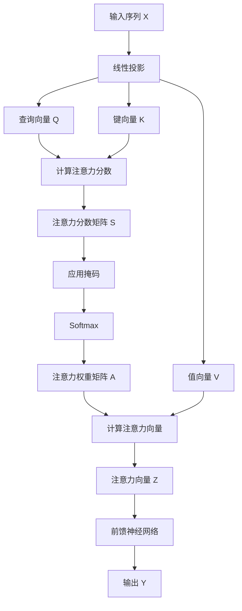

# 从零开始大模型开发与微调：自注意力层

## 1.背景介绍

随着深度学习的不断发展,transformer模型在自然语言处理、计算机视觉等领域取得了巨大的成功。自注意力机制作为transformer模型的核心组件,能够有效地捕捉输入序列中的长程依赖关系,从而显著提高了模型的性能。本文将从零开始介绍自注意力层的原理、实现细节以及在大模型中的应用,为读者提供一个全面的理解和实践指南。

## 2.核心概念与联系

### 2.1 注意力机制

注意力机制是一种灵活的序列建模方法,它允许模型在处理输入序列时,动态地分配不同位置的权重,从而关注更加重要的部分。传统的序列模型(如RNN)存在梯度消失、难以捕捉长程依赖等问题,而注意力机制则能够有效地解决这些问题。

### 2.2 自注意力层

自注意力层是transformer模型中的关键组件,它通过计算输入序列中每个元素与其他元素的相似性,从而捕捉序列内部的依赖关系。与传统的注意力机制不同,自注意力层不需要外部的查询向量,而是直接对输入序列进行编码。

### 2.3 大模型与微调

大模型(如GPT、BERT等)通过在海量数据上预训练,学习到了丰富的语义和世界知识表示。微调(fine-tuning)是指在特定任务上继续训练预训练模型的过程,以使模型更好地适应目标任务。自注意力层在大模型的预训练和微调中扮演着关键角色。

## 3.核心算法原理具体操作步骤

自注意力层的计算过程可以分为以下几个步骤:

1. **线性投影**:将输入序列 $X = (x_1, x_2, \ldots, x_n)$ 通过三个不同的线性变换得到查询(Query)、键(Key)和值(Value)向量:

$$
Q = XW^Q \\
K = XW^K \\
V = XW^V
$$

其中 $W^Q$、$W^K$ 和 $W^V$ 分别是可学习的权重矩阵。

2. **计算注意力分数**:通过查询向量与所有键向量的点积,计算出注意力分数矩阵 $S$:

$$
S = \frac{QK^T}{\sqrt{d_k}}
$$

其中 $d_k$ 是键向量的维度,用于缩放注意力分数。

3. **应用掩码(可选)**:对于某些应用场景(如机器翻译),需要屏蔽掉未来位置的信息,这可以通过在注意力分数矩阵 $S$ 中添加掩码来实现。

4. **计算注意力权重**:将注意力分数矩阵 $S$ 通过 Softmax 函数转换为注意力权重矩阵 $A$:

$$
A = \text{Softmax}(S)
$$

5. **计算注意力向量**:将注意力权重矩阵 $A$ 与值向量 $V$ 相乘,得到注意力向量 $Z$:

$$
Z = AV
$$

6. **输出**:将注意力向量 $Z$ 通过一个前馈神经网络进行进一步处理,得到自注意力层的输出 $Y$。

上述过程可以用以下 Mermaid 流程图直观地表示:



## 4.数学模型和公式详细讲解举例说明

在上一节中,我们已经介绍了自注意力层的核心算法步骤。现在,让我们通过一个具体的例子来更深入地理解其中的数学模型和公式。

假设我们有一个长度为 4 的输入序列 $X = (x_1, x_2, x_3, x_4)$,其中每个 $x_i$ 是一个 3 维的向量。我们将使用一个简单的自注意力层对该序列进行编码。

1. **线性投影**

首先,我们需要将输入序列 $X$ 投影到查询、键和值空间中。假设我们使用的线性变换矩阵维度为 $3 \times 2$,则投影结果为:

$$
Q = \begin{bmatrix}
    x_{11} & x_{12} \\
    x_{21} & x_{22} \\
    x_{31} & x_{32} \\
    x_{41} & x_{42}
\end{bmatrix} \begin{bmatrix}
    w_{11}^Q & w_{12}^Q \\
    w_{21}^Q & w_{22}^Q \\
    w_{31}^Q & w_{32}^Q
\end{bmatrix} \\
K = \begin{bmatrix}
    x_{11} & x_{12} \\
    x_{21} & x_{22} \\
    x_{31} & x_{32} \\
    x_{41} & x_{42}
\end{bmatrix} \begin{bmatrix}
    w_{11}^K & w_{12}^K \\
    w_{21}^K & w_{22}^K \\
    w_{31}^K & w_{32}^K
\end{bmatrix} \\
V = \begin{bmatrix}
    x_{11} & x_{12} \\
    x_{21} & x_{22} \\
    x_{31} & x_{32} \\
    x_{41} & x_{42}
\end{bmatrix} \begin{bmatrix}
    w_{11}^V & w_{12}^V \\
    w_{21}^V & w_{22}^V \\
    w_{31}^V & w_{32}^V
\end{bmatrix}
$$

其中 $w_{ij}^Q$、$w_{ij}^K$ 和 $w_{ij}^V$ 分别表示查询、键和值的线性变换权重。

2. **计算注意力分数**

接下来,我们计算查询向量与所有键向量的点积,得到注意力分数矩阵 $S$:

$$
S = \frac{QK^T}{\sqrt{2}} = \begin{bmatrix}
    q_1 \cdot k_1 & q_1 \cdot k_2 & q_1 \cdot k_3 & q_1 \cdot k_4 \\
    q_2 \cdot k_1 & q_2 \cdot k_2 & q_2 \cdot k_3 & q_2 \cdot k_4 \\
    q_3 \cdot k_1 & q_3 \cdot k_2 & q_3 \cdot k_3 & q_3 \cdot k_4 \\
    q_4 \cdot k_1 & q_4 \cdot k_2 & q_4 \cdot k_3 & q_4 \cdot k_4
\end{bmatrix}
$$

其中 $\sqrt{2}$ 是由于查询和键向量的维度为 2 而引入的缩放因子。

3. **计算注意力权重**

将注意力分数矩阵 $S$ 通过 Softmax 函数转换为注意力权重矩阵 $A$:

$$
A = \text{Softmax}(S) = \begin{bmatrix}
    a_{11} & a_{12} & a_{13} & a_{14} \\
    a_{21} & a_{22} & a_{23} & a_{24} \\
    a_{31} & a_{32} & a_{33} & a_{34} \\
    a_{41} & a_{42} & a_{43} & a_{44}
\end{bmatrix}
$$

其中每一行的元素之和为 1,表示该位置对应的注意力权重分布。

4. **计算注意力向量**

将注意力权重矩阵 $A$ 与值向量 $V$ 相乘,得到注意力向量 $Z$:

$$
Z = AV = \begin{bmatrix}
    a_{11}v_1 + a_{12}v_2 + a_{13}v_3 + a_{14}v_4 \\
    a_{21}v_1 + a_{22}v_2 + a_{23}v_3 + a_{24}v_4 \\
    a_{31}v_1 + a_{32}v_2 + a_{33}v_3 + a_{34}v_4 \\
    a_{41}v_1 + a_{42}v_2 + a_{43}v_3 + a_{44}v_4
\end{bmatrix}
$$

每个注意力向量 $z_i$ 是输入序列中所有位置的值向量的加权和,其中权重由对应的注意力权重 $a_{ij}$ 决定。

5. **输出**

最后,将注意力向量 $Z$ 通过一个前馈神经网络进行进一步处理,得到自注意力层的输出 $Y$。

通过上述例子,我们可以更好地理解自注意力层背后的数学原理。注意力机制允许模型动态地捕捉输入序列中的重要信息,从而提高了模型的表现能力。

## 5.项目实践:代码实例和详细解释说明

为了帮助读者更好地掌握自注意力层的实现细节,我们将提供一个基于PyTorch的代码示例。该示例实现了一个简单的自注意力层,可以直接集成到更复杂的模型中。

```python
import torch
import torch.nn as nn

class SelfAttention(nn.Module):
    def __init__(self, embed_size, heads):
        super(SelfAttention, self).__init__()
        self.embed_size = embed_size
        self.heads = heads
        self.head_dim = embed_size // heads

        assert (self.head_dim * heads == embed_size), "Embed size needs to be divisible by heads"

        self.values = nn.Linear(self.head_dim, self.head_dim, bias=False)
        self.keys = nn.Linear(self.head_dim, self.head_dim, bias=False)
        self.queries = nn.Linear(self.head_dim, self.head_dim, bias=False)
        self.fc_out = nn.Linear(heads * self.head_dim, embed_size)

    def forward(self, values, keys, query, mask):
        N = query.shape[0]
        value_len, key_len, query_len = values.shape[1], keys.shape[1], query.shape[1]

        # Split embedding into self.heads pieces
        values = values.reshape(N, value_len, self.heads, self.head_dim)
        keys = keys.reshape(N, key_len, self.heads, self.head_dim)
        queries = query.reshape(N, query_len, self.heads, self.head_dim)

        values = self.values(values)
        keys = self.keys(keys)
        queries = self.queries(queries)

        # Einsum does matrix mult. for query*keys for each batch
        energy = torch.einsum("nqhd,nkhd->nhqk", [queries, keys])
        # Mask fill value=-1e20
        if mask is not None:
            energy = energy.masked_fill(mask == 0, float("-1e20"))

        # Normalize energy values similarly to seq2seq + attention
        attention = torch.softmax(energy / (self.embed_size ** (1 / 2)), dim=3)

        # Attend over values
        out = torch.einsum("nhql,nlhd->nqhd", [attention, values]).reshape(
            N, query_len, self.heads * self.head_dim
        )
        out = self.fc_out(out)

        return out
```

上述代码实现了一个多头自注意力层。让我们逐步解释其中的关键部分:

1. **初始化**

在`__init__`函数中,我们定义了几个线性层,用于将输入分别投影到查询、键和值空间中。`self.head_dim`表示每个注意力头的维度,其乘积等于嵌入维度`embed_size`。

2. **前向传播**

`forward`函数接受四个输入:值(`values`)、键(`keys`)、查询(`query`)和掩码(`mask`)。

首先,我们将输入张量按批次大小(`N`)、序列长度和注意力头数进行重塑。然后,我们使用线性层将重塑后的张量投影到对应的空间中。

接下来,我们计算查询和键的点积,得到注意力能量(`energy`)。如果提供了掩码,我们将掩码的位置设置为一个非常小的值(`-1e20`)。

然后,我们对注意力能量进行归一化,得到注意力权重(`attention`)。这里使用了 Softmax 函数,并应用了一个缩放因子`(self.embed_size ** (1 / 2))`。

最后,我们将注意力权重与值张量相乘,得到注意力输出(`out`)。输出经过一个线性层后,即为自注意力层的最终输出。

通过上述代码示例,读者可以更好地理解自注意力层的实现细