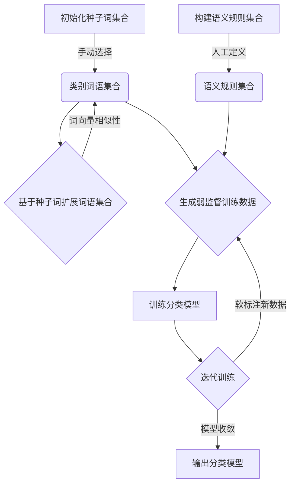

# 代码实战：基于Python的弱监督文本分类案例

## 1.背景介绍

随着互联网和移动互联网的快速发展,文本数据的产生呈现爆炸式增长。如何高效地对这些海量文本数据进行分类和挖掘,成为了当前人工智能领域的一个热门话题。传统的文本分类方法需要大量标注好的训练数据,但是人工标注数据的过程通常费时费力,成本很高。因此,弱监督文本分类技术应运而生,它利用种子词、语义规则等弱监督信号,从无标注或少量标注的数据中学习文本分类模型,大大降低了数据标注的成本。

## 2.核心概念与联系

### 2.1 文本分类

文本分类是自然语言处理领域的一个核心任务,旨在根据文本内容自动将其归类到预定义的类别中。常见的文本分类任务包括新闻分类、垃圾邮件过滤、情感分析等。

### 2.2 弱监督学习

弱监督学习是机器学习中的一种范式,它利用少量标注数据或无标注数据,结合一些先验知识或启发式规则,来学习预测模型。与监督学习相比,弱监督学习可以大幅降低标注成本,提高模型的泛化能力。

### 2.3 种子词扩展

种子词扩展是弱监督文本分类中常用的一种方法。它首先利用少量种子词(与类别相关的代表性词语)来初始化每个类别,然后基于词与词之间的相似性,不断地从语料库中找到新的相关词,并将其加入到对应的类别中,最终形成每个类别的词语集合。

### 2.4 语义规则

语义规则是另一种常见的弱监督信号,它利用人工定义的一些语义模式或规则来识别文本所属的类别。例如,"如果文本包含词语'球员'和'进球',则可能属于体育类"。

### 2.5 联系

弱监督文本分类将种子词扩展、语义规则等弱监督信号与传统的文本分类模型(如朴素贝叶斯、支持向量机等)相结合,从而可以在无标注或少量标注数据的情况下,学习出较好的文本分类模型。

## 3.核心算法原理具体操作步骤

弱监督文本分类算法的核心思想是利用种子词、语义规则等弱监督信号来引导模型学习,主要包括以下几个步骤:

1. **初始化种子词集合**

   为每个预定义的类别手动选择一些与该类别高度相关的种子词。例如,对于"体育"类别,可以选择"足球"、"篮球"、"运动员"等作为种子词。

2. **基于种子词扩展词语集合**

   利用词与词之间的相似性(如Word2Vec、GloVe等词向量),从语料库中找到与种子词高度相似的新词语,并将其加入到对应的类别词语集合中。这一步骤可以不断迭代进行,直到词语集合不再发生显著变化。

3. **构建语义规则集合**

   根据领域知识,人工定义一些语义规则,用于识别文本所属的类别。例如,"如果文本包含词语'球员'和'进球',则可能属于体育类"。

4. **生成弱监督训练数据**

   利用步骤2得到的类别词语集合,对语料库中的文本进行扫描。如果一篇文本中包含某个类别的多个词语,则可以将该文本"软标注"为该类别,从而生成弱监督训练数据。

5. **训练分类模型**

   使用步骤4生成的弱监督训练数据,训练传统的文本分类模型,如朴素贝叶斯、支持向量机等。在训练过程中,可以将语义规则作为辅助特征加入模型。

6. **迭代训练**

   在第一轮训练后,可以使用训练好的分类模型对语料库重新进行"软标注",生成新的弱监督训练数据,然后使用这些新数据再次训练模型。如此迭代,直到模型收敛或达到预期性能。

该算法的关键在于利用种子词和语义规则等弱监督信号作为先验知识,从无标注或少量标注的数据中"放大"出更多的训练样本,从而学习出较好的文本分类模型。



## 4.数学模型和公式详细讲解举例说明

在弱监督文本分类的算法中,常常需要计算词与词之间的相似度,以便基于种子词扩展类别词语集合。词向量是一种常用的词语表示方法,它将每个词映射到一个固定长度的dense向量,使得语义相似的词在向量空间中彼此靠近。

### 4.1 Word2Vec

Word2Vec是一种广为人知的词向量表示模型,它包含两种模型架构:Skip-gram和CBOW(Continuous Bag-of-Words)。以Skip-gram为例,其目标是根据中心词 $w_t$ 预测它在文本序列中前后一定窗口范围内的上下文词 $w_{t-n}, \dots, w_{t-1}, w_{t+1}, \dots, w_{t+n}$。具体来说,给定中心词 $w_t$,它的目标是最大化上下文词的条件概率:

$$\max_{\theta} \frac{1}{T}\sum_{t=1}^{T}\sum_{-n \leq j \leq n, j \neq 0} \log P(w_{t+j}|w_t; \theta)$$

其中 $\theta$ 表示模型参数, $T$ 是语料库中的总词数。

在Skip-gram模型中,条件概率 $P(w_{t+j}|w_t; \theta)$ 通过软max函数计算:

$$P(w_O|w_I; \theta) = \frac{\exp(v_{w_O}^{\top}v_{w_I})}{\sum_{w=1}^{V}\exp(v_w^{\top}v_{w_I})}$$

其中 $v_w$ 和 $v_{w_I}$ 分别表示词 $w$ 和 $w_I$ 的词向量,V是词表的大小。

通过对上述目标函数进行优化,可以学习到每个词的词向量表示,使得语义相似的词在向量空间中彼此靠近。

### 4.2 词向量相似度计算

在弱监督文本分类算法中,我们需要计算种子词与其他词的相似度,以便扩展类别词语集合。常用的相似度计算方法有:

1. **余弦相似度**

   余弦相似度计算两个向量的夹角余弦值,其值域在[-1,1]之间,值越接近1表示越相似。对于词向量 $v_1$ 和 $v_2$,它们的余弦相似度为:

   $$\text{sim}_\text{cos}(v_1, v_2) = \frac{v_1 \cdot v_2}{\|v_1\| \|v_2\|}$$

2. **欧氏距离**

   欧氏距离直接计算两个向量在空间中的距离,距离越小表示越相似。对于词向量 $v_1$ 和 $v_2$,它们的欧氏距离为:

   $$\text{dist}_\text{euc}(v_1, v_2) = \sqrt{\sum_{i=1}^{n}(v_{1i} - v_{2i})^2}$$

根据计算出的相似度或距离,我们可以从语料库中找到与种子词最相似的词语,并将它们加入到对应的类别词语集合中。

## 5.项目实践:代码实例和详细解释说明

下面是一个基于Python和Gensim库实现弱监督文本分类的代码示例,包括种子词扩展、生成弱监督训练数据和训练分类模型三个主要步骤。

### 5.1 种子词扩展

```python
import gensim.downloader as api
from gensim.models import Word2Vec

# 加载预训练的Word2Vec模型
wv_model = api.load("word2vec-google-news-300")

# 定义种子词集合
seed_words = {
    "sports": ["football", "basketball", "athlete"],
    "politics": ["government", "president", "election"],
    "technology": ["computer", "software", "internet"]
}

# 初始化类别词语集合
category_words = {category: set(words) for category, words in seed_words.items()}

# 扩展类别词语集合
for category, seed_words in seed_words.items():
    for seed_word in seed_words:
        # 找到与种子词最相似的top_n个词
        similar_words = wv_model.most_similar(positive=[seed_word], topn=20)
        for word, _ in similar_words:
            category_words[category].add(word)

# 输出扩展后的类别词语集合
for category, words in category_words.items():
    print(f"{category}: {', '.join(words)}")
```

在这个示例中,我们首先加载预训练的Word2Vec模型,然后定义了三个类别的种子词集合。接下来,我们初始化了每个类别的词语集合,并使用Word2Vec模型中的`most_similar`方法,找到与每个种子词最相似的top_n个词,将它们加入到对应的类别词语集合中。

最后,我们输出了扩展后的类别词语集合。通过这种方式,我们可以从少量种子词出发,自动扩展出每个类别的代表性词语集合。

### 5.2 生成弱监督训练数据

```python
import re
from collections import Counter

# 定义语义规则
semantic_rules = {
    "sports": [r"(goal|score|player|game|match|team)"],
    "politics": [r"(government|president|election|policy|law|vote)"],
    "technology": [r"(computer|software|internet|data|code|program)"]
}

# 初始化弱监督训练数据
weakly_labeled_data = []

# 遍历语料库中的文本
for text in corpus:
    # 计算每个类别的词语计数
    category_counts = {category: sum(len(re.findall(pattern, text, re.I)) for pattern in patterns)
                       for category, patterns in semantic_rules.items()}
    
    # 根据词语计数进行"软标注"
    max_count = max(category_counts.values())
    if max_count > 0:
        max_categories = [category for category, count in category_counts.items() if count == max_count]
        weakly_labeled_data.append((text, max_categories))

# 输出弱监督训练数据
for text, categories in weakly_labeled_data:
    print(f"Text: {text}\nCategories: {', '.join(categories)}\n")
```

在这个示例中,我们首先定义了每个类别的语义规则,即一组正则表达式模式。然后,我们遍历语料库中的每篇文本,计算它在每个类别的语义规则下的词语计数。如果某个类别的词语计数最高,我们就将该文本"软标注"为该类别,并将其加入到弱监督训练数据集合中。

最后,我们输出了生成的弱监督训练数据。通过这种方式,我们可以利用语义规则从无标注数据中自动生成弱监督训练样本。

### 5.3 训练分类模型

```python
from sklearn.feature_extraction.text import TfidfVectorizer
from sklearn.naive_bayes import MultinomialNB
from sklearn.pipeline import Pipeline

# 定义TF-IDF向量化器
vectorizer = TfidfVectorizer()

# 定义朴素贝叶斯分类器
clf = MultinomialNB()

# 构建Pipeline
text_clf = Pipeline([('vect', vectorizer), ('clf', clf)])

# 训练分类模型
texts, labels = zip(*weakly_labeled_data)
text_clf.fit(texts, labels)

# 评估模型性能
accuracy = text_clf.score(test_texts, test_labels)
print(f"Accuracy: {accuracy:.2f}")
```

在这个示例中,我们使用了scikit-learn库中的`TfidfVectorizer`将文本转换为TF-IDF向量表示,并使用`MultinomialNB`作为分类器。我们将向量化器和分类器组合成一个`Pipeline`,并使用步骤5.2生成的弱监督训练数据进行模型训练。

最后,我们在测试集上评估了模型的准确率。通过这种方式,我们可以基于