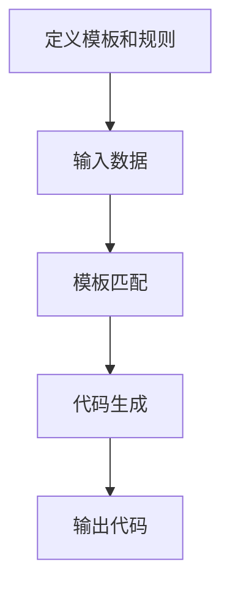

## 1. 背景介绍

代码生成是一种自动化软件开发的技术，它可以根据特定的规则和模板，自动生成程序代码。这种技术可以大大提高软件开发的效率和质量，减少开发人员的工作量，同时也可以减少代码错误和重复性工作。

代码生成技术已经被广泛应用于各种软件开发领域，例如Web应用程序、移动应用程序、桌面应用程序、数据库应用程序等等。它可以帮助开发人员快速构建高质量的软件系统，同时也可以提高软件的可维护性和可扩展性。

## 2. 核心概念与联系

代码生成技术的核心概念是模板和规则。模板是一种预定义的代码结构，规则是一种描述如何生成代码的逻辑。代码生成器可以根据模板和规则，自动化地生成程序代码。

代码生成技术与其他自动化软件开发技术有很多联系，例如模型驱动开发、领域特定语言、元编程等等。这些技术都可以帮助开发人员快速构建高质量的软件系统，但是它们的实现方式和应用场景有所不同。

## 3. 核心算法原理具体操作步骤

代码生成技术的核心算法是模板匹配和代码生成。模板匹配是指将输入数据与模板进行匹配，找到匹配的部分。代码生成是指根据匹配的结果，生成程序代码。

代码生成技术的具体操作步骤如下：

1. 定义模板和规则：定义程序代码的结构和生成规则。
2. 输入数据：输入需要生成的程序代码的相关数据。
3. 模板匹配：将输入数据与模板进行匹配，找到匹配的部分。
4. 代码生成：根据匹配的结果，生成程序代码。
5. 输出代码：输出生成的程序代码。

## 4. 数学模型和公式详细讲解举例说明

代码生成技术的数学模型和公式比较简单，主要是模板匹配和代码生成的算法。这些算法可以用伪代码或流程图来表示。

以下是一个简单的代码生成算法的流程图：



## 5. 项目实践：代码实例和详细解释说明

以下是一个简单的代码生成器的实例，它可以根据输入的数据，生成一个简单的Java类。

```java
public class CodeGenerator {
    private String className;
    private List<String> fields;

    public CodeGenerator(String className, List<String> fields) {
        this.className = className;
        this.fields = fields;
    }

    public String generate() {
        StringBuilder sb = new StringBuilder();
        sb.append("public class ").append(className).append(" {\n");
        for (String field : fields) {
            sb.append("    private ").append(field).append(";\n");
        }
        sb.append("}");
        return sb.toString();
    }
}
```

这个代码生成器可以根据输入的类名和字段列表，生成一个简单的Java类。以下是一个使用示例：

```java
List<String> fields = Arrays.asList("int id", "String name", "double salary");
CodeGenerator generator = new CodeGenerator("Employee", fields);
String code = generator.generate();
System.out.println(code);
```

输出结果如下：

```java
public class Employee {
    private int id;
    private String name;
    private double salary;
}
```

## 6. 实际应用场景

代码生成技术可以应用于各种软件开发领域，例如Web应用程序、移动应用程序、桌面应用程序、数据库应用程序等等。以下是一些实际应用场景的示例：

1. Web应用程序：根据数据库表结构，自动生成数据访问层和业务逻辑层的代码。
2. 移动应用程序：根据UI设计，自动生成界面代码和业务逻辑代码。
3. 桌面应用程序：根据用户需求，自动生成界面代码和业务逻辑代码。
4. 数据库应用程序：根据数据模型，自动生成数据访问层和业务逻辑层的代码。

## 7. 工具和资源推荐

以下是一些常用的代码生成工具和资源：

1. Eclipse Code Generation Tools：Eclipse的代码生成插件，可以根据模板和规则，自动生成程序代码。
2. MyBatis Generator：MyBatis的代码生成器，可以根据数据库表结构，自动生成数据访问层的代码。
3. JHipster：一个用于生成现代Web应用程序的代码生成器，可以生成Spring Boot和AngularJS的代码。
4. CodeSmith：一个商业代码生成器，可以根据模板和规则，自动生成程序代码。
5. CodePlex：一个开源的代码生成器，可以根据模板和规则，自动生成程序代码。

## 8. 总结：未来发展趋势与挑战

代码生成技术在未来的软件开发中将会越来越重要。随着软件系统的复杂性不断增加，手工编写程序代码的效率和质量将会受到越来越大的挑战。代码生成技术可以帮助开发人员快速构建高质量的软件系统，同时也可以提高软件的可维护性和可扩展性。

然而，代码生成技术也面临着一些挑战。首先，代码生成器的质量和可靠性需要得到保证，否则生成的程序代码可能会存在严重的错误和漏洞。其次，代码生成器需要支持多种编程语言和开发框架，以满足不同的开发需求。最后，代码生成器需要与其他自动化软件开发技术进行集成，以实现更高效的软件开发流程。

## 9. 附录：常见问题与解答

Q: 代码生成技术是否可以替代手工编写程序代码？

A: 代码生成技术可以帮助开发人员快速构建高质量的软件系统，但是它并不能完全替代手工编写程序代码。在实际开发中，开发人员需要根据具体的需求和情况，选择合适的开发方式。

Q: 代码生成技术是否可以应用于所有的软件开发领域？

A: 代码生成技术可以应用于各种软件开发领域，但是它的应用场景和实现方式可能会有所不同。在实际应用中，开发人员需要根据具体的需求和情况，选择合适的代码生成技术。

Q: 代码生成技术是否会影响程序代码的质量和可维护性？

A: 代码生成技术可以帮助开发人员快速构建高质量的软件系统，同时也可以提高软件的可维护性和可扩展性。但是，如果代码生成器的质量和可靠性不够好，生成的程序代码可能会存在严重的错误和漏洞。因此，开发人员需要选择高质量的代码生成器，并进行充分的测试和验证。