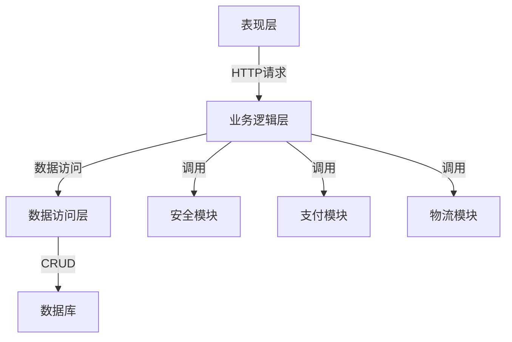

# 企业网上订单系统详细设计与具体代码实现

## 1.背景介绍

随着互联网和电子商务的快速发展,越来越多的企业开始将业务拓展到网上,建立网上订单系统成为了一个必然趋势。网上订单系统不仅能够为客户提供更加便捷的购物体验,还能够帮助企业降低运营成本、提高工作效率、扩大销售渠道。然而,要设计并实现一个高效、安全、可扩展的网上订单系统并非一件易事,需要综合考虑多方面的因素。

## 2.核心概念与联系

在网上订单系统中,有几个核心概念是非常重要的:

1. **订单(Order)**: 订单是整个系统的核心实体,包含了客户购买商品的详细信息,如商品列表、数量、总价格等。

2. **商品(Product)**: 商品是被销售的实体,每个商品都有自己的属性,如名称、价格、库存等。

3. **客户(Customer)**: 客户是下订单的主体,需要记录客户的个人信息、账户信息等。

4. **支付(Payment)**: 支付是订单流程中的关键环节,需要与第三方支付平台对接,保证支付安全。

5. **库存(Inventory)**: 库存管理是确保订单能够正常交付的前提,需要实时更新商品库存。

6. **物流(Logistics)**: 物流是将商品送达客户手中的最后一步,需要与物流公司系统对接。

这些核心概念之间存在着密切的联系,它们共同构成了一个完整的网上订单系统。设计时需要考虑它们之间的交互和数据流转。

## 3.核心算法原理具体操作步骤

网上订单系统的核心算法主要包括以下几个方面:

### 3.1 购物车算法

购物车算法用于管理客户所选择的商品,主要包括以下步骤:

1. 客户浏览商品列表,选择感兴趣的商品加入购物车。
2. 系统记录客户选择的商品信息,包括商品ID、数量等。
3. 客户可以随时修改购物车中的商品数量或删除商品。
4. 系统实时计算购物车中商品的总价格。
5. 客户确认购物车中的商品后,进入下单流程。

### 3.2 订单生成算法

订单生成算法用于根据客户的购物车信息创建新订单,主要包括以下步骤:

1. 获取客户的购物车信息,包括商品列表和总价格。
2. 检查商品库存是否足够,如果库存不足则提示客户。
3. 生成新的订单ID,并将购物车信息转化为订单详情。
4. 计算订单运费等附加费用,得到订单总金额。
5. 将新生成的订单信息保存到数据库中。

### 3.3 支付算法

支付算法用于处理客户的支付请求,主要包括以下步骤:

1. 获取客户选择的支付方式,如信用卡、网上银行等。
2. 调用第三方支付平台的API,传递订单信息和支付金额。
3. 等待支付平台返回支付结果,如支付成功或失败。
4. 根据支付结果更新订单状态,如已支付或未支付。
5. 如果支付成功,则进入发货流程;如果支付失败,则提示客户重新支付。

### 3.4 库存更新算法

库存更新算法用于实时更新商品库存,主要包括以下步骤:

1. 当客户下单时,获取订单中的商品信息和数量。
2. 遍历订单中的每个商品,从库存中减去相应的数量。
3. 如果库存不足,则拒绝该订单,并提示客户。
4. 如果库存足够,则更新数据库中的库存信息。
5. 当订单发生退货或取消时,需要相应地增加商品库存。

### 3.5 物流算法

物流算法用于将订单商品发送给客户,主要包括以下步骤:

1. 获取客户的收货地址信息。
2. 根据商品重量、体积等信息,计算运费。
3. 选择合适的物流公司和运输方式。
4. 调用物流公司的API,创建新的运单。
5. 将运单信息与订单信息关联,以便后续跟踪。
6. 当物流公司更新运单状态时,同步更新订单状态。

## 4.数学模型和公式详细讲解举例说明

在网上订单系统中,有一些常见的数学模型和公式需要注意:

### 4.1 运费计算

运费的计算通常基于商品的重量、体积和目的地等因素。一种常见的运费计算公式如下:

$$运费 = 基本运费 + 重量费用 + 体积费用 + 距离费用$$

其中:

- 基本运费是一个固定值,代表了处理订单的基本成本。
- 重量费用 = 商品重量 × 重量单价
- 体积费用 = 商品体积 × 体积单价
- 距离费用 = 距离 × 距离单价

例如,假设一个订单中包含两件商品,商品A重量为2kg,体积为0.03立方米;商品B重量为1kg,体积为0.02立方米。发货地点到收货地点的距离为500公里。其他参数如下:

- 基本运费: 10元
- 重量单价: 5元/kg
- 体积单价: 20元/立方米
- 距离单价: 0.5元/公里

则该订单的运费计算过程为:

$$
\begin{aligned}
重量费用 &= (2 + 1) \times 5 = 15 (元)\\
体积费用 &= (0.03 + 0.02) \times 20 = 1 (元)\\
距离费用 &= 500 \times 0.5 = 250 (元)\\
运费 &= 10 + 15 + 1 + 250 = 276 (元)
\end{aligned}
$$

### 4.2 库存管理

在库存管理中,我们需要跟踪每种商品的可用库存量。当有新订单时,需要从库存中扣减相应的商品数量。如果库存不足,则拒绝该订单。

设某商品的初始库存为$S_0$,有$n$个订单,第$i$个订单购买该商品的数量为$q_i$。则在处理完所有订单后,该商品的剩余库存$S_n$可以计算如下:

$$S_n = S_0 - \sum_{i=1}^{n}q_i$$

例如,假设一种商品的初始库存为100件,有3个订单,分别购买该商品5件、8件和3件。则最终的库存为:

$$S_3 = 100 - 5 - 8 - 3 = 84 (件)$$

如果在处理第4个订单时,客户想购买20件该商品,由于库存只剩84件,因此该订单将被拒绝。

### 4.3 购物车计算

在购物车中,我们需要计算客户选择的所有商品的总价格。设客户选择了$m$种商品,第$j$种商品的单价为$p_j$,购买数量为$q_j$,则购物车的总价格$T$可以计算如下:

$$T = \sum_{j=1}^{m}p_j \times q_j$$

例如,假设购物车中有3种商品:

- 商品A: 单价20元,购买2件
- 商品B: 单价50元,购买1件
- 商品C: 单价30元,购买3件

则购物车的总价格为:

$$T = 20 \times 2 + 50 \times 1 + 30 \times 3 = 160 (元)$$

## 5.项目实践:代码实例和详细解释说明

为了更好地理解网上订单系统的设计和实现,我们将使用Java语言并采用Spring Boot框架进行代码实例演示。

### 5.1 系统架构

我们将采用经典的三层架构设计,包括表现层(Controller)、业务逻辑层(Service)和数据访问层(Repository)。此外,我们还将引入一些其他模块,如安全模块(Security)、支付模块(Payment)和物流模块(Logistics)。



### 5.2 数据模型

我们将使用关系型数据库(如MySQL)来存储系统数据。下面是一些核心实体的数据模型:

#### 5.2.1 Customer

```java
@Entity
public class Customer {
    @Id
    @GeneratedValue(strategy = GenerationType.IDENTITY)
    private Long id;
    private String name;
    private String email;
    private String address;
    // 其他属性...
}
```

#### 5.2.2 Product

```java
@Entity
public class Product {
    @Id
    @GeneratedValue(strategy = GenerationType.IDENTITY)
    private Long id;
    private String name;
    private BigDecimal price;
    private Integer stock;
    // 其他属性...
}
```

#### 5.2.3 Order

```java
@Entity
public class Order {
    @Id
    @GeneratedValue(strategy = GenerationType.IDENTITY)
    private Long id;
    @ManyToOne
    private Customer customer;
    private BigDecimal totalPrice;
    private String status;
    @OneToMany(mappedBy = "order", cascade = CascadeType.ALL)
    private List<OrderItem> orderItems;
    // 其他属性...
}
```

#### 5.2.4 OrderItem

```java
@Entity
public class OrderItem {
    @Id
    @GeneratedValue(strategy = GenerationType.IDENTITY)
    private Long id;
    @ManyToOne
    private Order order;
    @ManyToOne
    private Product product;
    private Integer quantity;
    // 其他属性...
}
```

### 5.3 购物车实现

我们将使用Session来存储客户的购物车信息。

#### 5.3.1 CartItem

```java
public class CartItem {
    private Product product;
    private int quantity;
    // 构造函数、getter和setter...
}
```

#### 5.3.2 CartService

```java
@Service
public class CartService {
    public void addToCart(HttpSession session, Product product, int quantity) {
        List<CartItem> cart = getCart(session);
        CartItem item = findCartItem(cart, product.getId());
        if (item == null) {
            cart.add(new CartItem(product, quantity));
        } else {
            item.setQuantity(item.getQuantity() + quantity);
        }
        session.setAttribute("cart", cart);
    }

    public List<CartItem> getCart(HttpSession session) {
        List<CartItem> cart = (List<CartItem>) session.getAttribute("cart");
        if (cart == null) {
            cart = new ArrayList<>();
            session.setAttribute("cart", cart);
        }
        return cart;
    }

    // 其他方法...
}
```

### 5.4 订单处理

#### 5.4.1 OrderService

```java
@Service
public class OrderService {
    @Autowired
    private OrderRepository orderRepository;
    @Autowired
    private ProductService productService;
    @Autowired
    private PaymentService paymentService;
    @Autowired
    private LogisticsService logisticsService;

    public Order createOrder(Customer customer, List<CartItem> cart) {
        Order order = new Order();
        order.setCustomer(customer);
        List<OrderItem> orderItems = new ArrayList<>();
        BigDecimal totalPrice = BigDecimal.ZERO;
        for (CartItem item : cart) {
            Product product = item.getProduct();
            int quantity = item.getQuantity();
            if (product.getStock() < quantity) {
                throw new OutOfStockException("Product " + product.getName() + " is out of stock");
            }
            OrderItem orderItem = new OrderItem();
            orderItem.setProduct(product);
            orderItem.setQuantity(quantity);
            orderItem.setOrder(order);
            orderItems.add(orderItem);
            totalPrice = totalPrice.add(product.getPrice().multiply(BigDecimal.valueOf(quantity)));
            product.setStock(product.getStock() - quantity);
            productService.save(product);
        }
        order.setOrderItems(orderItems);
        order.setTotalPrice(totalPrice);
        order.setStatus(OrderStatus.PENDING);
        Order savedOrder = orderRepository.save(order);
        return savedOrder;
    }

    public void processPayment(Order order) {
        boolean paymentSuccess = paymentService.processPayment(order.getTotalPrice());
        if (paymentSuccess) {
            order.setStatus(OrderStatus.PAID);
            orderRepository.save(order);
            logisticsService.shipOrder(order);
        } else {
            order.setStatus(OrderStatus.PAYMENT_FAILED);
            orderRepository.save(order);
        }
    }

    // 其他方法...
}
```

#### 5.4.2 PaymentService

```java
@Service
public class PaymentService {
    public boolean processPayment(BigDecimal amount) {
        // 调用第三方支付平台API进行支付
        // ...
        return true; // 假设支付成