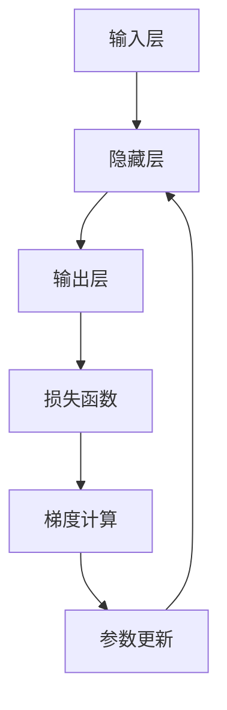

# 优化利器：反向传播算法的改进与优化

## 1. 背景介绍
### 1.1 人工智能与深度学习的发展
#### 1.1.1 人工智能的崛起
#### 1.1.2 深度学习的兴起
#### 1.1.3 神经网络的应用

### 1.2 反向传播算法的重要性
#### 1.2.1 反向传播算法的诞生
#### 1.2.2 反向传播算法在深度学习中的地位
#### 1.2.3 反向传播算法面临的挑战

## 2. 核心概念与联系
### 2.1 人工神经网络
#### 2.1.1 神经元模型
#### 2.1.2 前馈神经网络
#### 2.1.3 激活函数

### 2.2 损失函数
#### 2.2.1 均方误差损失
#### 2.2.2 交叉熵损失
#### 2.2.3 其他常见损失函数

### 2.3 梯度下降法
#### 2.3.1 梯度的概念
#### 2.3.2 梯度下降的原理
#### 2.3.3 学习率的选择

### 2.4 反向传播算法
#### 2.4.1 链式法则
#### 2.4.2 计算图的概念
#### 2.4.3 反向传播的推导



## 3. 核心算法原理具体操作步骤
### 3.1 前向传播
#### 3.1.1 输入数据的准备
#### 3.1.2 隐藏层的计算
#### 3.1.3 输出层的计算

### 3.2 反向传播
#### 3.2.1 损失函数梯度的计算
#### 3.2.2 输出层参数梯度的计算
#### 3.2.3 隐藏层参数梯度的计算

### 3.3 参数更新
#### 3.3.1 学习率的选择
#### 3.3.2 参数更新的公式
#### 3.3.3 权重衰减的应用

## 4. 数学模型和公式详细讲解举例说明
### 4.1 前向传播的数学表示
#### 4.1.1 输入层到隐藏层的计算
$$z^{(l)} = W^{(l)}a^{(l-1)} + b^{(l)}$$
#### 4.1.2 激活函数的应用
$$a^{(l)} = \sigma(z^{(l)})$$
#### 4.1.3 隐藏层到输出层的计算
$$\hat{y} = \sigma(W^{(L)}a^{(L-1)} + b^{(L)})$$

### 4.2 损失函数的数学表示
#### 4.2.1 均方误差损失
$$J(W,b) = \frac{1}{2m}\sum_{i=1}^m(\hat{y}^{(i)} - y^{(i)})^2$$
#### 4.2.2 交叉熵损失
$$J(W,b) = -\frac{1}{m}\sum_{i=1}^m[y^{(i)}\log\hat{y}^{(i)} + (1-y^{(i)})\log(1-\hat{y}^{(i)})]$$

### 4.3 反向传播的数学推导
#### 4.3.1 输出层参数梯度的计算
$$\frac{\partial J}{\partial W^{(L)}} = \frac{1}{m}\sum_{i=1}^m(\hat{y}^{(i)} - y^{(i)})a^{(L-1)(i)T}$$
$$\frac{\partial J}{\partial b^{(L)}} = \frac{1}{m}\sum_{i=1}^m(\hat{y}^{(i)} - y^{(i)})$$
#### 4.3.2 隐藏层参数梯度的计算
$$\frac{\partial J}{\partial W^{(l)}} = \frac{1}{m}\sum_{i=1}^m\delta^{(l+1)(i)}(a^{(l)(i)})^T$$
$$\frac{\partial J}{\partial b^{(l)}} = \frac{1}{m}\sum_{i=1}^m\delta^{(l+1)(i)}$$
其中，$\delta^{(l)} = ((W^{(l)})^T\delta^{(l+1)}) * \sigma'(z^{(l)})$

## 5. 项目实践：代码实例和详细解释说明
### 5.1 Python实现反向传播算法
#### 5.1.1 定义神经网络结构
```python
class NeuralNetwork:
    def __init__(self, input_size, hidden_size, output_size):
        self.W1 = np.random.randn(hidden_size, input_size)
        self.b1 = np.zeros((hidden_size, 1))
        self.W2 = np.random.randn(output_size, hidden_size)
        self.b2 = np.zeros((output_size, 1))
```
#### 5.1.2 前向传播的实现
```python
def forward(self, X):
    self.z1 = np.dot(self.W1, X) + self.b1
    self.a1 = sigmoid(self.z1)
    self.z2 = np.dot(self.W2, self.a1) + self.b2
    self.a2 = sigmoid(self.z2)
    return self.a2
```
#### 5.1.3 反向传播的实现
```python
def backward(self, X, y, learning_rate):
    m = X.shape[1]
    
    dZ2 = self.a2 - y
    dW2 = (1/m) * np.dot(dZ2, self.a1.T)
    db2 = (1/m) * np.sum(dZ2, axis=1, keepdims=True)
    
    dZ1 = np.dot(self.W2.T, dZ2) * sigmoid_derivative(self.z1)
    dW1 = (1/m) * np.dot(dZ1, X.T)
    db1 = (1/m) * np.sum(dZ1, axis=1, keepdims=True)
    
    self.W2 -= learning_rate * dW2
    self.b2 -= learning_rate * db2
    self.W1 -= learning_rate * dW1
    self.b1 -= learning_rate * db1
```

### 5.2 TensorFlow实现反向传播算法
#### 5.2.1 定义神经网络模型
```python
model = tf.keras.Sequential([
    tf.keras.layers.Dense(hidden_size, activation='sigmoid', input_shape=(input_size,)),
    tf.keras.layers.Dense(output_size, activation='sigmoid')
])
```
#### 5.2.2 编译模型并指定优化器
```python
model.compile(optimizer=tf.keras.optimizers.SGD(learning_rate=0.1),
              loss='binary_crossentropy',
              metrics=['accuracy'])
```
#### 5.2.3 训练模型
```python
model.fit(X_train, y_train, epochs=100, batch_size=32)
```

## 6. 实际应用场景
### 6.1 图像分类
#### 6.1.1 卷积神经网络的应用
#### 6.1.2 反向传播在图像分类中的优化

### 6.2 自然语言处理
#### 6.2.1 词向量的训练
#### 6.2.2 反向传播在语言模型中的应用

### 6.3 推荐系统
#### 6.3.1 协同过滤算法
#### 6.3.2 反向传播在推荐系统中的优化

## 7. 工具和资源推荐
### 7.1 深度学习框架
#### 7.1.1 TensorFlow
#### 7.1.2 PyTorch
#### 7.1.3 Keras

### 7.2 数据集资源
#### 7.2.1 MNIST手写数字数据集
#### 7.2.2 ImageNet图像数据集
#### 7.2.3 WordNet词汇数据库

### 7.3 学习资料推荐
#### 7.3.1 《深度学习》书籍
#### 7.3.2 吴恩达的深度学习课程
#### 7.3.3 CS231n计算机视觉课程

## 8. 总结：未来发展趋势与挑战
### 8.1 反向传播算法的局限性
#### 8.1.1 梯度消失问题
#### 8.1.2 过拟合问题
#### 8.1.3 计算效率问题

### 8.2 改进与优化方向
#### 8.2.1 残差网络的应用
#### 8.2.2 正则化技术的改进
#### 8.2.3 并行计算的加速

### 8.3 未来的研究方向
#### 8.3.1 无监督学习的探索
#### 8.3.2 强化学习的结合
#### 8.3.3 生成对抗网络的发展

## 9. 附录：常见问题与解答
### 9.1 反向传播算法的收敛性问题
#### 9.1.1 如何判断反向传播算法是否收敛？
#### 9.1.2 影响反向传播算法收敛性的因素有哪些？
#### 9.1.3 如何加速反向传播算法的收敛？

### 9.2 反向传播算法的超参数调整
#### 9.2.1 学习率的选择有哪些技巧？
#### 9.2.2 如何确定隐藏层的层数和神经元数量？
#### 9.2.3 正则化参数的设置有哪些经验？

### 9.3 反向传播算法的实现细节
#### 9.3.1 如何处理数据的归一化和标准化？
#### 9.3.2 如何进行权重的初始化？
#### 9.3.3 如何选择激活函数？

反向传播算法作为深度学习的核心算法，在人工智能的发展历程中扮演着至关重要的角色。通过对反向传播算法的深入理解和优化改进，我们可以构建出更加强大、高效的深度学习模型，推动人工智能技术的不断进步。未来，反向传播算法还将与其他领域的算法和技术相结合，开拓出更加广阔的应用前景，为人类社会的发展贡献智慧和力量。

作者：禅与计算机程序设计艺术 / Zen and the Art of Computer Programming