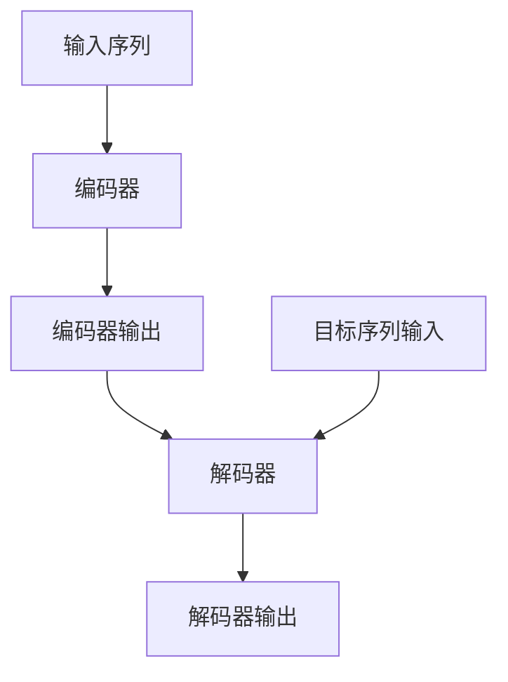
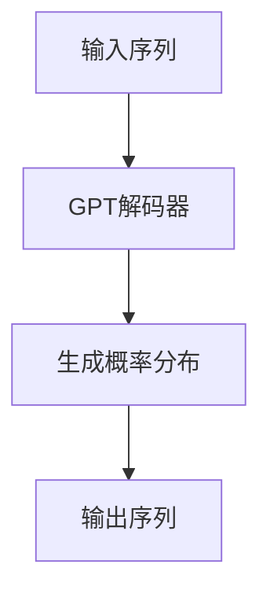

# 使用WikiText2数据集训练Wiki-GPT模型

## 1. 背景介绍

随着自然语言处理(NLP)技术的不断发展,基于Transformer的大型语言模型(LLM)已经成为NLP领域的主流方向之一。这些模型通过在大量文本数据上进行预训练,学习到丰富的语言知识和语义表示,并可以通过微调等方式应用到下游任务中。其中,GPT(Generative Pre-trained Transformer)是一种广为人知的LLM,由OpenAI公司提出,具有强大的生成能力。

Wiki-GPT是一种基于GPT架构的语言模型,专门针对维基百科(Wikipedia)数据进行训练。维基百科是一个庞大的多语言在线百科全书,涵盖了广泛的知识领域,具有高质量和结构化的特点。因此,在维基百科数据上训练的语言模型可以学习到丰富的知识,并具备较好的生成质量和一致性。

WikiText2是一个专门用于语言模型训练和评估的维基百科数据集。它由斯坦福大学的研究人员精心构建,从维基百科中选取了优质的文章,并进行了适当的预处理和划分。WikiText2数据集广泛应用于自然语言处理研究,是训练Wiki-GPT模型的理想选择。

## 2. 核心概念与联系

### 2.1 Transformer架构

Transformer是一种全新的基于注意力机制(Attention Mechanism)的序列到序列(Seq2Seq)模型架构,由Google的Vaswani等人在2017年提出。它完全摒弃了传统的基于RNN或CNN的序列模型结构,而是采用了全新的自注意力(Self-Attention)机制来捕捉序列中元素之间的依赖关系。

Transformer架构主要由编码器(Encoder)和解码器(Decoder)两个部分组成。编码器负责将输入序列映射为高维向量表示,而解码器则根据编码器的输出和自身的输入生成目标序列。两者之间通过注意力机制进行交互。



### 2.2 GPT模型

GPT(Generative Pre-trained Transformer)是一种基于Transformer解码器的自回归语言模型,由OpenAI公司提出。它通过在大规模文本数据上进行预训练,学习到丰富的语言知识和语义表示,并可以应用于各种自然语言生成任务,如文本生成、机器翻译、问答系统等。

GPT模型的核心思想是利用自注意力机制捕捉输入序列中元素之间的依赖关系,并通过自回归(Autoregressive)方式生成下一个元素的概率分布。在预训练阶段,GPT模型以无监督的方式学习语言模型,即根据给定的上文预测下一个词的概率。在下游任务中,GPT模型可以通过微调的方式进行特定任务的优化。



### 2.3 Wiki-GPT

Wiki-GPT是一种基于GPT架构的语言模型,专门针对维基百科数据进行训练。它利用了维基百科的高质量和结构化特点,在大规模维基百科文本数据上进行预训练,学习到丰富的知识和语义表示。

与原始GPT模型相比,Wiki-GPT具有以下优势:

1. 知识覆盖面广:维基百科涵盖了广泛的知识领域,因此Wiki-GPT可以学习到多样化的知识。
2. 生成质量高:维基百科文章通常具有较高的质量和一致性,有利于Wiki-GPT生成更加流畅和连贯的文本。
3. 知识结构化:维基百科的知识具有一定的结构化特征,有助于Wiki-GPT学习到更加有组织的知识表示。

Wiki-GPT可以应用于各种基于知识的自然语言处理任务,如知识问答、文本生成、知识推理等,并展现出优秀的性能。

## 3. 核心算法原理具体操作步骤

训练Wiki-GPT模型的核心算法原理与训练原始GPT模型类似,都是基于Transformer解码器的自回归语言模型训练。具体操作步骤如下:

### 3.1 数据预处理

1. 从维基百科数据集(如WikiText2)中选取合适的文章作为训练数据。
2. 对文章进行必要的预处理,如去除HTML标记、分词、标点符号处理等。
3. 构建词表(Vocabulary),将文本转换为对应的词序列。
4. 将词序列划分为训练集、验证集和测试集。

### 3.2 模型构建

1. 定义Transformer解码器的架构,包括embedding层、多头注意力层、前馈神经网络层等。
2. 初始化模型参数。

### 3.3 模型训练

1. 将训练数据按批次(Batch)输入模型。
2. 对于每个批次的输入序列,执行自回归过程:
   - 将输入序列的前缀作为解码器的输入
   - 解码器根据输入生成下一个词的概率分布
   - 计算预测概率与真实标签的损失(Loss)
3. 通过反向传播算法计算参数梯度,并使用优化器(如Adam)更新模型参数。
4. 在验证集上评估模型性能,监控训练过程。
5. 重复2-4步骤,直至模型收敛或达到预设的训练轮次。

### 3.4 模型评估和应用

1. 在测试集上评估模型的生成质量,计算相关指标(如困惑度、BLEU分数等)。
2. 根据需求,对模型进行微调或直接应用于下游任务(如文本生成、知识问答等)。

## 4. 数学模型和公式详细讲解举例说明

### 4.1 自注意力机制(Self-Attention)

自注意力机制是Transformer架构的核心部分,它允许模型捕捉输入序列中任意两个位置之间的依赖关系。给定一个长度为n的输入序列 $X = (x_1, x_2, \dots, x_n)$,自注意力机制计算每个位置 $i$ 的输出向量 $y_i$ 如下:

$$y_i = \sum_{j=1}^n \alpha_{ij}(x_jW^V)$$

其中, $W^V$ 是一个可学习的值矩阵(Value Matrix), $\alpha_{ij}$ 是注意力权重,表示位置 $i$ 对位置 $j$ 的注意力程度。注意力权重的计算方式如下:

$$\alpha_{ij} = \frac{exp(e_{ij})}{\sum_{k=1}^n exp(e_{ik})}$$

$$e_{ij} = \frac{(x_iW^Q)(x_jW^K)^T}{\sqrt{d_k}}$$

这里, $W^Q$ 和 $W^K$ 分别是可学习的查询矩阵(Query Matrix)和键矩阵(Key Matrix), $d_k$ 是缩放因子,用于防止点积过大导致梯度消失。

自注意力机制允许模型在计算每个位置的输出时,同时关注整个输入序列的所有位置,从而捕捉长距离依赖关系。这是Transformer相比传统RNN和CNN模型的一大优势。

### 4.2 掩码自回归语言模型(Masked Autoregressive Language Model)

在训练GPT模型时,通常采用掩码自回归语言模型(Masked Autoregressive Language Model)的方式。给定一个长度为n的输入序列 $X = (x_1, x_2, \dots, x_n)$,模型的目标是最大化下一个词 $x_{i+1}$ 的条件概率 $P(x_{i+1} | x_1, x_2, \dots, x_i)$。

具体来说,对于每个位置 $i$,模型会根据前缀 $(x_1, x_2, \dots, x_i)$ 生成下一个词 $x_{i+1}$ 的概率分布 $P(x_{i+1} | x_1, x_2, \dots, x_i)$。然后,将该概率分布与真实标签 $x_{i+1}$ 计算交叉熵损失(Cross-Entropy Loss):

$$\mathcal{L}_i = -\log P(x_{i+1} | x_1, x_2, \dots, x_i)$$

最终的损失函数是所有位置损失的平均:

$$\mathcal{L} = \frac{1}{n}\sum_{i=1}^{n-1}\mathcal{L}_i$$

通过最小化损失函数,模型可以学习到捕捉上下文依赖关系的能力,从而生成更加流畅和连贯的文本。

## 5. 项目实践:代码实例和详细解释说明

在这一部分,我们将提供一个使用PyTorch实现的Wiki-GPT模型训练示例,并对关键代码进行详细解释。

### 5.1 数据预处理

```python
import torchtext

# 加载WikiText2数据集
train_dataset, valid_dataset, test_dataset = torchtext.datasets.WikiText2.splits(root='./data')

# 构建词表
text_pipeline = lambda x: x.split()
vocab = torchtext.vocab.build_vocab_from_iterator(train_dataset.text, specials=['<unk>', '<pad>'], min_freq=3)
vocab.set_default_index(vocab['<unk>'])

# 将文本转换为词序列
text_transform = lambda x: [vocab[token] for token in text_pipeline(x)]
train_dataset = train_dataset.values.apply(text_transform)
valid_dataset = valid_dataset.values.apply(text_transform)
test_dataset = test_dataset.values.apply(text_transform)
```

在这段代码中,我们首先从`torchtext`库中加载WikiText2数据集,并将其划分为训练集、验证集和测试集。然后,我们构建词表(`vocab`)并将文本转换为对应的词序列。

### 5.2 模型定义

```python
import torch
import torch.nn as nn

class TransformerDecoder(nn.Module):
    def __init__(self, vocab_size, embed_dim, num_heads, ff_dim, num_layers, dropout=0.1):
        super().__init__()
        self.embed = nn.Embedding(vocab_size, embed_dim)
        self.decoder = nn.TransformerDecoder(
            nn.TransformerDecoderLayer(embed_dim, num_heads, ff_dim, dropout),
            num_layers
        )
        self.fc_out = nn.Linear(embed_dim, vocab_size)

    def forward(self, x, memory=None):
        x = self.embed(x)
        x = self.decoder(x, memory)
        return self.fc_out(x)

model = TransformerDecoder(len(vocab), 512, 8, 2048, 6)
```

在这段代码中,我们定义了一个基于Transformer解码器的语言模型`TransformerDecoder`。模型包括以下几个主要部分:

- `nn.Embedding`层用于将词序列映射为嵌入向量。
- `nn.TransformerDecoder`是Transformer解码器的核心部分,包含多层解码器层。每个解码器层由多头自注意力机制和前馈神经网络组成。
- `nn.Linear`层用于将解码器的输出映射回词表的维度,生成下一个词的概率分布。

最后,我们实例化一个`TransformerDecoder`模型,设置了相应的超参数。

### 5.3 模型训练

```python
import torch.optim as optim
from tqdm import tqdm

device = torch.device('cuda' if torch.cuda.is_available() else 'cpu')
model = model.to(device)
criterion = nn.CrossEntropyLoss()
optimizer = optim.Adam(model.parameters(), lr=1e-4)

for epoch in range(10):
    model.train()
    total_loss = 0
    for batch in tqdm(train_dataset):
        batch = torch.tensor(batch, dtype=torch.long, device=device)
        batch = batch.transpose(0, 1)  # (seq_len, batch_size)
        outputs = model(batch[:-1])
        loss = criterion(outputs.transpose(1, 2), batch[1:])
        optimizer.zero_grad()
        loss.backward()
        optimizer.step()
        total_loss += loss.item()
    print(f'Epoch {epoch+1}, Loss: {total_loss / len(train_dataset)}')
```

在这段代码中,我们实现了Wiki-GPT模型的训练过程。首先,我们将模型移动到GPU或CPU设备上,并定义交叉熵损失函数和优化器。

然后,我们进入训练循环。对于每个批次的输入序列,我们执行以下操作:

1. 将输入序列转换为PyTorch张量,并将其维度调整为(seq_len, batch_size)。
2. 将输入序列的前缀(batch[:-1])输入模型,获得下一个词