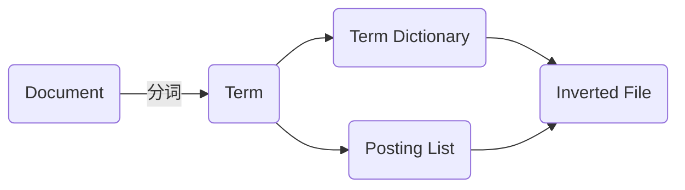

# 倒排索引 原理与代码实例讲解

## 1. 背景介绍
### 1.1 什么是倒排索引  
倒排索引(Inverted Index)，也称反向索引，是一种索引方法，用于存储在全文搜索下某个单词在一个文档或一组文档中的存储位置的映射。它是文档检索系统中最常用的数据结构。

### 1.2 倒排索引的起源与发展
倒排索引技术最早可以追溯到20世纪50年代末,60年代初。1960年，Hans Peter Luhn发表的一篇论文首次提出了使用倒排索引来加快文档检索的速度。此后,Gerard Salton等人不断完善倒排索引的理论基础。如今,几乎所有的全文检索引擎都采用了倒排索引技术,它已经成为文本检索领域的核心技术之一。

### 1.3 倒排索引的重要性
在海量数据的背景下,倒排索引以其优异的检索性能,在全文搜索领域占据着重要地位。无论是学术文献检索、互联网搜索引擎,还是商业数据库,倒排索引都是其核心组成部分。理解倒排索引的原理,对于从事信息检索、搜索引擎、自然语言处理等领域的研究人员和工程师来说都是非常必要的。

## 2. 核心概念与联系
### 2.1 文档(Document)
文档是指计算机系统中以文件形式存储的信息单元,例如一篇文章、一个网页等。每个文档都有一个唯一的文档ID。

### 2.2 词项(Term) 
词项是文档中出现的一个词(Word)。通常会对词项进行规范化处理,如大小写转换、词形还原(stemming)等。

### 2.3 词典(Term Dictionary)
词典是文档集合中出现过的所有词项的集合。为了节省空间,词典通常按字典序排列,每个词项用一个数字ID代替。

### 2.4 倒排列表(Posting List)
倒排列表记录了出现过某个词项的所有文档,以及该词项在这些文档中出现的位置等信息。一个倒排列表可以表示为[(docID1, freq1, [pos1,pos2,...]), (docID2, freq2, [pos1,pos2,...]),...]。其中,docID表示文档ID,freq表示词频,pos表示位置。

### 2.5 倒排文件(Inverted File)
倒排文件就是存储所有词项的倒排列表的文件。

### 2.6 概念之间的联系
倒排索引的核心就是词典和倒排列表。词典实现了词项到倒排列表的快速映射,倒排列表则记录了每个词项对应的文档。


## 3. 核心算法原理具体操作步骤
构建倒排索引主要分为以下几个步骤:

### 3.1 文档预处理
将原始文档进行预处理,如去除HTML标签、分词、大小写转换、去除停用词、词形还原等。预处理后得到每篇文档的词项序列。

### 3.2 构建词典
扫描所有文档的词项序列,构建词典。词典中的每个词项赋予一个唯一的数字ID。

### 3.3 构建倒排列表
再次扫描所有文档的词项序列,对于序列中的每个词项,在其对应的倒排列表中添加该文档ID、词频、位置等信息。

### 3.4 倒排文件的存储
将所有词项的倒排列表写入到倒排文件中。为了提高检索效率,倒排列表通常按文档ID递增排序,并使用压缩算法压缩。

### 3.5 检索
用户输入查询词,系统先对查询词进行预处理(同3.1),然后在词典中查找每个词项的ID,再根据ID去倒排列表中查找包含该词项的文档,最后对这些文档进行排序、高亮显示等处理,返回给用户。

## 4. 数学模型和公式详细讲解举例说明
倒排索引中的两个重要概念是词频(TF)和逆文档频率(IDF)。它们都源自信息检索领域的数学模型。

### 4.1 词频(TF)
词频(Term Frequency)指一个词项在一篇文档中出现的频率。设词项t在文档d中出现了$n_t$次,文档d中总共有$\sum_k n_k$个词,则t在d中的词频为:

$$
TF_{t,d} = \frac{n_t}{\sum_k n_k}
$$

词频反映了一个词项在文档中的重要程度。

### 4.2 逆文档频率(IDF) 
逆文档频率(Inverse Document Frequency)衡量一个词项在整个文档集合中的重要程度。设文档集合D中共有N篇文档,其中包含词项t的文档有$N_t$篇,则t的逆文档频率为:

$$
IDF_t = \log \frac{N}{N_t}
$$

如果一个词项在很多文档中出现,则它的IDF值较小;反之,如果一个词项只在少数文档中出现,则它的IDF值较大。IDF反映了一个词项的区分能力。

### 4.3 TF-IDF权重
将TF和IDF结合起来,就得到了一个词项在一篇文档中的权重:

$$
W_{t,d} = TF_{t,d} \times IDF_t
$$

TF-IDF权重既考虑了词项在文档中的重要性,也考虑了它在整个文档集合中的区分能力。在倒排索引中,可以将TF-IDF权重存储在倒排列表中,用于后续的文档排序。

举例来说,假设词项"computer"在文档1中出现了5次,文档1的总词数为100,则它在文档1中的词频为5/100=0.05。如果文档集合中共有10000篇文档,其中包含"computer"的文档有1000篇,则"computer"的逆文档频率为log(10000/1000)=2。因此,"computer"在文档1中的TF-IDF权重为0.05*2=0.1。

## 5. 项目实践：代码实例和详细解释说明
下面用Python实现一个简单的倒排索引。

### 5.1 文档预处理
```python
import re

def preprocess(text):
    text = re.sub(r'[^\w\s]','',text) #去除标点符号
    words = text.lower().split()     #转小写,分词
    return words
```

### 5.2 构建词典和倒排列表
```python
def build_index(docs):
    term_dict = {}  #词典
    posting_lists = {}  #倒排列表
    
    for doc_id, doc in enumerate(docs):
        terms = preprocess(doc)
        for pos, term in enumerate(terms):
            if term not in term_dict:
                term_dict[term] = len(term_dict)
            term_id = term_dict[term]
            
            if term_id not in posting_lists:
                posting_lists[term_id] = []
            posting_lists[term_id].append((doc_id, pos))
            
    return term_dict, posting_lists
```

### 5.3 检索
```python
def search(query, term_dict, posting_lists):
    terms = preprocess(query)
    term_ids = [term_dict[term] for term in terms if term in term_dict]
    
    result = []
    for term_id in term_ids:
        result.append(posting_lists[term_id])
        
    return result
```

### 5.4 测试
```python
docs = [
    "The quick brown fox jumps over the lazy dog",
    "The lazy dog sleeps all day long",
    "The quick brown fox is very quick and jumpy"
]

term_dict, posting_lists = build_index(docs)
print(term_dict)
print(posting_lists)

query = "quick fox"
print(search(query, term_dict, posting_lists))
```

输出结果:
```
{'the': 0, 'quick': 1, 'brown': 2, 'fox': 3, 'jumps': 4, 'over': 5, 'lazy': 6, 'dog': 7, 'sleeps': 8, 'all': 9, 'day': 10, 'long': 11, 'is': 12, 'very': 13, 'and': 14, 'jumpy': 15}

{0: [(0, 0), (0, 6), (1, 0), (2, 0)], 1: [(0, 1), (2, 1), (2, 8)], 2: [(0, 2), (2, 2)], 3: [(0, 3), (2, 3)], 4: [(0, 4)], 5: [(0, 5)], 6: [(0, 7), (1, 1)], 7: [(0, 8), (1, 2)], 8: [(1, 3)], 9: [(1, 4)], 10: [(1, 5)], 11: [(1, 6)], 12: [(2, 4)], 13: [(2, 5)], 14: [(2, 6)], 15: [(2, 9)]}

[[(0, 1), (2, 1), (2, 8)], [(0, 3), (2, 3)]]
```

在这个例子中,我们首先对文档进行预处理,然后构建词典和倒排列表。词典将每个词项映射到一个唯一的ID,倒排列表则记录了每个词项出现在哪些文档中的哪些位置。最后,我们对查询进行检索,返回包含查询词的文档ID和位置。

## 6. 实际应用场景
倒排索引在很多领域都有广泛应用,下面列举几个典型场景:

### 6.1 全文搜索引擎
搜索引擎是倒排索引最经典的应用。搜索引擎爬取了海量的网页,对网页内容建立倒排索引,当用户输入查询词时,就可以快速找到包含查询词的相关网页。

### 6.2 文献检索系统
学术文献检索系统如Google Scholar、IEEE Xplore等,也是基于倒排索引实现的。研究人员可以通过输入关键词,快速查找相关的论文和专利。

### 6.3 推荐系统
很多推荐系统也会对用户的历史行为(如浏览、点击、购买等)建立倒排索引,然后根据用户当前的行为,实时匹配相似的历史行为,从而给出推荐。

### 6.4 日志分析
在大规模日志分析中,日志通常会按照某些关键词建立倒排索引,这样就可以快速查询包含特定关键词的日志,进行故障排查和数据分析。

### 6.5 DNA序列分析
生物信息学中,DNA序列也可以看作一个字符串。通过对DNA序列建立倒排索引,可以加速相似序列的比对和查找。

## 7. 工具和资源推荐
下面推荐一些常用的开源搜索引擎库和工具,它们都基于倒排索引实现:
- Lucene/Solr: 最流行的Java搜索引擎库,提供了完整的全文检索功能。
- Elasticsearch: 基于Lucene的分布式搜索引擎,提供RESTful接口。
- Sphinx: 一个高性能的全文检索引擎,提供SQL-like的查询语言。
- Xapian: 一个高效的C++搜索引擎库,在Debian等Linux发行版中广泛使用。
- Whoosh: 一个纯Python实现的全文搜索引擎库,适合小型应用。

此外,推荐一些相关的学习资源:
- Introduction to Information Retrieval (Book by Christopher D. Manning, et al)
- Information Retrieval (Book by Stefan Buttcher, et al) 
- Inverted Index - Wikipedia
- Implementing an Inverted Index in Python - YouTube
- Lucene Tutorial - Tutorialspoint

## 8. 总结：未来发展趋势与挑战
倒排索引技术经过几十年的发展,已经相当成熟,但仍然面临着新的挑战和机遇:

### 8.1 海量数据的存储和检索
随着数据量的爆炸式增长,如何高效地存储和检索海量数据,是摆在倒排索引技术面前的一大挑战。需要更高效的压缩算法、更智能的缓存机制,以及更先进的分布式架构。

### 8.2 实时索引更新
很多应用场景如社交网络、新闻推荐等,都要求搜索引擎能够实时反映最新的内容变化。如何在不影响检索性能的前提下,实现实时的索引更新,是一个值得研究的问题。

### 8.3 个性化和语义化检索
用户的搜索需求越来越个性化,对搜索结果的相关性要求也越来越高。未来的倒排索引需要更好地理解用户意图,并融入个性化和语义化的特征,