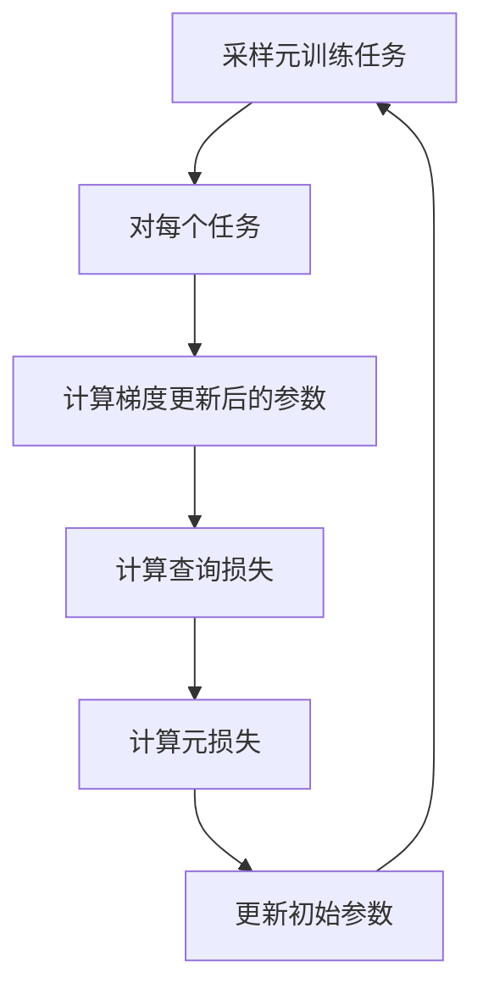

# 元学习(Meta-Learning) - 原理与代码实例讲解

## 1.背景介绍

在传统的机器学习中,我们通常需要为每个新任务收集大量的标记数据,并从头开始训练一个新的模型。然而,这种方法存在一些缺陷:

1. **数据效率低下**: 对于一些数据稀缺的领域,可能难以获得足够的标记数据来训练一个有效的模型。

2. **泛化能力差**: 由于每个任务都是独立训练的,模型很难从之前学到的知识中获益,导致在新任务上的泛化能力较差。

3. **计算效率低下**: 对于每个新任务,都需要从头开始训练模型,这是一种计算资源的浪费。

为了解决这些问题,**元学习(Meta-Learning)** 应运而生。元学习的目标是训练一个模型,使其能够快速适应新的任务,从而提高数据效率、泛化能力和计算效率。

### 1.1 元学习的动机

人类有着独特的学习能力。当我们学习一项新技能时,我们不是从零开始,而是利用之前学到的知识作为基础。例如,当我们学习一门新的编程语言时,虽然语法和细节有所不同,但是我们可以利用之前学习编程语言时获得的经验,从而加快新语言的学习进程。

元学习旨在赋予机器类似的能力,使其能够从过去的经验中积累知识,并将这些知识迁移到新的任务中,从而加快学习新任务的速度。

### 1.2 元学习的应用场景

元学习在许多领域都有广泛的应用前景,例如:

- **少样本学习(Few-Shot Learning)**: 在数据稀缺的情况下,利用元学习快速适应新任务。
- **持续学习(Continual Learning)**: 使模型能够持续学习新知识,而不会遗忘之前学到的内容。
- **多任务学习(Multi-Task Learning)**: 同时解决多个相关任务,提高模型的泛化能力。
- **自动机器学习(AutoML)**: 自动搜索最优的神经网络架构和超参数。
- **强化学习(Reinforcement Learning)**: 提高强化学习算法的样本效率和泛化能力。

## 2.核心概念与联系

### 2.1 元学习的形式化定义

在形式化定义元学习之前,我们首先需要了解一些基本概念:

- **Task(任务)**: 在机器学习中,任务通常指一个特定的学习问题,例如图像分类、机器翻译等。每个任务都有自己的数据分布和目标函数。
- **Task Distribution(任务分布)**: 所有可能任务的集合,以及每个任务被抽样的概率分布。
- **Meta-Train Tasks(元训练任务)**: 用于元训练的一系列任务的集合。
- **Meta-Test Tasks(元测试任务)**: 用于评估元学习算法性能的一系列任务的集合。

基于上述概念,我们可以将元学习形式化定义为:

给定一个任务分布 $p(\mathcal{T})$,以及来自该分布的一系列元训练任务 $\{\mathcal{T}_i\}_{i=1}^{n}$,元学习算法的目标是学习一个学习者(Learner) $f_{\theta}$,使其能够在观察到来自新任务 $\mathcal{T}_{new} \sim p(\mathcal{T})$ 的少量数据后,快速适应该任务,即:

$$\min_{\theta} \mathbb{E}_{\mathcal{T}_{new} \sim p(\mathcal{T})} \left[ \mathcal{L}_{\mathcal{T}_{new}} \left( f_{\theta}(\mathcal{D}_{\mathcal{T}_{new}}^{train}) \right) \right]$$

其中 $\mathcal{D}_{\mathcal{T}_{new}}^{train}$ 表示来自新任务 $\mathcal{T}_{new}$ 的训练数据, $\mathcal{L}_{\mathcal{T}_{new}}$ 表示该任务的损失函数。

直观地说,元学习算法的目标是在元训练阶段学习一个有效的学习策略,使得在元测试阶段,该策略能够快速适应新任务,并在新任务上取得良好的性能。

### 2.2 元学习的范式

根据具体的问题设置和优化目标的不同,元学习可以分为以下几种主要范式:

1. **优化基元学习(Optimization-Based Meta-Learning)**
2. **度量基元学习(Metric-Based Meta-Learning)** 
3. **模型基元学习(Model-Based Meta-Learning)**

我们将在后续章节详细介绍每种范式的原理和代表性算法。

### 2.3 元学习与其他机器学习范式的关系

元学习与其他一些流行的机器学习范式有着密切的联系,例如:

- **多任务学习(Multi-Task Learning)**: 多任务学习旨在同时解决多个相关任务,提高模型的泛化能力。元学习可以看作是一种特殊形式的多任务学习,其中"任务"是从一个任务分布中采样得到的。

- **迁移学习(Transfer Learning)**: 迁移学习旨在将在源域学到的知识迁移到目标域,提高目标任务的性能。元学习可以看作是一种特殊形式的迁移学习,其中源域是元训练任务的集合,目标域是元测试任务。

- **小样本学习(Few-Shot Learning)**: 小样本学习旨在使用少量标记数据训练有效的模型。元学习为小样本学习提供了一种有效的解决方案。

- **持续学习(Continual Learning)**: 持续学习旨在使模型能够持续学习新知识,而不会遗忘之前学到的内容。元学习可以为持续学习提供理论基础和实现方法。

## 3.核心算法原理具体操作步骤

在这一节,我们将介绍元学习的三种主要范式,以及它们的代表性算法。

### 3.1 优化基元学习

优化基元学习(Optimization-Based Meta-Learning)的核心思想是:在元训练阶段,学习一个有效的优化策略(Optimizer),使得在元测试阶段,该优化策略能够快速适应新任务。

#### 3.1.1 模型不可训练元学习(Model-Agnostic Meta-Learning, MAML)

MAML是优化基元学习范式中最著名的算法之一。它的核心思想是:在元训练阶段,通过多任务训练,学习一个有效的初始化参数,使得在元测试阶段,只需要少量梯度更新步骤,就能够快速适应新任务。

MAML的具体操作步骤如下:

1. 从元训练任务的分布 $p(\mathcal{T})$ 中采样一批任务 $\{\mathcal{T}_i\}$。
2. 对于每个任务 $\mathcal{T}_i$:
    - 从该任务的训练数据 $\mathcal{D}_{\mathcal{T}_i}^{train}$ 中采样一批数据 $\mathcal{D}_{\mathcal{T}_i}^{train,batch}$。
    - 计算在当前模型参数 $\theta$ 下,使用 $\mathcal{D}_{\mathcal{T}_i}^{train,batch}$ 进行一步或几步梯度更新后的新参数 $\theta_i^{\prime}$:
    
    $$\theta_i^{\prime} = \theta - \alpha \nabla_{\theta} \mathcal{L}_{\mathcal{T}_i}\left(f_{\theta}(\mathcal{D}_{\mathcal{T}_i}^{train,batch})\right)$$
    
    其中 $\alpha$ 是学习率。
    
3. 使用更新后的参数 $\theta_i^{\prime}$ 在每个任务的查询(Query)数据 $\mathcal{D}_{\mathcal{T}_i}^{query}$ 上计算损失:
    
    $$\mathcal{L}_i^{query} = \mathcal{L}_{\mathcal{T}_i}\left(f_{\theta_i^{\prime}}(\mathcal{D}_{\mathcal{T}_i}^{query})\right)$$
    
4. 对所有任务的查询损失求和,得到元损失(Meta-Loss):

    $$\mathcal{L}_{meta}(\theta) = \sum_i \mathcal{L}_i^{query}$$
    
5. 使用元损失对初始参数 $\theta$ 进行更新:

    $$\theta \leftarrow \theta - \beta \nabla_{\theta} \mathcal{L}_{meta}(\theta)$$
    
    其中 $\beta$ 是元学习率(Meta Learning Rate)。
    
通过上述过程,MAML在元训练阶段学习到一个有效的初始化参数 $\theta$,使得在元测试阶段,只需要少量梯度更新步骤,就能够快速适应新任务。

MAML的优点是简单、高效,并且是任务无关(Task-Agnostic)的,可以应用于广泛的领域。但它也存在一些缺陷,例如:

- 需要在每个任务上执行梯度更新,计算开销较大。
- 对于一些复杂任务,少量梯度更新步骤可能不够。
- 无法直接应用于基于无梯度优化器(如强化学习)的任务。

为了解决这些问题,研究者们提出了多种改进的优化基元学习算法,例如:

- **First-Order MAML**: 使用一阶近似代替二阶导数,降低计算复杂度。
- **Reptile**: 通过简单的参数平均,实现高效的元更新。
- **Meta-SGD**: 使用可微分的优化器,将优化过程作为一个可训练的模块。

#### 3.1.2 Mermaid 流程图

### 3.2 度量基元学习

度量基元学习(Metric-Based Meta-Learning)的核心思想是:在元训练阶段,学习一个有效的相似性度量,使得在元测试阶段,能够根据该度量快速识别新任务中的相似样本,从而实现快速适应。

#### 3.2.1 原型网络(Prototypical Networks)

原型网络是度量基元学习范式中最著名的算法之一。它的核心思想是:在元训练阶段,学习一个嵌入函数(Embedding Function),使得同一类样本在嵌入空间中彼此靠近,不同类样本彼此远离。在元测试阶段,通过计算查询样本与各类原型(即类均值)之间的距离,即可实现快速分类。

原型网络的具体操作步骤如下:

1. 从元训练任务的分布 $p(\mathcal{T})$ 中采样一批任务 $\{\mathcal{T}_i\}$。
2. 对于每个任务 $\mathcal{T}_i$:
    - 将该任务的训练数据 $\mathcal{D}_{\mathcal{T}_i}^{train}$ 分为支持集(Support Set) $\mathcal{S}_i$ 和查询集(Query Set) $\mathcal{Q}_i$。
    - 对于每个类 $c$,计算支持集中该类样本的均值(原型) $\boldsymbol{p}_c$:
    
        $$\boldsymbol{p}_c = \frac{1}{|\mathcal{S}_i^c|} \sum_{\boldsymbol{x} \in \mathcal{S}_i^c} f_{\phi}(\boldsymbol{x})$$
        
        其中 $f_{\phi}$ 是嵌入函数,参数为 $\phi$。
        
    - 对于每个查询样本 $\boldsymbol{x} \in \mathcal{Q}_i$,计算其与每个原型之间的距离:
    
        $$d(\boldsymbol{x}, \boldsymbol{p}_c) = \left\lVert f_{\phi}(\boldsymbol{x}) - \boldsymbol{p}_c \right\rVert_2^2$$
        
    - 将查询样本 $\boldsymbol{x}$ 分配给距离最近的原型所对应的类别:
    
        $$\hat{y}(\boldsymbol{x}) = \arg\min_c d(\boldsymbol{x}, \boldsymbol{p}_c)$$
        
3. 计算每个任务的查询集上的损失,并对所有任务的损失求和,得到元损失:

    $$\mathcal{L}_{meta}(\phi) = \sum_i \sum_{\boldsymbol{x} \in \mathcal{Q}_i} \ell\left(f_{\phi}(\boldsymbol{x}), y_{\boldsymbol{x}}\right