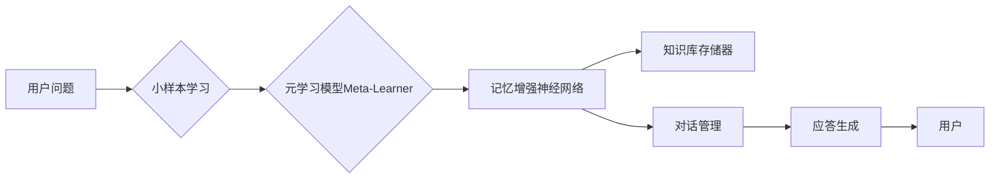

# 元学习实战：智能客服系统

## 1. 背景介绍

人工智能技术的飞速发展,正在深刻影响和改变着我们的生活。其中,智能客服系统作为人工智能落地应用的重要方向之一,受到了业界的广泛关注。传统的客服系统主要依赖人工座席,存在响应速度慢、服务质量不稳定、人力成本高等问题。而智能客服系统利用自然语言处理、知识图谱、机器学习等前沿技术,可以实现全天候、高质量、低成本的客户服务。

然而,智能客服系统的开发和实现并非易事。它需要融合多个AI领域的技术,并且要能够适应不同行业、不同场景的需求。其中一个关键挑战是,如何让智能客服具备快速学习和适应新知识、新场景的能力。这就需要用到元学习(Meta-Learning)的方法。

元学习,又称为"学会学习"(Learning to Learn),是机器学习领域的一个前沿方向。它的目标是训练出一个通用的学习器(Meta-Learner),使其能够在新的任务上,仅需少量训练样本,就可以快速学习和适应。将元学习应用到智能客服系统中,可以大幅提升系统对新知识、新场景的学习效率和适应能力,使其更加智能和实用。

本文将重点介绍如何利用元学习技术,构建一个高效、灵活、实用的智能客服系统。内容涵盖了元学习的核心概念、主要算法、关键技术、项目实践等方方面面。希望通过本文的分享,让大家对元学习在智能客服领域的应用有更深入的认识,并为相关的研究和实践提供参考。

## 2. 核心概念与联系

要理解元学习在智能客服系统中的应用,首先需要了解几个核心概念:

### 2.1 小样本学习(Few-Shot Learning)

小样本学习是指机器学习模型在仅有少量训练样本的情况下,依然能够进行有效学习的能力。这对智能客服系统非常重要,因为现实中很多新的客户问题和场景是长尾的,难以收集大量训练数据。通过小样本学习,智能客服可以在少量样本上进行快速学习和适应。

### 2.2 元学习(Meta-Learning) 

元学习是一种让机器学习模型具备"学会学习"能力的方法。传统的机器学习模型通常针对特定任务从头开始训练,难以适应新的任务。而元学习通过训练一个通用的学习器(Meta-Learner),可以在新任务上快速学习和适应。将元学习应用到智能客服,可以让系统具备持续学习、快速适应新知识的能力。

### 2.3 记忆增强神经网络(Memory-Augmented Neural Networks)

记忆增强神经网络是一类能够利用外部存储器进行读写的神经网络模型。它可以将大量知识存储在外部存储器中,并在需要时进行读取和利用。这种结构非常适合智能客服系统,可以将海量的知识库存入外部存储器,供智能客服在对话中查询和使用。

### 2.4 核心概念之间的联系

小样本学习、元学习和记忆增强神经网络三者之间是相辅相成的。元学习为小样本学习提供了一种有效的解决方案,使得模型可以在少量样本上快速学习。而记忆增强神经网络则为元学习模型提供了知识存储和检索的机制,让其可以利用大规模知识进行推理和决策。三者的结合,构成了智能客服系统技术架构的核心。

下图展示了智能客服系统的核心架构,体现了上述三个核心概念的结合与应用:



智能客服接收到用户问题后,首先利用小样本学习模块判断该问题是否可以在少量样本上进行学习。如果可以,则将样本输入给元学习模型进行快速训练和适应。元学习模型会利用记忆增强神经网络,将知识库存储器中的相关知识进行查询和匹配,并结合当前对话状态,生成合适的应答并反馈给用户。整个过程体现了小样本学习、元学习、记忆增强神经网络的有机结合与应用。

## 3. 核心算法原理与操作步骤

元学习的核心是学习一个通用的学习器(Meta-Learner),使其能够从一系列不同但相关的任务中学习,并能够在新任务上快速适应。目前主流的元学习算法包括:

### 3.1 基于度量的元学习(Metric-Based Meta-Learning)

基于度量的元学习通过学习一个度量函数,来度量不同样本之间的相似性。在智能客服场景下,可以学习一个语义相似度函数,判断新的客户问题与已有问题的相似程度,从而实现小样本学习和快速适应。

其主要步骤如下:
1. 构建episodic training set,每个episode包含一个support set和一个query set。support set包含少量已标注样本,query set包含需要预测的样本。
2. 训练元学习模型,使其能够从support set中快速学习,并在query set上进行预测。损失函数通常基于query set上的预测效果。
3. 在新任务上,利用少量标注样本作为support set,对元学习模型进行微调,使其适应新任务。
4. 利用微调后的元学习模型对新任务的query set进行预测。

### 3.2 基于优化的元学习(Optimization-Based Meta-Learning) 

基于优化的元学习通过学习一个优化器(Optimizer),来优化模型在新任务上的训练过程。比较典型的是MAML(Model-Agnostic Meta-Learning)算法。在智能客服场景下,可以利用MAML学习一个对话模型更新的优化策略,使得模型能够在新场景下快速适应。

其主要步骤如下:
1. 构建多个不同但相关的对话任务,每个任务包含一个support set和一个query set。
2. 在每个任务的support set上,利用当前模型参数进行几步梯度下降,得到任务专属参数。
3. 在每个任务的query set上,用任务专属参数计算损失,并对原始模型参数进行二次梯度传播和更新。
4. 在新的对话任务上,利用原始模型参数在support set上进行几步梯度下降,得到适应后的任务专属参数。
5. 用任务专属参数对新任务的query set进行预测。

### 3.3 基于模型的元学习(Model-Based Meta-Learning)

基于模型的元学习通过引入一个外部记忆模块,来快速存储和提取与新任务相关的知识。典型的如SNAIL(A Simple Neural Attentive Meta-Learner)算法。在智能客服场景下,可以利用SNAIL构建一个知识记忆模块,动态存储和检索与当前对话相关的知识。

其主要步骤如下:
1. 构建多个不同但相关的对话任务,每个任务包含一系列对话样本。
2. 训练一个带有外部记忆模块的元学习模型,使其能够在对话过程中动态存储和提取相关知识。
3. 在新的对话任务中,利用少量对话样本微调元学习模型,并将新任务相关知识存入外部记忆模块。
4. 在新对话中,元学习模型可以从外部记忆模块中提取相关知识,辅助对话决策。

## 4. 数学模型与公式详解

为了更好地理解元学习算法的原理,这里我们以MAML为例,对其数学模型进行详细推导和说明。

### 4.1 问题定义

假设我们有一组不同但相关的任务$\{\mathcal{T}_1, \mathcal{T}_2, ..., \mathcal{T}_n\}$,每个任务$\mathcal{T}_i$都有自己的数据分布$D_i$。我们的目标是训练一个模型$f_\theta$,使其能够在每个任务上都有好的性能。这里$\theta$代表模型的参数。

### 4.2 任务内训练(Inner Loop)

对于每个任务$\mathcal{T}_i$,我们从其数据分布$D_i$中采样一个support set $\mathcal{S}_i$和一个query set $\mathcal{Q}_i$。在support set上,我们对模型进行$k$步梯度下降(通常$k$取1或者2),得到任务专属参数$\theta_i'$:

$$
\theta_i' = \theta - \alpha \nabla_\theta \mathcal{L}_{\mathcal{S}_i}(f_\theta) 
$$

其中$\alpha$是学习率,$\mathcal{L}_{\mathcal{S}_i}$是在support set $\mathcal{S}_i$上的损失函数。

### 4.3 任务间训练(Outer Loop)

在得到每个任务的专属参数$\theta_i'$后,我们在对应的query set $\mathcal{Q}_i$上计算损失,并对原始参数$\theta$进行二次梯度传播和更新:

$$
\theta = \theta - \beta \nabla_\theta \sum_{\mathcal{T}_i \sim p(\mathcal{T})} \mathcal{L}_{\mathcal{Q}_i}(f_{\theta_i'})
$$

其中$\beta$是元学习的学习率,$p(\mathcal{T})$是任务分布。这一步可以理解为在所有任务上进行联合优化,使得初始参数$\theta$能够在不同任务上都具有良好的适应能力。

### 4.4 新任务上的快速适应

在新的任务$\mathcal{T}_{new}$上,我们利用原始参数$\theta$在其support set $\mathcal{S}_{new}$上进行$k$步梯度下降,得到适应后的任务专属参数$\theta_{new}'$:

$$
\theta_{new}' = \theta - \alpha \nabla_\theta \mathcal{L}_{\mathcal{S}_{new}}(f_\theta)
$$

然后用$\theta_{new}'$对query set $\mathcal{Q}_{new}$进行预测。

可以看到,MAML通过两层优化(内层任务内优化+外层任务间优化)实现了元学习。内层优化让模型在每个任务上都能快速适应,外层优化让模型初始参数具备跨任务的泛化能力。这使得MAML可以在新任务上仅需少量样本就实现快速学习。

## 5. 项目实践：代码实例与详解

下面我们通过一个简单的代码实例,来演示如何用PyTorch实现MAML算法,并应用到智能客服系统的意图识别任务中。

### 5.1 数据准备

首先我们需要准备意图识别的数据集。这里我们假设有多个不同领域的意图识别任务,每个任务包含一些意图类别和对应的用户问句。我们将每个任务的数据划分为support set和query set,模拟小样本学习的场景。

```python
class IntentDataset(Dataset):
    def __init__(self, data, num_classes, num_support, num_query):
        self.data = data
        self.num_classes = num_classes
        self.num_support = num_support
        self.num_query = num_query

    def __getitem__(self, index):
        # 从每个任务中采样support set和query set
        task_data = self.data[index]
        support_data = []
        query_data = []
        for i in range(self.num_classes):
            indices = np.where(task_data["intent"] == i)[0]
            np.random.shuffle(indices)
            support_data.append(task_data["text"][indices[:self.num_support]])
            query_data.append(task_data["text"][indices[self.num_support:self.num_support+self.num_query]])
        support_data = np.concatenate(support_data)
        query_data = np.concatenate(query_data)
        support_label = np.repeat(np.arange(self.num_classes), self.num_support)
        query_label = np.repeat(np.arange(self.num_classes), self.num_query)
        return support_data, support_label, query_data, query_label

    def __len__(self):
        return len(self.data)
```

### 5.2 模型定义

接下来我们定义意图识别模型。这里我们使用一个简单的TextCNN作为分类器。模型的输入是用户问句,输出是意图类别的概率分布。

```python
class TextCNN(nn.Module):
    def __init__(