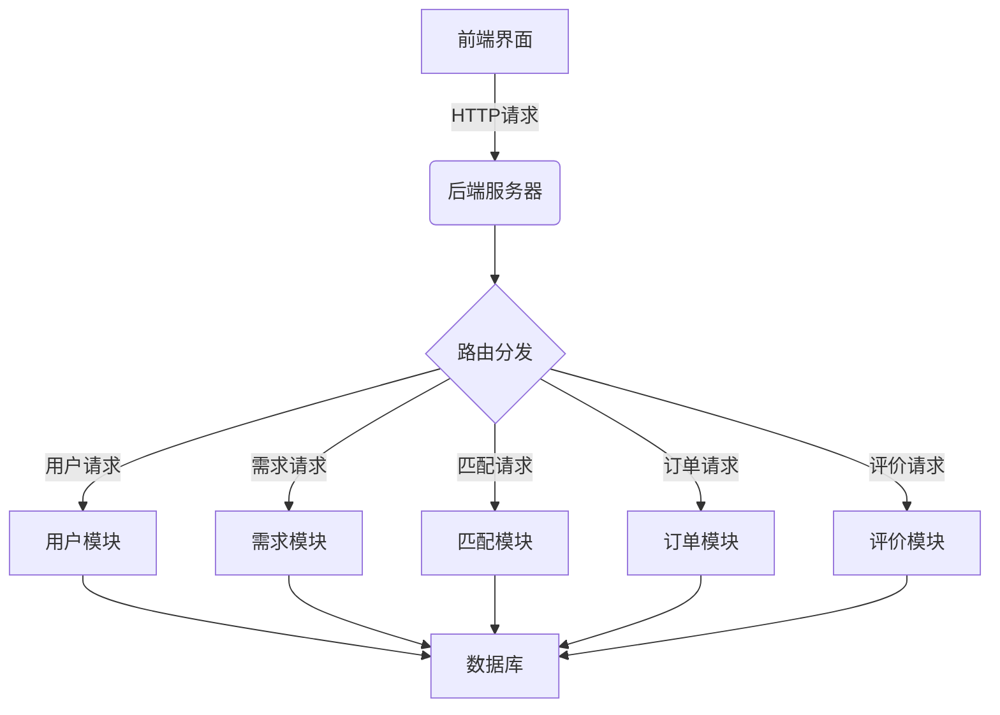

# 兼职中介管理系统详细设计与具体代码实现

## 1.背景介绍

随着互联网经济的快速发展和共享经济模式的兴起,兼职工作已成为许多人赚取额外收入的重要途径。然而,传统的线下寻找兼职工作的方式存在诸多不便,比如信息不对称、缺乏监管等问题。因此,开发一个高效便捷的兼职中介管理系统就显得尤为重要。

兼职中介管理系统旨在为求职者和雇主搭建一个高效透明的平台,实现供需双方的无缝对接。系统能够精准匹配双方需求,并为整个过程提供全程监督和服务保障。通过系统化的管理,可以极大提高兼职工作的效率,保护双方的合法权益。

## 2.核心概念与联系

### 2.1 用户角色

系统主要包括三种用户角色:求职者(Employee)、雇主(Employer)和管理员(Admin)。

- 求职者:可以在系统中发布自己的技能和工作意向,并申请合适的兼职工作机会。
- 雇主:可以在系统中发布招聘需求,并从合格的求职者中选择合适的人选。
- 管理员:负责维护系统的正常运行,处理异常情况,并对用户行为进行审核和监管。

### 2.2 核心流程

系统的核心流程包括:发布需求、发布技能、匹配对接、订单管理和评价反馈等环节。

1. 发布需求:雇主发布招聘需求,包括工作内容、时间地点、薪酬待遇等信息。
2. 发布技能:求职者发布自己的技能和工作意向。
3. 匹配对接:系统根据双方的需求和技能进行智能匹配,为双方推荐合适的对象。
4. 订单管理:双方确认后可以签订订单,系统将全程监督订单的执行情况。
5. 评价反馈:工作完成后,双方可以对彼此进行评价,系统将评价记录存档。

### 2.3 系统架构

系统采用前后端分离的架构设计,前端基于 React 框架开发,后端使用 Spring Boot 框架搭建 RESTful API,数据库选用 MySQL。系统核心模块包括:用户模块、需求模块、匹配模块、订单模块和评价模块等。



## 3.核心算法原理具体操作步骤  

### 3.1 求职者-雇主匹配算法

匹配算法是系统的核心部分,它决定了匹配的精准度和效率。我们采用基于内容的推荐算法,根据双方的技能需求、地理位置、薪酬预期等因素计算相似度分数,从而实现精准匹配。

算法步骤如下:

1. 数据预处理:对用户发布的技能需求等文本数据进行分词、去停用词等预处理。
2. 特征提取:将预处理后的文本数据转化为向量形式,作为用户的特征向量。
3. 相似度计算:采用余弦相似度或其他相似度度量,计算求职者和雇主之间的相似分数。
4. 排序输出:根据相似度分数对候选对象进行排序,输出最匹配的结果。

```python
import numpy as np
from sklearn.feature_extraction.text import TfidfVectorizer
from sklearn.metrics.pairwise import cosine_similarity

# 数据预处理和特征提取
def preprocess_text(text):
    # 分词、去停用词等预处理
    ...
    return processed_text

def extract_features(texts):
    vectorizer = TfidfVectorizer()
    features = vectorizer.fit_transform(texts)
    return features

# 相似度计算和匹配
def match_candidates(employee_texts, employer_texts):
    employee_features = extract_features(employee_texts)
    employer_features = extract_features(employer_texts)
    
    similarity_scores = cosine_similarity(employee_features, employer_features)
    
    matched_pairs = []
    for i, employee_score in enumerate(similarity_scores):
        sorted_indices = np.argsort(employee_score)[::-1]
        for j in sorted_indices:
            if employee_score[j] > threshold:
                matched_pairs.append((i, j, employee_score[j]))
    
    return sorted(matched_pairs, key=lambda x: x[2], reverse=True)
```

### 3.2 地理位置匹配算法

除了技能需求匹配,地理位置也是一个重要因素。我们采用基于距离的匹配算法,计算求职者和雇主之间的地理距离,在一定范围内进行匹配。

算法步骤如下:

1. 获取用户地理坐标:通过地理编码服务将用户输入的地址转换为经纬度坐标。
2. 计算距离:使用大圆距离公式或其他距离计算方法,计算两个坐标点之间的距离。
3. 距离过滤:设置一个距离阈值,只保留距离在阈值范围内的候选对象。
4. 综合打分:将技能匹配分数和距离分数加权求和,得到综合匹配分数。

```python
from math import radians, cos, sin, asin, sqrt

# 距离计算
def haversine(lon1, lat1, lon2, lat2):
    lon1, lat1, lon2, lat2 = map(radians, [lon1, lat1, lon2, lat2])
    dlon = lon2 - lon1
    dlat = lat2 - lat1
    a = sin(dlat/2)**2 + cos(lat1) * cos(lat2) * sin(dlon/2)**2
    c = 2 * asin(sqrt(a))
    r = 6371  # 地球平均半径(km)
    return c * r

# 地理位置匹配
def location_match(employee_coords, employer_coords, distance_threshold):
    matched_pairs = []
    for i, emp_coord in enumerate(employee_coords):
        for j, er_coord in enumerate(employer_coords):
            distance = haversine(emp_coord[0], emp_coord[1], er_coord[0], er_coord[1])
            if distance <= distance_threshold:
                matched_pairs.append((i, j, distance))
    return matched_pairs
```

### 3.3 综合匹配算法

最终的匹配结果需要综合考虑技能匹配分数和地理位置距离分数,我们可以给两个分数赋予不同的权重,然后加权求和得到综合匹配分数。

```python
# 综合匹配算法
def comprehensive_match(skill_matches, location_matches, skill_weight, location_weight):
    comprehensive_scores = []
    for sm in skill_matches:
        emp_idx, er_idx, skill_score = sm
        for lm in location_matches:
            if lm[0] == emp_idx and lm[1] == er_idx:
                distance_score = 1 / (1 + lm[2])  # 距离分数
                comprehensive_score = skill_weight * skill_score + location_weight * distance_score
                comprehensive_scores.append((emp_idx, er_idx, comprehensive_score))
    
    return sorted(comprehensive_scores, key=lambda x: x[2], reverse=True)
```

综合匹配算法将技能匹配分数和地理位置距离分数进行加权求和,从而得到最终的综合匹配分数。我们可以根据实际需求调整两个分数的权重,以达到最优的匹配效果。

## 4.数学模型和公式详细讲解举例说明

### 4.1 TF-IDF模型

在文本匹配算法中,我们使用了 TF-IDF 模型将文本转换为特征向量。TF-IDF 是一种统计模型,用于评估一个词对于一个文档集或一个语料库中的其他文档的重要程度。

TF-IDF 由两部分组成:词频 (Term Frequency, TF) 和逆文档频率 (Inverse Document Frequency, IDF)。

**词频 TF**:某个词在文档中出现的次数,用于评估该词对于文档的重要程度。

$$ TF(t,d) = \frac{n_{t,d}}{\sum_{t' \in d} n_{t',d}} $$

其中 $n_{t,d}$ 表示词 $t$ 在文档 $d$ 中出现的次数,分母是文档 $d$ 中所有词的总数。

**逆文档频率 IDF**:某个词在整个语料库中出现的频率,用于评估该词的普遍重要性。

$$ IDF(t,D) = \log \frac{|D|}{|\{d \in D: t \in d\}|} $$

其中 $|D|$ 表示语料库中文档的总数,$|\{d \in D: t \in d\}|$ 表示包含词 $t$ 的文档数量。

**TF-IDF**:将 TF 和 IDF 相乘,得到词 $t$ 在文档 $d$ 中的 TF-IDF 权重:

$$ \text{TF-IDF}(t,d,D) = TF(t,d) \times IDF(t,D) $$

TF-IDF 模型能够很好地平衡词频和逆文档频率,从而提高文本匹配的准确性。

### 4.2 余弦相似度

在计算文本相似度时,我们使用了余弦相似度作为相似度度量。余弦相似度是一种常用的评估两个非零向量之间夹角余弦值的方法,可以有效衡量两个向量的相似程度。

设有两个向量 $\vec{a}$ 和 $\vec{b}$,它们的余弦相似度定义为:

$$ \text{cosine\_similarity}(\vec{a}, \vec{b}) = \cos(\theta) = \frac{\vec{a} \cdot \vec{b}}{||\vec{a}|| \times ||\vec{b}||} = \frac{\sum_{i=1}^{n} a_i b_i}{\sqrt{\sum_{i=1}^{n} a_i^2} \sqrt{\sum_{i=1}^{n} b_i^2}} $$

其中 $\theta$ 是两个向量的夹角,分子是两个向量的点积,分母是两个向量的模长的乘积。

余弦相似度的取值范围是 $[-1, 1]$,当两个向量完全相同时,余弦相似度为 1;当两个向量完全相反时,余弦相似度为 -1;当两个向量orthogonal正交时,余弦相似度为 0。

在文本匹配中,我们将文本转换为 TF-IDF 向量,然后计算两个文本向量之间的余弦相似度,作为它们相似程度的评估指标。

### 4.3 大圆距离公式

在地理位置匹配算法中,我们使用了大圆距离公式来计算两个坐标点之间的距离。大圆距离公式是计算球面上两点之间最短距离的方法,适用于地理坐标系统。

设有两个坐标点 $(lon_1, lat_1)$ 和 $(lon_2, lat_2)$,它们的大圆距离公式如下:

$$
d = R \times c
$$

其中 $R$ 是地球的平均半径 (约 6371 km),而 $c$ 是由下式计算得到的:

$$
c = 2 \times \arcsin\left(\sqrt{\sin^2\left(\frac{lat_2 - lat_1}{2}\right) + \cos(lat_1) \times \cos(lat_2) \times \sin^2\left(\frac{lon_2 - lon_1}{2}\right)}\right)
$$

这个公式利用了三角函数和球面三角学的原理,可以准确计算出两个坐标点之间的大圆距离。在地理位置匹配中,我们可以设置一个距离阈值,只保留距离在阈值范围内的候选对象,从而提高匹配的精准度。

## 5.项目实践:代码实例和详细解释说明

### 5.1 系统架构和技术栈

我们采用了前后端分离的架构设计,前端使用 React 框架开发,后端使用 Spring Boot 框架搭建 RESTful API,数据库选用 MySQL。

前端技术栈:

- React: 用于构建用户界面
- React Router: 前端路由管理
- Ant Design: UI 组件库
- Axios: 发送异步 HTTP 请求

后端技术栈:

- Spring Boot: 快速构建应用程序
- Spring Data JPA: 对象关系映射
- Spring Security: 认证和授权
- MySQL: 关系型数据库

### 5.2 数据库设计

```sql
CREATE TABLE `user` (
  `id` int(11) NOT NULL AUTO_INCREMENT,
  `username` varchar(50) NOT NULL,
  `password` varchar(100) NOT NULL,
  `role` varchar(20) NOT