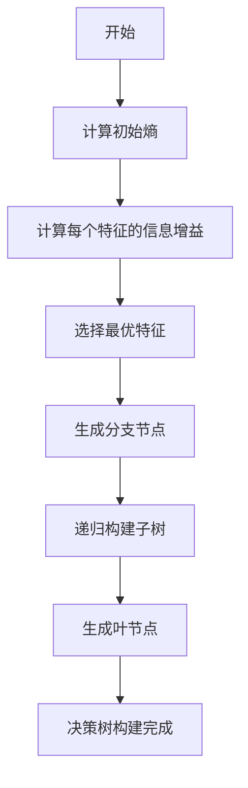

# 决策树 (Decision Tree)

## 1. 背景介绍

决策树是一种监督式机器学习算法,广泛应用于分类和回归问题。它以树状结构的形式对数据进行建模,可以直观地展示决策过程,易于理解和解释。决策树通过根据特征值将样本划分到不同的叶子节点,从而实现对目标变量的预测。

决策树的优势在于:

1. **可解释性强**: 树状结构清晰直观,决策路径容易理解。
2. **无需数据预处理**: 能够处理数值型和类别型数据,无需进行归一化等预处理。
3. **鲁棒性好**: 不受异常值的影响,对缺失值也有较好的处理能力。
4. **并行化处理**: 树的构建过程可以很好地并行化,提高计算效率。

决策树在许多领域得到广泛应用,如金融风险评估、医疗诊断、客户关系管理等。

## 2. 核心概念与联系

### 2.1 决策树的构成

决策树由节点和边组成,包括以下几个基本概念:

- **根节点(Root Node)**: 整个树的起点。
- **内部节点(Internal Node)**: 用于对样本数据进行划分的节点,每个内部节点对应一个特征。
- **分支(Branch)**: 连接父节点和子节点的边,代表对应特征取值的情况。
- **叶节点(Leaf Node)**: 树的终止节点,代表了对目标变量的预测结果。

### 2.2 熵和信息增益

熵(Entropy)是度量数据纯度的指标,用于评估数据集的无序程度。对于二分类问题,熵的计算公式如下:

$$
\text{Entropy}(D) = -\sum_{i=1}^{c}p_i\log_2p_i
$$

其中 $c$ 是类别数, $p_i$ 是第 $i$ 类样本占比。熵越大,数据越混乱。

信息增益(Information Gain)是决策树选择最优特征的标准,它衡量了使用某个特征进行划分后,数据的无序程度减少了多少。信息增益的计算公式为:

$$
\text{Gain}(D, a) = \text{Entropy}(D) - \sum_{v=1}^{V}\frac{|D^v|}{|D|}\text{Entropy}(D^v)
$$

其中 $a$ 是特征, $V$ 是特征 $a$ 的取值集合, $D^v$ 是特征 $a$ 取值为 $v$ 的子集。信息增益越大,说明使用该特征进行划分后,纯度提高得越多。

### 2.3 决策树的生成

决策树的生成过程是一个递归的过程,主要包括以下步骤:

1. 从根节点开始,计算所有特征的信息增益。
2. 选择信息增益最大的特征作为当前节点。
3. 根据该特征的取值,将数据集划分为若干子集。
4. 对每个子集递归调用步骤1-3,构建子树。
5. 直到满足停止条件(如所有样本属于同一类别或没有剩余特征可供划分),将该节点标记为叶节点。

### 2.4 剪枝策略

为了防止决策树过拟合,通常需要采取剪枝(Pruning)策略。常见的剪枝方法包括:

- **预剪枝(Pre-pruning)**: 在生成树的过程中,根据某些准则终止分支的生长。
- **后剪枝(Post-pruning)**: 先生成一棵完整的决策树,然后根据验证集的表现,裁剪掉一些分支。

## 3. 核心算法原理具体操作步骤

以下是基于ID3算法构建决策树的具体步骤:

1. **计算初始熵**

   计算整个数据集的熵,作为基准熵。

2. **计算每个特征的信息增益**

   对于每个特征,计算其信息增益,即基准熵与按该特征划分后子集的熵之差。

3. **选择最优特征**

   选择信息增益最大的特征作为当前节点。

4. **生成分支节点**

   根据所选特征的不同取值,从当前节点生成子节点,构成树的分支。

5. **递归构建子树**

   对于每个子节点,重复步骤2-4,递归构建子树。

6. **生成叶节点**

   当满足停止条件时(如所有样本属于同一类别或没有剩余特征可供划分),将该节点标记为叶节点,并将其值设置为数据集中样本最多的类别。

7. **决策树构建完成**

以上步骤重复执行,直到所有分支节点都变成叶节点,整棵决策树构建完成。



## 4. 数学模型和公式详细讲解举例说明

### 4.1 熵的计算

假设我们有一个二分类数据集 $D$,包含 $p$ 个正例和 $n$ 个反例,则数据集 $D$ 的熵可以计算如下:

$$
\begin{aligned}
\text{Entropy}(D) &= -\frac{p}{p+n}\log_2\frac{p}{p+n} - \frac{n}{p+n}\log_2\frac{n}{p+n} \\
&= -\left(\frac{p}{p+n}\log_2\frac{p}{p+n} + \frac{n}{p+n}\log_2\frac{n}{p+n}\right)
\end{aligned}
$$

例如,假设数据集 $D$ 包含 6 个正例和 4 个反例,则熵为:

$$
\text{Entropy}(D) = -\left(\frac{6}{10}\log_2\frac{6}{10} + \frac{4}{10}\log_2\frac{4}{10}\right) \approx 0.971
$$

### 4.2 信息增益的计算

假设我们有一个特征 $A$,它有 $n$ 个不同的取值 $\{a_1, a_2, \dots, a_n\}$,对应的数据子集为 $\{D_1, D_2, \dots, D_n\}$,其中 $D_i$ 表示特征 $A$ 取值为 $a_i$ 的子集。则特征 $A$ 的信息增益可以计算如下:

$$
\text{Gain}(D, A) = \text{Entropy}(D) - \sum_{i=1}^{n}\frac{|D_i|}{|D|}\text{Entropy}(D_i)
$$

其中 $|D_i|$ 表示子集 $D_i$ 的样本数, $|D|$ 表示整个数据集 $D$ 的样本数。

例如,假设我们有一个天气数据集,包含 4 个特征:阴天(Overcast)、温度(Temperature)、湿度(Humidity)和是否适合打球(PlayTennis)。现在我们计算特征"温度"的信息增益:

- 数据集 $D$ 包含 14 个样本,其中 9 个正例(适合打球)和 5 个反例(不适合打球)。
- 特征"温度"有 3 个取值:高(High)、中(Medium)和低(Low),对应的子集分别为 $D_1$、$D_2$ 和 $D_3$。
- $D_1$ 包含 2 个正例和 3 个反例,熵为 $\text{Entropy}(D_1) \approx 0.971$。
- $D_2$ 包含 4 个正例和 0 个反例,熵为 $\text{Entropy}(D_2) = 0$。
- $D_3$ 包含 3 个正例和 2 个反例,熵为 $\text{Entropy}(D_3) \approx 0.971$。

则特征"温度"的信息增益为:

$$
\begin{aligned}
\text{Gain}(D, \text{Temperature}) &= \text{Entropy}(D) - \frac{5}{14}\text{Entropy}(D_1) - \frac{4}{14}\text{Entropy}(D_2) - \frac{5}{14}\text{Entropy}(D_3) \\
&\approx 0.971 - \frac{5}{14}\times 0.971 - \frac{4}{14}\times 0 - \frac{5}{14}\times 0.971 \\
&\approx 0.247
\end{aligned}
$$

通过计算每个特征的信息增益,我们可以选择增益最大的特征作为当前节点,进行数据划分。

## 5. 项目实践: 代码实例和详细解释说明

以下是使用Python中的scikit-learn库构建决策树的代码示例:

```python
from sklearn.datasets import load_iris
from sklearn.tree import DecisionTreeClassifier
from sklearn.model_selection import train_test_split
from sklearn.metrics import accuracy_score
import matplotlib.pyplot as plt

# 加载iris数据集
iris = load_iris()
X, y = iris.data, iris.target

# 拆分训练集和测试集
X_train, X_test, y_train, y_test = train_test_split(X, y, test_size=0.3, random_state=42)

# 创建决策树分类器
clf = DecisionTreeClassifier(criterion='entropy', max_depth=3)

# 训练模型
clf.fit(X_train, y_train)

# 在测试集上进行预测
y_pred = clf.predict(X_test)

# 计算准确率
accuracy = accuracy_score(y_test, y_pred)
print(f"Accuracy: {accuracy:.2f}")

# 可视化决策树
plt.figure(figsize=(10, 8))
plot_tree = plt.subplot()
iris.feature_names = ['Sepal Length', 'Sepal Width', 'Petal Length', 'Petal Width']
plot_tree = tree.plot_tree(clf, feature_names=iris.feature_names, filled=True, fontsize=8)
```

代码解释:

1. 首先导入必要的库和iris数据集。
2. 将数据集拆分为训练集和测试集。
3. 创建决策树分类器对象,设置熵作为信息增益的计算标准,最大深度为3。
4. 使用`fit`方法在训练集上训练决策树模型。
5. 在测试集上进行预测,并计算预测准确率。
6. 使用`matplotlib`库可视化构建的决策树。

上述代码展示了如何使用scikit-learn库快速构建和训练决策树模型。通过调整参数,如`max_depth`(最大深度)、`min_samples_split`(内部节点最小样本数)等,可以控制决策树的生长,防止过拟合。

## 6. 实际应用场景

决策树在各个领域都有广泛的应用,以下是一些典型的应用场景:

1. **信用风险评估**: 银行和金融机构使用决策树来评估客户的信用风险,决定是否批准贷款或信用卡申请。
2. **医疗诊断**: 通过症状和检查结果构建决策树,帮助医生诊断疾病。
3. **垃圾邮件过滤**: 根据邮件的主题、发件人等特征,构建决策树模型来识别垃圾邮件。
4. **客户关系管理(CRM)**: 通过分析客户的购买行为和人口统计数据,构建决策树来预测客户流失风险,并制定相应的营销策略。
5. **天气预报**: 根据气压、温度、湿度等气象数据,构建决策树模型来预测天气情况。
6. **欺诈检测**: 在金融、保险等领域,利用决策树模型检测异常交易或索赔,识别潜在的欺诈行为。

总的来说,决策树擅长处理具有分层结构的决策问题,能够提供清晰的决策路径,因此在各个领域都有广泛的应用前景。

## 7. 工具和资源推荐

以下是一些常用的决策树相关工具和资源:

1. **Python库**:
   - scikit-learn: 机器学习库,提供决策树算法的实现。
   - XGBoost: gradient boosting库,支持决策树模型。
   - LightGBM: 另一个高效的gradient boosting库。

2. **R包**:
   - rpart: 构建决策树和回归树的R包。
   - party: 基于条件推理树的R包。
   - C5.0: 商业决策树算法的R接口。

3. **可视化工具**:
   - Orange: 开源的数据可视化和机器学习工具,支持决策树可视化。
   - Weka: 著名的机器学习工具集,包含决策树可视化功能。

4. **在线课程**:
   - Coursera上的"机器学习"课程