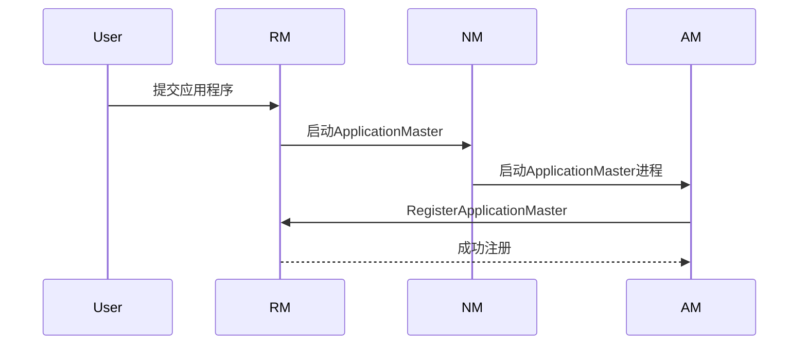
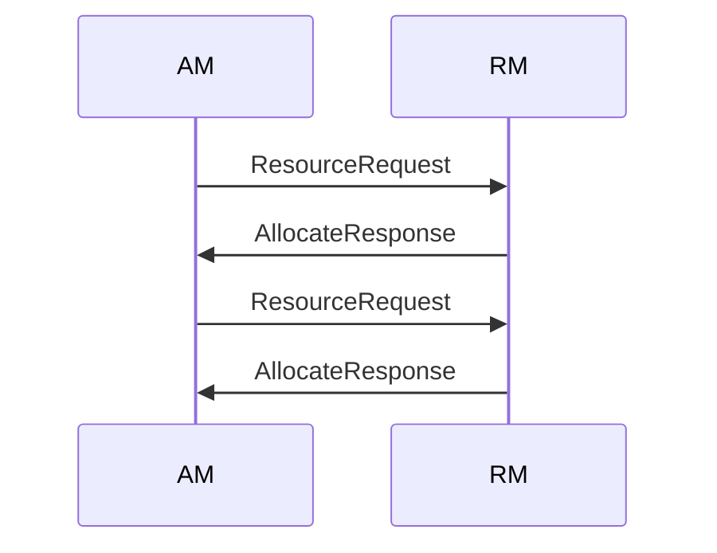
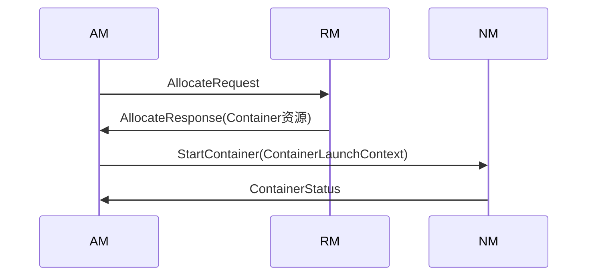
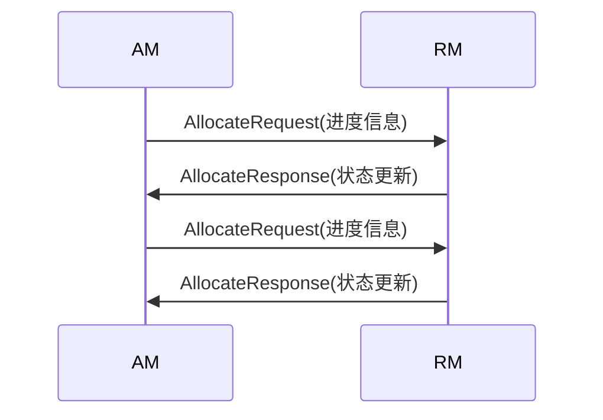
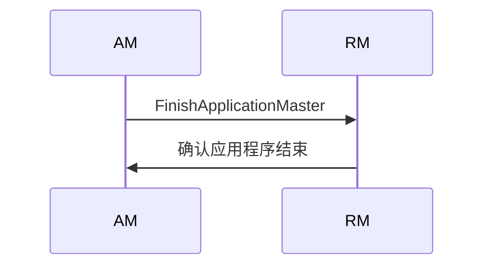

# 剖析ApplicationMaster与YARN的交互机制

## 1.背景介绍

Apache Hadoop YARN(Yet Another Resource Negotiator)是Hadoop 2.x版本中引入的全新的资源管理和任务调度框架,旨在解决Hadoop 1.x版本中JobTracker单点故障、资源利用率低下等问题。YARN将资源管理和作业调度/监控的功能拆分到独立的ResourceManager和ApplicationMaster进程中,提高了系统的伸缩性和可用性。

ApplicationMaster(AM)是YARN中管理和监控应用程序执行的关键组件。每个应用程序在YARN上运行时,都会启动一个AM进程,负责向ResourceManager申请资源、启动和监控任务、处理任务失败等工作。ApplicationMaster与YARN资源管理器ResourceManager之间的交互机制是整个YARN框架的核心,直接影响着应用程序的执行效率和可靠性。

### 1.1 YARN架构概述

YARN架构主要由ResourceManager、ApplicationMaster、NodeManager和Container四个核心组件组成:

- **ResourceManager(RM)**: 集群资源管理和调度器,负责处理来自ApplicationMaster的资源请求,并将可用资源分配给各个应用程序。
- **ApplicationMaster(AM)**: 应用程序的"大脑",负责向RM申请资源、启动任务、监控任务执行、处理任务失败等。
- **NodeManager(NM)**: 运行在每个节点上的资源和容器管理器,负责启动/停止Container,监控资源使用情况并汇报给RM。
- **Container**: YARN中表示资源的基本单位,包括CPU、内存等资源,用于运行应用程序的任务。

### 1.2 ApplicationMaster作用

ApplicationMaster在YARN中扮演着至关重要的角色,主要职责包括:

1. **资源协商**: 向ResourceManager申请运行应用程序所需的资源(CPU、内存等)。
2. **任务调度**: 根据申请到的资源,将任务分发到各个Container中执行。
3. **任务监控**: 监控任务的执行状态,处理任务失败等异常情况。
4. **进度/状态报告**: 周期性地向ResourceManager汇报应用程序的运行进度和状态。

ApplicationMaster的高效稳定运行对整个应用程序的执行效率和可靠性至关重要。本文将重点剖析ApplicationMaster与YARN ResourceManager之间的交互机制,揭示其内部运行原理。

## 2.核心概念与联系

为了深入理解ApplicationMaster与YARN的交互机制,我们需要先了解以下几个核心概念:

### 2.1 ApplicationId

ApplicationId是YARN中用于唯一标识一个应用程序的ID。当用户向YARN提交一个新的应用程序时,ResourceManager会为该应用程序分配一个唯一的ApplicationId。ApplicationId由以下三部分组成:

```
ApplicationId = ClusterTimestamp + IncarnatedId + ResourceManagerId
```

- **ClusterTimestamp**: 应用程序提交时的时间戳,用于标识提交时间。
- **IncarnatedId**: 资源管理器重启后递增的计数器,用于保证ID的唯一性。
- **ResourceManagerId**: ResourceManager实例的ID,用于区分不同的ResourceManager。

ApplicationId在整个应用程序生命周期中都会被使用,是ApplicationMaster与YARN交互的基础。

### 2.2 ApplicationAttemptId

ApplicationAttemptId用于标识一个应用程序的尝试(Attempt)。每个应用程序可能会尝试多次执行,每次尝试都会分配一个唯一的ApplicationAttemptId。ApplicationAttemptId由ApplicationId和AttemptId两部分组成:

```
ApplicationAttemptId = ApplicationId + AttemptId
```

- **ApplicationId**: 应用程序的唯一标识符。
- **AttemptId**: 在同一个ApplicationId下的尝试计数器。

ApplicationAttemptId用于标识ApplicationMaster实例,确保每个ApplicationMaster实例都是唯一的。

### 2.3 ContainerId

ContainerId用于唯一标识一个Container实例。Container是YARN中表示资源的基本单位,ApplicationMaster需要向ResourceManager申请Container资源,然后将任务分发到这些Container中执行。ContainerId由以下三部分组成:

```
ContainerId = ApplicationAttemptId + ContainerIdCounter
```

- **ApplicationAttemptId**: 标识应用程序的尝试。
- **ContainerIdCounter**: 在同一个ApplicationAttempt下的Container计数器。

ContainerId确保了每个Container实例在整个集群中都是唯一的,ApplicationMaster可以根据ContainerId来监控和管理任务的执行情况。

### 2.4 资源模型

YARN采用了一种通用的资源模型,将集群中的资源抽象为多个维度,如CPU、内存等。每个Container都会被分配一定量的资源,ApplicationMaster需要根据应用程序的需求向ResourceManager申请合适的资源。

资源模型使YARN能够统一管理和调度各种类型的资源,提高了资源利用率和系统的可扩展性。ApplicationMaster需要根据应用程序的特点,合理地向ResourceManager请求和利用资源。

## 3.核心算法原理具体操作步骤

ApplicationMaster与YARN ResourceManager之间的交互遵循一定的协议和流程,下面我们将详细分析这个交互过程的核心算法原理和具体操作步骤。

### 3.1 ApplicationMaster启动

当用户向YARN提交一个新的应用程序时,ResourceManager会为该应用程序分配一个ApplicationId,并选择一个NodeManager节点来启动ApplicationMaster进程。ApplicationMaster启动后,会向ResourceManager发送RegisterApplicationMaster请求,注册自己的ApplicationAttemptId。



### 3.2 资源申请与分配

ApplicationMaster启动后,需要向ResourceManager申请运行任务所需的资源(CPU、内存等)。ApplicationMaster会根据应用程序的需求,周期性地向ResourceManager发送ResourceRequest请求,申请一定数量的Container资源。

ResourceManager会根据整个集群的资源情况,按照特定的调度策略(如公平调度、容量调度等),为ApplicationMaster分配可用的资源。当有资源可用时,ResourceManager会向ApplicationMaster发送AllocateResponse响应,通知ApplicationMaster可用的资源情况。



### 3.3 任务分发与执行

ApplicationMaster获取到ResourceManager分配的Container资源后,就可以将任务分发到这些Container中执行了。ApplicationMaster会为每个任务生成一个ContainerLaunchContext,包含任务运行所需的环境变量、命令等信息,然后通过StartContainer请求将任务分发到对应的NodeManager节点上。

NodeManager会根据ContainerLaunchContext中的信息,启动一个新的Container,并在其中运行任务。ApplicationMaster可以通过ContainerStatus响应获取任务的执行状态,并根据需要进行相应的处理(如重试失败任务等)。



### 3.4 进度/状态报告

在应用程序执行的过程中,ApplicationMaster需要周期性地向ResourceManager汇报应用程序的运行进度和状态。ApplicationMaster会通过AllocateRequest请求携带进度信息,ResourceManager则通过AllocateResponse响应返回相关的指令和状态更新。

这种进度/状态报告机制使得ResourceManager能够实时监控应用程序的执行情况,并根据需要采取相应的操作,如杀死失败的ApplicationMaster、重新启动ApplicationMaster等。



### 3.5 应用程序完成

当应用程序执行完成后,ApplicationMaster会向ResourceManager发送FinishApplicationMaster请求,通知ResourceManager应用程序已经结束。ResourceManager会回收应用程序占用的资源,并将应用程序的最终状态持久化到HDFS上。

如果应用程序执行失败,ResourceManager可以根据配置的重试策略,重新启动一个新的ApplicationMaster实例,尝试重新执行应用程序。



## 4.数学模型和公式详细讲解举例说明

在YARN中,资源调度和分配是一个复杂的优化问题,需要考虑多个目标和约束条件。我们可以将这个问题建模为一个线性规划问题,使用数学模型和公式来描述和求解。

### 4.1 符号说明

- $n$: 集群中节点的数量
- $m$: 应用程序的数量
- $r_i$: 第$i$个节点的可用资源量(CPU、内存等)
- $d_j$: 第$j$个应用程序对资源的需求量
- $x_{ij}$: 决策变量,表示分配给第$j$个应用程序在第$i$个节点上的资源量
- $C$: 集群的总资源量

### 4.2 目标函数

我们的目标是最大化集群资源的利用率,即最小化未使用的资源量。可以将目标函数建模为:

$$
\min \sum_{i=1}^{n}\left(r_i - \sum_{j=1}^{m}x_{ij}\right)
$$

### 4.3 约束条件

1. 每个应用程序的资源需求必须得到满足:

$$
\sum_{i=1}^{n}x_{ij} \geq d_j, \quad \forall j \in \{1, 2, \ldots, m\}
$$

2. 每个节点分配的资源不能超过其可用资源量:

$$
\sum_{j=1}^{m}x_{ij} \leq r_i, \quad \forall i \in \{1, 2, \ldots, n\}
$$

3. 集群的总资源分配量不能超过集群的总资源量:

$$
\sum_{i=1}^{n}\sum_{j=1}^{m}x_{ij} \leq C
$$

4. 非负约束:

$$
x_{ij} \geq 0, \quad \forall i \in \{1, 2, \ldots, n\}, \forall j \in \{1, 2, \ldots, m\}
$$

### 4.4 示例

假设我们有一个由4个节点组成的YARN集群,每个节点的可用资源量分别为(8 CPU, 16 GB)、(4 CPU, 8 GB)、(6 CPU, 12 GB)和(2 CPU, 4 GB)。现在有3个应用程序提交到集群,它们对资源的需求量分别为(6 CPU, 12 GB)、(4 CPU, 8 GB)和(2 CPU, 4 GB)。我们需要确定如何在集群中分配资源,以最大化资源利用率。

令决策变量$x_{ij}$表示分配给第$j$个应用程序在第$i$个节点上的资源量,我们可以构建如下线性规划模型:

目标函数:
$$
\min \left(8 - x_{11} - x_{12} - x_{13}\right) + \left(4 - x_{21} - x_{22} - x_{23}\right) + \left(6 - x_{31} - x_{32} - x_{33}\right) + \left(2 - x_{41} - x_{42} - x_{43}\right)
$$

约束条件:
$$
\begin{align*}
&x_{11} + x_{21} + x_{31} + x_{41} \geq 6 \\
&x_{12} + x_{22} + x_{32} + x_{42} \geq 4 \\
&x_{13} + x_{23} + x_{33} + x_{43} \geq 2 \\
&x_{11} + x_{12} + x_{13} \leq 8 \\
&x_{21} + x_{22} + x_{23} \leq 4 \\
&x_{31} + x_{32} + x_{33} \leq 6 \\
&x_{41} + x_{42} + x_{43} \leq 2 \\
&\sum_{i=1}^{4}\sum_{j=1}^{3}x_{ij} \leq 20 \\
&x_{ij} \geq 0, \quad \forall i \in \{1, 2, 3, 4\}, \forall j \in \{1, 2, 3\}
\end{align*}
$$

通过求解这个线性规划问题,我们