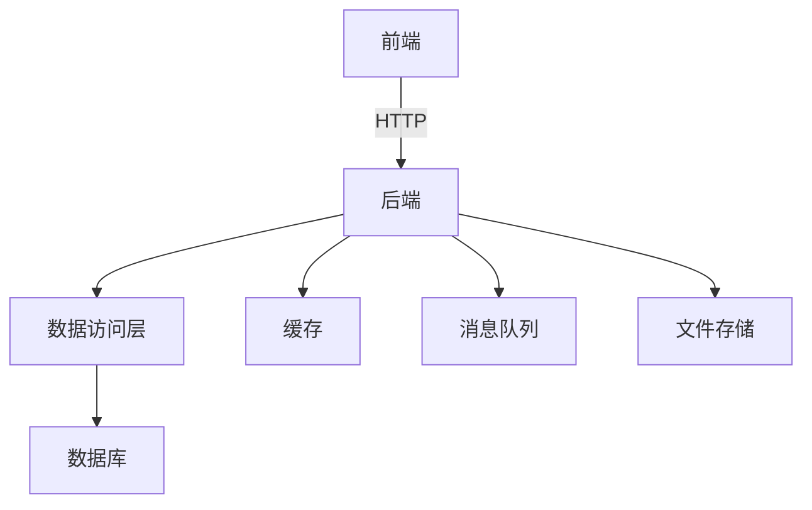

以下是标题为《办公管理系统详细设计与具体代码实现》的技术博客文章正文内容：

# 办公管理系统详细设计与具体代码实现

## 1. 背景介绍

### 1.1 办公管理系统概述

在当今快节奏的商业环境中，高效的办公管理对于企业的运营至关重要。办公管理系统旨在优化和自动化日常办公流程,提高工作效率,降低运营成本。它集成了多种功能模块,涵盖了文件管理、任务分配、审批流程、日程安排等多个方面,为企业提供了一站式的办公解决方案。

### 1.2 系统需求分析

在开发过程中,我们首先需要深入了解企业的具体需求,包括:

- 文件管理需求:支持多种文件格式上传、下载、预览、版本控制等功能。
- 任务管理需求:实现任务的创建、分配、跟踪、评审等全生命周期管理。
- 审批流程需求:自定义审批流程,支持多级审批、会签等复杂场景。
- 日程安排需求:提供日历视图,方便安排会议和个人日程。
- 权限管理需求:基于角色的访问控制,确保数据安全。

### 1.3 技术选型

基于上述需求,我们选择了以下技术栈:

- 前端: React + Redux + Ant Design
- 后端: Spring Boot + MyBatis
- 数据库: MySQL
- 缓存: Redis
- 消息队列: RabbitMQ
- 文件存储: FastDFS

这些技术在业界广泛使用,具有良好的生态支持和活跃的社区,能够满足系统的可扩展性和可维护性要求。

## 2. 核心概念与联系

### 2.1 系统架构概览

办公管理系统采用了经典的三层架构设计,包括:

1. 表现层(前端): 负责与用户交互,展示数据和接收用户输入。
2. 业务逻辑层(后端): 处理业务逻辑,实现系统功能。
3. 数据访问层: 与数据库进行交互,执行数据持久化操作。



### 2.2 核心概念解析

- **文档(Document)**: 表示各种格式的办公文件,如Word、Excel、PDF等。
- **任务(Task)**: 描述需要完成的工作项,包括标题、描述、截止日期等属性。
- **审批流程(Approval Process)**: 定义了文件或任务在获得批准之前需要经过的一系列步骤和参与者。
- **日程(Calendar)**: 用于安排和管理个人或团队的会议、活动等日程事项。
- **角色(Role)**: 定义了用户在系统中的权限和职责,如管理员、普通员工等。

这些概念相互关联,共同构建了办公管理系统的核心功能。

## 3. 核心算法原理具体操作步骤

### 3.1 文件版本控制算法

文件版本控制是文件管理模块的核心功能之一,它允许用户跟踪文件的变更历史,并在必要时回退到之前的版本。我们采用了一种基于内容哈希的版本控制算法,具体步骤如下:

1. 计算文件内容的哈希值(如MD5或SHA-256)。
2. 将哈希值与文件元数据一起存储在数据库中。
3. 当用户上传新版本文件时,重复步骤1,并将新哈希值与上一个版本的哈希值进行比较。
4. 如果哈希值不同,则认为文件已被修改,创建一个新的版本记录。
5. 用户可以查看和下载任意版本的文件。

这种算法的优点是简单高效,无需存储每个版本的完整文件内容,从而节省了存储空间。缺点是无法追踪文件的精确变更内容,只能判断文件是否被修改过。

### 3.2 任务分配算法

任务分配是一个经典的优化问题,需要在满足约束条件的前提下,实现某些目标的最优化。在我们的系统中,任务分配算法需要考虑以下因素:

- 员工的技能和经验
- 员工的当前工作量
- 任务的优先级和截止日期
- 团队合作需求

我们采用了一种基于优先级和工作量的任务分配算法,具体步骤如下:

1. 根据任务的优先级对待分配任务进行排序。
2. 遍历员工列表,计算每个员工的当前工作量。
3. 将高优先级任务分配给工作量最小的合格员工。
4. 如果存在团队合作需求,则将相关任务分配给同一个团队。
5. 重复步骤3和4,直到所有任务都被分配。

这种算法可以较好地平衡员工的工作量,并优先处理紧急任务。但它也存在一些局限性,例如无法考虑员工的精确技能匹配度,也无法处理动态调度的场景。在实际应用中,我们可能需要结合其他算法和人工调整来优化任务分配效果。

### 3.3 审批流程引擎

审批流程引擎是系统的核心组件之一,它负责定义、执行和监控各种审批流程。我们采用了一种基于有限状态机的审批流程引擎设计,具体原理如下:

1. 每个审批流程都可以用一个有限状态机来表示,其中状态表示审批的当前阶段,转移条件表示审批通过或被拒绝的规则。
2. 流程定义通过XML或DSL(Domain Specific Language)的方式进行描述,定义状态、转移条件和参与者等信息。
3. 引擎根据流程定义创建状态机实例,并根据用户操作(审批/拒绝)执行状态转移。
4. 在每个状态下,引擎会通知相应的参与者执行审批操作。
5. 流程执行过程中,引擎会持久化状态机实例的运行状态,以便于恢复和监控。

这种设计具有很好的灵活性和可扩展性,可以支持各种复杂的审批场景。同时,它也提供了标准化的流程定义方式,降低了开发和维护的难度。

## 4. 数学模型和公式详细讲解举例说明

在任务分配算法中,我们需要量化员工的工作量,以便进行合理分配。假设有n个员工和m个任务,我们可以构建一个$n\times m$的矩阵$W$,其中$W_{ij}$表示员工$i$完成任务$j$所需的工作量。

我们的目标是找到一个分配方案$X$,使得每个任务都被分配给一个员工,并且总工作量最小化。数学模型如下:

$$
\begin{aligned}
\min \quad & \sum_{i=1}^{n}\sum_{j=1}^{m}W_{ij}X_{ij} \\
\text{s.t.} \quad & \sum_{i=1}^{n}X_{ij}=1, \quad \forall j=1,\ldots,m \\
& \sum_{j=1}^{m}X_{ij}\leq 1, \quad \forall i=1,\ldots,n \\
& X_{ij}\in\{0,1\}, \quad \forall i=1,\ldots,n, \quad \forall j=1,\ldots,m
\end{aligned}
$$

其中,$X_{ij}$是一个二元变量,表示任务$j$是否分配给员工$i$。第一个约束条件确保每个任务只被分配给一个员工,第二个约束条件限制每个员工最多只能接受一个任务(可根据实际情况调整)。

这是一个经典的整数线性规划问题,可以使用各种求解算法(如Branch and Bound)来求解。但是,随着问题规模的增大,求解时间会迅速增长。因此,在实际应用中,我们通常会采用启发式算法(如贪心算法)来获得近似最优解。

## 5. 项目实践:代码实例和详细解释说明

### 5.1 文件上传与版本控制

以下是文件上传和版本控制模块的核心代码:

```java
// FileController.java
@PostMapping("/upload")
public ResponseEntity<FileMetadata> uploadFile(@RequestParam("file") MultipartFile file) {
    // 计算文件哈希值
    String hash = HashUtils.calculateHash(file.getBytes());

    // 检查是否已存在相同文件
    FileMetadata existingMetadata = fileService.getFileByHash(hash);
    if (existingMetadata != null) {
        // 如果存在,则创建新版本记录
        FileVersion newVersion = new FileVersion(file.getOriginalFilename(), file.getContentType(), file.getSize(), hash);
        existingMetadata.addVersion(newVersion);
        fileService.updateFileMetadata(existingMetadata);
        return ResponseEntity.ok(existingMetadata);
    }

    // 否则,创建新的文件元数据记录
    FileMetadata newMetadata = new FileMetadata(file.getOriginalFilename(), file.getContentType());
    FileVersion initialVersion = new FileVersion(file.getOriginalFilename(), file.getContentType(), file.getSize(), hash);
    newMetadata.addVersion(initialVersion);

    // 将文件内容存储到FastDFS
    String filePath = fastDFSClient.uploadFile(file.getBytes(), file.getOriginalFilename());
    initialVersion.setFilePath(filePath);

    fileService.saveFileMetadata(newMetadata);
    return ResponseEntity.ok(newMetadata);
}
```

这段代码实现了文件上传和版本控制的核心逻辑。首先,它计算上传文件的哈希值,并检查是否已存在相同哈希值的文件。如果存在,则创建一个新的版本记录,并将其添加到现有的文件元数据中。否则,它会创建一个新的文件元数据记录,并将文件内容上传到FastDFS存储系统。

版本控制的关键在于使用哈希值作为文件内容的唯一标识符。这样,我们可以避免存储重复的文件内容,从而节省存储空间。同时,通过维护版本历史,用户可以方便地回退到之前的文件版本。

### 5.2 任务分配算法实现

下面是任务分配算法的Java实现:

```java
// TaskAssignmentService.java
public Map<Employee, List<Task>> assignTasks(List<Task> tasks, List<Employee> employees) {
    // 按优先级对任务进行排序
    tasks.sort(Comparator.comparingInt(Task::getPriority).reversed());

    // 计算每个员工的当前工作量
    Map<Employee, Integer> workloadMap = employees.stream()
            .collect(Collectors.toMap(Function.identity(), e -> 0));

    // 分配任务
    Map<Employee, List<Task>> assignmentMap = new HashMap<>();
    for (Task task : tasks) {
        Employee selectedEmployee = null;
        int minWorkload = Integer.MAX_VALUE;

        for (Employee employee : employees) {
            if (employee.hasRequiredSkills(task) && workloadMap.get(employee) < minWorkload) {
                selectedEmployee = employee;
                minWorkload = workloadMap.get(employee);
            }
        }

        if (selectedEmployee != null) {
            workloadMap.put(selectedEmployee, minWorkload + task.getEffort());
            assignmentMap.computeIfAbsent(selectedEmployee, k -> new ArrayList<>()).add(task);
        }
    }

    return assignmentMap;
}
```

这段代码实现了一个基于优先级和工作量的任务分配算法。首先,它按优先级对待分配任务进行排序。然后,它计算每个员工的当前工作量,并遍历任务列表。对于每个任务,它会选择具有所需技能且当前工作量最小的员工进行分配。

需要注意的是,这只是一个简化版本的算法实现,在实际应用中可能需要考虑更多的约束条件,如团队合作需求、任务截止日期等。此外,我们还可以引入其他优化目标,如最大化员工技能利用率,或最小化任务完成时间。

### 5.3 审批流程引擎实现

以下是审批流程引擎的核心代码:

```java
// ApprovalProcessEngine.java
public void startProcess(String processDefinitionId, Map<String, Object> variables) {
    ProcessDefinition processDefinition = repositoryService.getProcessDefinition(processDefinitionId);
    ProcessInstance processInstance = runtimeService.startProcessInstanceById(processDefinition.getId(), variables);
    // 持久化ProcessInstance状态
}

public void completeTask(String taskId, Map<String, Object> variables) {
    Task task = taskService.createTaskQuery().taskId(taskId).singleResult();
    taskService.complete(taskId, variables);
    // 持久化Task状态
}

// ApprovalProcessListener.java
public class ApprovalProcessListener implements ExecutionListener {
    @Override