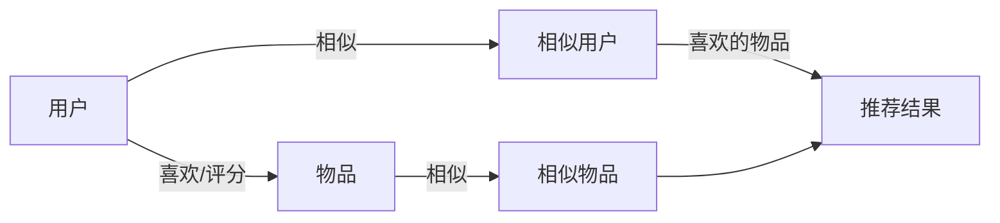

# 协同过滤 原理与代码实例讲解

## 1.背景介绍

### 1.1 个性化推荐系统的重要性

在当今信息爆炸的时代,面对海量的信息和产品,用户很难快速找到自己感兴趣的内容。个性化推荐系统应运而生,它可以根据用户的历史行为和偏好,自动为用户推荐可能感兴趣的信息和产品,大大提高了用户的满意度和体验。个性化推荐已经成为各大互联网公司的标配,如亚马逊、Netflix、YouTube等,它们的成功很大程度上归功于优秀的推荐系统。

### 1.2 协同过滤推荐的优势

协同过滤(Collaborative Filtering)是个性化推荐系统中最常用、最成熟的技术之一。它的基本思想是利用用户群体的集体智慧来推荐,即如果某些用户在某些物品上有相似的喜好,那么在其他物品上他们也可能有相似的喜好。协同过滤的优势在于:
1. 不需要对物品本身进行建模,只利用用户的历史行为数据。
2. 可以发现用户的"惊喜",推荐出用户可能感兴趣但未接触过的长尾物品。
3. 随着用户行为数据的积累,推荐质量会不断提升。

### 1.3 协同过滤的分类

协同过滤主要分为两大类:基于用户的协同过滤(User-based CF)和基于物品的协同过滤(Item-based CF)。

- 基于用户的 CF:先计算用户之间的相似度,然后根据目标用户的相似用户对物品的偏好来推荐。
- 基于物品的 CF:先计算物品之间的相似度,然后根据用户喜欢的物品来推荐与之相似的其他物品。

基于物品的 CF 通常比基于用户的 CF 有更好的推荐效果和性能,因此在工业界应用更加广泛。本文将重点介绍基于物品的协同过滤算法。

## 2.核心概念与联系

### 2.1 用户(User)

在推荐系统中,用户是信息和服务的消费者。每个用户有其独特的兴趣爱好和行为模式。推荐系统的目标就是通过分析用户的行为,为其提供个性化的推荐服务。

### 2.2 物品(Item)

物品是推荐系统要向用户推荐的对象,可以是各种信息、产品或服务,如新闻文章、电影、歌曲、商品等。每个物品也有其内在的属性特征。

### 2.3 用户-物品评分矩阵(Rating Matrix)

用户对物品的偏好可以用显式或隐式的反馈来表示。显式反馈如用户的评分、点赞等,隐式反馈如用户的点击、购买行为等。这些反馈数据可以组织成一个用户-物品评分矩阵,矩阵的行表示用户,列表示物品,每个元素表示某个用户对某个物品的偏好得分。

### 2.4 物品相似度(Item Similarity)

物品相似度衡量了两个物品在用户偏好上的相似程度。直观地说,如果两个物品被很多相同的用户喜欢,或者得到了相似的评分,那么它们的相似度就高。常见的相似度计算方法有欧几里得距离、皮尔逊相关系数、余弦相似度等。

### 2.5 用户相似度(User Similarity)

用户相似度衡量了两个用户在物品偏好上的相似程度。如果两个用户对很多相同的物品有相似的喜好,那么他们的相似度就高。用户相似度的计算方法与物品相似度类似。

### 2.6 核心概念之间的联系

下图展示了协同过滤推荐中几个核心概念之间的联系:



协同过滤就是利用用户-物品评分矩阵,计算用户或物品之间的相似度,然后根据用户的相似用户喜欢的物品,或者用户喜欢的物品的相似物品,来生成个性化推荐结果。

## 3.核心算法原理具体操作步骤

下面我们以基于物品的协同过滤为例,详细介绍其核心算法步骤。

### 3.1 构建用户-物品评分矩阵

首先需要收集用户对物品的偏好反馈数据,构建用户-物品评分矩阵。矩阵的每一行代表一个用户,每一列代表一个物品,矩阵元素 $r_{ui}$ 表示用户 $u$ 对物品 $i$ 的偏好得分。得分可以是显式的评分,如1-5星,也可以是隐式的反馈值,如购买、点击、停留时间等。

### 3.2 计算物品相似度矩阵

基于用户-物品评分矩阵,计算物品两两之间的相似度,构建物品相似度矩阵。设 $N(i)$ 和 $N(j)$ 分别是对物品 $i$ 和 $j$ 有过评分的用户集合, $r_{ui}$ 是用户 $u$ 对物品 $i$ 的评分, $\bar{r}_i$ 是物品 $i$ 的平均评分。常用的相似度计算方法有:

- 欧几里得距离:
$$sim(i,j) = \frac{1}{1+\sqrt{\sum_{u \in N(i) \cap N(j)} (r_{ui}-r_{uj})^2}}$$

- 皮尔逊相关系数:
$$sim(i,j) = \frac{\sum_{u \in N(i) \cap N(j)} (r_{ui}-\bar{r}_i)(r_{uj}-\bar{r}_j)}{\sqrt{\sum_{u \in N(i) \cap N(j)} (r_{ui}-\bar{r}_i)^2} \sqrt{\sum_{u \in N(i) \cap N(j)} (r_{uj}-\bar{r}_j)^2}}$$

- 余弦相似度:
$$sim(i,j) = \frac{\sum_{u \in N(i) \cap N(j)} r_{ui} r_{uj}}{\sqrt{\sum_{u \in N(i)} r_{ui}^2} \sqrt{\sum_{u \in N(j)} r_{uj}^2}}$$

这里的物品相似度 $sim(i,j) \in [0,1]$,值越大表示物品 $i$ 和 $j$ 越相似。

### 3.3 生成推荐列表

对于要推荐的目标用户 $u$,找出他评分过的所有物品 $I_u$,然后基于物品相似度矩阵,为每个物品 $i \in I_u$ 找到 $k$ 个最相似的物品 $S_i^k$,作为候选推荐。对每个候选物品 $j$,计算其推荐得分:

$$p_{uj} = \frac{\sum_{i \in I_u \cap S_j} sim(i,j) \cdot r_{ui}}{\sum_{i \in I_u \cap S_j} sim(i,j)}$$

即先用用户 $u$ 对相似物品 $i$ 的评分 $r_{ui}$ 乘以相似度 $sim(i,j)$ 作为权重,再对所有相似物品求加权平均。最后,选取得分最高的 $N$ 个物品作为最终的 Top-N 推荐列表。

## 4.数学模型和公式详细讲解举例说明

本节我们通过一个简单的例子来详细说明协同过滤推荐的数学模型和公式。

假设有4个用户 $\{u_1,u_2,u_3,u_4\}$ 和5个物品 $\{i_1,i_2,i_3,i_4,i_5\}$,用户-物品评分矩阵如下:

|      | $i_1$ | $i_2$ | $i_3$ | $i_4$ | $i_5$ |
|:----:|:-----:|:-----:|:-----:|:-----:|:-----:|
| $u_1$ |   5   |   4   |   2   |       |   1   |
| $u_2$ |   2   |   3   |   5   |   4   |       |
| $u_3$ |   4   |   1   |       |   3   |   5   |
| $u_4$ |   1   |       |   4   |   5   |   2   |

空白表示用户未对该物品评分。现在我们要为用户 $u_4$ 推荐物品。

### 步骤1:计算物品相似度矩阵

这里我们用皮尔逊相关系数来计算物品相似度。以物品 $i_1$ 和 $i_2$ 为例,有:

$$\begin{aligned}
\bar{r}_{i_1} &= \frac{5+2+4+1}{4} = 3 \\
\bar{r}_{i_2} &= \frac{4+3+1}{3} = 2.67 \\
sim(i_1,i_2) &= \frac{(5-3)(4-2.67)+(2-3)(3-2.67)+(4-3)(1-2.67)}{\sqrt{(5-3)^2+(2-3)^2+(4-3)^2} \sqrt{(4-2.67)^2+(3-2.67)^2+(1-2.67)^2}} \\
             &= 0.39
\end{aligned}$$

类似地可以计算出其他物品对的相似度,得到物品相似度矩阵:

|       | $i_1$ | $i_2$ | $i_3$ | $i_4$ | $i_5$ |
|:-----:|:-----:|:-----:|:-----:|:-----:|:-----:|
| $i_1$ |   1   |  0.39 |  -1   | -0.81 |  -1   |
| $i_2$ |  0.39 |   1   | -0.38 | -0.96 | -0.58 |
| $i_3$ |  -1   | -0.38 |   1   |  0.91 |  0.19 |
| $i_4$ | -0.81 | -0.96 |  0.91 |   1   |  0.45 |
| $i_5$ |  -1   | -0.58 |  0.19 |  0.45 |   1   |

### 步骤2:生成推荐列表

用户 $u_4$ 评分过的物品集合为 $I_{u_4}=\{i_1,i_3,i_4,i_5\}$。对于每个物品,选取其最相似的2个物品($k=2$)作为候选推荐:

- $i_1$: $S_{i_1}^2 = \{i_2,i_4\}$
- $i_3$: $S_{i_3}^2 = \{i_4,i_5\}$
- $i_4$: $S_{i_4}^2 = \{i_3,i_5\}$
- $i_5$: $S_{i_5}^2 = \{i_4,i_3\}$

可以看到,用户已评分的物品 $i_1$ 的相似物品中包含了未评分物品 $i_2$,因此 $i_2$ 可作为推荐候选。

下面计算候选物品 $i_2$ 的推荐得分:

$$\begin{aligned}
p_{u_4,i_2} &= \frac{sim(i_1,i_2) \cdot r_{u_4,i_1}}{\sum_{i \in I_{u_4} \cap S_{i_2}} sim(i,i_2)} \\
            &= \frac{0.39 \times 1}{0.39} = 1
\end{aligned}$$

即用 $u_4$ 对相似物品 $i_1$ 的评分1乘以相似度0.39作为加权得分。由于 $i_2$ 只有 $i_1$ 一个相似物品被 $u_4$ 评分过,分母就等于 $sim(i_1,i_2)$。

最终,物品 $i_2$ 得到推荐得分为1,可作为 Top-1 推荐给用户 $u_4$。

## 5.项目实践:代码实例和详细解释说明

下面我们用Python代码来实现一个简单的基于物品的协同过滤推荐算法。

### 5.1 读取用户-物品评分矩阵

首先定义一个读取用户-物品评分数据的函数:

```python
def load_data(file_path):
    """
    读取用户-物品评分数据
    :param file_path: 数据文件路径
    :return: 用户-物品评分矩阵,用户ID列表,物品ID列表
    """
    with open(file_path, 'r') as f:
        lines = f.readlines()
    
    user_ids = []
    item_ids = []
    ratings = []
    
    for line in lines:
        user_id, item_id, rating = line.strip().split(',')
        user_ids.appen