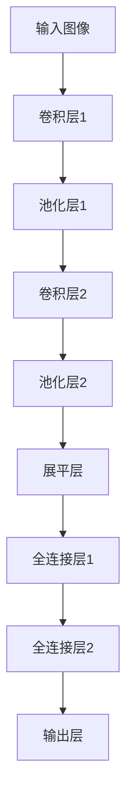

# 卷积神经网络(CNN)原理与代码实战案例讲解

## 1.背景介绍

在当今的计算机视觉和模式识别领域,卷积神经网络(Convolutional Neural Networks, CNN)无疑是最成功和最广泛应用的深度学习模型之一。CNN已经在图像分类、目标检测、语义分割等众多视觉任务中取得了卓越的成绩,甚至超越了人类的能力。

CNN的核心思想源于生物学中的视觉机理,它模仿了视觉皮层中神经元对于局部感受野的反应特征。通过交替使用卷积层和池化层来提取图像的局部特征,最终形成对整个输入图像的高层次抽象表示。与传统的人工设计特征相比,CNN能够自动从数据中学习最优特征表示,从而避免了人工特征设计的困难。

### 1.1 CNN在计算机视觉中的重要性

CNN在计算机视觉领域的重要性主要体现在以下几个方面:

1. **图像分类**: CNN能够从原始像素数据中自动学习特征表示,在大规模图像分类任务中表现出色,如ImageNet等竞赛中的优异成绩。

2. **目标检测**: 通过滑动窗口或区域建议网络,CNN可以实现准确的目标定位和识别,是目标检测领域的主流方法。

3. **语义分割**: 像素级别的图像分割任务,CNN可以通过端到端的训练实现高精度的语义分割。

4. **实例分割**: 进一步对个体目标实例进行分割,是CNN在计算机视觉中的又一重要应用。

5. **视频理解**: CNN不仅可以应用于静止图像,还可以扩展到时空数据,用于行为识别、动作检测等视频理解任务。

6. **生成对抗网络(GAN)**: CNN是生成式对抗网络的核心组成部分,可用于图像生成、风格迁移等任务。

总的来说,CNN已经成为计算机视觉领域不可或缺的基础模型,在各种视觉任务中发挥着关键作用。

## 2.核心概念与联系

### 2.1 CNN的基本结构

CNN是一种前馈神经网络,由多个卷积层、池化层、全连接层等不同类型的层组成。这些层按照一定的顺序堆叠,形成端到端的网络结构。CNN的基本结构如下所示:

1. **卷积层(Convolutional Layer)**: 卷积层是CNN的核心部分,它通过滑动卷积核在输入数据上执行卷积操作,提取局部特征。

2. **池化层(Pooling Layer)**: 池化层用于降低特征图的分辨率,减小计算量并提高模型的鲁棒性。常见的池化操作有最大池化和平均池化。

3. **全连接层(Fully Connected Layer)**: 全连接层将前面层的特征图展平,并对展平后的向量进行全连接操作,用于进一步提取高层次的特征表示。

4. **输出层(Output Layer)**: 输出层根据任务的类型(如分类或回归)进行相应的输出计算。

这种层次化的结构使CNN能够逐步提取从低级到高级的特征表示,最终实现对输入数据的理解和处理。

### 2.2 CNN的关键概念

CNN中有几个关键概念需要理解:

1. **局部连接(Local Connectivity)**: 卷积层中的神经元只与输入数据的局部区域相连,而不是全连接。这种局部连接有利于提取局部特征,并减少了参数数量。

2. **权值共享(Weight Sharing)**: 在同一卷积层中,所有神经元共享相同的权值和偏置。这种权值共享大大减少了需要学习的参数数量,提高了模型的泛化能力。

3. **平移不变性(Translation Invariance)**: 由于卷积操作和池化操作的特性,CNN具有一定的平移不变性,即对输入数据的平移具有一定的鲁棒性。

4. **多尺度特征提取**: 通过堆叠多个卷积层和池化层,CNN可以逐层提取不同尺度和抽象程度的特征表示,从而捕捉输入数据的多尺度信息。

这些核心概念赋予了CNN强大的特征提取能力,使其在计算机视觉任务中表现出色。

## 3.核心算法原理具体操作步骤

CNN的核心算法原理包括卷积操作、池化操作和反向传播算法。下面将详细介绍这些操作的具体步骤。

### 3.1 卷积操作

卷积操作是CNN中最关键的步骤,它通过滑动卷积核在输入数据上执行卷积运算,提取局部特征。具体步骤如下:

1. 初始化卷积核权重和偏置。

2. 将卷积核在输入数据上滑动,对应元素相乘并求和,得到输出特征图上的一个元素值。

3. 根据步长(stride)和零填充(padding)设置,移动卷积核到下一个位置,重复步骤2。

4. 完成整个输入数据的卷积操作,得到输出特征图。

5. 对输出特征图进行激活函数(如ReLU)的非线性变换。

卷积操作的数学表达式如下:

$$
y_{ij} = \sum_{m} \sum_{n} w_{mn} x_{i+m, j+n} + b
$$

其中,$y_{ij}$是输出特征图上的元素,$w_{mn}$是卷积核的权重,$x_{i+m, j+n}$是输入数据的局部区域,b是偏置项。

通过卷积操作,CNN可以自动从输入数据中学习局部特征,并且通过堆叠多个卷积层,可以逐步提取更高级的特征表示。

### 3.2 池化操作

池化操作用于降低特征图的分辨率,减小计算量并提高模型的鲁棒性。常见的池化操作有最大池化和平均池化。

**最大池化(Max Pooling)**的具体步骤如下:

1. 在输入特征图上划分一个池化窗口(如2x2)。

2. 在池化窗口内选取最大值作为输出特征图的一个元素。

3. 根据步长(stride)移动池化窗口,重复步骤2,直到完成整个输入特征图的池化操作。

最大池化的数学表达式如下:

$$
y_{ij} = \max_{(m,n) \in R_{ij}} x_{i+m, j+n}
$$

其中,$y_{ij}$是输出特征图上的元素,$R_{ij}$是以$(i,j)$为中心的池化窗口区域,$x_{i+m, j+n}$是输入特征图的局部区域。

**平均池化(Average Pooling)**的步骤与最大池化类似,只是将最大值替换为平均值。

池化操作可以减小特征图的分辨率,从而减少后续层的计算量。同时,它也增强了模型对于输入数据的平移和扭曲的鲁棒性。

### 3.3 反向传播算法

CNN的训练过程采用反向传播算法,通过梯度下降法更新网络参数,最小化损失函数。反向传播算法的具体步骤如下:

1. 前向传播:输入数据经过卷积层、池化层和全连接层,计算出预测输出。

2. 计算损失函数:将预测输出与真实标签进行比较,计算损失函数值(如交叉熵损失)。

3. 反向传播:从输出层开始,计算每一层的梯度,利用链式法则逐层传播到前面的层。

4. 更新参数:根据计算得到的梯度,使用优化算法(如随机梯度下降)更新网络参数(权重和偏置)。

5. 重复步骤1-4,直到模型收敛或达到最大迭代次数。

在反向传播过程中,需要计算每一层的梯度,包括卷积层、池化层和全连接层。卷积层的梯度计算涉及到卷积核权重的更新,池化层的梯度计算则需要考虑最大池化或平均池化的特殊性。

通过不断迭代地更新网络参数,CNN可以逐步学习到最优的特征表示,从而提高模型在各种任务上的性能。

## 4.数学模型和公式详细讲解举例说明

CNN中涉及到多个数学模型和公式,下面将详细讲解其中的几个关键部分。

### 4.1 卷积操作

卷积操作是CNN的核心操作,它通过滑动卷积核在输入数据上执行卷积运算,提取局部特征。卷积操作的数学表达式如下:

$$
y_{ij} = \sum_{m} \sum_{n} w_{mn} x_{i+m, j+n} + b
$$

其中,$y_{ij}$是输出特征图上的元素,$w_{mn}$是卷积核的权重,$x_{i+m, j+n}$是输入数据的局部区域,b是偏置项。

让我们以一个具体的例子来说明卷积操作的过程。假设输入数据$X$为3x3的矩阵,卷积核$W$为2x2的矩阵,步长为1,无零填充。

$$
X = \begin{bmatrix}
1 & 2 & 3\\
4 & 5 & 6\\
7 & 8 & 9
\end{bmatrix}, \quad
W = \begin{bmatrix}
1 & 2\\
3 & 4
\end{bmatrix}
$$

卷积操作的过程如下:

1. 将卷积核$W$置于输入数据$X$的左上角,对应元素相乘并求和:
   $$
   y_{11} = 1\times1 + 2\times3 + 4\times2 + 5\times4 = 35
   $$

2. 将卷积核$W$向右滑动一步,重复步骤1:
   $$
   y_{12} = 2\times1 + 3\times2 + 5\times3 + 6\times4 = 50
   $$

3. 继续向右滑动,直到完成第一行的卷积操作:
   $$
   y_{13} = 3\times2 + 6\times4 = 30
   $$

4. 移动到下一行,重复步骤1-3,直到完成整个输入数据的卷积操作。

通过上述示例,我们可以直观地理解卷积操作的过程。卷积操作可以自动从输入数据中提取局部特征,是CNN的核心部分。

### 4.2 池化操作

池化操作用于降低特征图的分辨率,减小计算量并提高模型的鲁棒性。最大池化和平均池化是两种常见的池化操作。

**最大池化(Max Pooling)**的数学表达式如下:

$$
y_{ij} = \max_{(m,n) \in R_{ij}} x_{i+m, j+n}
$$

其中,$y_{ij}$是输出特征图上的元素,$R_{ij}$是以$(i,j)$为中心的池化窗口区域,$x_{i+m, j+n}$是输入特征图的局部区域。

让我们以一个具体的例子来说明最大池化的过程。假设输入特征图$X$为4x4的矩阵,池化窗口大小为2x2,步长为2,无零填充。

$$
X = \begin{bmatrix}
1 & 2 & 3 & 4\\
5 & 6 & 7 & 8\\
9 & 10 & 11 & 12\\
13 & 14 & 15 & 16
\end{bmatrix}
$$

最大池化的过程如下:

1. 在输入特征图$X$的左上角放置一个2x2的池化窗口,取窗口内的最大值作为输出特征图的第一个元素:
   $$
   y_{11} = \max\begin{bmatrix}
   1 & 2\\
   5 & 6
   \end{bmatrix} = 6
   $$

2. 向右移动池化窗口,重复步骤1:
   $$
   y_{12} = \max\begin{bmatrix}
   3 & 4\\
   7 & 8
   \end{bmatrix} = 8
   $$

3. 继续向右移动,直到完成第一行的池化操作。

4. 移动到下一行,重复步