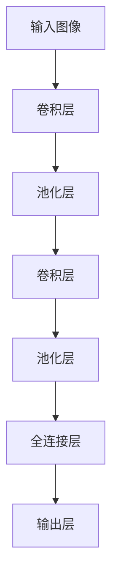
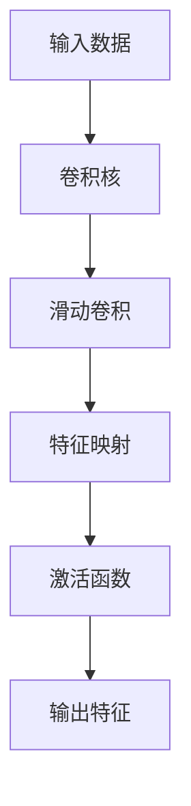
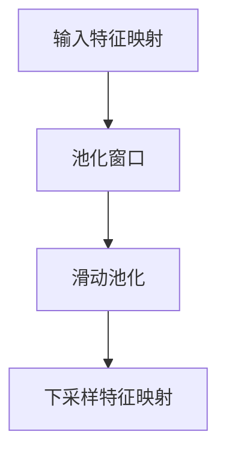
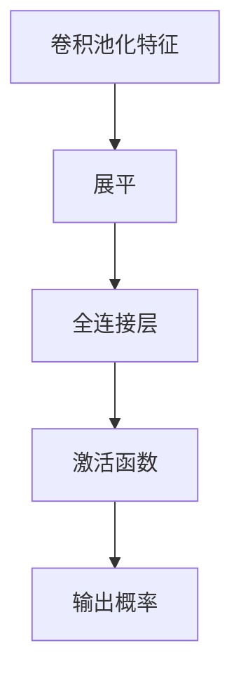

# 卷积神经网络(Convolutional Neural Network)原理与代码实战案例讲解

## 1.背景介绍

### 1.1 人工智能与深度学习的兴起

在过去的几十年里,人工智能(Artificial Intelligence, AI)技术取得了长足的进步,深度学习(Deep Learning)作为其中的一个重要分支,已经广泛应用于计算机视觉、自然语言处理、语音识别等诸多领域。随着算力的不断提升和海量数据的积累,深度学习模型展现出了超越传统机器学习算法的强大能力,能够自动从原始数据中学习出高层次的抽象特征表示,从而解决更加复杂的任务。

### 1.2 卷积神经网络在计算机视觉中的关键作用

在计算机视觉领域,卷积神经网络(Convolutional Neural Network, CNN)作为一种专门用于处理网格结构数据(如图像)的深度神经网络模型,因其在图像分类、目标检测、语义分割等任务中取得了卓越的性能,而备受关注。自2012年AlexNet在ImageNet大赛上的惊艳表现后,卷积神经网络成为计算机视觉领域的主流模型,也推动了深度学习在其他领域的快速发展。

### 1.3 本文内容概览

本文将系统地介绍卷积神经网络的基本原理、核心组件、训练过程,并通过实战案例讲解如何使用Python及相关深度学习框架(如PyTorch、TensorFlow等)构建和训练卷积神经网络模型。我们将探讨卷积神经网络在图像分类、目标检测等任务中的应用,分析其优缺点,并展望未来的发展趋势和挑战。

## 2.核心概念与联系

### 2.1 神经网络与深度学习

神经网络(Neural Network)是一种受生物神经系统启发而设计的数学模型,由大量互连的节点(神经元)组成,能够从数据中自动学习出特征表示。深度学习则是指使用深层次的神经网络结构,通过反向传播算法对大量数据进行训练,从而学习出高层次的抽象特征表示。

### 2.2 卷积神经网络的结构

卷积神经网络是一种专门用于处理网格结构数据(如图像)的深度神经网络模型。它由多个卷积层(Convolutional Layer)、池化层(Pooling Layer)和全连接层(Fully Connected Layer)组成,每一层都执行特定的操作,从而逐步提取出图像的高层次特征表示。



### 2.3 卷积运算与特征提取

卷积运算是卷积神经网络的核心操作,它通过在输入数据(如图像)上滑动一个小窗口(卷积核),对窗口内的数据进行加权求和,从而提取出局部特征。多个卷积核可以同时应用于输入数据,提取出不同的特征映射。通过多层卷积操作,网络能够逐步从低层次的边缘和纹理特征,提取出高层次的语义特征。

### 2.4 池化操作与特征压缩

池化操作通常在卷积层之后进行,它对卷积层输出的特征映射进行下采样,减小特征映射的空间尺寸。常用的池化方法包括最大池化(Max Pooling)和平均池化(Average Pooling)。池化操作不仅能够减小计算量和内存占用,还能提高模型的平移不变性和空间不变性,从而提高模型的泛化能力。

### 2.5 全连接层与分类任务

在卷积神经网络的最后几层通常是全连接层,它将前面卷积层和池化层提取出的高层次特征映射展平,并与分类任务的输出类别数量相对应。全连接层的作用是将提取出的特征映射到最终的分类标签或回归值上。

## 3.核心算法原理具体操作步骤

### 3.1 卷积运算

卷积运算是卷积神经网络的核心操作,它通过在输入数据(如图像)上滑动一个小窗口(卷积核),对窗口内的数据进行加权求和,从而提取出局部特征。具体步骤如下:

1. 初始化卷积核的权重参数,通常使用随机初始化或特定的初始化方法。
2. 将卷积核在输入数据上进行滑动,每次移动一个步长(stride)。
3. 在每个滑动位置,计算卷积核与输入数据对应窗口的元素wise乘积之和,得到一个输出值。
4. 将所有输出值组成一个特征映射(Feature Map)。
5. 对特征映射进行激活函数操作(如ReLU),以增加非线性。
6. 可以使用多个卷积核,得到多个特征映射,组成一个新的输出张量。



### 3.2 池化操作

池化操作通常在卷积层之后进行,它对卷积层输出的特征映射进行下采样,减小特征映射的空间尺寸。常用的池化方法包括最大池化(Max Pooling)和平均池化(Average Pooling)。具体步骤如下:

1. 设置池化窗口大小(如2x2)和步长(stride)。
2. 将池化窗口在特征映射上滑动,每次移动一个步长。
3. 在每个滑动位置,根据池化方法(如最大值或平均值)计算窗口内元素的输出值。
4. 将所有输出值组成一个新的下采样特征映射。



### 3.3 全连接层与分类

在卷积神经网络的最后几层通常是全连接层,它将前面卷积层和池化层提取出的高层次特征映射展平,并与分类任务的输出类别数量相对应。具体步骤如下:

1. 将卷积层和池化层输出的高维特征映射展平为一维向量。
2. 将展平后的特征向量输入到全连接层,与全连接层的权重参数进行矩阵乘法运算。
3. 对全连接层的输出应用激活函数(如ReLU或Softmax)。
4. 对于分类任务,最后一层全连接层的输出维度与类别数量相同,通过Softmax激活函数得到每个类别的概率值。
5. 在训练过程中,根据预测值与真实标签的差异,使用反向传播算法更新网络的权重参数。



## 4.数学模型和公式详细讲解举例说明

### 4.1 卷积运算公式

卷积运算的数学表达式如下:

$$
(I * K)(i, j) = \sum_{m} \sum_{n} I(i+m, j+n) K(m, n)
$$

其中:
- $I$ 表示输入数据(如图像)
- $K$ 表示卷积核的权重参数
- $i, j$ 表示输出特征映射的坐标
- $m, n$ 表示卷积核的坐标

例如,对于一个3x3的卷积核和一个5x5的输入图像,卷积运算的过程如下:

```
输入图像 I:
1 2 3 4 5
6 7 8 9 10
11 12 13 14 15
16 17 18 19 20
21 22 23 24 25

卷积核 K:
1 0 1
0 1 0
1 0 1

输出特征映射 O:
O(0,0) = 1*1 + 0*2 + 1*3 + 0*6 + 1*7 + 0*8 + 1*11 + 0*12 + 1*13 = 30
O(0,1) = 1*2 + 0*3 + 1*4 + 0*7 + 1*8 + 0*9 + 1*12 + 0*13 + 1*14 = 38
...
```

通过在输入图像上滑动卷积核,并对每个位置进行加权求和,我们可以得到一个3x3的输出特征映射。

### 4.2 池化运算公式

最大池化(Max Pooling)和平均池化(Average Pooling)的数学表达式分别如下:

最大池化:
$$
\text{max\_pool}(X)_{i,j} = \max_{m,n} X_{i+m, j+n}
$$

平均池化:
$$
\text{avg\_pool}(X)_{i,j} = \frac{1}{mn} \sum_{m,n} X_{i+m, j+n}
$$

其中:
- $X$ 表示输入的特征映射
- $i, j$ 表示输出特征映射的坐标
- $m, n$ 表示池化窗口的坐标范围

例如,对于一个2x2的池化窗口和一个4x4的输入特征映射,最大池化和平均池化的过程如下:

```
输入特征映射 X:
1 2 3 4
5 6 7 8
9 10 11 12
13 14 15 16

最大池化输出 O_max:
O_max(0,0) = max(1, 2, 5, 6) = 6
O_max(0,1) = max(3, 4, 7, 8) = 8
O_max(1,0) = max(9, 10, 13, 14) = 14
O_max(1,1) = max(11, 12, 15, 16) = 16

平均池化输出 O_avg:
O_avg(0,0) = (1 + 2 + 5 + 6) / 4 = 3.5
O_avg(0,1) = (3 + 4 + 7 + 8) / 4 = 5.5
O_avg(1,0) = (9 + 10 + 13 + 14) / 4 = 11.5
O_avg(1,1) = (11 + 12 + 15 + 16) / 4 = 13.5
```

通过池化操作,我们可以减小特征映射的空间尺寸,同时保留了重要的特征信息。

### 4.3 全连接层与Softmax分类

全连接层的数学表达式如下:

$$
y = f(Wx + b)
$$

其中:
- $x$ 表示输入特征向量
- $W$ 表示全连接层的权重矩阵
- $b$ 表示全连接层的偏置向量
- $f$ 表示激活函数(如ReLU或Softmax)

对于分类任务,最后一层全连接层的输出通常使用Softmax激活函数,将输出映射到(0,1)之间的概率值,并满足所有概率值之和为1。Softmax函数的数学表达式如下:

$$
\text{softmax}(x_i) = \frac{e^{x_i}}{\sum_{j}e^{x_j}}
$$

其中:
- $x_i$ 表示第i个输出节点的值
- $j$ 表示所有输出节点的索引

例如,对于一个3类分类问题,假设最后一层全连接层的输出为$[2.0, 1.0, -1.0]$,经过Softmax函数后得到的概率值为$[0.65, 0.24, 0.11]$,表示第一类的概率为0.65,第二类的概率为0.24,第三类的概率为0.11。

在训练过程中,我们通常使用交叉熵损失函数(Cross-Entropy Loss)来衡量预测值与真实标签之间的差异,并使用反向传播算法更新网络的权重参数,以最小化损失函数的值。

## 5.项目实践:代码实例和详细解释说明

在本节中,我们将使用Python和PyTorch深度学习框架,构建并训练一个卷积神经网络模型,用于对MNIST手写数字图像进行分类。

### 5.1 导入所需库

```python
import torch
import torch.nn as nn
import torch.optim as optim
from torchvision import datasets, transforms
```

我们导入了PyTorch的核心库、神经网络模块、优化器模块,以及用于加载MNIST数据集的torchvision库。

### 5.2 定义卷积神经网络模型

```python
class ConvNet