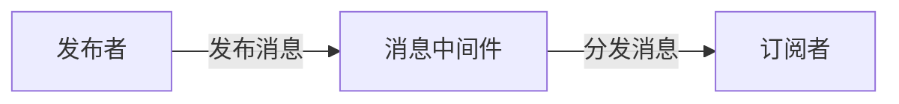

## 1.背景介绍

在现代软件开发中，发布订阅模式是一种常见的设计模式，被广泛应用于各种场景，包括消息队列、事件驱动编程、异步处理等。发布订阅模式的核心思想是，发布者（Publisher）将信息发布出去，而订阅者（Subscriber）可以选择订阅他们感兴趣的信息。当发布者发布新的信息时，所有订阅了这个信息的订阅者都会收到通知。这种模式可以帮助我们创建松耦合、可扩展和高效的系统。

## 2.核心概念与联系

发布订阅模式包含三个核心角色：发布者、订阅者和消息中间件。发布者负责发布消息，订阅者负责接收消息，而消息中间件则负责存储和分发消息。在发布订阅模式中，发布者和订阅者并不直接通信，而是通过消息中间件进行间接通信。这种方式可以保证系统的松耦合，提高系统的可扩展性。



## 3.核心算法原理具体操作步骤

发布订阅模式的核心算法可以分为以下几步：

1. 订阅者向消息中间件发送订阅请求，请求订阅某个主题的消息。
2. 消息中间件接收到订阅请求后，将订阅者添加到对应主题的订阅者列表中。
3. 发布者向消息中间件发送消息，消息包含主题和消息内容。
4. 消息中间件接收到消息后，将消息存储起来，并向对应主题的所有订阅者发送消息。
5. 订阅者接收到消息后，进行相应的处理。

## 4.数学模型和公式详细讲解举例说明

发布订阅模式的性能可以用数学模型来描述。假设系统中有 $n$ 个发布者，$m$ 个订阅者，每个发布者每秒发布 $p$ 条消息，每条消息的大小为 $s$，那么消息中间件每秒需要处理的消息数量为 $n \times p$，每秒需要处理的数据量为 $n \times p \times s$。如果消息中间件的处理能力为 $q$ 条消息/秒，那么系统的最大负载为 $n \times p / q$。

## 5.项目实践：代码实例和详细解释说明

下面是一个简单的发布订阅模式的Python代码实例：

```python
class MessageBroker:
    def __init__(self):
        self.subscribers = dict()

    def subscribe(self, topic, subscriber):
        if topic not in self.subscribers:
            self.subscribers[topic] = []
        self.subscribers[topic].append(subscriber)

    def publish(self, topic, message):
        if topic in self.subscribers:
            for subscriber in self.subscribers[topic]:
                subscriber.receive(message)

class Publisher:
    def __init__(self, broker):
        self.broker = broker

    def publish(self, topic, message):
        self.broker.publish(topic, message)

class Subscriber:
    def receive(self, message):
        print("Received message:", message)
```

## 6.实际应用场景

发布订阅模式在很多场景都有应用，例如：

1. 消息队列：消息队列是发布订阅模式的一个典型应用场景。发布者将消息发布到消息队列中，订阅者从消息队列中取出消息进行处理。
2. 事件驱动编程：在事件驱动编程中，事件源是发布者，事件监听器是订阅者。当事件源发生事件时，所有监听该事件的事件监听器都会收到通知。
3. 异步处理：在异步处理中，任务生产者是发布者，任务消费者是订阅者。任务生产者将任务发布到任务队列中，任务消费者从任务队列中取出任务进行处理。

## 7.工具和资源推荐

在实际项目中，我们通常会使用一些开源的消息中间件，例如RabbitMQ、Kafka、Redis等。这些消息中间件提供了丰富的功能，可以帮助我们更方便地实现发布订阅模式。

## 8.总结：未来发展趋势与挑战

随着微服务和云原生技术的发展，发布订阅模式的应用将越来越广泛。但同时，也面临着一些挑战，例如如何保证消息的可靠传输、如何处理大量的消息、如何保证系统的高可用等。

## 9.附录：常见问题与解答

1. Q: 发布订阅模式和观察者模式有什么区别？
   A: 发布订阅模式和观察者模式都是行为型设计模式，都用于实现对象间的解耦。但在发布订阅模式中，发布者和订阅者通过消息中间件进行间接通信，而在观察者模式中，主题和观察者直接通信。

2. Q: 如何选择消息中间件？
   A: 选择消息中间件时，需要考虑以下几个因素：消息的吞吐量、消息的延迟、消息的可靠性、系统的可扩展性、系统的易用性等。

作者：禅与计算机程序设计艺术 / Zen and the Art of Computer Programming