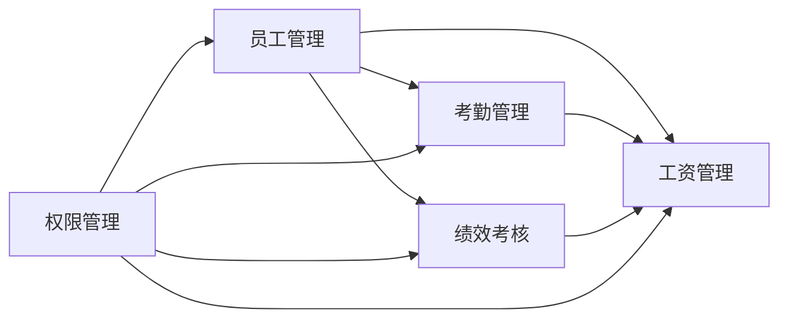

# 商厦人员管理系统详细设计与具体代码实现

## 1.背景介绍

### 1.1 商厦人员管理的重要性
在现代化商厦的运营管理中,高效的人员管理是保证商厦正常运转的关键。随着商厦规模的不断扩大,人员数量也在快速增长,传统的人工管理方式已经难以满足日益复杂的管理需求。因此,开发一套功能完善、易于操作的商厦人员管理系统就显得尤为重要。

### 1.2 系统开发的目标
本文旨在设计并实现一个基于 Web 的商厦人员管理系统,该系统能够实现员工信息的录入、查询、修改等基本功能,同时还要具备考勤管理、工资管理、绩效考核等高级功能。系统的设计要遵循软件工程的基本原则,采用模块化、层次化的架构,保证系统的可扩展性和可维护性。

### 1.3 文章的组织结构
本文将从以下几个方面对商厦人员管理系统进行详细阐述:

1. 核心概念与关联
2. 系统架构设计
3. 数据库设计
4. 核心功能模块详解
5. 关键技术实现
6. 系统测试与部署
7. 总结与展望

## 2.核心概念与联系

### 2.1 员工管理
员工管理是系统的基础功能,主要包括员工信息的 CRUD 操作。每个员工都有一个唯一的工号,以及姓名、性别、部门、职位、联系方式等基本信息。员工之间通过部门和职位形成上下级关系。

### 2.2 考勤管理  
考勤管理是记录员工出勤情况的功能。每天员工需要打卡签到和签退,系统自动记录员工的出勤时间。如果员工有请假、加班等情况,需要提交审批,通过后才能生效。考勤数据是计算员工工资的重要依据。

### 2.3 工资管理
工资管理是根据员工的出勤情况、岗位级别、绩效表现等因素,自动计算员工的应发工资。工资主要包括基本工资、岗位工资、绩效工资、加班工资、津贴等项目。每月会进行一次工资核算,生成工资条,并完成发放。

### 2.4 绩效考核
绩效考核是对员工一个周期内的工作表现进行评估打分的过程。主要考核员工的业务能力、工作态度、团队协作等方面。绩效考核的结果与员工的晋升、调薪、奖惩等密切相关。

### 2.5 权限管理
权限管理是对系统的功能和数据进行访问控制。不同的用户角色拥有不同的操作权限,例如普通员工只能查看自己的信息,人事专员可以管理所有员工信息,财务可以查看工资数据,等等。权限管理对于保障系统的安全性和数据私密性非常重要。

下面是这些核心概念之间的关系图:



## 3.核心算法原理具体操作步骤

### 3.1 员工信息的增删改查
员工信息的 CRUD 操作是系统的基本功能,涉及到数据库表的操作。以添加员工为例,具体步骤如下:

1. 在前端页面输入员工的各项信息,点击提交按钮
2. 后端接收到请求,对数据进行必要的校验
3. 对密码进行加密处理 
4. 生成唯一的员工工号
5. 将员工信息插入到数据库对应的表中
6. 返回操作结果给前端

删除、修改、查询员工的操作类似,这里不再赘述。

### 3.2 考勤打卡算法
考勤打卡是记录员工每天上下班时间的过程。当员工打卡时,会记录打卡的时间戳和打卡类型(上班/下班)。具体算法如下:

1. 员工在打卡机或 App 上触发打卡动作
2. 系统记录当前的时间戳和打卡类型
3. 判断打卡是否有效(是否在允许的打卡时间范围内)
4. 如果是上班卡,则将打卡记录保存到数据库中
5. 如果是下班卡,则在数据库中查找当天的上班卡记录,计算工作时长
6. 保存下班卡记录,同时更新工作时长字段
7. 返回打卡结果

### 3.3 工资计算算法
工资计算是根据员工的出勤情况、岗位等级、绩效表现等因素,计算员工的应发工资。计算公式如下:

```
应发工资 = 基本工资 + 岗位工资 + 绩效工资 + 加班工资 + 津贴 - 缺勤扣款 - 请假扣款 - 税费
```

具体计算步骤如下:

1. 根据员工的岗位等级,确定基本工资和岗位工资
2. 根据员工的考勤情况,计算出勤天数和缺勤天数
3. 根据加班记录,计算加班工资
4. 根据请假记录,计算请假扣款  
5. 根据绩效考核结果,计算绩效工资
6. 计算税费,包括个人所得税、社保、公积金等
7. 根据公式计算应发工资,保存到数据库中

### 3.4 绩效考核算法
绩效考核是对员工一段时间内的工作表现进行评分,主要考察员工的业务能力、工作态度、团队协作等方面。具体算法如下:

1. 确定考核周期,例如每季度考核一次
2. 制定考核指标和权重,例如业务能力 40%,工作态度 30%,团队协作 30%
3. 员工进行自评,给自己的各项指标打分
4. 直属领导进行评分,给员工的各项指标打分
5. 计算各项指标的得分,得分 = 权重 * 分值
6. 计算总分,总分 = 各项指标得分之和
7. 根据总分对员工进行排名,确定考核等级
8. 将考核结果保存到数据库中

## 4.数学模型和公式详细讲解举例说明

在商厦人员管理系统中,涉及到一些数学模型和公式,下面我们举例说明。

### 4.1 员工工号的生成
员工工号是员工的唯一标识,需要保证不重复。我们可以采用如下算法生成工号:

```
工号 = 部门编号 + 入职年月 + 序号
```

例如,市场部的一个员工,入职日期是 2023 年 6 月,在当月入职的第 8 个员工,则他的工号就是:

```
MKT20230608
```

其中,MKT 是市场部的部门编号,2023 是年份,06 是月份,08 是序号。这样生成的工号可以保证唯一性,同时也包含了一定的业务信息。

### 4.2 考勤打卡的时间计算
考勤打卡需要记录员工的上班时间和下班时间,并计算工作时长。假设上班时间为 $t_1$,下班时间为 $t_2$,则工作时长 $T$ 的计算公式为:

$$
T = t_2 - t_1
$$

例如,员工的上班打卡时间是 9:00,下班打卡时间是 18:00,则工作时长为:

$$
T = 18:00 - 9:00 = 9 \text{小时}
$$

如果员工有加班的情况,例如加班 2 小时,则总工作时长为:

$$
T = 18:00 - 9:00 + 2 = 11 \text{小时} 
$$

### 4.3 绩效考核的分数计算
绩效考核需要对员工的各项指标进行打分,然后计算总分。假设考核指标有 $n$ 项,第 $i$ 项指标的权重为 $w_i$,员工的得分为 $s_i$,则总分 $S$ 的计算公式为:

$$
S = \sum_{i=1}^{n} w_i \times s_i
$$

例如,考核指标和权重如下:

- 业务能力:40%
- 工作态度:30%
- 团队协作:30%

员工的得分如下:

- 业务能力:80 分
- 工作态度:90 分
- 团队协作:85 分

则员工的总分为:

$$
S = 40\% \times 80 + 30\% \times 90 + 30\% \times 85 = 84.5
$$

员工的绩效考核等级可以根据总分来确定,例如:

- 90 分及以上:A 等
- 80-89 分:B 等 
- 70-79 分:C 等
- 60-69 分:D 等
- 60 分以下:E 等

## 5.项目实践：代码实例和详细解释说明

下面我们通过一些代码实例,来说明商厦人员管理系统的具体实现。我们使用 Java 语言和 Spring Boot 框架进行开发。

### 5.1 员工实体类
我们首先定义员工实体类 Employee,包含员工的基本信息:

```java
@Entity
@Table(name = "employee")
public class Employee {
    @Id
    @GeneratedValue(strategy = GenerationType.IDENTITY)
    private Long id;

    @Column(name = "emp_no", unique = true, nullable = false)
    private String empNo;

    @Column(name = "name", nullable = false)
    private String name;

    @Column(name = "gender", nullable = false)
    private String gender;

    @Column(name = "department", nullable = false)
    private String department;

    @Column(name = "position", nullable = false)
    private String position;

    @Column(name = "phone")
    private String phone;

    @Column(name = "email")
    private String email;

    // 省略 getter 和 setter 方法
}
```

这里我们使用了 JPA 注解,将 Employee 类映射到数据库中的 employee 表。其中,@Id 注解表示主键,@GeneratedValue 注解表示主键的生成策略,@Column 注解表示字段的属性。

### 5.2 员工管理接口
接下来我们定义员工管理的接口 EmployeeService,包含员工的 CRUD 操作:

```java
public interface EmployeeService {
    Employee addEmployee(Employee employee);
    void deleteEmployee(Long id);
    Employee updateEmployee(Employee employee);
    Employee getEmployeeById(Long id);
    List<Employee> getAllEmployees();
}
```

这里我们定义了添加、删除、修改、查询单个员工以及查询所有员工的方法。

### 5.3 员工管理实现类
我们来实现 EmployeeService 接口:

```java
@Service
public class EmployeeServiceImpl implements EmployeeService {
    @Autowired
    private EmployeeRepository employeeRepository;

    @Override
    public Employee addEmployee(Employee employee) {
        // 生成员工工号
        String empNo = generateEmpNo(employee);
        employee.setEmpNo(empNo);
        return employeeRepository.save(employee);
    }

    @Override
    public void deleteEmployee(Long id) {
        employeeRepository.deleteById(id);
    }

    @Override
    public Employee updateEmployee(Employee employee) {
        return employeeRepository.save(employee);
    }

    @Override
    public Employee getEmployeeById(Long id) {
        return employeeRepository.findById(id).orElse(null);
    }

    @Override
    public List<Employee> getAllEmployees() {
        return employeeRepository.findAll();
    }

    private String generateEmpNo(Employee employee) {
        // 生成员工工号,规则:部门编号 + 入职年月 + 序号
        String deptNo = getDeptNo(employee.getDepartment());
        String joinDate = new SimpleDateFormat("yyyyMM").format(new Date());
        int seq = getSeqNo(deptNo, joinDate);
        return deptNo + joinDate + String.format("%02d", seq);
    }

    private String getDeptNo(String department) {
        // 根据部门名称获取部门编号,这里只是示例
        switch (department) {
            case "市场部":
                return "MKT";
            case "研发部":
                return "RD";
            case "财务部":
                return "FIN";
            default:
                return "OTH";
        }
    }

    private int getSeqNo(String deptNo, String joinDate) {
        // 根据部门编号和入职年月获取员工序号,这里只是示例
        String prefix = deptNo + joinDate;
        String maxEmpNo = employeeRepository.findFirstByEmpNoStartingWithOrderByEmpNoDesc(prefix);
        if (maxEmpNo == null) {
            return 1;
        } else {
            return Integer.