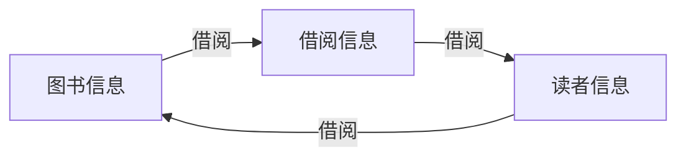

# 图书管理系统设计与实现

## 1. 背景介绍

### 1.1 图书管理系统的意义

图书管理系统是现代图书馆运营的核心，它可以有效地管理和组织大量的图书资源，提高图书馆的工作效率和服务质量。随着信息技术的快速发展，传统的人工管理模式已经无法满足现代图书馆的需求，开发一个功能完善、易于使用的图书管理系统成为了图书馆信息化建设的重要内容。

### 1.2 图书管理系统的主要功能

一个完整的图书管理系统通常包括以下主要功能：

1. 图书信息管理：包括图书的录入、修改、删除、查询等操作。
2. 读者信息管理：包括读者的注册、修改、删除、查询等操作。
3. 借阅管理：包括图书的借阅、归还、预约、续借等操作。
4. 统计报表：包括图书借阅统计、读者借阅统计、图书库存统计等。
5. 系统管理：包括用户权限管理、系统参数设置等。

### 1.3 图书管理系统的开发技术

图书管理系统的开发涉及多种技术，包括：

1. 前端技术：HTML、CSS、JavaScript等，用于构建系统的用户界面。
2. 后端技术：Java、Python、C#等，用于实现系统的业务逻辑。
3. 数据库技术：MySQL、Oracle、SQL Server等，用于存储和管理系统的数据。
4. 框架技术：Spring、Django、.NET等，用于提高系统的开发效率和可维护性。

## 2. 核心概念与联系

### 2.1 图书信息

图书信息是图书管理系统的核心数据之一，包括图书的编号、名称、作者、出版社、出版日期、ISBN、价格、分类等属性。这些属性之间存在一定的联系，例如，ISBN与图书的出版社和出版日期有关，分类与图书的主题和内容有关。

### 2.2 读者信息

读者信息是图书管理系统的另一个核心数据，包括读者的编号、姓名、性别、联系方式、身份证号、读者类型等属性。读者信息与图书信息之间存在借阅关系，即读者可以借阅图书，图书也可以被读者借阅。

### 2.3 借阅信息

借阅信息是连接图书信息和读者信息的桥梁，包括借阅编号、图书编号、读者编号、借阅日期、应还日期、实际还书日期、借阅状态等属性。借阅信息与图书信息和读者信息之间存在多对多的关系，即一本图书可以被多个读者借阅，一个读者也可以借阅多本图书。

### 2.4 概念关系图

下面使用Mermaid流程图来表示图书管理系统中的核心概念及其关系：



从图中可以看出，图书信息、读者信息和借阅信息之间存在着紧密的联系，它们共同构成了图书管理系统的核心数据模型。

## 3. 核心算法原理具体操作步骤

### 3.1 图书查询算法

图书查询是图书管理系统的一个重要功能，其核心算法是根据用户输入的查询条件，在图书信息表中查找符合条件的记录。具体操作步骤如下：

1. 用户输入查询条件，例如图书名称、作者、ISBN等。
2. 将查询条件解析成SQL语句，例如：
   
   ```sql
   SELECT * FROM book WHERE name LIKE '%Java%' AND author LIKE '%张三%'
   ```
   
3. 执行SQL语句，从数据库中查询符合条件的图书记录。
4. 将查询结果返回给用户界面，显示给用户。

### 3.2 图书借阅算法

图书借阅是图书管理系统的另一个重要功能，其核心算法是根据用户选择的图书和读者信息，在借阅信息表中创建一条新的借阅记录。具体操作步骤如下：

1. 用户选择要借阅的图书和读者信息。
2. 检查图书是否可借，读者是否可借。
3. 生成新的借阅记录，包括借阅编号、图书编号、读者编号、借阅日期、应还日期等信息。
4. 将新的借阅记录插入到借阅信息表中，例如：
   
   ```sql
   INSERT INTO borrow (id, book_id, reader_id, borrow_date, return_date) 
   VALUES (1, 1001, 2001, '2023-05-01', '2023-06-01')
   ```
   
5. 更新图书信息表中的库存量，将库存量减1。
6. 返回借阅成功的信息给用户界面，显示给用户。

### 3.3 图书归还算法

图书归还是图书借阅的逆向操作，其核心算法是根据用户选择的借阅记录，在借阅信息表中更新借阅状态，并在图书信息表中更新库存量。具体操作步骤如下：

1. 用户选择要归还的借阅记录。
2. 检查借阅记录是否存在，是否已经归还。
3. 更新借阅记录的实际还书日期和借阅状态，例如：
   
   ```sql
   UPDATE borrow SET return_date = '2023-05-10', status = 'returned' WHERE id = 1
   ```
   
4. 更新图书信息表中的库存量，将库存量加1。
5. 返回归还成功的信息给用户界面，显示给用户。

## 4. 数学模型和公式详细讲解举例说明

### 4.1 图书借阅期限计算模型

在图书管理系统中，图书的借阅期限通常是根据读者类型和图书类型来确定的。假设读者类型包括教师、学生和普通读者，图书类型包括普通图书和珍藏图书，则图书借阅期限可以用以下数学模型来表示：

$$
BorrowDays = 
\begin{cases}
30, & \text{if ReaderType = 'Teacher' and BookType = 'Normal'} \\
60, & \text{if ReaderType = 'Teacher' and BookType = 'Rare'} \\
15, & \text{if ReaderType = 'Student' and BookType = 'Normal'} \\
30, & \text{if ReaderType = 'Student' and BookType = 'Rare'} \\
10, & \text{if ReaderType = 'General' and BookType = 'Normal'} \\
20, & \text{if ReaderType = 'General' and BookType = 'Rare'}
\end{cases}
$$

其中，$BorrowDays$表示图书借阅期限，单位为天；$ReaderType$表示读者类型；$BookType$表示图书类型。

例如，如果一个教师借阅了一本普通图书，则借阅期限为30天；如果一个普通读者借阅了一本珍藏图书，则借阅期限为20天。

### 4.2 图书借阅费用计算模型

在有些图书管理系统中，图书借阅是需要收费的，借阅费用通常是根据图书的价格和借阅天数来计算的。假设借阅费用的计算公式如下：

$$
BorrowFee = 
\begin{cases}
0, & \text{if BorrowDays} \leq 30 \\
0.1 \times BookPrice \times (BorrowDays - 30), & \text{if BorrowDays} > 30
\end{cases}
$$

其中，$BorrowFee$表示图书借阅费用，单位为元；$BookPrice$表示图书价格，单位为元；$BorrowDays$表示实际借阅天数。

例如，如果一本价格为50元的图书，借阅了40天，则借阅费用为：

$$
BorrowFee = 0.1 \times 50 \times (40 - 30) = 5 \text{元}
$$

如果借阅天数不超过30天，则不收取借阅费用。

## 5. 项目实践：代码实例和详细解释说明

下面以Java语言为例，给出图书管理系统中的一些核心代码实例。

### 5.1 图书信息管理模块

```java
public class Book {
    private Long id;
    private String name;
    private String author;
    private String publisher;
    private String isbn;
    private Double price;
    private Integer stock;
    // 省略getter和setter方法
}

public interface BookDao {
    void add(Book book);
    void update(Book book);
    void delete(Long id);
    Book findById(Long id);
    List<Book> findByName(String name);
    List<Book> findAll();
}

public class BookDaoImpl implements BookDao {
    // 省略数据库连接和关闭代码
    
    @Override
    public void add(Book book) {
        String sql = "INSERT INTO book (name, author, publisher, isbn, price, stock) VALUES (?, ?, ?, ?, ?, ?)";
        // 执行SQL插入语句
    }
    
    @Override
    public void update(Book book) {
        String sql = "UPDATE book SET name = ?, author = ?, publisher = ?, isbn = ?, price = ?, stock = ? WHERE id = ?";
        // 执行SQL更新语句
    }
    
    @Override
    public void delete(Long id) {
        String sql = "DELETE FROM book WHERE id = ?";
        // 执行SQL删除语句
    }
    
    @Override
    public Book findById(Long id) {
        String sql = "SELECT * FROM book WHERE id = ?";
        // 执行SQL查询语句，返回Book对象
    }
    
    @Override
    public List<Book> findByName(String name) {
        String sql = "SELECT * FROM book WHERE name LIKE ?";
        // 执行SQL模糊查询语句，返回Book列表
    }
    
    @Override
    public List<Book> findAll() {
        String sql = "SELECT * FROM book";
        // 执行SQL查询语句，返回所有Book列表
    }
}
```

上面的代码定义了一个`Book`类，包含了图书的基本属性；定义了一个`BookDao`接口，包含了图书信息的增删改查操作；定义了一个`BookDaoImpl`类，实现了`BookDao`接口，使用JDBC操作数据库完成图书信息的增删改查。

### 5.2 图书借阅管理模块

```java
public class Borrow {
    private Long id;
    private Long bookId;
    private Long readerId;
    private Date borrowDate;
    private Date returnDate;
    private String status;
    // 省略getter和setter方法
}

public interface BorrowDao {
    void add(Borrow borrow);
    void update(Borrow borrow);
    Borrow findById(Long id);
    List<Borrow> findByReaderId(Long readerId);
    List<Borrow> findByBookId(Long bookId);
    List<Borrow> findAll();
}

public class BorrowDaoImpl implements BorrowDao {
    // 省略数据库连接和关闭代码
    
    @Override
    public void add(Borrow borrow) {
        String sql = "INSERT INTO borrow (book_id, reader_id, borrow_date, return_date, status) VALUES (?, ?, ?, ?, ?)";
        // 执行SQL插入语句
    }
    
    @Override
    public void update(Borrow borrow) {
        String sql = "UPDATE borrow SET return_date = ?, status = ? WHERE id = ?";
        // 执行SQL更新语句
    }
    
    @Override
    public Borrow findById(Long id) {
        String sql = "SELECT * FROM borrow WHERE id = ?";
        // 执行SQL查询语句，返回Borrow对象
    }
    
    @Override
    public List<Borrow> findByReaderId(Long readerId) {
        String sql = "SELECT * FROM borrow WHERE reader_id = ?";
        // 执行SQL查询语句，返回Borrow列表
    }
    
    @Override
    public List<Borrow> findByBookId(Long bookId) {
        String sql = "SELECT * FROM borrow WHERE book_id = ?";
        // 执行SQL查询语句，返回Borrow列表
    }
    
    @Override
    public List<Borrow> findAll() {
        String sql = "SELECT * FROM borrow";
        // 执行SQL查询语句，返回所有Borrow列表
    }
}
```

上面的代码定义了一个`Borrow`类，包含了图书借阅的基本属性；定义了一个`BorrowDao`接口，包含了图书借阅信息的增改查操作；定义了一个`BorrowDaoImpl`类，实现了`BorrowDao`接口，使用JDBC操作数据库完成图书借阅信息的增改查。

## 6. 实际应用场景

图书管理系统可以应用于各种类型的图书馆，包括学校图书馆、公共图书馆、专业图书馆等。下面以学校图书馆为例，介绍图书管理系统的实际应用场景。

### 6.1 学生借阅图书

学生可以通过图书管理系统查询图书信息，包括图书名称、作者、ISBN、库存量等。当学生找到