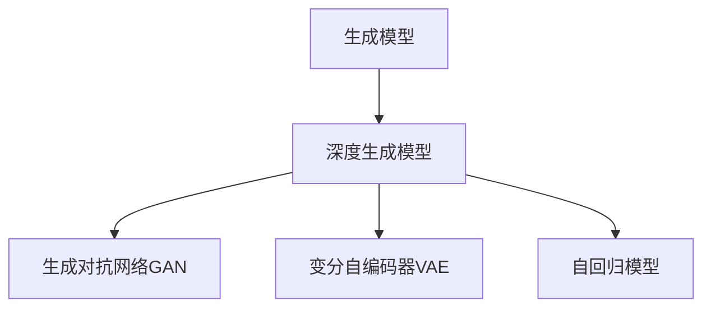

# 《图像生成：深度学习的技术难点》

## 1. 背景介绍
### 1.1 图像生成的重要性
在计算机视觉和人工智能领域,图像生成一直是一个充满挑战和机遇的研究方向。它涉及利用计算机算法和模型来生成逼真、多样化的图像,在诸如计算机图形学、虚拟现实、增强现实、医学成像等众多领域有着广泛的应用前景。图像生成技术的发展,不仅可以极大地提高图像内容创作的效率,还能够突破人类想象力和创造力的限制,创造出前所未有的视觉奇观。

### 1.2 深度学习在图像生成中的应用
近年来,随着深度学习技术的蓬勃发展,图像生成领域也迎来了革命性的突破。以生成对抗网络(GAN)、变分自编码器(VAE)为代表的深度生成模型,利用海量数据和强大的神经网络学习能力,实现了高质量、高分辨率图像的生成。与传统的图像生成方法相比,基于深度学习的方法具有更强的表达能力和灵活性,能够生成更加逼真、多样化的图像。

### 1.3 图像生成面临的技术难点
尽管深度学习在图像生成领域取得了瞩目的进展,但仍然存在诸多技术难点有待攻克:

1. 生成图像的真实性和多样性难以兼顾
2. 生成过程难以控制和解释
3. 训练过程不稳定,容易出现模式崩溃
4. 计算资源消耗大,训练时间长
5. 缺乏有效的评估指标和方法

本文将围绕这些技术难点,深入探讨图像生成领域的核心概念、算法原理、实践案例和未来发展方向,为读者提供全面、深入的认识和思考。

## 2. 核心概念与联系
### 2.1 生成模型
生成模型是一类重要的机器学习模型,旨在学习数据的分布,并根据学习到的分布生成新的数据样本。与判别模型不同,生成模型关注的是如何生成数据,而不是如何区分数据。在图像生成任务中,生成模型通过学习大量图像数据的分布,来生成新的、逼真的图像。

### 2.2 深度生成模型
深度生成模型是生成模型与深度学习技术的结合,利用深度神经网络强大的表达能力和学习能力来建模复杂的数据分布。典型的深度生成模型包括生成对抗网络(GAN)、变分自编码器(VAE)、自回归模型(如PixelRNN/CNN)等。这些模型在图像生成领域取得了广泛的成功和应用。

### 2.3 生成对抗网络(GAN)
生成对抗网络(GAN)是目前图像生成领域最具代表性和影响力的模型之一。GAN由生成器(Generator)和判别器(Discriminator)两部分组成,两者通过对抗训练的方式不断博弈,最终使生成器能够生成以假乱真的图像。GAN的核心思想在于利用判别器来指导生成器的优化,使生成图像尽可能接近真实图像的分布。

### 2.4 变分自编码器(VAE) 
变分自编码器(VAE)是另一类重要的深度生成模型,由编码器(Encoder)和解码器(Decoder)组成。VAE通过将输入图像映射到隐空间,并从隐空间重构图像,来学习图像数据的低维表示。与GAN不同,VAE采用变分推断的方法来优化模型,使重构图像与原始图像尽可能相似,同时使隐变量的分布接近于先验分布。

### 2.5 自回归模型
自回归模型是一类基于像素点概率分布建模的生成模型,代表性的模型包括PixelRNN和PixelCNN。这些模型将图像生成看作是一个序列生成问题,通过建模像素点之间的依赖关系,逐个像素地生成图像。自回归模型具有较强的表达能力,能够生成高质量的图像,但生成速度较慢。

### 2.6 核心概念之间的联系
下图展示了上述核心概念之间的联系:

深度生成模型是生成模型与深度学习的结合,其中GAN、VAE、自回归模型是三类代表性的深度生成模型,它们分别从不同的角度来建模和生成图像数据。这些模型相互补充,共同推动了图像生成技术的发展。

## 3. 核心算法原理与具体操作步骤
### 3.1 生成对抗网络(GAN)
#### 3.1.1 原理
GAN的核心思想是让两个神经网络相互博弈:生成器(Generator)试图生成以假乱真的图像欺骗判别器,而判别器(Discriminator)则试图区分真实图像和生成图像。在训练过程中,生成器和判别器不断地相互对抗、相互提升,最终使生成器能够生成高质量、逼真的图像。

#### 3.1.2 具体步骤
1. 初始化生成器G和判别器D的参数
2. 重复以下步骤直到收敛:
   a. 从真实图像数据集中采样一批图像 $\{x^{(1)}, \dots, x^{(m)}\}$
   b. 从先验分布(如高斯分布)中采样一批随机噪声 $\{z^{(1)}, \dots, z^{(m)}\}$
   c. 利用生成器G生成一批图像 $\{\tilde{x}^{(1)}, \dots, \tilde{x}^{(m)}\}$,其中 $\tilde{x}^{(i)} = G(z^{(i)})$
   d. 利用判别器D计算真实图像和生成图像的判别概率 $\{D(x^{(1)}), \dots, D(x^{(m)})\}$ 和 $\{D(\tilde{x}^{(1)}), \dots, D(\tilde{x}^{(m)})\}$
   e. 更新判别器D的参数,最大化目标函数:
      $$\max_D \frac{1}{m} \sum_{i=1}^m [\log D(x^{(i)}) + \log (1 - D(\tilde{x}^{(i)}))]$$
   f. 更新生成器G的参数,最小化目标函数:  
      $$\min_G \frac{1}{m} \sum_{i=1}^m \log (1 - D(G(z^{(i)})))$$

### 3.2 变分自编码器(VAE)
#### 3.2.1 原理
VAE通过编码器将输入图像映射到隐空间,再通过解码器从隐空间重构图像。其目标是最大化图像的边缘似然概率,同时使隐变量的后验分布接近于先验分布(通常为标准正态分布)。通过这种方式,VAE可以学习到图像数据的低维表示,并根据先验分布生成新的图像。

#### 3.2.2 具体步骤
1. 初始化编码器E和解码器D的参数
2. 重复以下步骤直到收敛:
   a. 从真实图像数据集中采样一批图像 $\{x^{(1)}, \dots, x^{(m)}\}$
   b. 利用编码器E将图像映射到隐空间,得到隐变量的均值和方差 $\{\mu^{(1)}, \dots, \mu^{(m)}\}$ 和 $\{\sigma^{(1)}, \dots, \sigma^{(m)}\}$
   c. 从隐变量的后验分布中采样一批隐变量 $\{z^{(1)}, \dots, z^{(m)}\}$,其中 $z^{(i)} \sim \mathcal{N}(\mu^{(i)}, \sigma^{(i)})$
   d. 利用解码器D将隐变量映射回图像空间,得到重构图像 $\{\tilde{x}^{(1)}, \dots, \tilde{x}^{(m)}\}$
   e. 计算重构损失和KL散度正则化项:
      $$\mathcal{L}_{rec} = \frac{1}{m} \sum_{i=1}^m \log p(x^{(i)} | z^{(i)})$$
      $$\mathcal{L}_{KL} = \frac{1}{m} \sum_{i=1}^m KL(\mathcal{N}(\mu^{(i)}, \sigma^{(i)}) || \mathcal{N}(0, I))$$
   f. 更新编码器E和解码器D的参数,最大化变分下界(ELBO):
      $$\max_{E,D} \mathcal{L}_{rec} - \mathcal{L}_{KL}$$

### 3.3 自回归模型
#### 3.3.1 原理
自回归模型将图像生成看作是一个序列生成问题,通过建模像素点之间的依赖关系,逐个像素地生成图像。具体而言,自回归模型学习像素点的条件概率分布 $p(x_i | x_1, \dots, x_{i-1})$,即每个像素点在给定前面像素点的条件下的概率分布。生成时,根据学习到的条件概率分布,逐个像素地采样生成图像。

#### 3.3.2 具体步骤
1. 初始化自回归模型(如PixelRNN或PixelCNN)的参数
2. 重复以下步骤直到收敛:
   a. 从真实图像数据集中采样一批图像 $\{x^{(1)}, \dots, x^{(m)}\}$
   b. 对每个图像 $x^{(i)}$,计算其像素点的条件概率 $p(x_j^{(i)} | x_1^{(i)}, \dots, x_{j-1}^{(i)})$
   c. 计算负对数似然损失:
      $$\mathcal{L} = -\frac{1}{m} \sum_{i=1}^m \sum_{j=1}^n \log p(x_j^{(i)} | x_1^{(i)}, \dots, x_{j-1}^{(i)})$$
   d. 更新模型参数,最小化损失函数:
      $$\min_{\theta} \mathcal{L}$$
3. 生成图像时,根据学习到的条件概率分布,逐个像素地采样生成图像。

## 4. 数学模型和公式详细讲解举例说明
### 4.1 生成对抗网络(GAN)的数学模型
GAN的数学模型可以表示为一个极小极大博弈问题:

$$\min_G \max_D V(D, G) = \mathbb{E}_{x \sim p_{data}(x)}[\log D(x)] + \mathbb{E}_{z \sim p_z(z)}[\log (1 - D(G(z)))]$$

其中,$G$表示生成器,$D$表示判别器,$p_{data}$表示真实图像的分布,$p_z$表示先验噪声分布。

这个公式可以理解为:判别器D试图最大化真实图像的对数概率和生成图像的负对数概率之和,而生成器G试图最小化生成图像被判别器判定为假的对数概率。通过这种对抗训练,生成器和判别器不断地相互提升,最终达到纳什均衡,使生成器能够生成与真实图像分布接近的图像。

举例说明:假设我们要训练一个GAN模型来生成手写数字图像。首先,我们准备一批真实的手写数字图像作为训练数据。然后,我们随机初始化生成器G和判别器D的参数。在训练过程中,我们交替地更新生成器和判别器:

1. 固定生成器G,更新判别器D,最大化目标函数:
   $$\max_D V(D, G) = \mathbb{E}_{x \sim p_{data}(x)}[\log D(x)] + \mathbb{E}_{z \sim p_z(z)}[\log (1 - D(G(z)))]$$
   即最大化真实图像的对数概率和生成图像的负对数概率之和。

2. 固定判别器D,更新生成器G,最小化目标函数:
   $$\min_G V(D, G) = \mathbb{E}_{z \sim p_z(z)}[\log (1 - D(G(z)))]$$
   即最小化生成图像被判别器判定为假的对数概率。

通过不断地重复这个过程,生成器G会逐渐学会生成越来越逼真的手写数字图像,而判别器D则会越来越难以区分真实图像和生成图像。最终