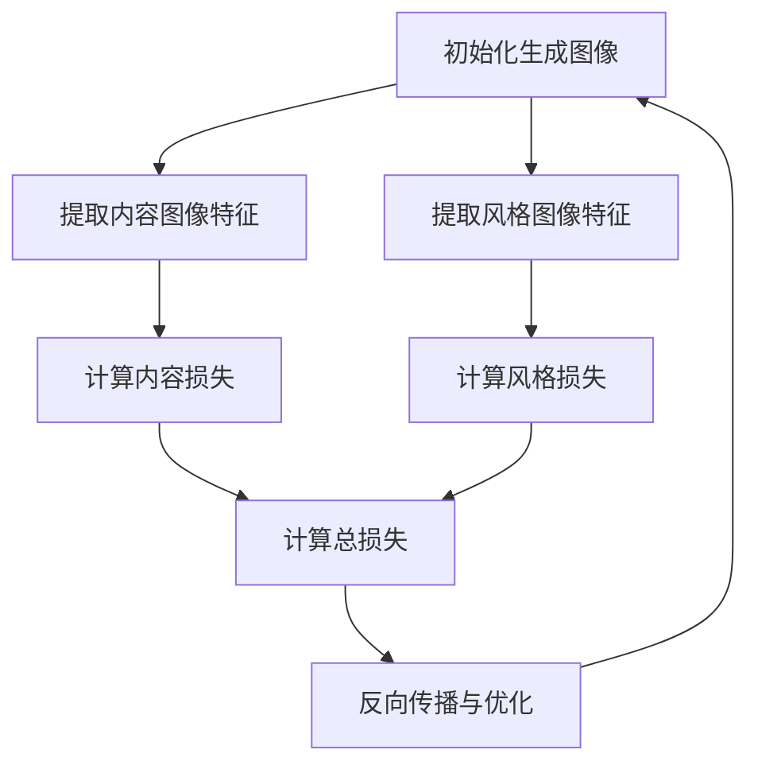

# 图像风格迁移(Style Transfer)原理与代码实战案例讲解

## 1.背景介绍

图像风格迁移（Style Transfer）是一种计算机视觉技术，它能够将一幅图像的内容与另一幅图像的风格相结合，生成一幅新的图像。这项技术最早由Gatys等人在2015年提出，并迅速在学术界和工业界引起了广泛关注。风格迁移的应用场景非常广泛，包括艺术创作、图像增强、广告设计等。

## 2.核心概念与联系

### 2.1 内容图像与风格图像

- **内容图像**：包含我们希望保留的主要结构和物体的图像。
- **风格图像**：包含我们希望应用到内容图像上的艺术风格的图像。

### 2.2 卷积神经网络（CNN）

卷积神经网络是风格迁移的核心工具。通过使用预训练的CNN（如VGG-19），我们可以提取图像的内容特征和风格特征。

### 2.3 损失函数

风格迁移的关键在于定义一个损失函数，该函数衡量生成图像与内容图像和风格图像的相似度。损失函数通常包括内容损失和风格损失两部分。

## 3.核心算法原理具体操作步骤

### 3.1 初始化

首先，我们需要初始化生成图像。通常，我们将内容图像作为初始图像。

### 3.2 特征提取

使用预训练的CNN（如VGG-19）提取内容图像和风格图像的特征。具体来说，我们会选择网络中的某些层来提取特征。

### 3.3 损失计算

计算内容损失和风格损失。内容损失衡量生成图像与内容图像在特定层的特征相似度，风格损失衡量生成图像与风格图像在特定层的特征相似度。

### 3.4 反向传播与优化

通过反向传播算法，调整生成图像的像素值，使得总损失最小化。常用的优化算法包括L-BFGS和Adam。



## 4.数学模型和公式详细讲解举例说明

### 4.1 内容损失

内容损失衡量生成图像与内容图像在特定层的特征相似度。假设 $P$ 是内容图像，$F$ 是生成图像，$P^l$ 和 $F^l$ 分别表示在第 $l$ 层的特征表示，则内容损失定义为：

$$
L_{content}^l = \frac{1}{2} \sum_{i,j} (F_{ij}^l - P_{ij}^l)^2
$$

### 4.2 风格损失

风格损失衡量生成图像与风格图像在特定层的特征相似度。我们使用Gram矩阵来表示风格特征。假设 $A$ 是风格图像，$G$ 是生成图像，$A^l$ 和 $G^l$ 分别表示在第 $l$ 层的特征表示，则风格损失定义为：

$$
L_{style}^l = \frac{1}{4N_l^2M_l^2} \sum_{i,j} (G_{ij}^l - A_{ij}^l)^2
$$

其中，$N_l$ 和 $M_l$ 分别表示第 $l$ 层特征图的通道数和空间维度。

### 4.3 总损失

总损失是内容损失和风格损失的加权和：

$$
L_{total} = \alpha L_{content} + \beta L_{style}
$$

其中，$\alpha$ 和 $\beta$ 是权重参数，用于平衡内容和风格的影响。

## 5.项目实践：代码实例和详细解释说明

### 5.1 环境准备

首先，我们需要安装必要的Python库：

```bash
pip install torch torchvision pillow
```

### 5.2 导入库和加载图像

```python
import torch
import torch.nn as nn
import torch.optim as optim
from torchvision import models, transforms
from PIL import Image
import matplotlib.pyplot as plt

def load_image(image_path, max_size=400, shape=None):
    image = Image.open(image_path).convert('RGB')
    size = max_size if max(image.size) > max_size else max(image.size)
    if shape is not None:
        size = shape
    in_transform = transforms.Compose([
        transforms.Resize(size),
        transforms.ToTensor(),
        transforms.Normalize((0.485, 0.456, 0.406), 
                             (0.229, 0.224, 0.225))])
    image = in_transform(image)[:3, :, :].unsqueeze(0)
    return image

content = load_image('path_to_content_image.jpg')
style = load_image('path_to_style_image.jpg', shape=content.shape[-2:])
```

### 5.3 定义模型

我们使用预训练的VGG-19模型，并提取中间层的特征：

```python
class VGG(nn.Module):
    def __init__(self):
        super(VGG, self).__init__()
        self.chosen_features = ['0', '5', '10', '19', '28']
        self.model = models.vgg19(pretrained=True).features[:29]

    def forward(self, x):
        features = []
        for layer_num, layer in enumerate(self.model):
            x = layer(x)
            if str(layer_num) in self.chosen_features:
                features.append(x)
        return features

model = VGG().to(device).eval()
```

### 5.4 定义损失函数

```python
def gram_matrix(tensor):
    _, d, h, w = tensor.size()
    tensor = tensor.view(d, h * w)
    gram = torch.mm(tensor, tensor.t())
    return gram

def get_loss(gen_features, orig_features, style_grams):
    content_loss = torch.mean((gen_features[1] - orig_features[1]) ** 2)
    style_loss = 0
    for gen, style in zip(gen_features, style_grams):
        gram_gen = gram_matrix(gen)
        style_loss += torch.mean((gram_gen - style) ** 2)
    return content_loss + style_loss
```

### 5.5 优化生成图像

```python
generated = content.clone().requires_grad_(True)
optimizer = optim.Adam([generated], lr=0.003)

for step in range(2000):
    gen_features = model(generated)
    orig_features = model(content)
    style_features = model(style)
    style_grams = [gram_matrix(feature) for feature in style_features]
    
    total_loss = get_loss(gen_features, orig_features, style_grams)
    
    optimizer.zero_grad()
    total_loss.backward()
    optimizer.step()
    
    if step % 500 == 0:
        print(f'Step {step}, Total loss {total_loss.item()}')
```

### 5.6 显示结果

```python
def im_convert(tensor):
    image = tensor.to("cpu").clone().detach()
    image = image.numpy().squeeze()
    image = image.transpose(1, 2, 0)
    image = image * np.array((0.229, 0.224, 0.225)) + np.array((0.485, 0.456, 0.406))
    image = image.clip(0, 1)
    return image

plt.imshow(im_convert(generated))
plt.show()
```

## 6.实际应用场景

### 6.1 艺术创作

风格迁移可以用于将普通照片转换为具有特定艺术风格的图像，广泛应用于数字艺术创作。

### 6.2 图像增强

在图像处理领域，风格迁移可以用于增强图像的视觉效果，例如将低质量图像转换为高质量图像。

### 6.3 广告设计

广告设计师可以使用风格迁移技术快速生成具有特定风格的广告图像，提高设计效率。

## 7.工具和资源推荐

### 7.1 工具

- **PyTorch**：一个强大的深度学习框架，适用于实现风格迁移。
- **TensorFlow**：另一个流行的深度学习框架，也可以用于风格迁移。

### 7.2 资源

- **预训练模型**：如VGG-19，可以从PyTorch或TensorFlow的模型库中下载。
- **开源项目**：GitHub上有许多开源的风格迁移项目，可以参考和学习。

## 8.总结：未来发展趋势与挑战

风格迁移技术在过去几年中取得了显著进展，但仍然面临一些挑战。例如，如何在保持高质量的同时提高计算效率，如何处理视频中的风格迁移等。未来，随着深度学习技术的不断发展，我们可以期待风格迁移在更多领域中的应用。

## 9.附录：常见问题与解答

### 9.1 为什么我的生成图像质量不高？

可能的原因包括：优化步骤不足、学习率设置不当、损失函数权重不平衡等。

### 9.2 如何选择合适的内容和风格图像？

内容图像应具有清晰的结构和物体，风格图像应具有明显的艺术风格和纹理。

### 9.3 如何提高风格迁移的计算效率？

可以使用更高效的优化算法，或者在GPU上进行计算。

---

作者：禅与计算机程序设计艺术 / Zen and the Art of Computer Programming