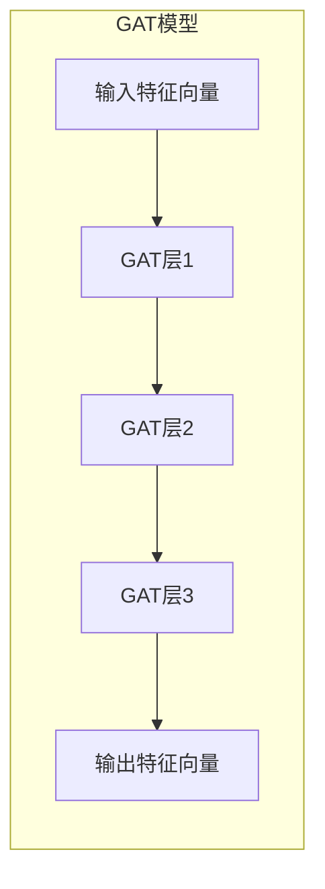

# 图注意力网络(GAT)原理与代码实战案例讲解

## 1.背景介绍

### 1.1 图神经网络概述

在过去几年中,图神经网络(Graph Neural Networks, GNNs)已经成为机器学习领域的一个研究热点。图是一种通用的数据结构,可以自然地表示具有复杂拓扑结构和属性的数据,例如社交网络、生物网络、交通网络等。与传统的机器学习算法相比,图神经网络可以直接对图结构数据进行建模,从而更好地捕捉数据中的模式和关系。

图神经网络的基本思想是将节点的特征向量与邻居节点的特征向量进行聚合,从而学习节点的表示。通过层层传播和聚合,图神经网络可以捕捉图结构中节点之间的依赖关系,并生成节点级别和图级别的表示。

### 1.2 注意力机制在图神经网络中的应用

尽管图神经网络取得了令人瞩目的成就,但早期的图神经网络模型存在一些局限性。例如,在聚合邻居节点特征时,通常采用简单的平均或求和操作,无法充分捕捉不同邻居节点对中心节点的不同重要性。另一方面,传统的图神经网络模型通常只考虑节点的直接邻居,而忽略了图中可能存在的长程依赖关系。

为了解决这些问题,注意力机制(Attention Mechanism)被引入到图神经网络中。注意力机制允许模型自适应地为不同的邻居节点分配不同的权重,从而更好地捕捉图结构中的重要信息。基于注意力机制的图神经网络模型不仅可以学习节点之间的短程依赖关系,还可以捕捉长程依赖关系,提高模型的表现力。

### 1.3 图注意力网络(GAT)概述

图注意力网络(Graph Attention Network, GAT)是一种基于自注意力机制的图神经网络模型,由Petar Veličković等人在2017年提出。GAT通过自注意力机制为每个节点的邻居节点分配不同的重要性权重,从而更好地捕捉图结构中的重要信息。与传统的图神经网络相比,GAT具有以下优点:

1. **自适应权重分配**:GAT可以自适应地为不同的邻居节点分配不同的重要性权重,而不是简单地对所有邻居节点进行平均或求和操作。

2. **长程依赖关系建模**:GAT可以通过多头注意力机制捕捉图结构中的长程依赖关系,而不仅限于直接邻居节点。

3. **可解释性**:GAT学习的注意力权重可以解释不同邻居节点对中心节点的重要性,提高了模型的可解释性。

GAT已被广泛应用于各种图数据挖掘任务,如节点分类、链接预测、图聚类等,并取得了优异的性能表现。

## 2.核心概念与联系

### 2.1 图神经网络基本概念

在介绍图注意力网络的核心概念之前,我们先回顾一下图神经网络的基本概念。

**图数据表示**:图数据通常由一组节点(nodes)和连接节点的边(edges)组成。每个节点可以携带一个特征向量,表示该节点的属性信息。边可以是无权重的,也可以携带一个权重值,表示节点之间关系的强度。

**邻居聚合**:图神经网络的核心思想是通过邻居聚合(neighbor aggregation)来学习节点的表示。具体来说,每个节点的新表示是由其自身的特征向量和邻居节点的特征向量聚合而成。

**信息传播**:图神经网络通过层层传播和聚合,将节点的局部邻居信息传递到全局,从而学习节点级别和图级别的表示。

**消息传递框架**:图神经网络的计算过程可以概括为消息传递框架(Message Passing Framework),包括以下三个步骤:

1. **Message Construction**:根据中心节点和邻居节点的特征向量,构建消息向量。
2. **Message Aggregation**:将所有邻居节点的消息向量进行聚合,得到中心节点的聚合消息向量。
3. **State Update**:根据中心节点的原始特征向量和聚合消息向量,更新中心节点的状态(即新的特征向量)。

### 2.2 注意力机制在图神经网络中的应用

注意力机制最初是在序列数据建模任务中被引入,用于自适应地为不同的输入元素分配不同的重要性权重。在图神经网络中,注意力机制被用于为不同的邻居节点分配不同的重要性权重,从而更好地捕捉图结构中的重要信息。

具体来说,在图神经网络的消息传递框架中,注意力机制可以应用于以下两个步骤:

1. **Message Construction**:在构建消息向量时,可以为每个邻居节点分配一个注意力权重,表示该邻居节点对中心节点的重要性。

2. **Message Aggregation**:在聚合邻居节点的消息向量时,可以根据注意力权重对消息向量进行加权求和,而不是简单的平均或求和操作。

引入注意力机制后,图神经网络不仅可以学习节点之间的短程依赖关系,还可以捕捉长程依赖关系。此外,注意力权重可以解释不同邻居节点对中心节点的重要性,提高了模型的可解释性。

### 2.3 图注意力网络(GAT)的核心概念

图注意力网络(GAT)是一种基于自注意力机制的图神经网络模型。GAT的核心概念包括:

1. **自注意力机制**:GAT采用了自注意力机制,即注意力权重是通过中心节点和邻居节点的特征向量计算得到的,而不是预先设定的固定权重。

2. **多头注意力**:为了捕捉不同类型的邻居依赖关系,GAT引入了多头注意力机制。每个注意力头都可以学习不同的注意力权重分布,最终将多个注意力头的结果进行拼接。

3. **掩码注意力**:为了防止注意力权重分配到不存在的边上,GAT采用了掩码注意力机制,将不存在边的注意力权重设置为一个非常小的值或者直接屏蔽掉。

4. **注意力权重共享**:为了减少参数量和提高泛化能力,GAT在同一层内共享注意力权重,即对于同一层内的所有节点,使用相同的注意力权重计算方式。

通过上述核心概念,GAT可以自适应地为不同的邻居节点分配不同的重要性权重,从而更好地捕捉图结构中的重要信息,并捕捉长程依赖关系。

## 3.核心算法原理具体操作步骤

### 3.1 GAT层的计算过程

GAT的计算过程可以概括为以下几个步骤:

1. **线性变换**:对输入节点特征向量进行线性变换,得到新的特征向量表示。

   $$\mathbf{h}_i' = \mathbf{W}\mathbf{h}_i$$

   其中,$\mathbf{h}_i$是节点$i$的输入特征向量,$\mathbf{W}$是可学习的权重矩阵,$\mathbf{h}_i'$是经过线性变换后的新特征向量。

2. **计算注意力权重**:计算中心节点$i$对邻居节点$j$的注意力权重$\alpha_{ij}$。注意力权重是通过中心节点和邻居节点的特征向量计算得到的,具体计算公式如下:

   $$\alpha_{ij} = \mathrm{softmax}_j\left(\frac{(\mathbf{a}^{\top}[\mathbf{W}\mathbf{h}_i\,\|\,\mathbf{W}\mathbf{h}_j]))}{\sqrt{d}}\right)$$

   其中,$\mathbf{a}$是可学习的注意力向量,$\|$表示向量拼接操作,$d$是特征向量的维度,softmax函数用于对注意力权重进行归一化。

3. **多头注意力**:为了捕捉不同类型的邻居依赖关系,GAT采用了多头注意力机制。具体来说,对于$K$个注意力头,第$k$个注意力头的计算过程如下:

   $$\mathbf{h}_i^{(k)} = \sigma\left(\sum_{j\in\mathcal{N}(i)}\alpha_{ij}^{(k)}\mathbf{W}^{(k)}\mathbf{h}_j\right)$$

   其中,$\mathcal{N}(i)$表示节点$i$的邻居节点集合,$\alpha_{ij}^{(k)}$是第$k$个注意力头计算得到的注意力权重,$\mathbf{W}^{(k)}$是第$k$个注意力头的可学习权重矩阵,$\sigma$是非线性激活函数(如ReLU)。

   最终,将$K$个注意力头的结果拼接起来,得到节点$i$的新特征向量表示:

   $$\mathbf{h}_i' = \,\|\,_{k=1}^K\mathbf{h}_i^{(k)}$$

4. **掩码注意力**:为了防止注意力权重分配到不存在的边上,GAT采用了掩码注意力机制。具体来说,对于不存在边的节点对$(i,j)$,将其注意力权重$\alpha_{ij}$设置为一个非常小的值或者直接屏蔽掉。

5. **注意力权重共享**:为了减少参数量和提高泛化能力,GAT在同一层内共享注意力权重,即对于同一层内的所有节点,使用相同的注意力权重计算方式。

通过上述步骤,GAT可以自适应地为不同的邻居节点分配不同的重要性权重,从而更好地捕捉图结构中的重要信息,并捕捉长程依赖关系。

### 3.2 GAT模型架构

GAT模型通常由多个GAT层堆叠而成,每一层的输出作为下一层的输入。具体来说,GAT模型的架构如下:

其中,每一个GAT层的计算过程如上一小节所述。通过多层堆叠,GAT可以逐步捕捉更高层次的图结构信息,并生成更加丰富的节点表示。

需要注意的是,为了防止过拟合,GAT模型通常会在每一层之后添加dropout正则化,并在最后一层之后添加一个预测头(prediction head),用于特定的下游任务,如节点分类、链接预测等。

## 4.数学模型和公式详细讲解举例说明

在上一节中,我们介绍了GAT的核心算法原理和计算步骤。现在,我们将更加详细地讲解GAT中涉及的数学模型和公式,并给出具体的例子说明。

### 4.1 线性变换

在GAT的计算过程中,首先需要对输入节点特征向量进行线性变换,得到新的特征向量表示。具体公式如下:

$$\mathbf{h}_i' = \mathbf{W}\mathbf{h}_i$$

其中,$\mathbf{h}_i$是节点$i$的输入特征向量,$\mathbf{W}$是可学习的权重矩阵,$\mathbf{h}_i'$是经过线性变换后的新特征向量。

例如,假设节点$i$的输入特征向量$\mathbf{h}_i$是一个3维向量$[0.5, 0.2, 0.7]^{\top}$,权重矩阵$\mathbf{W}$是一个$2\times3$的矩阵:

$$\mathbf{W} = \begin{pmatrix}
0.1 & 0.2 & 0.3\\
0.4 & 0.5 & 0.6
\end{pmatrix}$$

那么,经过线性变换后,节点$i$的新特征向量$\mathbf{h}_i'$为:

$$\mathbf{h}_i' = \mathbf{W}\mathbf{h}_i = \begin{pmatrix}
0.1 & 0.2 & 0.3\\
0.4 & 0.5 & 0.6
\end{pmatrix}\begin{pmatrix}
0.5\\
0.2\\
0.7
\end{pmatrix} = \begin{pmatrix}