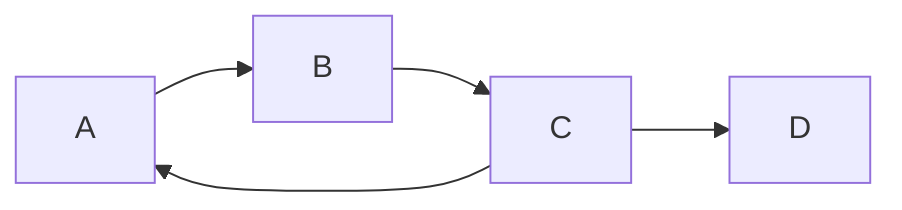

# 图的类型：无向图、有向图、加权图、树

## 1. 背景介绍
图论是数学的一个分支，它研究图的性质和图之间的关系。在计算机科学中，图论的概念被广泛应用于数据结构和算法设计中，尤其是在网络路由、社交网络、推荐系统等领域。图可以根据其性质被分类为无向图、有向图、加权图和树，每种类型的图都有其独特的特点和应用场景。

## 2. 核心概念与联系

### 2.1 无向图
无向图是图的一种基本形式，它由一组顶点和连接这些顶点的边组成。在无向图中，边没有方向，表示顶点之间的双向关系。

```mermaid
graph LR
    A -- B
    B -- C
    A -- C
    C -- D
```

### 2.2 有向图
与无向图不同，有向图的边具有方向，表示从一个顶点到另一个顶点的单向关系。



### 2.3 加权图
加权图是图的一种扩展，每条边都赋予了一个权重，这个权重可以表示成本、距离或任何其他的度量标准。

```mermaid
graph LR
    A -- 5 -- B
    B -- 3 -- C
    A -- 4 -- C
    C -- 2 -- D
```

### 2.4 树
树是一种特殊的图，它是一个无环连通图。在树中，任意两个顶点之间有且仅有一条路径。

```mermaid
graph TD
    A -- B
    A -- C
    B -- D
    B -- E
    C -- F
```

## 3. 核心算法原理具体操作步骤

### 3.1 图的遍历
图的遍历是图算法中的基础，主要有深度优先搜索（DFS）和广度优先搜索（BFS）两种方法。

#### 3.1.1 深度优先搜索（DFS）
DFS算法会尽可能深地搜索图的分支。

```mermaid
graph LR
    A -- B
    A -- C
    B -- D
    B -- E
    C -- F
    D -- G
```

操作步骤：
1. 从一个顶点开始，访问其任一相邻的未访问顶点。
2. 沿当前顶点的边继续执行步骤1，直到所有顶点都被访问。
3. 若当前顶点的所有相邻顶点都已访问，回退到上一个顶点。
4. 重复步骤1至3，直到所有顶点都被访问。

#### 3.1.2 广度优先搜索（BFS）
BFS算法会在图中按层次遍历顶点。

操作步骤：
1. 从一个顶点开始，访问其所有相邻的未访问顶点。
2. 对于每一个已访问的顶点，再访问其所有相邻的未访问顶点。
3. 重复步骤2，直到所有顶点都被访问。

## 4. 数学模型和公式详细讲解举例说明

### 4.1 图的表示
图可以通过邻接矩阵或邻接表来表示。

#### 4.1.1 邻接矩阵
邻接矩阵是一个二维数组，其中的元素表示顶点之间是否有边。

$$
A_{ij} = \begin{cases}
1, & \text{如果顶点 } i \text{ 和顶点 } j \text{ 之间有边} \\
0, & \text{否则}
\end{cases}
$$

#### 4.1.2 邻接表
邻接表是一个数组，其中的每个元素是一个列表，表示与该顶点相邻的所有顶点。

### 4.2 加权图的最短路径
在加权图中，最短路径问题是找到顶点间权重和最小的路径。

#### 4.2.1 Dijkstra算法
Dijkstra算法是解决加权图中单源最短路径问题的算法。

$$
D(v) = \min(D(u) + w(u, v))
$$

其中，$D(v)$ 是从源顶点到顶点 $v$ 的最短路径长度，$w(u, v)$ 是顶点 $u$ 到顶点 $v$ 的边的权重。

## 5. 项目实践：代码实例和详细解释说明

### 5.1 无向图的创建和遍历

```python
# 无向图的表示
class Graph:
    def __init__(self, vertices):
        self.V = vertices
        self.graph = defaultdict(list)

    def add_edge(self, u, v):
        self.graph[u].append(v)
        self.graph[v].append(u)

# DFS遍历
def DFS(graph, v, visited):
    visited[v] = True
    print(v, end=' ')
    for neighbour in graph.graph[v]:
        if not visited[neighbour]:
            DFS(graph, neighbour, visited)

# 创建图实例
g = Graph(4)
g.add_edge(0, 1)
g.add_edge(0, 2)
g.add_edge(1, 2)
g.add_edge(2, 3)

visited = [False] * g.V
DFS(g, 2, visited)
```

### 5.2 有向图的创建和拓扑排序

```python
# 有向图的表示
class Graph:
    def __init__(self, vertices):
        self.V = vertices
        self.graph = defaultdict(list)

    def add_edge(self, u, v):
        self.graph[u].append(v)

# 拓扑排序
def topological_sort(graph):
    in_degree = [0] * graph.V
    for i in graph.graph:
        for j in graph.graph[i]:
            in_degree[j] += 1
    queue = deque()
    for i in range(graph.V):
        if in_degree[i] == 0:
            queue.append(i)
    while queue:
        u = queue.popleft()
        print(u, end=' ')
        for v in graph.graph[u]:
            in_degree[v] -= 1
            if in_degree[v] == 0:
                queue.append(v)

# 创建图实例
g = Graph(6)
g.add_edge(5, 2)
g.add_edge(5, 0)
g.add_edge(4, 0)
g.add_edge(4, 1)
g.add_edge(2, 3)
g.add_edge(3, 1)

topological_sort(g)
```

### 5.3 加权图的最短路径算法

```python
# 加权图的表示
class Graph:
    def __init__(self, vertices):
        self.V = vertices
        self.graph = defaultdict(list)

    def add_edge(self, u, v, w):
        self.graph[u].append((v, w))

# Dijkstra算法
def dijkstra(graph, src):
    dist = [float("inf")] * graph.V
    dist[src] = 0
    pq = [(0, src)]
    while pq:
        (distance, u) = heapq.heappop(pq)
        for v, w in graph.graph[u]:
            if dist[v] > dist[u] + w:
                dist[v] = dist[u] + w
                heapq.heappush(pq, (dist[v], v))
    return dist

# 创建图实例
g = Graph(9)
g.add_edge(0, 1, 4)
g.add_edge(0, 7, 8)
g.add_edge(1, 2, 8)
g.add_edge(1, 7, 11)
g.add_edge(2, 3, 7)
g.add_edge(2, 8, 2)
g.add_edge(2, 5, 4)
g.add_edge(3, 4, 9)
g.add_edge(3, 5, 14)
g.add_edge(4, 5, 10)
g.add_edge(5, 6, 2)
g.add_edge(6, 7, 1)
g.add_edge(6, 8, 6)
g.add_edge(7, 8, 7)

distances = dijkstra(g, 0)
print(distances)
```

## 6. 实际应用场景

图的概念和算法在现实世界中有广泛的应用：

- **社交网络分析**：无向图用于表示用户之间的友谊关系。
- **网络路由**：有向图和加权图用于表示网络中的路由和路径成本。
- **组织结构图**：树状结构用于表示公司的组织架构。
- **推荐系统**：加权图用于表示用户和产品之间的关系，以及用户的偏好。

## 7. 工具和资源推荐

- **Graphviz**：一个开源图形可视化软件，可以帮助设计者通过简单的文本语言来描述复杂的图形结构。
- **NetworkX**：一个用于创建、操作和研究复杂网络的Python库。
- **Gephi**：一个开源的网络分析和可视化软件包。

## 8. 总结：未来发展趋势与挑战

图论和图算法在计算机科学中的重要性将继续增长，特别是在数据科学和人工智能领域。未来的发展趋势可能包括图的大规模并行处理、动态图算法以及图嵌入技术。同时，随着图数据的规模越来越大，如何高效地存储和处理大规模图数据将是一个挑战。

## 9. 附录：常见问题与解答

- **Q1：无向图和有向图有什么区别？**
  - A1：无向图的边没有方向，表示顶点之间的双向关系；有向图的边有方向，表示顶点之间的单向关系。
  
- **Q2：如何选择图的存储结构？**
  - A2：选择图的存储结构取决于图的大小和操作的类型。邻接矩阵适合稠密图，而邻接表适合稀疏图。

- **Q3：加权图中的权重可以是负数吗？**
  - A3：是的，加权图中的权重可以是负数，但这可能会导致算法（如Dijkstra算法）无法正确工作。对于包含负权重的图，可以使用Bellman-Ford算法。

作者：禅与计算机程序设计艺术 / Zen and the Art of Computer Programming