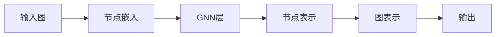

# 图神经网络(Graph Neural Network)原理与代码实战案例讲解

## 1. 背景介绍

### 1.1 图数据的重要性

在现实世界中,许多数据都可以用图(Graph)的形式来表示,例如社交网络、交通网络、分子结构、知识图谱等。图数据蕴含着丰富的结构信息和关系信息,挖掘这些信息对于许多应用场景都有重要意义,如社交网络分析、推荐系统、药物发现等。

### 1.2 传统机器学习方法的局限性

传统的机器学习方法如支持向量机(SVM)、随机森林等主要针对欧几里得空间中的结构化数据,很难直接应用于图数据。图数据通常是非欧几里得的,且具有复杂的拓扑结构和节点关系,传统方法难以有效建模。

### 1.3 深度学习与图数据

深度学习技术的发展为处理图数据提供了新的思路。一些经典的深度学习模型如卷积神经网络(CNN)已经在图像、文本等领域取得了巨大成功。研究者们开始探索如何将深度学习与图数据结合,发展出一系列图神经网络(Graph Neural Network, GNN)模型。

### 1.4 GNN的应用前景

GNN能够有效地学习图数据中蕴含的特征信息,已经在许多任务中展现出优异的性能,如节点分类、链接预测、图分类等。GNN有望在社交网络、推荐系统、生物医药、金融风控等众多领域得到广泛应用。

## 2. 核心概念与联系

### 2.1 图的基本概念

- 节点(Node):图中的基本单元,表示实体对象
- 边(Edge):连接节点的链接,表示实体间的关系
- 属性(Attribute):节点或边的属性信息,如节点的特征向量
- 邻域(Neighborhood):节点的邻居节点集合

### 2.2 图神经网络的核心思想

GNN的核心思想是通过迭代的信息传递和聚合,学习节点的隐藏状态(Hidden State),得到节点的低维向量表示。具体而言:

1. 每个节点聚合其邻居节点的信息来更新自身的隐藏状态
2. 多次迭代上述过程,使节点能捕获多跳(multi-hop)的结构信息
3. 将节点的隐藏状态输出作为节点的嵌入表示(Embedding),用于下游任务

### 2.3 GNN与图算法的联系

GNN与一些经典图算法有着内在联系,如:

- 随机游走(Random Walk):类似于在图上进行节点序列采样
- Weisfeiler-Lehman 核:迭代地聚合节点的邻域信息,类似GNN的信息传递
- 谱聚类(Spectral Clustering):基于图的拉普拉斯矩阵,与一些基于谱的GNN方法相通

理解这些联系有助于更好地理解GNN的原理。

### 2.4 GNN框架概览



如上图所示,GNN的基本框架可概括为:

1. 将输入图转化为初始的节点嵌入
2. 通过一系列GNN层迭代更新节点表示
3. 根据任务需要,可将节点表示聚合为图表示
4. 将输出用于节点分类、链接预测等下游任务

## 3. 核心算法原理具体操作步骤

### 3.1 图卷积网络(GCN)

GCN是最经典的GNN模型之一,其核心是通过聚合一阶邻域的信息来更新节点表示。

#### 3.1.1 GCN的前向传播

$$
H^{(l+1)} = \sigma(\tilde{D}^{-\frac{1}{2}} \tilde{A} \tilde{D}^{-\frac{1}{2}} H^{(l)} W^{(l)})
$$

其中:
- $H^{(l)}$是第$l$层的节点表示矩阵
- $\tilde{A}=A+I$是加入自环的邻接矩阵
- $\tilde{D}$是$\tilde{A}$的度矩阵
- $W^{(l)}$是第$l$层的权重矩阵
- $\sigma$是激活函数,如ReLU

#### 3.1.2 GCN的训练过程

1. 输入:图的邻接矩阵$A$,节点特征矩阵$X$
2. 计算归一化的邻接矩阵$\tilde{D}^{-\frac{1}{2}} \tilde{A} \tilde{D}^{-\frac{1}{2}}$
3. 将$X$作为初始节点表示$H^{(0)}$
4. 迭代$L$层GCN前向传播
5. 将最后一层输出$H^{(L)}$用于节点分类等任务
6. 通过反向传播优化模型参数$W^{(l)}$

### 3.2 图注意力网络(GAT)

GAT是一种基于注意力机制的GNN模型,能够为不同邻居节点分配不同的权重。

#### 3.2.1 GAT的注意力机制

$$
e_{ij} = a(Wh_i, Wh_j)
$$

$$
\alpha_{ij} = \frac{\exp(e_{ij})}{\sum_{k \in \mathcal{N}_i} \exp(e_{ik})}
$$

其中:
- $e_{ij}$是节点$i$对节点$j$的注意力系数
- $a$是注意力机制函数,如拼接后接MLP
- $\alpha_{ij}$是归一化后的注意力权重
- $\mathcal{N}_i$是节点$i$的邻居节点集合

#### 3.2.2 GAT的前向传播

$$
h_i^{(l+1)} = \sigma\left(\sum_{j \in \mathcal{N}_i} \alpha_{ij} W^{(l)} h_j^{(l)}\right)
$$

其中:
- $h_i^{(l)}$是第$l$层节点$i$的隐藏状态
- $W^{(l)}$是第$l$层的权重矩阵
- $\sigma$是激活函数,如ELU

#### 3.2.3 GAT的训练过程

与GCN类似,区别在于:

1. 计算注意力系数$e_{ij}$和权重$\alpha_{ij}$
2. 使用注意力加权的邻居聚合来更新节点表示

### 3.3 GraphSAGE

GraphSAGE是一种可归纳(Inductive)的GNN模型,能够处理动态图和未知节点。

#### 3.3.1 GraphSAGE的邻居采样

GraphSAGE引入了邻居采样(Neighborhood Sampling)策略,在每一层随机采样固定数量的邻居节点,而不是使用全部邻居。这大大提高了计算效率。

#### 3.3.2 GraphSAGE的聚合函数

GraphSAGE提出了多种聚合函数,用于聚合采样的邻居信息:

- Mean聚合:对邻居隐藏状态取平均
- LSTM聚合:用LSTM对邻居隐藏状态序列建模
- Pooling聚合:对邻居隐藏状态做池化操作

不同的聚合函数可以捕获不同类型的结构信息。

#### 3.3.3 GraphSAGE的训练过程

1. 对每个节点进行$k$层邻居采样,得到节点的邻居集合
2. 从最底层开始,逐层计算采样邻居的嵌入表示
3. 将节点自身嵌入与聚合的邻居信息拼接,并经过非线性变换得到新的节点嵌入
4. 重复上述过程,直到得到最终的节点嵌入
5. 用节点嵌入进行监督学习任务如节点分类

GraphSAGE能够高效地处理大规模图数据,且具有归纳学习能力。

## 4. 数学模型和公式详细讲解举例说明

本节将详细讲解GNN中的一些关键数学模型和公式,并给出具体的例子帮助理解。

### 4.1 图卷积的数学定义

图卷积(Graph Convolution)是许多GNN模型的基础,其数学定义为:

$$
h_i^{(l+1)} = \sigma\left(\sum_{j \in \mathcal{N}_i} \frac{1}{c_{ij}} h_j^{(l)}W^{(l)}\right)
$$

其中:
- $h_i^{(l)}$是第$l$层节点$i$的隐藏状态
- $\mathcal{N}_i$是节点$i$的邻居节点集合
- $c_{ij}$是归一化常数,如$\sqrt{|\mathcal{N}_i|}\sqrt{|\mathcal{N}_j|}$
- $W^{(l)}$是第$l$层的权重矩阵
- $\sigma$是激活函数

举例说明:假设有一个3节点的简单图,邻接矩阵为:

$$
A = \begin{bmatrix}
0 & 1 & 1 \\ 
1 & 0 & 0 \\
1 & 0 & 0
\end{bmatrix}
$$

假设初始节点特征为:

$$
X = \begin{bmatrix}
1 & 0 \\ 
0 & 1 \\
0 & 1
\end{bmatrix}
$$

那么第一层图卷积的计算过程为:

$$
h_1^{(1)} = \sigma\left(\frac{1}{\sqrt{2}}(x_1W^{(0)}+x_2W^{(0)}+x_3W^{(0)})\right)
$$

$$
h_2^{(1)} = \sigma\left(\frac{1}{1}(x_1W^{(0)})\right)
$$

$$
h_3^{(1)} = \sigma\left(\frac{1}{1}(x_1W^{(0)})\right)
$$

其中$x_i$是节点$i$的初始特征。可以看出,图卷积实际上是对节点邻域信息的加权聚合。

### 4.2 注意力机制的数学定义

注意力机制(Attention Mechanism)可以为不同邻居节点分配不同的权重,其数学定义为:

$$
e_{ij} = a(Wh_i, Wh_j)
$$

$$
\alpha_{ij} = \frac{\exp(e_{ij})}{\sum_{k \in \mathcal{N}_i} \exp(e_{ik})}
$$

其中:
- $e_{ij}$是节点$i$对节点$j$的注意力系数
- $a$是注意力机制函数,如拼接后接MLP
- $\alpha_{ij}$是归一化后的注意力权重

举例说明:假设节点$i$有3个邻居节点$j,k,l$,它们的隐藏状态分别为$h_j,h_k,h_l$。那么节点$i$对节点$j$的注意力系数为:

$$
e_{ij} = a(Wh_i, Wh_j)
$$

类似地可以计算$e_{ik}$和$e_{il}$。然后通过softmax归一化得到注意力权重:

$$
\alpha_{ij} = \frac{\exp(e_{ij})}{\exp(e_{ij})+\exp(e_{ik})+\exp(e_{il})}
$$

最后,节点$i$的新隐藏状态为:

$$
h_i^{(l+1)} = \sigma\left(\alpha_{ij}Wh_j+\alpha_{ik}Wh_k+\alpha_{il}Wh_l\right)
$$

可以看出,注意力机制可以自适应地调整不同邻居的重要性,从而更好地聚合邻域信息。

## 5. 项目实践：代码实例和详细解释说明

本节将给出一个使用PyTorch Geometric(PyG)库实现GCN节点分类的完整代码实例,并详细解释关键步骤。

### 5.1 导入必要的库

```python
import torch
import torch.nn.functional as F
from torch_geometric.datasets import Planetoid
from torch_geometric.nn import GCNConv
```

这里导入了PyTorch、PyG的数据集和层模块。

### 5.2 定义GCN模型类

```python
class GCN(torch.nn.Module):
    def __init__(self, in_channels, hidden_channels, out_channels):
        super().__init__()
        self.conv1 = GCNConv(in_channels, hidden_channels)
        self.conv2 = GCNConv(hidden_channels, out_channels)

    def forward(self, x, edge_index):
        x = self.conv1(x, edge_index)
        x = F.relu(x)
        x = F.dropout(x, training=self.training)
        x = self.conv2(x, edge_index)
        return F.log_softmax(x,