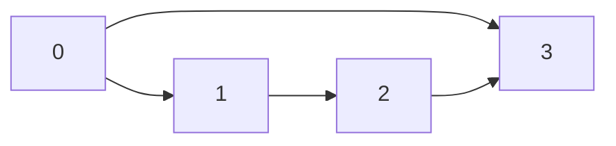

# 图算法 原理与代码实例讲解

## 1.背景介绍

图是一种非线性数据结构，由一组顶点(节点)和连接这些顶点的边(边可以是有向或无向)组成。图广泛应用于多个领域,如网络拓扑、社交网络分析、路径规划、编译器优化等。图算法是研究图结构及其性质的一系列算法,用于解决涉及图的各种问题。

图算法主要研究以下几个方面:

- 图的表示和存储
- 图的遍历(广度优先搜索BFS和深度优先搜索DFS)
- 最短路径算法(Dijkstra、Bellman-Ford、Floyd-Warshall等)
- 最小生成树算法(Prim、Kruskal)
- 拓扑排序
- 关键路径
- 网络流算法(最大流、最小费用最大流等)

## 2.核心概念与联系

### 2.1 图的表示

常见的图的存储表示方式有两种:邻接矩阵和邻接表。

#### 2.1.1 邻接矩阵

邻接矩阵是用二维数组表示图,其中`matrix[i][j]`表示顶点`i`和顶点`j`之间是否有边相连。对于无向图,邻接矩阵对角线两侧的元素值相等。

```python
# 邻接矩阵表示无向图
graph = [
    [0, 1, 0, 1],
    [1, 0, 1, 0],
    [0, 1, 0, 1],
    [1, 0, 1, 0]
]
```

邻接矩阵的优点是可以在O(1)时间内判断两个顶点之间是否有边相连,缺点是对于稀疏图浪费空间。

#### 2.1.2 邻接表

邻接表使用一个列表(数组)来存储每个顶点的邻居节点。对于无向图,每条边需要在两个顶点的邻接表中都存在。

```python
# 邻接表表示无向图
graph = {
    0: [1, 3], 
    1: [0, 2],
    2: [1, 3],
    3: [0, 2]
}
```

邻接表的优点是节省空间,适合表示稀疏图,缺点是判断两个顶点之间是否有边需要遍历某个顶点的邻接表。

### 2.2 图的遍历

图的遍历是指按照某种规则访问图中的所有顶点,常用的遍历算法有广度优先搜索(BFS)和深度优先搜索(DFS)。

#### 2.2.1 广度优先搜索(BFS)

BFS从一个顶点出发,先访问所有距离初始顶点距离为1的顶点,然后访问距离为2的顶点,以此类推。使用队列辅助实现。

```python
# 广度优先搜索(邻接表表示)
def bfs(graph, start):
    visited = set()
    queue = [start]
    visited.add(start)

    while queue:
        vertex = queue.pop(0)
        print(vertex)
        
        for neighbor in graph[vertex]:
            if neighbor not in visited:
                visited.add(neighbor)
                queue.append(neighbor)
```

BFS可用于最短路径问题、图的连通分量等。

#### 2.2.2 深度优先搜索(DFS)

DFS从一个顶点出发,沿着一条路径一直访问下去,直到无法继续访问为止,然后回溯访问下一条路径。使用递归或栈辅助实现。

```python
# 深度优先搜索(邻接表表示)
def dfs(graph, start, visited=None):
    if visited is None:
        visited = set()
    visited.add(start)
    print(start)

    for neighbor in graph[start]:
        if neighbor not in visited:
            dfs(graph, neighbor, visited)
```

DFS可用于拓扑排序、检测环路、求连通分量等。

### 2.3 最短路径算法

最短路径算法是求解从源点到其他所有顶点的最短路径的算法,包括:

- Dijkstra算法:计算单源最短路径,适用于非负权重图。
- Bellman-Ford算法:计算单源最短路径,可处理负权重边,检测负权重环路。
- Floyd-Warshall算法:计算任意两点间的最短路径。

### 2.4 最小生成树算法

最小生成树是一个连通加权无向图的生成树,其中所有边的权重和最小。常见算法有:

- Prim算法:从一个顶点开始构建最小生成树。
- Kruskal算法:按边的权重从小到大加入最小生成树。

### 2.5 拓扑排序

拓扑排序是对有向无环图进行线性排序,使得对于任意一条有向边(u,v),顶点u在v之前。应用于任务调度、编译器优化等。

### 2.6 网络流算法

网络流算法研究在有向图中寻找最大流量或最小费用最大流的问题,包括:

- Ford-Fulkerson算法:计算单源单汇最大流量。
- Edmonds-Karp算法:基于BFS的Ford-Fulkerson算法优化版本。
- Dinic算法:基于BFS和DFS的最大流算法。

## 3.核心算法原理具体操作步骤

### 3.1 广度优先搜索(BFS)

BFS使用队列辅助,从源点出发,先将源点加入队列。然后不断从队列取出一个顶点,访问并将其所有未被访问的邻居顶点加入队列,直到队列为空。

```python
from collections import deque

def bfs(graph, start):
    visited = set()
    queue = deque([start])
    visited.add(start)

    while queue:
        vertex = queue.popleft()
        print(vertex)

        for neighbor in graph[vertex]:
            if neighbor not in visited:
                visited.add(neighbor)
                queue.append(neighbor)
```

BFS算法步骤:

1. 创建一个队列和一个集合visited存储已访问过的顶点
2. 将源点加入队列和visited集合
3. 当队列不为空时,执行以下操作:
   - 从队列中取出一个顶点vertex
   - 访问顶点vertex
   - 将vertex的所有未被访问过的邻居顶点加入队列和visited集合
4. 重复步骤3,直到队列为空

BFS性质:
- 按层级顺序访问顶点
- 第一次访问某个顶点时,其路径是最短路径

时间复杂度:O(V+E),其中V是顶点数,E是边数。

### 3.2 深度优先搜索(DFS)

DFS使用递归或栈辅助,从源点出发,沿着一条路径一直访问下去,直到无法继续访问为止,然后回溯访问下一条路径。

```python
def dfs(graph, start, visited=None):
    if visited is None:
        visited = set()
    visited.add(start)
    print(start)

    for neighbor in graph[start]:
        if neighbor not in visited:
            dfs(graph, neighbor, visited)
```

DFS算法步骤:

1. 创建一个集合visited存储已访问过的顶点
2. 访问源点start,将其加入visited集合
3. 对start的每个未被访问过的邻居递归执行步骤2和3

DFS性质:
- 按深度优先顺序访问顶点
- 能访问到所有与源点连通的顶点

时间复杂度:O(V+E),其中V是顶点数,E是边数。

### 3.3 Dijkstra算法

Dijkstra算法用于计算单源最短路径,适用于非负权重图。算法使用一个优先队列存储所有未访问过的顶点,每次从队列取出一个最短路径顶点,更新其邻居顶点到源点的距离。

```python
import heapq

def dijkstra(graph, start):
    distances = {vertex: float('infinity') for vertex in graph}
    distances[start] = 0
    pq = [(0, start)]

    while pq:
        current_dist, current_vertex = heapq.heappop(pq)

        if current_dist > distances[current_vertex]:
            continue

        for neighbor, weight in graph[current_vertex].items():
            distance = current_dist + weight
            if distance < distances[neighbor]:
                distances[neighbor] = distance
                heapq.heappush(pq, (distance, neighbor))

    return distances
```

Dijkstra算法步骤:

1. 初始化一个字典distances,存储每个顶点到源点的最短距离,初始值为无穷大,源点距离为0
2. 创建一个优先队列pq,初始值为(0, start)
3. 当优先队列不为空时,执行以下操作:
   - 从优先队列中取出具有最小距离的顶点current_vertex
   - 对current_vertex的每个未访问过的邻居neighbor:
     - 计算从源点到neighbor的距离distance
     - 如果distance小于neighbor在distances中的距离,更新distances[neighbor]为distance,并将(distance, neighbor)加入优先队列
4. 返回distances字典

时间复杂度:O((V+E)logV),其中V是顶点数,E是边数。

### 3.4 Kruskal算法

Kruskal算法用于计算加权无向连通图的最小生成树。算法按照边的权重从小到大加入最小生成树,并使用并查集避免构成环路。

```python
class DisjointSet:
    def __init__(self, n):
        self.parent = list(range(n))
        self.rank = [0] * n

    def find(self, x):
        if self.parent[x] != x:
            self.parent[x] = self.find(self.parent[x])
        return self.parent[x]

    def union(self, x, y):
        x_root = self.find(x)
        y_root = self.find(y)
        if x_root == y_root:
            return

        if self.rank[x_root] < self.rank[y_root]:
            self.parent[x_root] = y_root
        elif self.rank[x_root] > self.rank[y_root]:
            self.parent[y_root] = x_root
        else:
            self.parent[y_root] = x_root
            self.rank[x_root] += 1


def kruskal(graph):
    mst = []
    edges = []
    for u in graph:
        for v, w in graph[u].items():
            edges.append((w, u, v))

    edges.sort()
    disjoint_set = DisjointSet(len(graph))

    for w, u, v in edges:
        if disjoint_set.find(u) != disjoint_set.find(v):
            mst.append((u, v, w))
            disjoint_set.union(u, v)

    return mst
```

Kruskal算法步骤:

1. 创建一个列表edges,存储所有边及其权重
2. 按边的权重对edges进行排序
3. 创建一个并查集disjoint_set
4. 对edges中的每条边(u, v)执行以下操作:
   - 如果u和v不在同一个连通分量中,将边(u, v)加入最小生成树,并在并查集中合并u和v所在的连通分量
5. 返回最小生成树mst

时间复杂度:O(ElogE),其中E是边数。

## 4.数学模型和公式详细讲解举例说明

### 4.1 图的表示

#### 4.1.1 邻接矩阵

设G=(V, E)是一个有n个顶点和e条边的无向图,邻接矩阵是一个n×n的矩阵A,其中:

$$
A_{ij} = \begin{cases}
1, & \text{if } (i, j) \in E \\
0, & \text{otherwise}
\end{cases}
$$

对于有权图,邻接矩阵中的元素A_{ij}表示边(i, j)的权重。

例如,下图的邻接矩阵表示为:



$$
A = \begin{bmatrix}
0 & 1 & 0 & 1\\
1 & 0 & 1 & 0\\
0 & 1 & 0 & 1\\
1 & 0 & 1 & 0
\end{bmatrix}
$$

#### 4.1.2 邻接表

邻接表使用一个字典(或列表)来存储每个顶点的邻居节点。对于无向图G=(V, E),邻接表表示为:

$$
Adj(v) = \{u | (v, u) \in E\}
$$

其中,Adj(v)表示与顶点v相邻的所有顶点集合。

对于有权图,邻接表中还需存储每条边的权重。

例如,上图的邻接表表示为:

```python
graph = {
    0: {1: 1, 3: 1},
    1: {0: 1, 2: 1},
    2: {1: 1, 3: 1},
    3: {0: 1, 2: 1}
}
```

### 4.2 广度优先搜索(BFS)

BFS从源点s出发,按层级顺序访问所有可