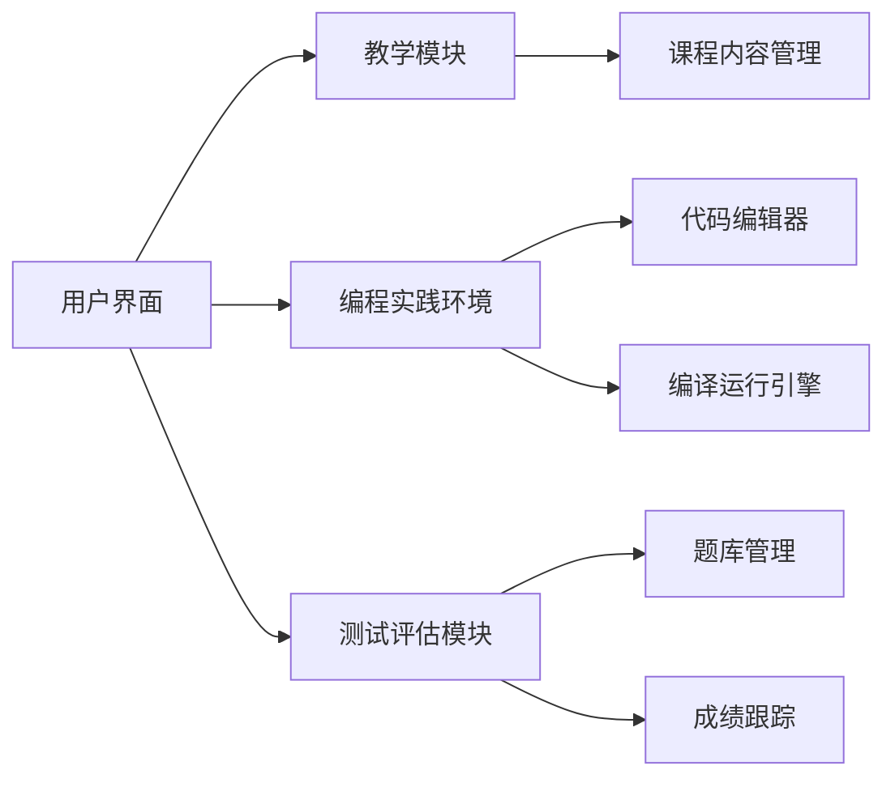

## 1. 背景介绍

在当今的信息技术时代，编程教育已成为基础教育的重要组成部分。C语言作为一种经典的编程语言，不仅在教育领域，也在工业界有着广泛的应用。因此，开发一个在线C语言教学系统对于提高编程教育的质量和效率具有重要意义。本文将详细介绍在线C语言教学系统的设计理念、核心技术、实现方法以及实际应用场景。

## 2. 核心概念与联系

在线C语言教学系统是一个集教学内容展示、编程实践、在线测试和进度跟踪于一体的综合性学习平台。它通过模块化设计，将复杂的教学流程分解为可管理的单元，从而提高系统的可维护性和扩展性。

### 2.1 系统架构



### 2.2 关键技术

- **教学模块**：提供课程内容的展示和管理。
- **编程实践环境**：集成代码编辑器和编译运行引擎，支持在线编写和测试代码。
- **测试评估模块**：包含题库管理和成绩跟踪，实现在线考核和进度监控。

## 3. 核心算法原理具体操作步骤

在线C语言教学系统的核心算法涉及到用户代码的编译、运行和评估。以下是具体的操作步骤：

1. **代码编辑**：用户在网页端的代码编辑器中输入C语言代码。
2. **代码提交**：用户提交代码后，系统将代码发送到服务器。
3. **代码编译**：服务器上的编译器将代码编译成可执行文件。
4. **代码运行**：系统在沙箱环境中运行可执行文件，以确保安全性。
5. **结果评估**：系统根据预设的测试用例评估程序的输出结果，并给出反馈。

## 4. 数学模型和公式详细讲解举例说明

在线C语言教学系统中，评估算法的核心是比较程序输出与预期结果的相似度。这可以通过编辑距离（Levenshtein Distance）来实现，其数学公式如下：

$$
D(i, j) = \left\{
\begin{array}{ll}
0 & \text{if } i = 0 \text{ and } j = 0 \\
i & \text{if } j = 0 \text{ and } i > 0 \\
j & \text{if } i = 0 \text{ and } j > 0 \\
\min \left\{
\begin{array}{l}
D(i-1, j) + 1 \\
D(i, j-1) + 1 \\
D(i-1, j-1) + 1_{(a_i \neq b_j)}
\end{array}
\right. & \text{otherwise}
\end{array}
\right.
$$

其中，$D(i, j)$ 是字符串 $a$ 的前 $i$ 个字符与字符串 $b$ 的前 $j$ 个字符之间的编辑距离，$1_{(a_i \neq b_j)}$ 是一个指示函数，当 $a_i \neq b_j$ 时值为1，否则为0。

## 5. 项目实践：代码实例和详细解释说明

为了实现在线C语言教学系统，我们需要开发一个简单的Web应用。以下是一个基于Flask框架的代码编辑器后端处理逻辑的示例：

```python
from flask import Flask, request
import subprocess

app = Flask(__name__)

@app.route('/compile_and_run', methods=['POST'])
def compile_and_run():
    code = request.form['code']
    with open('main.c', 'w') as f:
        f.write(code)
    compile_result = subprocess.run(['gcc', 'main.c', '-o', 'main'], capture_output=True, text=True)
    if compile_result.returncode != 0:
        return {'output': compile_result.stderr, 'error': True}
    run_result = subprocess.run(['./main'], capture_output=True, text=True)
    return {'output': run_result.stdout, 'error': False}

if __name__ == '__main__':
    app.run(debug=True)
```

这段代码接收用户提交的C语言代码，将其写入文件，然后使用GCC编译器进行编译，并运行生成的可执行文件。编译或运行出错时，将错误信息返回给用户。

## 6. 实际应用场景

在线C语言教学系统可以广泛应用于高校和中学的计算机编程课程，以及自学者的编程学习。它可以帮助学生在没有物理环境限制的情况下进行编程实践，同时也为教师提供了一个方便的在线批改和进度跟踪工具。

## 7. 工具和资源推荐

- **编程环境**：GCC、Clang等C语言编译器。
- **Web框架**：Flask、Django等Python Web框架。
- **前端技术**：HTML、CSS、JavaScript以及Vue.js、React.js等前端框架。
- **数据库**：SQLite、MySQL、PostgreSQL等数据库系统。

## 8. 总结：未来发展趋势与挑战

在线C语言教学系统的未来发展趋势将更加注重交互性、个性化和智能化。例如，通过人工智能技术提供个性化的学习建议，使用大数据分析优化教学内容。同时，保证系统安全性、提高系统稳定性和扩展性也是未来发展的重要挑战。

## 9. 附录：常见问题与解答

- **Q1**: 如何确保在线编程环境的安全性？
- **A1**: 通过在服务器端使用沙箱环境隔离用户代码的执行，限制程序的资源使用和网络访问，可以有效防止恶意代码的攻击。

- **Q2**: 在线C语言教学系统如何处理大量并发请求？
- **A2**: 通过负载均衡和分布式部署，系统可以在多个服务器之间分配请求，从而提高并发处理能力。

- **Q3**: 如何提高在线编程系统的用户体验？
- **A3**: 优化前端界面设计，提供即时反馈和详细的错误提示，以及增加互动式教学元素，可以显著提高用户体验。

作者：禅与计算机程序设计艺术 / Zen and the Art of Computer Programming