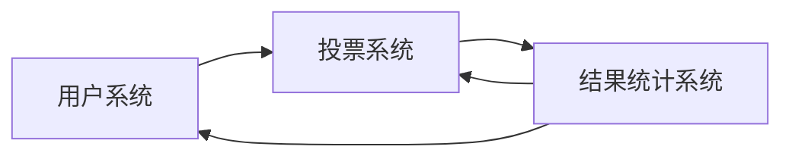

## 1.背景介绍

在线投票系统是现代社会中常见的一种系统，它的主要功能是实现网络上的投票服务，让用户可以在任何地方、任何时间进行投票。这种系统在很多领域都有广泛的应用，比如政府的公民投票，企业的员工投票，学校的学生投票，甚至是社交网络上的各种投票活动。

## 2.核心概念与联系

在线投票系统主要由三个核心部分组成：用户系统、投票系统和结果统计系统。

- 用户系统：负责用户的注册、登录和信息管理等功能。
- 投票系统：负责创建投票、投票和管理投票等功能。
- 结果统计系统：负责对投票结果进行统计和展示。

这三个系统之间有着紧密的联系，用户系统为投票系统提供用户信息，投票系统为结果统计系统提供投票数据，结果统计系统又可以向用户系统和投票系统反馈统计结果。



## 3.核心算法原理具体操作步骤

在线投票系统的核心算法主要是投票算法和结果统计算法。

### 3.1 投票算法

投票算法的主要任务是记录用户的投票选择，并确保每个用户只能对每个投票选项投票一次。具体操作步骤如下：

1. 用户登录系统后，选择一个投票。
2. 系统检查用户是否已经对这个投票投过票，如果已经投过，则拒绝用户的投票请求。
3. 如果用户没有投过票，则记录用户的投票选择，并更新投票数据。

### 3.2 结果统计算法

结果统计算法的主要任务是对投票结果进行统计，并生成统计报告。具体操作步骤如下：

1. 系统收集所有的投票数据。
2. 对每个投票选项，统计得票数。
3. 根据得票数，计算每个投票选项的得票比例。
4. 生成统计报告，并展示给用户。

## 4.数学模型和公式详细讲解举例说明

在线投票系统的核心算法涉及到一些数学模型和公式，这里我们以结果统计算法为例，进行详细讲解和举例说明。

结果统计算法的主要任务是计算每个投票选项的得票比例，这可以用下面的公式表示：

$$ P_i = \frac{N_i}{N} $$

其中，$P_i$ 是第 i 个投票选项的得票比例，$N_i$ 是第 i 个投票选项的得票数，$N$ 是总的投票数。

假设有一个投票，有三个选项 A、B 和 C，得票数分别是 100、200 和 300，总的投票数是 600，那么可以计算得到每个选项的得票比例：

$$ P_A = \frac{100}{600} = 0.167 $$
$$ P_B = \frac{200}{600} = 0.333 $$
$$ P_C = \frac{300}{600} = 0.500 $$

这就是结果统计算法的数学模型和公式的详细讲解和举例说明。

## 5.项目实践：代码实例和详细解释说明

在实际项目中，我们可以使用 Python 语言和 Django 框架来实现在线投票系统。下面是一些核心代码示例和详细解释说明。

### 5.1 用户系统代码示例

```python
from django.contrib.auth.models import User

# 用户注册
def register(request):
    username = request.POST['username']
    password = request.POST['password']
    User.objects.create_user(username=username, password=password)

# 用户登录
def login(request):
    username = request.POST['username']
    password = request.POST['password']
    user = authenticate(request, username=username, password=password)
    if user is not None:
        login(request, user)
```

这段代码实现了用户系统的注册和登录功能。我们使用 Django 自带的 User 模型来处理用户数据，使用 create_user 方法来创建新用户，使用 authenticate 方法来验证用户登录。

### 5.2 投票系统代码示例

```python
from django.db import models

# 投票模型
class Poll(models.Model):
    question = models.CharField(max_length=200)
    pub_date = models.DateTimeField('date published')

# 选项模型
class Choice(models.Model):
    poll = models.ForeignKey(Poll, on_delete=models.CASCADE)
    choice_text = models.CharField(max_length=200)
    votes = models.IntegerField(default=0)

# 投票操作
def vote(request, poll_id):
    poll = Poll.objects.get(pk=poll_id)
    selected_choice = poll.choice_set.get(pk=request.POST['choice'])
    selected_choice.votes += 1
    selected_choice.save()
```

这段代码实现了投票系统的投票模型和选项模型，以及投票操作。我们使用 Django 的模型系统来定义投票和选项的数据结构，使用 get 方法来获取投票和选项的数据，使用 save 方法来更新数据。

### 5.3 结果统计系统代码示例

```python
from django.db.models import Sum

# 结果统计
def results(request, poll_id):
    poll = Poll.objects.get(pk=poll_id)
    total_votes = poll.choice_set.aggregate(Sum('votes'))['votes__sum']
    results = []
    for choice in poll.choice_set.all():
        percentage = choice.votes / total_votes
        results.append((choice.choice_text, percentage))
    return results
```

这段代码实现了结果统计系统的结果统计功能。我们使用 Django 的聚合查询来计算总的投票数，然后对每个选项，计算其得票比例，最后返回结果列表。

## 6.实际应用场景

在线投票系统在很多领域都有广泛的应用，以下是一些具体的应用场景：

- 政府公民投票：政府可以通过在线投票系统，让公民在网络上参与重大决策的投票，提高公民参与度，增强政策的公众接受度。
- 企业员工投票：企业可以通过在线投票系统，让员工在网络上参与企业决策的投票，增强员工的参与感，提高企业的凝聚力。
- 学校学生投票：学校可以通过在线投票系统，让学生在网络上参与学校活动的投票，提高学生的参与度，增强学校活动的吸引力。
- 社交网络投票：社交网络可以通过在线投票系统，让用户在网络上参与各种投票活动，提高用户的活跃度，增强社交网络的粘性。

## 7.工具和资源推荐

在实现在线投票系统时，有一些工具和资源可以帮助我们：

- Python：一种广泛使用的高级编程语言，适合快速开发和原型设计。
- Django：一种基于 Python 的高级 Web 框架，内置了用户系统、模型系统和模板系统等功能，可以快速开发 Web 应用。
- SQLite：一种轻量级的数据库系统，适合小型 Web 应用和开发测试。
- Bootstrap：一种流行的前端框架，提供了丰富的 CSS 样式和 JavaScript 插件，可以快速开发美观的前端界面。
- Git：一种分布式版本控制系统，可以有效管理代码版本，方便团队协作。

## 8.总结：未来发展趋势与挑战

在线投票系统作为一种重要的网络应用，有着广阔的发展前景。随着互联网技术的发展，在线投票系统将更加普及，应用场景将更加丰富，功能将更加强大。

然而，同时也面临着一些挑战，如如何保证投票的公正性和公平性，如何防止投票作弊，如何保护用户的隐私等。这些都需要我们在未来的研究和开发中去解决。

## 9.附录：常见问题与解答

Q: 如何防止同一个用户对同一个投票多次投票？

A: 可以通过用户系统来记录每个用户的投票记录，当用户试图对同一个投票多次投票时，系统可以检查用户的投票记录，如果发现用户已经投过票，就拒绝用户的投票请求。

Q: 如何保证投票的公正性和公平性？

A: 可以通过设计合理的投票算法和结果统计算法来保证投票的公正性和公平性。例如，可以确保每个用户只能对每个投票选项投票一次，可以公正公平地统计每个投票选项的得票数和得票比例。

Q: 如何保护用户的隐私？

A: 可以通过用户系统来保护用户的隐私。例如，可以对用户的密码进行加密存储，可以对用户的投票记录进行匿名处理，可以让用户在投票时选择是否公开自己的投票选择。

作者：禅与计算机程序设计艺术 / Zen and the Art of Computer Programming