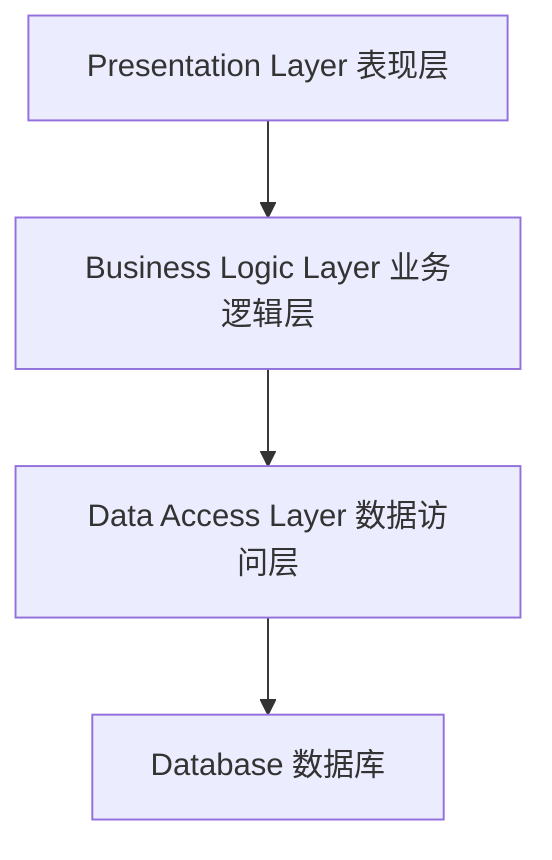

# 基于ASP的计算机组成原理考试系统详细设计与具体代码实现

## 1.背景介绍

### 1.1 计算机组成原理课程概述

计算机组成原理是计算机科学与技术专业的一门核心课程,是计算机系统硬件的基础理论课程。该课程主要介绍计算机系统的基本组成、工作原理、指令系统、存储系统、输入/输出系统以及总线结构等内容。学习该课程有助于学生掌握计算机系统的基本概念、原理和设计方法,为后续学习计算机体系结构、操作系统、编译原理等课程奠定坚实的基础。

### 1.2 在线考试系统的必要性

传统的纸质考试模式存在诸多不足,例如耗费大量人力物力、无法及时反馈考试结果、缺乏针对性的错题分析等。而在线考试系统能够有效解决这些问题,实现考试过程的自动化、智能化,提高考试效率和公平性。因此,开发一款基于ASP的计算机组成原理在线考试系统,对于提高教学质量和学习效率具有重要意义。

### 1.3 ASP技术简介

ASP(Active Server Pages)是微软公司开发的一种服务器端脚本技术,可以嵌入HTML网页中,用于创建动态交互式网站。ASP脚本在服务器端执行,生成标准的HTML页面发送给客户端浏览器,从而实现客户端与服务器端的交互。ASP技术具有跨平台、安全可靠、易于开发和维护等优点,非常适合用于开发中小型Web应用程序。

## 2.核心概念与联系

### 2.1 系统架构概述

基于ASP的计算机组成原理考试系统采用经典的三层架构(Presentation Layer、Business Logic Layer、Data Access Layer),如下图所示:



表现层负责与用户交互,接收用户请求并显示处理结果;业务逻辑层负责实现系统的核心功能,如试卷组卷、判卷、成绩统计等;数据访问层负责与数据库进行交互,执行数据的增删改查操作。

### 2.2 系统功能模块

该考试系统包含以下几个核心功能模块:

1. **用户管理模块**: 实现用户注册、登录、密码修改等基本功能。
2. **试卷管理模块**: 包括试题库管理、自动组卷、手动组卷等功能。
3. **在线考试模块**: 提供计时答题、交卷、自动判卷等功能。
4. **成绩查询模块**: 实现考生成绩查询、统计分析等功能。
5. **系统管理模块**: 用于管理员维护整个系统,包括用户权限管理等。

### 2.3 数据库设计

系统使用关系型数据库存储试题信息、用户信息、考试记录等数据。数据库主要包含以下几个核心表:

1. **User表**: 存储用户基本信息,如用户名、密码、角色等。
2. **Question表**: 存储试题信息,包括题目内容、答案、分值等。
3. **Paper表**: 存储组卷信息,包括试卷编号、考试科目、总分等。
4. **PaperDetail表**: 存储试卷明细,即每张试卷包含的具体试题。
5. **Score表**: 存储考生的答题情况和最终成绩。

## 3.核心算法原理具体操作步骤  

### 3.1 自动组卷算法

自动组卷是考试系统的一个核心功能,需要根据教师设置的组卷规则,从试题库中自动选取符合要求的试题,生成试卷。常用的组卷策略包括:

1. **按知识点比例组卷**: 根据每个知识点的权重,按比例从对应知识点的题库中随机抽取试题。
2. **按难度级别组卷**: 根据设置的难度系数,按比例从不同难度的题库中抽取试题。
3. **避免题型雷同**: 避免同一种题型的试题在同一张试卷中出现过多。
4. **题目随机排序**: 对抽取的试题顺序进行随机排列,增加试卷的随机性。

自动组卷算法的基本步骤如下:

1. 根据教师设置的组卷规则,计算每个知识点、每个难度级别需要抽取的题目数量。
2. 遍历每个知识点和难度级别对应的题库,按照设定的数量随机抽取试题。
3. 对抽取的试题顺序进行随机排列,生成试卷初稿。
4. 检查试卷初稿是否满足其他约束条件(如题型分布),若不满足则返回第2步重新抽取。
5. 将符合要求的试卷保存到数据库中。

### 3.2 自动判卷算法

自动判卷是在线考试系统的另一个核心功能,需要根据预设的判分规则,对考生的答题结果进行自动评分。判卷算法的基本步骤如下:

1. 从数据库中获取当前考生的答题记录和对应试卷的参考答案。
2. 对选择题、判断题等客观题进行自动判分,给出得分情况。
3. 对于主观题,可采用关键词匹配等自然语言处理技术进行初步评分。
4. 将评分结果更新到数据库的成绩表中,供教师和学生查询。

## 4.数学模型和公式详细讲解举例说明

### 4.1 试题信息熵模型

在自动组卷过程中,为了生成难度适中、信息量较大的试卷,可以借助信息熵理论对试题进行量化评估。定义试题$q_i$的信息熵为:

$$H(q_i) = -\sum_{j=1}^{m}p_{ij}\log_2p_{ij}$$

其中$m$为答案的可能取值数量,$p_{ij}$表示选择第$j$个答案的概率。信息熵值越大,说明试题的不确定性越高,难度越大。

在组卷时,可以控制生成试卷的总信息熵在一个合理范围内,从而确保试卷整体难度适中。

### 4.2 题型分布模型

为避免同一种题型的试题在试卷中出现过多或过少,可以建立题型分布模型,对试卷中每种题型的数量进行约束:

$$\sum\limits_{i=1}^{n}x_i = N$$
$$l_j \leq \sum\limits_{i=1}^{n}a_{ij}x_i \leq u_j,\quad j=1,2,\cdots,m$$

其中$n$为试卷总题数,$x_i$为第$i$题的取舍变量(取1或0),$N$为试卷总分值,$a_{ij}$为第$i$题的第$j$种题型标记(0或1),$l_j$和$u_j$分别为第$j$种题型的下限和上限。

该模型可以作为自动组卷过程中的约束条件,确保生成的试卷符合题型分布要求。

## 5.项目实践：代码实例和详细解释说明

### 5.1 自动组卷功能实现

```vb.net
'根据教师设置的组卷规则计算每个知识点和难度级别的抽题数量
For Each kp As KnowledgePoint In knowledgePoints
    kp.QuestionCount = CInt(totalCount * kp.Proportion)
Next
For Each dl As DifficultyLevel In difficultyLevels
    dl.QuestionCount = CInt(totalCount * dl.Proportion)  
Next

'从题库中按规则抽取试题
Dim selectedQuestions As New List(Of Question)
For Each kp As KnowledgePoint In knowledgePoints
    Dim kpQuestions = GetQuestionsFromDB(kp.ID)
    selectedQuestions.AddRange(kpQuestions.OrderBy(Function(q) Guid.NewGuid()).Take(kp.QuestionCount))
Next
For Each dl As DifficultyLevel In difficultyLevels
    Dim dlQuestions = GetQuestionsFromDB(difficultyID:=dl.ID)
    selectedQuestions.AddRange(dlQuestions.OrderBy(Function(q) Guid.NewGuid()).Take(dl.QuestionCount))
Next

'对抽取的试题顺序进行随机排列
selectedQuestions = selectedQuestions.OrderBy(Function(q) Guid.NewGuid()).ToList()

'检查试卷是否满足其他约束条件
If CheckPaperConstraints(selectedQuestions) Then
    '保存试卷到数据库
    SavePaperToDB(selectedQuestions)
Else
    '不满足约束条件，返回重新组卷
End If
```

上述代码实现了自动组卷的核心逻辑。首先根据教师设置的知识点权重和难度级别权重,计算每个知识点和难度级别需要抽取的题目数量。然后从对应的题库中随机抽取指定数量的试题,并将它们合并到一个列表中。接着对抽取的试题顺序进行随机排列,生成试卷初稿。

最后,通过`CheckPaperConstraints`函数检查试卷初稿是否满足其他约束条件,如题型分布、信息熵范围等。如果满足要求,则调用`SavePaperToDB`函数将试卷保存到数据库中;否则返回重新组卷。

### 5.2 自动判卷功能实现

```vb.net
'获取考生答题记录和试卷参考答案
Dim examRecord As ExamRecord = GetExamRecordFromDB(examID, studentID)
Dim paperAnswers As List(Of Answer) = GetPaperAnswersFromDB(examRecord.PaperID)

'遍历每个试题,对比考生答案与参考答案
Dim totalScore As Integer = 0
For i As Integer = 0 To examRecord.Answers.Count - 1
    Dim studentAnswer = examRecord.Answers(i)
    Dim referenceAnswer = paperAnswers(i)
    
    '判分逻辑
    If studentAnswer.QuestionType = QuestionType.Choice Or studentAnswer.QuestionType = QuestionType.TrueFalse Then
        '对选择题和判断题进行自动判分
        If studentAnswer.AnswerContent = referenceAnswer.AnswerContent Then
            studentAnswer.Score = referenceAnswer.Score
        Else
            studentAnswer.Score = 0
        End If
    ElseIf studentAnswer.QuestionType = QuestionType.Subjective Then
        '对主观题进行自动评分(此处使用简单的关键词匹配算法)
        Dim keywords As String() = referenceAnswer.AnswerContent.Split(","c)
        Dim matchedCount As Integer = 0
        For Each keyword As String In keywords
            If studentAnswer.AnswerContent.Contains(keyword) Then
                matchedCount += 1
            End If
        Next
        studentAnswer.Score = CInt(referenceAnswer.Score * matchedCount / keywords.Length)
    End If
    
    totalScore += studentAnswer.Score
Next

'更新考生成绩到数据库
UpdateScoreToDB(examRecord.ExamID, examRecord.StudentID, totalScore)
```

上述代码实现了自动判卷的核心逻辑。首先从数据库中获取当前考生的答题记录和对应试卷的参考答案。然后遍历每个试题,对比考生答案与参考答案,根据判分规则进行自动评分。

对于选择题和判断题,直接比对考生答案与参考答案是否一致,给出全分或零分。对于主观题,此处使用了一种简单的关键词匹配算法进行初步评分,即根据考生答案中出现的参考答案关键词的数量,按比例给分。

最后,将计算出的总分数更新到数据库的成绩表中,供教师和学生查询。

## 6.实际应用场景

计算机组成原理考试系统可以广泛应用于高校教学、企业培训、资格考试等多种场景:

1. **高校教学**: 该系统可以用于计算机组成原理课程的期末考试、机考等,提高考试效率,减轻教师的工作量。

2. **企业培训**: 企业可以使用该系统对员工进行计算机硬件知识的培训和考核,帮助员工提升专业技能。

3. **资格考试**: 该系统也可用于计算机等级考试、职业资格考试等,实现考试过程的自动化和标准化。

4. **在线教育**: 随着在线教育的兴起,该系统可以集成到在线课程平台中,为学员提供自主练习和在线考核的功能。

总之,基于ASP的计算机组成原理考试系统具有自动化、智能化、标准化的优势,可以广泛应用于教育培训和考试认证等多个领域,提高工作效率,优化用户体验。

## 7.工具和资源推荐

在开发基于ASP的