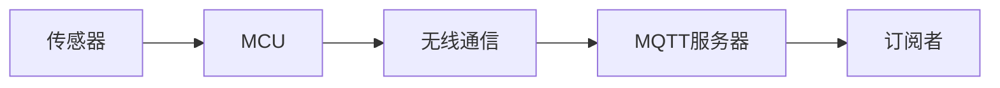
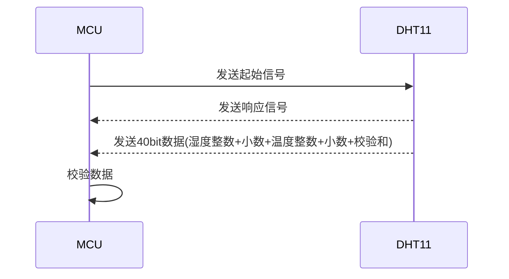

# 基于D1 MINI的空气站节点设计与实现

## 1.背景介绍

随着物联网技术的快速发展,各种智能设备和传感器被广泛应用于环境监测、智慧城市等领域。空气质量监测作为智慧城市建设的重要组成部分,受到了越来越多的关注。本文将介绍基于D1 MINI开发板设计实现的空气站节点,用于采集温湿度、PM2.5等空气质量数据,并通过无线网络上传至云端进行分析和展示。

### 1.1 空气质量监测的重要性

空气污染已成为全球面临的重大环境问题之一,对人类健康和生态环境造成严重危害。实时监测空气质量,有助于及时发现污染问题,采取有效措施改善空气质量。同时空气质量数据也是智慧城市大数据分析的重要来源。

### 1.2 物联网技术在空气监测中的应用

物联网技术为空气质量监测提供了新的手段。通过在城市各个区域部署大量传感器节点,形成覆盖面广、数据量大的空气监测网络。每个节点配备温湿度、PM2.5等传感器,定时采集数据并通过无线通信模块上传至云端汇总分析。

### 1.3 D1 MINI开发板简介

D1 MINI是基于ESP8266 WiFi芯片的开发板,以其小巧的尺寸、丰富的接口和强大的性能在物联网领域得到广泛应用。D1 MINI集成了ESP8266 WiFi功能,支持I2C、SPI、UART等通信接口,同时引出多个GPIO可连接各类传感器,非常适合作为空气监测节点的主控。

## 2.核心概念与联系

要设计空气站节点,需要理解几个核心概念:

### 2.1 传感器

传感器是测量物理量并转换为电信号的器件。空气监测常用的传感器有:
- 温湿度传感器:测量空气的温度和相对湿度,如DHT11、DHT22、SHT3x等。  
- PM2.5传感器:测量空气中直径小于等于2.5μm颗粒物的浓度,如PMS5003、GP2Y1014等。
- 其他气体传感器:测量CO、NO2、SO2等污染气体浓度。

### 2.2 MCU

MCU(Micro Controller Unit)是节点的核心,负责传感器数据采集、处理和通信等任务。本项目选用的D1 MINI开发板集成了基于Tensilica L106的32位MCU,主频80MHz,内置TCP/IP协议栈。

### 2.3 无线通信

为实现数据远程上传,节点需要具备无线通信能力。常见的短距离无线通信技术有WiFi、Zigbee、LoRa等。本项目利用D1 MINI的WiFi功能,通过MQTT协议将数据上传至云端服务器。

### 2.4 MQTT协议

MQTT(Message Queuing Telemetry Transport)是物联网领域广泛采用的轻量级发布/订阅式消息协议。通过MQTT,节点作为发布者将采集到的传感器数据发送给MQTT服务器(代理)。服务器将消息推送给订阅该主题的客户端,实现数据的实时同步。

以下是这些概念之间的联系:



传感器采集物理量数据并发送给MCU处理,MCU通过无线通信模块将数据打包成MQTT消息发布给服务器,服务器再将消息分发给订阅者,完成端到端的数据传输。

## 3.核心算法原理具体操作步骤

### 3.1 传感器数据采集

以DHT11温湿度传感器为例,其采用单总线通信方式,具体通信时序如下:



读取DHT11数据的步骤:
1. MCU发送起始信号,拉低数据线>18ms,再拉高20~40us。
2. DHT11发送响应信号,拉低数据线80us,再拉高80us。
3. DHT11开始发送40bit数据,每bit以50us低电平起始,后跟26~28us高电平表示0,或70us高电平表示1。
4. MCU接收完40bit数据后,检查校验和,判断数据是否有效。

### 3.2 MQTT数据发布

使用MQTT发布数据的基本步骤:
1. 建立与MQTT服务器的连接。
2. 构造MQTT消息,包括主题(Topic)和负载(Payload)。
3. 调用publish()函数发布消息。
4. 关闭MQTT连接。

示例代码:

```cpp
#include <ESP8266WiFi.h>
#include <PubSubClient.h>

const char* ssid = "your-ssid";
const char* password = "your-password";
const char* mqttServer = "your-mqtt-server";
const int mqttPort = 1883;

WiFiClient espClient;
PubSubClient client(espClient);

void connectMQTT() {
  while (!client.connected()) {
    if (client.connect("ESP8266Client")) {
      Serial.println("MQTT connected");
    } else {
      Serial.print("failed with state ");
      Serial.println(client.state());
      delay(2000);
    }
  }
}

void setup() {
  Serial.begin(115200);
  WiFi.begin(ssid, password);
  while (WiFi.status() != WL_CONNECTED) {
    delay(500);
  }
  client.setServer(mqttServer, mqttPort);
}

void loop() {
  if (!client.connected()) {
    connectMQTT();
  }
  
  // 读取传感器数据
  float temperature = 25.5;
  float humidity = 60.8;
  
  // 构造MQTT消息
  String payload = "{\"temperature\":"+String(temperature)+",\"humidity\":"+String(humidity)+"}";
  
  // 发布MQTT消息
  if(client.publish("sensor/data", payload.c_str())){
    Serial.println("Data published");
  }
  
  delay(5000);
}
```

## 4.数学模型和公式详细讲解举例说明

空气质量评估涉及AQI(Air Quality Index)的计算,是基于各污染物浓度的分段线性函数。以PM2.5为例,AQI计算公式为:

$$
I_{PM2.5} = \frac{I_{Hi} - I_{Lo}}{C_{Hi} - C_{Lo}} (C_{PM2.5} - C_{Lo}) + I_{Lo}
$$

其中:
- $I_{PM2.5}$表示PM2.5的AQI。 
- $C_{PM2.5}$表示PM2.5的质量浓度值。
- $C_{Lo}$表示$C_{PM2.5}$所在区间的下限值。
- $C_{Hi}$表示$C_{PM2.5}$所在区间的上限值。
- $I_{Lo}$表示$C_{PM2.5}$所在区间的AQI下限值。  
- $I_{Hi}$表示$C_{PM2.5}$所在区间的AQI上限值。

例如,当PM2.5浓度为85μg/m³时,对应的区间是75~115,代入公式:

$$
\begin{aligned}
I_{PM2.5} &= \frac{150 - 101}{115 - 75} (85 - 75) + 101 \\
          &= \frac{49}{40} \times 10 + 101 \\
          &= 113.25
\end{aligned}
$$

因此PM2.5的AQI为113,对应的空气质量等级为三级,轻度污染。

## 5.项目实践：代码实例和详细解释说明

下面是一个完整的空气站节点代码示例,包括温湿度、PM2.5传感器数据采集,并通过MQTT发送至服务器:

```cpp
#include <ESP8266WiFi.h>
#include <PubSubClient.h>
#include <DHT.h>

#define DHTPIN D4
#define DHTTYPE DHT11

const char* ssid = "your-ssid";
const char* password = "your-password";
const char* mqttServer = "your-mqtt-server";
const int mqttPort = 1883;

WiFiClient espClient;
PubSubClient mqttClient(espClient);
DHT dht(DHTPIN, DHTTYPE);

void setupWiFi() {
  WiFi.begin(ssid, password);
  while (WiFi.status() != WL_CONNECTED) {
    delay(500);
  }
}

void connectMQTT() {
  while (!mqttClient.connected()) {
    if (mqttClient.connect("ESP8266Client")) {
      Serial.println("MQTT connected");
    } else {
      Serial.print("failed with state ");
      Serial.println(mqttClient.state());
      delay(2000);
    }
  }
}

void setup() {
  Serial.begin(115200);
  dht.begin();
  setupWiFi();
  mqttClient.setServer(mqttServer, mqttPort); 
}

void loop() {
  if (!mqttClient.connected()) {
    connectMQTT();
  }
  
  // 读取温湿度
  float temperature = dht.readTemperature();
  float humidity = dht.readHumidity();
  
  // 读取PM2.5浓度
  int pm25 = 85; // 示例值,请替换为实际读数
  
  // 构造MQTT消息 
  String payload = "{\"temperature\":"+String(temperature)+",\"humidity\":"+String(humidity)+",\"pm25\":"+String(pm25)+"}";
  
  // 发布MQTT消息
  if(mqttClient.publish("sensor/data", payload.c_str())){
    Serial.println("Data published");  
  }
  
  delay(5000);
}
```

代码说明:
1. 引入ESP8266WiFi、PubSubClient和DHT库,分别用于WiFi连接、MQTT通信和DHT11传感器读取。
2. 定义DHTPIN为D4引脚,DHTTYPE为DHT11。 
3. 设置WiFi的SSID和密码,MQTT服务器地址和端口。
4. 在setup()函数中,初始化串口、DHT传感器,连接WiFi和MQTT服务器。
5. 在loop()函数中,检查MQTT连接状态,如果断开则重新连接。
6. 通过dht.readTemperature()和dht.readHumidity()读取温湿度值。
7. 读取PM2.5浓度值,这里用一个示例值代替,实际项目中需要根据所用传感器的库函数读取。
8. 构造MQTT消息,将温湿度和PM2.5浓度打包成JSON格式的字符串。
9. 调用mqttClient.publish()发布消息,主题为"sensor/data"。
10. 延时5秒后进入下一个循环。

## 6.实际应用场景

基于D1 MINI的空气站节点可应用于以下场景:

### 6.1 室内空气质量监测

在家庭、办公室、学校等室内环境中部署空气站节点,实时监测室内空气质量,当空气质量指数超标时,可联动空气净化器等设备改善空气质量,或提醒用户开窗通风。

### 6.2 城市空气质量监测网络

在城市的主要街道、公园、广场等公共场所部署大量空气站节点,形成覆盖全城的空气质量监测网络。通过数据分析可以绘制城市空气质量热力图,为环保部门提供决策依据。

### 6.3 工业园区污染监测

在工业园区厂房内外布设空气站节点,监测工业废气排放对周边环境的影响,一旦发现异常,可及时预警并溯源。

## 7.工具和资源推荐

### 7.1 硬件工具
- D1 MINI开发板 
- DHT11温湿度传感器
- PMS5003 PM2.5传感器
- 面包板、杜邦线等

### 7.2 软件工具
- Arduino IDE
- ESPHome固件 
- Node-RED
- Grafana可视化面板
- MQTT.fx客户端

### 7.3 相关资源
- [D1 MINI官方文档](https://docs.wemos.cc/en/latest/d1/d1_mini.html)
- [PubSubClient库](https://pubsubclient.knolleary.net/)
- [DHT传感器库](https://github.com/adafruit/DHT-sensor-library)
- [ESPHome文档](https://esphome.io/)
- [MQTT协议规范](https://mqtt.org/mqtt-specification/)

## 8.总结：未来发展趋势与挑战

随着物联网技术的发展,未来空气监测将呈现出以下趋势:
1. 微型化、低功耗化。节点设备将变得更小、更省电,便于大规模部署。
2. 多传感器融合。一个节点集成温湿度、PM2.5、CO2、TVOC等多种传感器,全面评估空气质量。