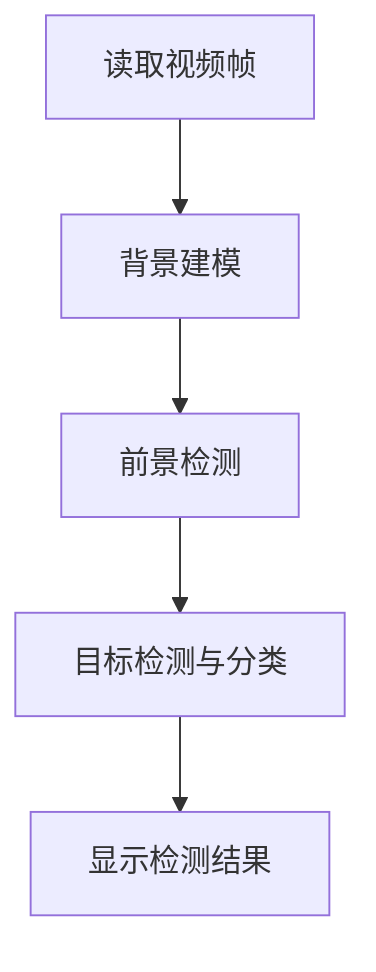

# 基于OpenCV的船只检测系统详细设计与具体代码实现

## 1.背景介绍

在海事监控、港口安全管理、船舶交通管理等领域,对船只的实时检测与跟踪具有重要意义。传统的雷达监测系统虽然可以检测到船只的位置,但无法获取船只的图像信息。而基于计算机视觉技术的船只检测系统不仅可以实时检测船只的位置,还可以获取船只的图像,为后续的船只识别、行为分析等提供重要数据支持。

本文将介绍如何利用OpenCV(开源计算机视觉库)设计并实现一个实时的船只检测系统。该系统可以从视频流或静态图像中检测出船只的位置,并将检测结果以矩形框的形式在图像上标注出来。系统的核心是一种基于背景建模的船只检测算法,能够有效应对复杂的水面环境。

## 2.核心概念与联系

### 2.1 背景建模

背景建模是实现船只检测的关键技术。它的基本思路是:利用视频序列的前几帧构建背景模型,然后对新到来的每一帧图像与背景模型进行比较,检测出与背景不同的前景目标(即船只)。

背景建模的难点在于需要应对复杂的水面环境,如波浪、反射、阴影等,这些因素会导致背景不断发生变化。为此,需要采用能够自适应调整的背景模型,如高斯混合模型(GMM)等。

### 2.2 目标检测

在完成背景建模后,需要对检测到的前景目标进行进一步处理,以确定其是否为船只。常用的方法包括基于形状、纹理、颜色等特征的目标分类。

### 2.3 系统流程

基于OpenCV的船只检测系统的基本流程如下所示:



## 3.核心算法原理具体操作步骤

### 3.1 背景建模算法

本系统采用的背景建模算法是基于OpenCV中的BackgroundSubtractorMOG2类,它实现了基于高斯混合模型(GMM)的前景/背景分割算法。

高斯混合模型的基本思路是:对每个像素,用K(通常为3-5)个高斯分布来对其历史值进行建模。每个高斯分布都有一个权重,表示该分布对应像素值出现的频率。在新的帧到来时,可以根据像素值更新每个高斯分布的参数。

具体的算法步骤如下:

1) 初始化阶段:对前面几帧的图像进行处理,得到每个像素位置的K个高斯分布的初始参数(均值、方差、权重)。

2) 更新阶段:对新到来的帧,对每个像素执行以下操作:
   
   a) 计算该像素值与每个高斯分布的马氏距离。
   
   b) 选择与该像素值最匹配的高斯分布(马氏距离最小),更新该分布的参数。
   
   c) 对剩余的K-1个高斯分布,进行权重调整,并按权重从大到小排序。
   
   d) 将最后一个低权重的高斯分布,用新的像素值及较大的初始方差值进行重新初始化。

3) 背景/前景分割:将权重排在前B(B<=K)个高斯分布对应的像素值确定为背景,其余为前景。

通过上述过程,背景模型可以自适应地更新,适应背景的缓慢变化,从而实现鲁棒的前景检测。

### 3.2 目标检测与分类

在获得前景掩模图像后,需要进一步对前景目标进行检测与分类,判断是否为船只目标。常用的方法有:

1) 基于形状特征的分类:分析目标的外形轮廓,提取形状特征(如面积、周长、圆度等),并基于这些特征训练分类器(如SVM等)对目标进行分类。

2) 基于纹理特征的分类:提取目标区域的纹理特征(如LBP、HOG等),并基于这些特征训练分类器。

3) 基于颜色特征的分类:分析目标区域的颜色分布,并将其与船只的典型颜色模式进行匹配。

4) 基于模板匹配的检测:构建船只的模板库,对图像进行滑动窗口搜索,匹配模板以检测船只。

本系统中,我们将采用较为简单的基于形状特征的分类方法。具体来说,将提取每个前景目标的外接矩形,计算其宽高比,并根据船只典型的长条形状,利用宽高比阈值对目标进行分类。

## 4.数学模型和公式详细讲解举例说明

### 4.1 高斯混合模型(GMM)

在背景建模算法中,关键是利用高斯混合模型(GMM)对每个像素进行建模。高斯混合模型的数学表达式如下:

$$
P(X_t) = \sum_{i=1}^{K} \omega_{i,t} * \eta(X_t, \mu_{i,t}, \Sigma_{i,t})
$$

其中:
- $X_t$表示在时间t处的像素值
- K是高斯分布的个数
- $\omega_{i,t}$是第i个高斯分布在时间t处的权重
- $\eta$是高斯分布的概率密度函数,定义如下:

$$
\eta(X_t, \mu, \Sigma) = \frac{1}{(2\pi)^{\frac{n}{2}}|\Sigma|^{\frac{1}{2}}}e^{-\frac{1}{2}(X_t-\mu)^T\Sigma^{-1}(X_t-\mu)}
$$

- $\mu_{i,t}$和$\Sigma_{i,t}$分别是第i个高斯分布在时间t处的均值向量和协方差矩阵。

在初始化阶段,需要对每个像素位置的K个高斯分布的参数进行初始化。通常采用的策略是:

- 将第一个高斯分布的均值设为像素值,权重设为较大值(如0.7),方差设为较小值。
- 其余K-1个高斯分布的均值设为0,权重设为较小值(如0.3/(K-1)),方差设为较大值。

在更新阶段,需要根据新的像素值,更新每个高斯分布的参数。常用的更新策略是在线逐帧更新,具体如下:

对于与新像素值$X_t$最匹配的第j个高斯分布,有:

$$
\mu_{j,t} = (1-\rho)\mu_{j,t-1} + \rho X_t \\
\Sigma_{j,t} = (1-\rho)\Sigma_{j,t-1} + \rho(X_t-\mu_{j,t})(X_t-\mu_{j,t})^T \\
\omega_{j,t} = (1-\alpha)\omega_{j,t-1} + \alpha
$$

其中$\rho$和$\alpha$是学习率,控制更新的速度。

对于其余的K-1个高斯分布,有:

$$
\omega_{i,t} = (1-\alpha)\omega_{i,t-1}
$$

通过上述更新,高斯混合模型可以自适应地捕获背景的变化,从而实现鲁棒的前景检测。

### 4.2 马氏距离

在高斯混合模型中,需要计算像素值与每个高斯分布之间的"距离",以确定最匹配的那个分布。常用的距离度量是马氏距离(Mahalanobis Distance),它考虑了数据的相关性,定义如下:

$$
D(X) = \sqrt{(X-\mu)^T\Sigma^{-1}(X-\mu)}
$$

其中$X$是数据向量,$\mu$和$\Sigma$分别是高斯分布的均值向量和协方差矩阵。

马氏距离实际上是对欧氏距离的一种扩展,它通过协方差矩阵$\Sigma$对数据进行了归一化处理,使得距离计算不受数据分布的伸缩变换影响。当$\Sigma$是单位矩阵时,马氏距离就等价于欧氏距离。

在背景建模算法中,将计算新像素值$X_t$与每个高斯分布之间的马氏距离,选择距离最小的那个高斯分布作为最匹配的分布。

## 5.项目实践:代码实例和详细解释说明

下面是基于OpenCV实现船只检测系统的Python代码示例,并对关键部分进行详细解释说明。

```python
import cv2

# 创建背景建模对象
bg_subtractor = cv2.createBackgroundSubtractorMOG2()

# 读取视频文件
cap = cv2.VideoCapture('ship_video.mp4')

while True:
    # 读取一帧
    ret, frame = cap.read()
    if not ret:
        break

    # 背景建模和前景检测
    fg_mask = bg_subtractor.apply(frame)

    # 对前景掩模进行形态学开运算,去除噪声
    kernel = cv2.getStructuringElement(cv2.MORPH_ELLIPSE, (5, 5))
    fg_mask = cv2.morphologyEx(fg_mask, cv2.MORPH_OPEN, kernel)

    # 找到前景目标的外接矩形
    contours, _ = cv2.findContours(fg_mask, cv2.RETR_EXTERNAL, cv2.CHAIN_APPROX_SIMPLE)

    # 遍历每个目标
    for cnt in contours:
        # 计算外接矩形
        x, y, w, h = cv2.boundingRect(cnt)

        # 根据宽高比判断是否为船只
        aspect_ratio = float(w) / h
        if 0.1 < aspect_ratio < 0.9:
            continue  # 忽略不符合船只形状的目标

        # 在原始图像上绘制矩形框
        cv2.rectangle(frame, (x, y), (x + w, y + h), (0, 255, 0), 2)

    # 显示结果
    cv2.imshow('Ship Detection', frame)
    if cv2.waitKey(30) == 27:
        break

# 释放资源
cap.release()
cv2.destroyAllWindows()
```

代码解释:

1. 首先创建一个`cv2.createBackgroundSubtractorMOG2()`对象,用于背景建模和前景检测。这是OpenCV中实现高斯混合模型的类。

2. 使用`cv2.VideoCapture()`读取视频文件。

3. 进入主循环,每次读取一帧图像。

4. 调用`bg_subtractor.apply(frame)`进行背景建模和前景检测,得到前景掩模图像`fg_mask`。

5. 对前景掩模进行形态学开运算,去除噪声。

6. 使用`cv2.findContours()`找到前景目标的轮廓,并获取每个目标的外接矩形。

7. 遍历每个目标,计算其外接矩形的宽高比`aspect_ratio`。如果宽高比在一定范围内(0.1-0.9),则认为是船只目标,否则忽略。

8. 对于检测到的船只目标,在原始图像上使用`cv2.rectangle()`绘制矩形框。

9. 使用`cv2.imshow()`显示结果图像。

10. 按下Esc键退出程序,释放资源。

需要注意的是,上述代码只是一个简单的示例,仅使用了基于形状特征的分类方法。在实际应用中,可以结合其他特征(如纹理、颜色等)来提高分类的准确性。另外,也可以考虑使用机器学习方法(如SVM、深度学习等)来训练更加鲁棒的分类器。

## 6.实际应用场景

基于OpenCV的船只检测系统可以应用于以下场景:

1. **海事监控**:在海岸线、港口等区域部署视频监控系统,实时检测和跟踪船只的位置和动态,用于海上安全监控和管理。

2. **港口安全管理**:在港口码头安装视频监控系统,检测非法入侵的船只,提高港口的安全防护能力。

3. **船舶交通管理**:在航道、锚地等区域部署视频监控系统,实时检测船只的位置和航行状态,为船舶交通管理提供数据支持。

4. **水上救援**:在海上救援过程中,利用无人机或其他视频设备捕获现场画面,快速检测遇险船只的位置,提高救援效率。

5. **科学研究**:在海洋生态、水文气象等领域的科学研究中,利用视