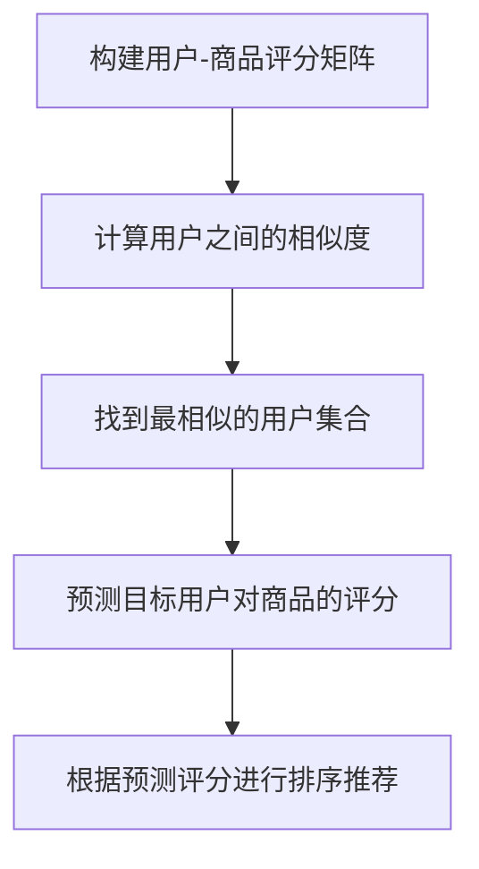

# 基于SSM实现的在线农产品商城

## 1.背景介绍

### 1.1 农产品电子商务的重要性

随着互联网技术的不断发展和普及,农产品电子商务已经成为一种新兴的商业模式。通过在线销售农产品,不仅可以打破地理位置的限制,扩大农产品的销售渠道,还能够缩短农产品从农田到餐桌的路径,提高农产品的新鲜度和质量。同时,农产品电子商务也为农民创造了新的收入来源,提高了农民的收益水平。

### 1.2 传统农产品销售模式的弊端

传统的农产品销售模式存在着诸多弊端,例如流通环节过多、中间环节利润过高、农产品新鲜度下降等问题。这些问题不仅影响了农民的收益,也影响了消费者获得优质农产品的体验。因此,构建一个高效、便捷的农产品电子商务平台,对于促进农产品流通、提高农民收益、满足消费者需求具有重要意义。

## 2.核心概念与联系

### 2.1 SSM架构

SSM架构是指Spring+SpringMVC+MyBatis的整合开发模式,它是目前比较流行的一种JavaEE企业级开发模式。其中:

- Spring: 提供了对象的生命周期管理,并通过依赖注入的方式将对象和对象之间的依赖关系绑定在一起。
- SpringMVC: 是Spring框架的一个模块,是一种基于MVC设计模式的Web层框架,用于处理HTTP请求和响应。
- MyBatis: 是一种持久层框架,用于执行SQL语句,将结果集映射为Java对象,并提供了动态SQL等强大功能。

SSM架构将这三个框架有机地整合在一起,构建了一个高效、灵活的JavaEE企业级开发平台。其中,Spring负责对象的生命周期管理和依赖注入,SpringMVC负责处理HTTP请求和响应,MyBatis负责数据持久化操作。

### 2.2 在线农产品商城系统

在线农产品商城系统是一种基于互联网技术的电子商务平台,旨在为农民和消费者提供一个高效、便捷的农产品交易渠道。该系统通常包括以下几个核心模块:

1. 商品管理模块: 用于管理农产品的上架、下架、库存、价格等信息。
2. 订单管理模块: 用于处理订单的创建、支付、发货、收货等流程。
3. 用户管理模块: 用于管理买家和卖家的注册、登录、个人信息等。
4. 支付模块: 集成第三方支付平台,实现在线支付功能。
5. 物流模块: 集成物流公司的API,实现订单物流跟踪功能。

这些模块通过SSM架构有机地整合在一起,构建了一个完整的在线农产品商城系统。

## 3.核心算法原理具体操作步骤

在线农产品商城系统涉及到多个核心算法,包括商品推荐算法、订单处理算法、支付算法等。下面以商品推荐算法为例,介绍其核心原理和具体操作步骤。

### 3.1 商品推荐算法原理

商品推荐算法是电子商务系统中一种常见的个性化推荐技术,旨在根据用户的浏览历史、购买记录等数据,推荐用户可能感兴趣的商品。常见的商品推荐算法包括:

1. 协同过滤算法(Collaborative Filtering): 基于用户之间的相似性或商品之间的相似性进行推荐。
2. 基于内容的推荐算法(Content-based): 根据商品的内容特征(如标题、描述等)与用户的兴趣偏好进行匹配。
3. 基于规则的推荐算法(Rule-based): 根据预定义的规则对商品进行推荐。
4. 混合推荐算法(Hybrid): 将多种算法结合起来,综合考虑多种因素进行推荐。

在本系统中,我们采用了基于用户的协同过滤算法,具体步骤如下:

### 3.2 基于用户的协同过滤算法步骤

1. **构建用户-商品评分矩阵**

   首先,需要构建一个用户-商品评分矩阵,矩阵的行表示用户,列表示商品,每个元素代表该用户对该商品的评分。如果用户没有对某个商品评分,则该元素为空。

2. **计算用户之间的相似度**

   接下来,需要计算用户之间的相似度。常用的相似度计算方法有:

   - 欧几里得距离
   - 皮尔逊相关系数
   - 余弦相似度

   在本系统中,我们采用了皮尔逊相关系数,计算公式如下:

   $$r_{xy} = \frac{\sum_{i=1}^{n}(x_i - \overline{x})(y_i - \overline{y})}{\sqrt{\sum_{i=1}^{n}(x_i - \overline{x})^2}\sqrt{\sum_{i=1}^{n}(y_i - \overline{y})^2}}$$

   其中,$r_{xy}$表示用户x和用户y之间的相似度,$x_i$和$y_i$分别表示用户x和用户y对第i个商品的评分,$\overline{x}$和$\overline{y}$分别表示用户x和用户y的平均评分。

3. **找到最相似的用户集合**

   根据计算出的相似度,选取与目标用户最相似的K个用户,作为最相似用户集合。

4. **预测目标用户对商品的评分**

   对于目标用户未评分的商品,可以根据最相似用户集合中其他用户对该商品的评分,预测目标用户对该商品的评分。常用的预测方法有:

   - 基于相似度加权平均
   - 基于调整的加权平均

   在本系统中,我们采用了基于相似度加权平均的方法,预测公式如下:

   $$p_{x,j} = \overline{x} + \frac{\sum_{y \in S}r_{xy}(y_j - \overline{y})}{\sum_{y \in S}|r_{xy}|}$$

   其中,$p_{x,j}$表示预测用户x对商品j的评分,$\overline{x}$表示用户x的平均评分,$r_{xy}$表示用户x和用户y之间的相似度,$y_j$表示用户y对商品j的评分,$\overline{y}$表示用户y的平均评分,S表示最相似用户集合。

5. **根据预测评分进行排序推荐**

   最后,根据预测的评分对商品进行排序,将评分较高的商品推荐给目标用户。

该算法的核心思想是利用用户之间的相似度,找到与目标用户最相似的用户集合,然后根据这些用户对商品的评分,预测目标用户对其他商品的评分,从而实现个性化推荐。

### 3.3 算法流程图

下面使用Mermaid流程图展示了上述算法的核心流程:



## 4.数学模型和公式详细讲解举例说明

在商品推荐算法中,我们使用了皮尔逊相关系数来计算用户之间的相似度,公式如下:

$$r_{xy} = \frac{\sum_{i=1}^{n}(x_i - \overline{x})(y_i - \overline{y})}{\sqrt{\sum_{i=1}^{n}(x_i - \overline{x})^2}\sqrt{\sum_{i=1}^{n}(y_i - \overline{y})^2}}$$

其中,$r_{xy}$表示用户x和用户y之间的相似度,$x_i$和$y_i$分别表示用户x和用户y对第i个商品的评分,$\overline{x}$和$\overline{y}$分别表示用户x和用户y的平均评分。

这个公式实际上是计算两个向量之间的相关性,用于衡量两个用户的评分趋势是否相似。如果两个用户对同一批商品的评分趋势相似,那么他们之间的相似度就会较高。

下面通过一个具体的例子来解释这个公式:

假设有两个用户A和B,他们对5个商品的评分分别为:

- 用户A: [4, 5, 3, 2, 1]
- 用户B: [5, 4, 2, 1, 3]

首先,我们需要计算两个用户的平均评分:

$$\overline{x} = \frac{4 + 5 + 3 + 2 + 1}{5} = 3$$
$$\overline{y} = \frac{5 + 4 + 2 + 1 + 3}{5} = 3$$

接下来,计算公式的分子部分:

$$\sum_{i=1}^{n}(x_i - \overline{x})(y_i - \overline{y}) = (4 - 3)(5 - 3) + (5 - 3)(4 - 3) + (3 - 3)(2 - 3) + (2 - 3)(1 - 3) + (1 - 3)(3 - 3) = 1 + 2 + 0 + -2 + -6 = -5$$

然后,计算公式的分母部分:

$$\sqrt{\sum_{i=1}^{n}(x_i - \overline{x})^2} = \sqrt{(4 - 3)^2 + (5 - 3)^2 + (3 - 3)^2 + (2 - 3)^2 + (1 - 3)^2} = \sqrt{1 + 4 + 0 + 1 + 4} = \sqrt{10}$$

$$\sqrt{\sum_{i=1}^{n}(y_i - \overline{y})^2} = \sqrt{(5 - 3)^2 + (4 - 3)^2 + (2 - 3)^2 + (1 - 3)^2 + (3 - 3)^2} = \sqrt{4 + 1 + 1 + 4 + 0} = \sqrt{10}$$

最后,将分子和分母代入公式,得到用户A和用户B之间的相似度:

$$r_{xy} = \frac{-5}{\sqrt{10} \times \sqrt{10}} = -0.5$$

可以看出,用户A和用户B的相似度为-0.5,表示他们的评分趋势存在一定的负相关性。

通过这个例子,我们可以更好地理解皮尔逊相关系数公式的含义和计算过程。在实际应用中,我们可以根据计算出的相似度,选取与目标用户最相似的K个用户,作为最相似用户集合,从而实现个性化推荐。

## 5.项目实践: 代码实例和详细解释说明

在本节中,我们将通过具体的代码实例,展示如何在实际项目中实现上述商品推荐算法。

### 5.1 数据准备

首先,我们需要准备用户-商品评分数据,可以从数据库或其他数据源中获取。为了简化示例,我们假设有以下评分数据:

```java
Map<String, Map<String, Double>> userRatings = new HashMap<>();

// 用户A的评分
Map<String, Double> userARatings = new HashMap<>();
userARatings.put("商品1", 4.0);
userARatings.put("商品2", 5.0);
userARatings.put("商品3", 3.0);
userARatings.put("商品4", 2.0);
userARatings.put("商品5", 1.0);
userRatings.put("用户A", userARatings);

// 用户B的评分
Map<String, Double> userBRatings = new HashMap<>();
userBRatings.put("商品1", 5.0);
userBRatings.put("商品2", 4.0);
userBRatings.put("商品3", 2.0);
userBRatings.put("商品4", 1.0);
userBRatings.put("商品5", 3.0);
userRatings.put("用户B", userBRatings);

// 用户C的评分
Map<String, Double> userCRatings = new HashMap<>();
userCRatings.put("商品1", 3.0);
userCRatings.put("商品2", 4.0);
userCRatings.put("商品3", 5.0);
userCRatings.put("商品4", 2.0);
userCRatings.put("商品5", 1.0);
userRatings.put("用户C", userCRatings);
```

### 5.2 计算用户相似度

接下来,我们实现一个方法来计算任意两个用户之间的相似度,