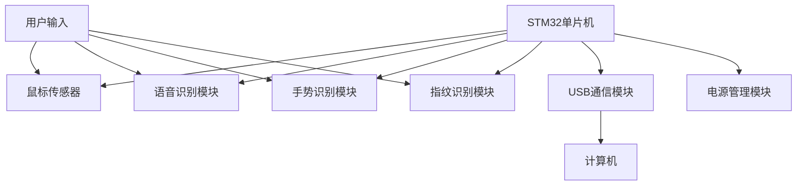

# 基于STM32的半尺寸智能电脑鼠设计与实现

## 1.背景介绍

### 1.1 计算机鼠标的发展历史

计算机鼠标作为人机交互的重要输入设备,其发展历史可以追溯到20世纪60年代。1964年,道格拉斯·恩格尔巴特在斯坦福研究所首次发明了鼠标原型。当时的鼠标使用两个金属轮子来检测运动,并且只有一个按钮。1968年,这一发明被成功集成到了第一台带有图形用户界面(GUI)的计算机Xerox Alto中。

随着个人电脑的普及,鼠标也逐渐成为标配。1983年,微软推出了首款商用鼠标,标志着鼠标正式进入大众视野。此后,鼠标的设计不断革新,功能也在不断扩展,从最初的简单移动和点击,发展到如今的滚轮滚动、手势控制等多种交互方式。

### 1.2 智能鼠标的兴起

伴随着人工智能和物联网技术的飞速发展,智能鼠标应运而生。智能鼠标不仅具备传统鼠标的基本功能,还集成了诸如语音控制、生物识别、运动检测等智能化功能,极大地提升了人机交互体验。

其中,基于STM32单片机的智能鼠标因其强大的处理能力、低功耗特性以及开源生态环境,成为智能鼠标设计的热门选择。本文将详细介绍基于STM32的半尺寸智能电脑鼠标的设计与实现过程。

## 2.核心概念与联系

### 2.1 STM32单片机

STM32是意法半导体(ST)公司推出的一款基于ARM Cortex-M内核的32位微控制器系列,具有高性能、低功耗、高集成度等优点。STM32广泛应用于工业控制、消费电子、物联网等领域。

在智能鼠标设计中,STM32单片机承担着数据采集、运算处理、通信控制等核心功能,是整个系统的大脑和控制中心。

### 2.2 鼠标传感器

鼠标传感器是检测鼠标运动的关键部件。常见的鼠标传感器有以下几种:

1. **机械式鼠标传感器**: 利用滚轮和滚珠来检测鼠标的运动,是最早期的鼠标传感器技术。
2. **光电式鼠标传感器**: 使用LED光源和图像传感器来捕捉鼠标在表面的运动,是目前最常见的鼠标传感器技术。
3. **激光式鼠标传感器**: 与光电式类似,但使用激光作为光源,可以获得更高的分辨率和精度。
4. **惯性鼠标传感器**: 利用陀螺仪和加速度计来检测鼠标的运动,无需接触表面,适用于空中操作场景。

在本文设计的智能鼠标中,我们选择了高性能的光电式传感器,能够提供准确的运动检测和良好的用户体验。

### 2.3 人机交互技术

智能鼠标的核心价值在于提升人机交互体验。除了基本的运动检测和按键控制外,本文设计的智能鼠标还集成了以下人机交互技术:

1. **语音控制**: 通过语音识别模块,用户可以使用语音命令来控制鼠标的操作,实现无接触式交互。
2. **手势控制**: 利用加速度计和陀螺仪传感器,智能鼠标能够识别特定的手势动作,并执行相应的操作命令。
3. **生物识别**: 通过集成指纹识别模块,智能鼠标可以实现用户身份验证,提高系统安全性。

这些先进的人机交互技术使得智能鼠标不仅是一个简单的输入设备,更是一个智能化的人机交互终端。

### 2.4 系统架构概览

基于STM32的半尺寸智能电脑鼠标系统架构如下所示:

该系统由STM32单片机作为控制中心,集成了鼠标传感器、语音识别模块、手势识别模块、指纹识别模块等多种人机交互功能模块。用户的输入通过这些模块被采集并传递给STM32进行处理,最终通过USB通信模块将处理结果发送到计算机上。同时,系统还包括电源管理模块,以确保整个系统的低功耗运行。

## 3.核心算法原理具体操作步骤

### 3.1 光电式鼠标传感器工作原理

光电式鼠标传感器是目前应用最广泛的鼠标传感器技术。它的工作原理可以概括为以下几个步骤:

1. **光源照射**: LED光源将光线照射到鼠标底部的工作表面上。
2. **图像采集**: 图像传感器(如CMOS或CCD)捕获工作表面的图像。
3. **图像处理**: 对采集到的图像进行处理,提取表面纹理特征。
4. **运动检测**: 通过比较连续两帧图像的纹理特征差异,计算出鼠标的运动距离和方向。
5. **数据传输**: 将运动数据通过USB或其他接口传输到计算机。

在实际应用中,光电式鼠标传感器往往采用专用的数字图像处理芯片(如Avago/PixArt等)来实现高效的图像处理和运动检测算法,从而获得高精度、低延迟的鼠标跟踪效果。

### 3.2 语音识别算法

语音识别是智能鼠标实现语音控制的核心技术。常见的语音识别算法包括隐马尔可夫模型(HMM)、深度神经网络(DNN)、长短期记忆网络(LSTM)等。

以LSTM为例,其语音识别过程可以概括为以下几个步骤:

1. **语音预处理**: 对采集的语音信号进行预加重、分帧、加窗等预处理操作。
2. **特征提取**: 使用梅尔频率倒谱系数(MFCC)等算法从预处理后的语音数据中提取特征向量。
3. **声学模型**: 将提取的特征向量输入训练好的LSTM声学模型,得到语音的概率输出。
4. **语言模型**: 利用语言模型(如N-gram模型)对声学模型的输出进行修正,提高识别准确率。
5. **解码器**: 通过beam search或Viterbi算法等方法,在声学模型和语言模型的约束下,找到最可能的语音转录结果。

在智能鼠标中,我们可以在STM32单片机上部署简化版的LSTM语音识别算法,或者利用云端语音识别服务,将语音数据上传到云端进行识别和处理。

### 3.3 手势识别算法

手势识别是另一种常见的人机交互方式。智能鼠标通常使用加速度计和陀螺仪传感器来检测手势动作。手势识别算法可以分为以下几个步骤:

1. **数据采集**: 从加速度计和陀螺仪获取运动数据,包括加速度、角速度等。
2. **数据预处理**: 对采集的运动数据进行滤波、校准等预处理,消除噪声和偏移。
3. **特征提取**: 从预处理后的数据中提取特征向量,如统计特征(均值、方差等)、时域特征(峰值、零交叉率等)、频域特征(傅里叶变换系数等)。
4. **模式识别**: 将提取的特征向量输入机器学习模型(如支持向量机、随机森林等),对手势进行分类识别。
5. **后处理**: 对识别结果进行平滑处理,消除抖动,提高稳定性。

在智能鼠标中,我们可以在STM32单片机上实现简单的手势识别算法,如基于阈值的手势检测。对于更复杂的算法,可以考虑在单片机上部署轻量级的机器学习模型,或者将数据上传到云端进行处理。

### 3.4 指纹识别算法

指纹识别是一种常见的生物识别技术,可以用于智能鼠标的用户身份验证。指纹识别算法通常包括以下几个步骤:

1. **图像采集**: 使用指纹传感器采集用户指纹图像。
2. **图像预处理**: 对采集的指纹图像进行归一化、增强、二值化等预处理,提高图像质量。
3. **特征提取**: 从预处理后的指纹图像中提取特征,如终止点、分叉点、纹理方向等。
4. **特征匹配**: 将提取的指纹特征与存储的模板特征进行匹配,计算相似度得分。
5. **决策**: 根据相似度得分和预设阈值,判断是否为合法用户。

常见的指纹特征提取算法包括minutiae算法、谱域算法、人工神经网络算法等。在智能鼠标中,我们可以选择计算量较小的minutiae算法,在STM32单片机上实现指纹识别功能。

## 4.数学模型和公式详细讲解举例说明

### 4.1 光电式鼠标运动检测算法

光电式鼠标的运动检测算法是基于图像处理和计算机视觉技术实现的。我们以一种常见的相位相关算法(Phase Correlation Algorithm)为例,详细介绍其数学原理。

相位相关算法的基本思路是:通过计算两幅图像的相位相关函数,可以得到它们之间的平移向量,进而确定鼠标的运动距离和方向。

设有两幅图像 $f(x, y)$ 和 $g(x, y)$,它们之间存在平移关系:

$$g(x, y) = f(x - \Delta x, y - \Delta y)$$

其中 $(\Delta x, \Delta y)$ 是平移向量。我们对两个图像进行二维离散傅里叶变换(DFT):

$$F(u, v) = \mathcal{F}\{f(x, y)\}$$
$$G(u, v) = \mathcal{F}\{g(x, y)\}$$

根据平移性质,它们之间存在如下关系:

$$G(u, v) = F(u, v) \cdot e^{-j2\pi(u\Delta x/M + v\Delta y/N)}$$

其中 $M$、$N$ 分别是图像的宽度和高度。

我们定义相位相关函数(Phase Correlation Function)为:

$$R(u, v) = \frac{F(u, v) \cdot G^*(u, v)}{|F(u, v) \cdot G^*(u, v)|}$$

将上式代入,可以得到:

$$R(u, v) = e^{j2\pi(u\Delta x/M + v\Delta y/N)}$$

对相位相关函数进行反傅里叶变换,可以得到一个尖峰函数:

$$r(x, y) = \mathcal{F}^{-1}\{R(u, v)\} = \delta(x - \Delta x, y - \Delta y)$$

其中 $\delta(x, y)$ 是二维狄拉克delta函数。尖峰函数的位置就对应着两幅图像之间的平移向量 $(\Delta x, \Delta y)$,即鼠标的运动距离和方向。

在实际应用中,我们可以通过计算相位相关函数的质心位置,获得亚像素级别的平移估计,从而提高鼠标的运动精度。

### 4.2 MFCC语音特征提取

在语音识别算法中,梅尔频率倒谱系数(MFCC)是一种常用的语音特征提取方法。MFCC的计算过程如下:

1. **预加重**: 对语音信号进行预加重,以增强高频部分的能量,公式为:

$$y[n] = x[n] - \alpha \cdot x[n-1]$$

其中 $\alpha$ 通常取值 0.95~0.97。

2. **分帧**: 将语音信号分成若干个短时帧,每帧长度通常为 20~40 ms,相邻帧之间有重叠。

3. **加窗**: