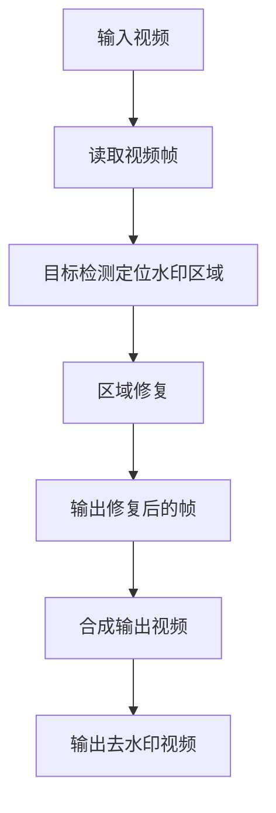

# 基于OpenCV实现视频去水印系统详细设计与具体代码实现

## 1.背景介绍

随着数字视频的广泛应用,视频水印技术成为保护视频版权的重要手段。但在某些情况下,视频水印会影响观看体验,因此去除视频水印的需求也日益增长。传统的去水印方法通常需要对视频进行解码、处理和重新编码,效率低下且可能导致质量下降。本文将介绍如何基于OpenCV实现一个高效、无损的视频去水印系统。

### 1.1 视频水印简介

视频水印是指在视频中嵌入一些标识信息,用于版权保护、溯源等目的。常见的水印形式包括:

- 文字水印:在视频画面上叠加文字标识
- 图片水印:在视频画面上叠加图片标识
- 数字水印:将标识信息隐藏在视频数据中

### 1.2 去水印的需求场景

虽然视频水印有其正当用途,但在某些情况下需要去除水印:

- 个人使用:去除影响观看体验的水印
- 视频剪辑:水印可能遮挡重要画面区域
- 视频压制:水印会影响压制质量
- 视频分析:水印会干扰图像处理算法

### 1.3 OpenCV简介

OpenCV(Open Source Computer Vision Library)是一个跨平台的计算机视觉库,提供了丰富的图像/视频处理函数。它具有以下优势:

- 开源免费
- 跨平台(Windows/Linux/macOS等)
- 性能优化,实时处理能力强
- 丰富的算法和函数库

## 2.核心概念与联系

实现视频去水印系统需要涉及以下几个核心概念:

### 2.1 图像处理

去除视频水印的本质是对每一帧图像进行处理。常用的图像处理操作包括:

- 滤波:去噪、锐化等
- 几何变换:平移、旋转、缩放等
- 形态学操作:腐蚀、膨胀等
- 阈值分割:将图像二值化

### 2.2 目标检测

要去除水印,首先需要检测并定位水印区域。可以采用以下方法:

- 模板匹配:使用已知水印图像作为模板进行匹配
- 特征匹配:提取水印和背景的特征,进行匹配
- 机器学习:训练模型识别水印

### 2.3 区域修复

定位到水印区域后,需要对该区域进行修复,使其与周围背景融合。常用的修复方法有:

- 插值:使用周围像素的值进行插值
- 纹理合成:合成与背景相似的纹理
- 基于示例的修复:使用相似图像块进行修复

### 2.4 视频处理

对视频进行去水印需要逐帧处理,并考虑帧间的连贯性。OpenCV提供了视频读写功能,可以方便地访问和处理视频数据。

## 3.核心算法原理具体操作步骤

本节将介绍基于OpenCV实现视频去水印系统的核心算法原理和具体操作步骤。

### 3.1 算法流程概览



### 3.2 目标检测算法

本系统采用基于模板匹配的目标检测算法,具体步骤如下:

1. 准备已知水印图像作为模板
2. 对输入视频帧进行预处理(如灰度化、平滑等)
3. 使用OpenCV的`matchTemplate`函数在帧图像中匹配模板
4. 根据匹配结果定位水印区域

```python
import cv2
import numpy as np

# 读取水印模板图像
watermark_template = cv2.imread('watermark.png', 0)

# 读取视频帧
frame = ... # 读取视频帧的代码

# 进行模板匹配
res = cv2.matchTemplate(frame, watermark_template, cv2.TM_CCOEFF_NORMED)
min_val, max_val, min_loc, max_loc = cv2.minMaxLoc(res)

# 获取水印区域坐标
top_left = max_loc
bottom_right = (max_loc[0] + watermark_template.shape[1], 
                max_loc[1] + watermark_template.shape[0])
```

### 3.3 区域修复算法

本系统采用基于纹理合成的区域修复算法,具体步骤如下:

1. 使用前一步检测到的坐标提取水印区域
2. 对水印区域应用`cv2.inpaint`函数进行修复
3. 将修复后的区域合并到原始帧图像中

```python
import cv2
import numpy as np

# 水印区域坐标
top_left = ... 
bottom_right = ...

# 提取水印区域
watermark_mask = np.zeros_like(frame)
watermark_mask[top_left[1]:bottom_right[1], top_left[0]:bottom_right[0]] = 1

# 进行区域修复
repaired_frame = cv2.inpaint(frame, watermark_mask, 3, cv2.INPAINT_TELEA)
```

## 4.数学模型和公式详细讲解举例说明

### 4.1 模板匹配算法

模板匹配是一种在图像中查找与给定模板最匹配的区域的方法。OpenCV提供了`cv2.matchTemplate`函数实现模板匹配,其数学原理如下:

对于图像$I$和模板$T$,定义匹配度量函数$R(x,y)$,表示模板$T$在图像$I$的$(x,y)$位置处的匹配程度。常用的匹配度量函数有:

1. 平方差匹配(Square Difference Matching):

$$R(x,y) = \sum_{x',y'} [T(x',y') - I(x+x',y+y')]^2$$

2. 相关匹配(Correlation Matching):

$$R(x,y) = \sum_{x',y'} [T(x',y') \cdot I(x+x',y+y')]$$

3. 归一化相关匹配(Normalized Correlation Matching):

$$R(x,y) = \frac{\sum_{x',y'} [T(x',y') \cdot I(x+x',y+y')]}{\sqrt{\sum_{x',y'} T(x',y')^2 \cdot \sum_{x',y'} I(x+x',y+y')^2}}$$

对于平方差匹配,匹配度量值越小,表示匹配程度越高;对于相关匹配,匹配度量值越大,表示匹配程度越高。OpenCV默认使用归一化相关匹配,匹配度量值在$[-1,1]$范围内,值越接近1表示匹配程度越高。

### 4.2 区域修复算法

OpenCV的`cv2.inpaint`函数实现了基于纹理合成的区域修复算法,其数学原理如下:

给定一幅图像$I$和一个掩码图像$M$,其中$M$中的非零像素点表示需要修复的区域。目标是使用$I$中的有效像素点(即$M$中的零像素点)来估计并填充$M$中的非零像素点,使得修复后的图像$I'$在视觉上与原始图像$I$无缝衔接。

该算法基于以下两个基本观察:

1. 修复区域内的像素值应该与其周围有效像素值相似
2. 修复区域的边缘应该与图像边缘保持连续性

算法的核心思想是在修复区域内插值,使用周围有效像素值的加权组合来估计修复像素的值。具体来说,对于修复区域内的每个像素点$p$,算法会在其邻域内搜索与$p$最相似的图像块,并使用该图像块的像素值对$p$进行加权平均,得到$p$的估计值。

该算法由两个步骤组成:

1. **纹理合成步骤**:使用快速行进算法,从已知区域向未知区域传播已知信息,生成粗略的修复结果。
2. **插值步骤**:使用分段线性插值,对粗略结果进行精细化处理,得到最终的修复结果。

OpenCV提供了两种区域修复算法的实现:`cv2.INPAINT_NS`(Navier-Stokes基于等式的插值算法)和`cv2.INPAINT_TELEA`(Alexandru Telea的快速行进算法)。一般情况下,`cv2.INPAINT_TELEA`算法的效果更好、速度更快。

## 5.项目实践:代码实例和详细解释说明

本节将提供一个基于OpenCV实现视频去水印系统的Python代码示例,并对关键部分进行详细解释。

```python
import cv2
import numpy as np

# 读取水印模板图像
watermark_template = cv2.imread('watermark.png', 0)

# 打开视频文件
cap = cv2.VideoCapture('input_video.mp4')

# 获取视频属性
fps = cap.get(cv2.CAP_PROP_FPS)
width = int(cap.get(cv2.CAP_PROP_FRAME_WIDTH))
height = int(cap.get(cv2.CAP_PROP_FRAME_HEIGHT))

# 创建视频写入对象
fourcc = cv2.VideoWriter_fourcc(*'mp4v')
out = cv2.VideoWriter('output_video.mp4', fourcc, fps, (width, height))

# 逐帧处理
while True:
    ret, frame = cap.read()
    if not ret:
        break

    # 进行模板匹配
    res = cv2.matchTemplate(frame, watermark_template, cv2.TM_CCOEFF_NORMED)
    min_val, max_val, min_loc, max_loc = cv2.minMaxLoc(res)

    # 获取水印区域坐标
    top_left = max_loc
    bottom_right = (max_loc[0] + watermark_template.shape[1], 
                    max_loc[1] + watermark_template.shape[0])

    # 提取水印区域
    watermark_mask = np.zeros_like(frame)
    watermark_mask[top_left[1]:bottom_right[1], top_left[0]:bottom_right[0]] = 1

    # 进行区域修复
    repaired_frame = cv2.inpaint(frame, watermark_mask, 3, cv2.INPAINT_TELEA)

    # 写入修复后的帧
    out.write(repaired_frame)

# 释放资源
cap.release()
out.release()
```

代码解释:

1. 首先读取水印模板图像,并打开输入视频文件。
2. 获取视频的属性(帧率、宽度、高度),用于创建输出视频文件。
3. 进入循环,逐帧读取视频帧。
4. 对每一帧进行模板匹配,定位水印区域。
5. 提取水印区域,创建掩码图像。
6. 使用`cv2.inpaint`函数进行区域修复,得到修复后的帧图像。
7. 将修复后的帧写入输出视频文件。
8. 循环结束后,释放资源。

需要注意的是,上述代码仅适用于静态水印的情况。对于动态水印,需要进一步优化算法,例如跟踪水印的运动轨迹,或者使用机器学习方法进行检测和修复。

## 6.实际应用场景

视频去水印系统在以下场景中具有广泛的应用:

1. **个人娱乐**:去除影响观看体验的水印,获得更好的视觉效果。
2. **视频剪辑**:去除遮挡重要画面区域的水印,提高剪辑质量。
3. **视频压制**:去除可能影响压制质量的水印。
4. **视频分析**:去除可能干扰图像处理算法的水印,提高分析精度。
5. **版权保护**:对于非法传播的视频,去除水印以追查视频来源。

需要注意的是,去除视频水印可能会侵犯版权,因此在使用该系统时需要遵守相关法律法规。

## 7.工具和资源推荐

本节将介绍一些实现视频去水印系统的有用工具和资源。

### 7.1 OpenCV

OpenCV是本系统的核心库,提供了丰富的计算机视觉和图像处理函数。它支持多种编程语言(C++、Python、Java等),并提供了跨平台支持。OpenCV官网提供了详细的文档、教程和示例代码,是学习和使用OpenCV的绝佳资源。

官网地址:https://opencv.org/

### 7.2 FFmpeg

FFmpeg是一个功能强大的多媒体框架,可用于视频/音频的录制、转换和流媒体处理。在视频去水印系统中,可以使用FFmpeg进行视