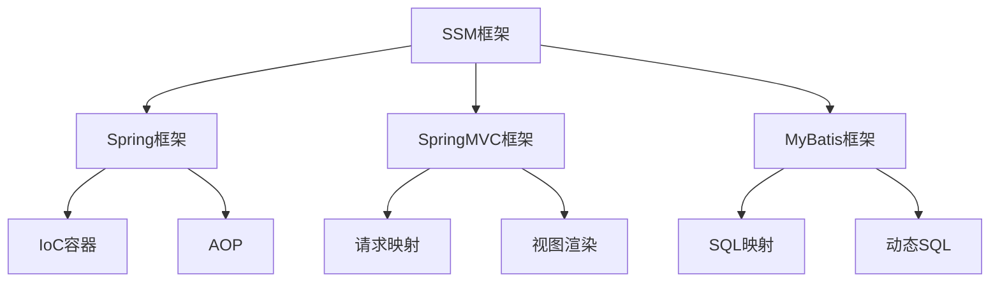
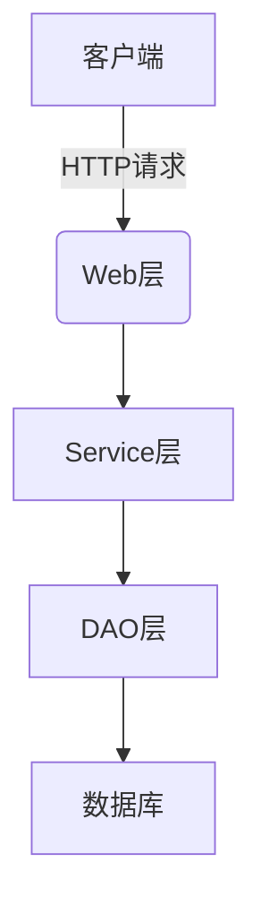

# 基于SSM的钢铁工厂管理系统

## 1.背景介绍

### 1.1 钢铁工业概述

钢铁工业是一个国家工业化进程中的支柱产业,对于国民经济的发展具有重要意义。钢铁产品广泛应用于建筑、交通运输、机械制造、能源等诸多领域,是现代社会不可或缺的基础材料。随着工业化和城市化进程的推进,钢铁需求将持续增长。

### 1.2 钢铁工厂管理现状及挑战

传统钢铁工厂的管理模式存在诸多问题和挑战:

1. 信息孤岛严重,各个部门系统无法有效集成共享数据
2. 生产计划与实际执行存在偏差,无法实时监控生产状态
3. 人工管理效率低下,容易出现失误和遗漏
4. 缺乏科学决策支持,管理决策依赖经验主观判断
5. 物料消耗和能源利用率不佳,浪费严重

为了提高钢铁企业的管理水平和运营效率,迫切需要构建一套集成化的信息管理系统。

### 1.3 SSM框架介绍  

SSM(Spring+SpringMVC+MyBatis)是目前使用最广泛的JavaEE企业级开发框架之一。它将优秀的设计模式如工厂模式、代理模式、单例模式等融合到框架之中,提高了系统的可扩展性、可维护性和可重用性。SSM框架主要包括:

- Spring: 核心容器,负责对象的创建、装配及管理
- SpringMVC: 展现层框架,封装了请求映射、数据绑定、视图渲染等机制
- MyBatis: 持久层框架,实现了JDBC与SQL的自动映射和执行

SSM框架的分层设计使得代码结构清晰,降低了各层之间的耦合度,具有良好的可维护性和可扩展性。

## 2.核心概念与联系



SSM框架的核心概念及其联系如上图所示:

1. **Spring框架**: 提供了IoC(控制反转)和AOP(面向切面编程)机制,管理应用中的对象及其生命周期,实现了低耦合的代码设计。
2. **SpringMVC框架**: 基于请求驱动的MVC模式,实现了请求映射、数据绑定、视图渲染等功能,简化了Web层的开发。
3. **MyBatis框架**: 采用ORM思想,通过SQL映射文件将对象与SQL查询语句建立映射关系,并支持动态SQL、存储过程等高级特性。

三个框架有机结合,Spring作为核心容器管理对象,SpringMVC负责Web层的请求处理,MyBatis负责数据持久化操作,共同构建了高效、可扩展的应用系统。

## 3.核心算法原理具体操作步骤

### 3.1 Spring IoC容器初始化过程

Spring IoC容器的初始化是整个框架的基础,其核心原理是基于"工厂模式+反射机制"实现的。初始化过程包括以下步骤:

1. **加载配置文件**: 根据配置方式(xml、注解等)加载bean的定义信息
2. **解析bean定义**: 将配置信息解析为BeanDefinition对象
3. **注册bean**: 将BeanDefinition存储到相应的bean容器中
4. **实例化bean**: 根据bean的作用域、构造方法等信息创建bean实例
5. **注入属性**: 将bean实例的属性值注入,包括对象引用和值注入
6. **初始化bean**: 调用bean的初始化方法,例如InitializingBean接口的afterPropertiesSet()
7. **注册相关事件**: 注册监听器,处理bean生命周期相关事件

通过上述步骤,Spring能够管理应用中所有bean的生命周期,并根据依赖注入原则组装对象,从而实现低耦合的代码设计。

### 3.2 SpringMVC请求处理流程

SpringMVC通过请求映射的方式,将客户端请求与控制器方法建立映射关系,请求处理流程如下:

1. **发起请求**: 客户端发起HTTP请求
2. **请求分发**: DispatcherServlet接收请求,根据HandlerMapping查找对应的处理器
3. **执行拦截器**: 执行已配置的HandlerInterceptor的preHandle方法
4. **执行控制器**: 调用映射的Controller处理请求
5. **视图渲染**: Controller方法返回ModelAndView对象,根据视图名称查找View进行渲染
6. **执行拦截器**: 执行HandlerInterceptor的postHandle和afterCompletion方法
7. **响应结果**: 将渲染结果响应给客户端

SpringMVC的设计遵循"前端控制器"模式,通过中央处理器DispatcherServlet统一分发请求,将请求的接收、处理、视图渲染等功能分离,提高了代码的复用性。

### 3.3 MyBatis查询流程

MyBatis采用ORM思想,将对象与SQL语句建立映射关系,查询流程如下:

1. **加载配置文件**: 根据配置方式加载MyBatis的全局配置信息
2. **创建SqlSessionFactory**: 通过配置信息构建SqlSessionFactory
3. **获取SqlSession**: 从SqlSessionFactory中获取SqlSession对象
4. **获取映射器**: 通过SqlSession获取Mapper接口的代理对象
5. **执行SQL**: 调用Mapper接口方法,由MyBatis根据方法签名查找对应的SQL语句并执行
6. **结果映射**: MyBatis将查询结果按照映射规则封装为对象
7. **关闭资源**: 关闭SqlSession等资源

MyBatis通过动态代理机制,将SQL语句与接口方法建立映射关系,开发者只需编写接口和映射文件,无需手动编写JDBC代码,大大提高了开发效率。

## 4.数学模型和公式详细讲解举例说明

在钢铁工厂管理系统中,需要对生产计划、物料消耗、能源利用等进行优化,涉及到一些数学模型和算法,下面对其中的一些核心模型进行介绍。

### 4.1 生产计划优化模型

生产计划优化是钢铁工厂管理的核心问题之一,需要在满足产品需求的前提下,合理安排生产计划,最小化生产成本。可以构建如下数学规划模型:

$$
\begin{aligned}
\min \quad & \sum_{i=1}^{n}c_ix_i \\
\text{s.t.}\quad & \sum_{i=1}^{n}a_{ij}x_i\geq d_j,\quad j=1,2,\dots,m\\
& x_i\geq 0,\quad i=1,2,\dots,n
\end{aligned}
$$

其中:
- $n$为产品种类数量
- $m$为原材料种类数量
- $x_i$为第$i$种产品的生产量
- $c_i$为第$i$种产品的单位生产成本
- $a_{ij}$为生产1单位第$i$种产品需要消耗的第$j$种原材料量
- $d_j$为第$j$种原材料的最低需求量

该模型的目标是最小化总生产成本,约束条件包括满足各种原材料的最低需求量,以及生产量的非负性约束。可以使用线性规划或整数规划算法求解。

### 4.2 钢铁冶炼过程控制模型

钢铁冶炼过程是一个复杂的物理化学过程,需要对温度、压力、物料投料量等参数进行精确控制。可以构建如下控制模型:

$$
\begin{aligned}
\dot{x}(t)&=f(x(t),u(t))\\
y(t)&=g(x(t),u(t))
\end{aligned}
$$

其中:
- $x(t)$为系统状态变量向量,包括温度、压力等
- $u(t)$为控制变量向量,包括燃料供给量、风量等
- $y(t)$为输出变量向量,包括产品质量指标等
- $f(\cdot)$为系统状态方程,描述系统的动态行为
- $g(\cdot)$为输出方程,描述状态与输出的关系

基于该模型,可以设计反馈控制器,通过测量系统输出,调节控制变量,使系统输出跟踪给定的理想轨迹,从而实现对冶炼过程的自动控制。控制算法可以采用经典PID控制、现代滑模控制等方法。

以上仅为数学模型的简单示例,在实际应用中还需要结合具体问题,构建更加精细的模型,并采用高效的数值求解方法。

## 5.项目实践:代码实例和详细解释说明 

### 5.1 系统架构设计



如上图所示,整个系统采用经典的三层架构设计:

1. **Web层**: 基于SpringMVC框架,负责接收请求、调用Service层方法、渲染视图等
2. **Service层**: 负责业务逻辑处理,对上提供服务接口,对下调用DAO层方法
3. **DAO层**: 基于MyBatis框架,负责与数据库进行交互,执行增删改查操作
4. **数据库**: 存储系统所需的各种数据

该架构将系统按功能职责进行清晰划分,各层之间相对独立,降低了耦合度,便于后期扩展和维护。

### 5.2 Spring配置示例

```xml
<?xml version="1.0" encoding="UTF-8"?>
<beans xmlns="http://www.springframework.org/schema/beans"
    xmlns:xsi="http://www.w3.org/2001/XMLSchema-instance"
    xmlns:context="http://www.springframework.org/schema/context"
    xsi:schemaLocation="http://www.springframework.org/schema/beans
        https://www.springframework.org/schema/beans/spring-beans.xsd
        http://www.springframework.org/schema/context
        https://www.springframework.org/schema/context/spring-context.xsd">

    <!-- 开启注解扫描 -->
    <context:component-scan base-package="com.example.factory" />

    <!-- 数据源配置 -->
    <bean id="dataSource" class="org.apache.commons.dbcp.BasicDataSource">
        <property name="driverClassName" value="com.mysql.jdbc.Driver"/>
        <property name="url" value="jdbc:mysql://localhost:3306/factory"/>
        <property name="username" value="root"/>
        <property name="password" value="123456"/>
    </bean>

    <!-- MyBatis配置 -->
    <bean id="sqlSessionFactory" class="org.mybatis.spring.SqlSessionFactoryBean">
        <property name="dataSource" ref="dataSource" />
        <property name="mapperLocations" value="classpath:mappers/*.xml"/>
    </bean>

    <!-- 扫描Mapper接口 -->
    <bean class="org.mybatis.spring.mapper.MapperScannerConfigurer">
        <property name="basePackage" value="com.example.factory.dao" />
    </bean>

</beans>
```

上面是一个基本的Spring配置文件示例,包括:

1. 开启注解扫描,自动扫描并创建bean
2. 配置数据源,连接MySQL数据库
3. 配置MyBatis的SqlSessionFactory,指定映射文件位置
4. 扫描MyBatis的Mapper接口,自动创建代理对象

通过该配置文件,Spring能够管理整个应用的bean生命周期,并将MyBatis整合到项目中。

### 5.3 SpringMVC配置示例

```xml
<servlet>
    <servlet-name>dispatcher</servlet-name>
    <servlet-class>org.springframework.web.servlet.DispatcherServlet</servlet-class>
    <init-param>
        <param-name>contextConfigLocation</param-name>
        <param-value>/WEB-INF/spring-mvc.xml</param-value>
    </init-param>
    <load-on-startup>1</load-on-startup>
</servlet>

<servlet-mapping>
    <servlet-name>dispatcher</servlet-name>
    <url-pattern>/</url-pattern>
</servlet-mapping>
```

```xml
<?xml version="1.0" encoding="UTF-8"?>
<beans xmlns="http://www.springframework.org/schema/beans"
    xmlns:xsi="http://www.w3.org/2001/XMLSchema-instance"
    xmlns:context="http://www.springframework.org/schema/context"
    xmlns:mvc="http://www.springframework.org/schema/mvc"
    xsi:schemaLocation="
        http://www.springframework.org/schema/beans
        https://www.springframework.org/schema/beans/spring-beans.xsd
        http://www.springframework.org/