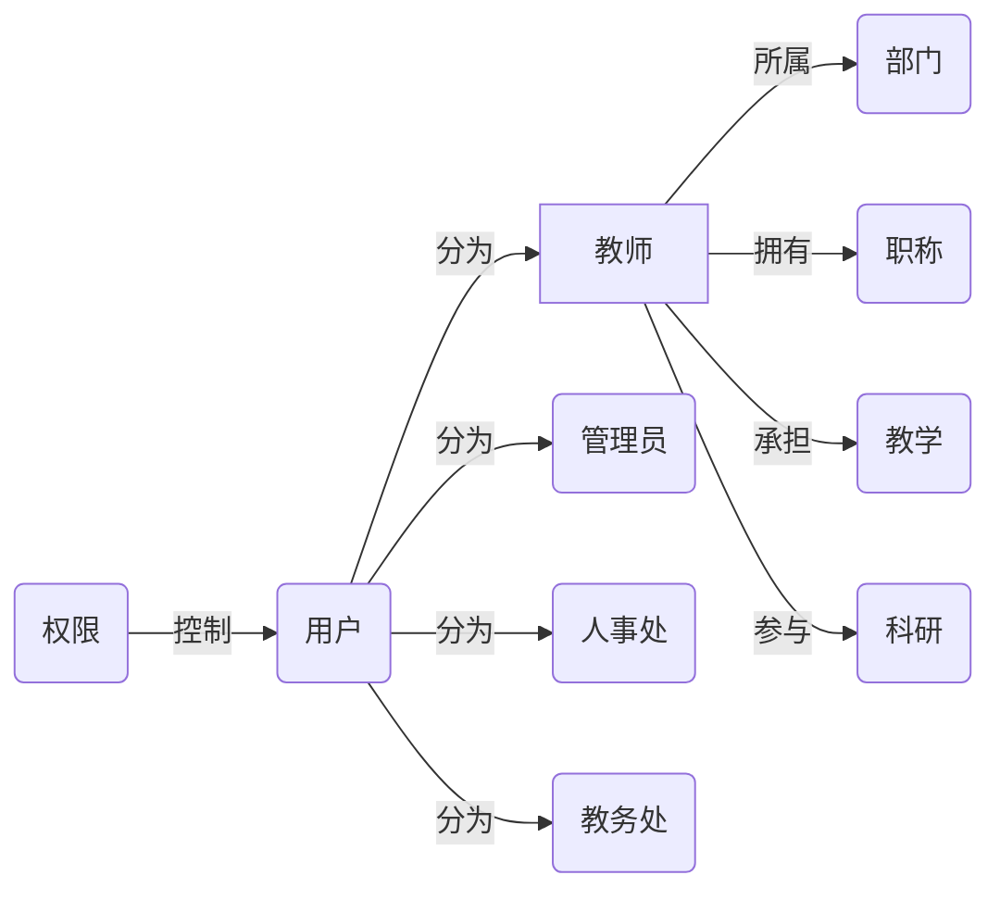

# 基于web的师资管理系统详细设计与具体代码实现

## 1. 背景介绍

在现代教育管理中,师资管理是一项非常重要的工作。随着信息技术的快速发展,传统的人工管理方式已经无法满足日益增长的管理需求。因此,开发一个基于web的师资管理系统就显得尤为重要和迫切。

本文将详细介绍如何使用现代web开发技术,从需求分析、系统设计到具体的代码实现,一步步构建出一个功能完善、易于使用的师资管理系统。通过该系统,可以大大提高师资管理工作的效率和准确性,为学校的教学管理提供有力的支持。

### 1.1 师资管理的重要性

师资管理在教育管理中占据着非常重要的地位。高素质的师资队伍是保证教学质量的根本。做好师资管理工作,对于提高教师队伍整体素质,促进教育事业健康发展具有重要意义。

### 1.2 传统师资管理方式的局限性

传统的师资管理主要采用人工的方式,通过纸质档案、电子表格等手段进行管理。这种方式存在着诸多不足:

- 效率低下:人工处理数据耗时耗力,难以应对海量数据
- 准确性差:人工录入、统计数据容易出错
- 数据孤岛:不同部门各自为政,数据难以共享
- 不易维护:系统升级、数据备份困难

### 1.3 师资管理信息化的必要性

为了克服传统管理方式的种种弊端,实现师资管理的科学化、规范化、高效化,开发一套功能完善的师资管理信息系统势在必行。通过信息化手段,可以:

- 提高工作效率,减轻管理人员工作量
- 保证数据准确性,提供数据支撑决策分析
- 打通数据壁垒,实现信息资源共享
- 简化维护流程,降低系统运维成本

因此,加快推进师资管理信息化建设,对于推动教育管理现代化,具有十分重要的意义。

## 2. 核心概念与联系

在师资管理系统中,涉及到一些核心概念,下面我们来进行介绍和梳理。

### 2.1 教师信息

教师是师资管理的核心对象,主要包含以下信息:

- 基本信息:姓名、性别、出生年月、照片等
- 学历学位:毕业院校、专业、学历、学位等  
- 职称信息:职称等级、评定时间等
- 教学情况:授课专业、课程、班级等
- 科研情况:论文、项目、获奖等

### 2.2 部门信息

教师所属部门,是组织管理教师的基本单位。主要包括:

- 部门名称
- 部门编码
- 所属学院
- 负责人

### 2.3 职称信息

职称是教师专业技术水平的体现,通常分为初级、中级、高级三个等级。不同职称在待遇、职责上有所区别。

### 2.4 用户角色

系统用户分为几种角色:

- 管理员:拥有所有权限,负责系统管理
- 人事处:负责教师信息的录入、审核
- 教务处:负责教学信息的录入、统计
- 教师:可查看和修改个人信息

### 2.5 权限管理

为保证系统的安全性,需要对用户的操作权限进行控制。主要涉及:

- 身份认证:登录、注销、修改密码等
- 操作权限:增删改查、导入导出等

### 2.6 核心概念关系图

下面使用Mermaid流程图来展示师资管理系统的核心概念及其关系:



从上图可以清晰的看出,教师与部门、职称、教学、科研等概念紧密相关,而用户又分为不同角色,通过权限控制可以规范用户行为。厘清了这些概念间的关系,有助于我们更好地进行系统设计与开发。

## 3. 核心算法原理具体操作步骤

师资管理系统涉及到一些核心算法,下面我们重点介绍其中的两个算法。

### 3.1 数据导入算法

系统需要支持从Excel等外部文件中批量导入教师数据,涉及到数据导入的算法。具体步骤如下:

1. 读取Excel文件,获取数据表格
2. 遍历表格每一行数据
3. 对每一行数据进行解析,提取各字段值
4. 对提取出的数据进行校验,判断是否符合要求
5. 如果数据合法,则写入数据库表中
6. 如果全部数据都导入完成,则提交事务
7. 如果出现错误,则回滚事务,并返回错误信息

伪代码如下:

```
function importData(file):
    data = readExcel(file)
    db.beginTransaction()
    try:
        for each row in data:
            fields = parseRow(row)
            if validate(fields):
                db.insert(fields)
            else:
                raise Exception('Invalid data')
        db.commit()
    except Exception as e:  
        db.rollback()
        return e.message
```

### 3.2 教师搜索算法

系统需要提供教师搜索功能,根据姓名、职称、学历等条件快速查找教师。搜索算法步骤如下:

1. 解析用户输入的搜索条件
2. 生成SQL查询语句
3. 执行SQL语句,返回匹配结果
4. 对结果进行分页处理
5. 返回分页后的结果给前端展示

伪代码:

```
function searchTeachers(conditions, page, pageSize):
    sql = generateSQL(conditions)
    data = db.query(sql)
    total = data.length
    start = (page - 1) * pageSize
    end = start + pageSize
    pageData = data[start:end]
    return {
        total: total, 
        data: pageData
    }
```

合理使用这些算法,可以保证系统的数据处理高效、准确。

## 4. 数学模型和公式详细讲解举例说明

在师资管理系统中,会涉及到一些数学模型和公式,用于进行数据分析和统计。下面我们举例说明。

### 4.1 教师学历分布统计

我们可以用数学公式来计算教师的学历分布比例。假设学历分为专科、本科、硕士、博士四个层次,分别记为 $x_1, x_2, x_3, x_4$,总教师数为 $N$,则各学历教师占比可表示为:

$$
r_i = \frac{x_i}{N} \quad (i=1,2,3,4)
$$

其中 $r_i$ 表示第 $i$ 类学历教师占总教师数的比例。

例如,某学校共有教师100人,其中专科10人,本科20人,硕士50人,博士20人,则各学历教师占比为:

$$
\begin{aligned}
r_1 &= \frac{10}{100} = 10\% \\
r_2 &= \frac{20}{100} = 20\% \\
r_3 &= \frac{50}{100} = 50\% \\  
r_4 &= \frac{20}{100} = 20\% \\
\end{aligned}
$$

### 4.2 教师职称晋升预测

我们可以用马尔可夫模型来预测教师职称的晋升情况。假设职称分为助教、讲师、副教授、教授四个等级,分别用 $S_1, S_2, S_3, S_4$ 表示,教师从低一级职称晋升到高一级职称的概率为 $P$,则教师职称状态转移概率矩阵为:

$$
P = 
\begin{bmatrix}
    P_{11} & P_{12} & P_{13} & P_{14} \\
    0 & P_{22} & P_{23} & P_{24} \\
    0 & 0 & P_{33} & P_{34} \\
    0 & 0 & 0 & 1
\end{bmatrix}
$$

其中 $P_{ij}$ 表示从状态 $S_i$ 转移到状态 $S_j$ 的概率。

假设初始时刻处于助教、讲师、副教授、教授状态的教师人数分别为 $N_1, N_2, N_3, N_4$,用列向量 $\vec{N}$ 表示,则 $k$ 年后各职称教师人数分布为:  

$$
\vec{N}(k) = P^k \vec{N}(0)
$$

例如,假设初始时某学院有助教10人,讲师20人,副教授10人,教授5人,相邻职称间的晋升概率为0.1,则可得到概率转移矩阵为:

$$
P =
\begin{bmatrix} 
    0.9 & 0.1 & 0 & 0\\  
    0 & 0.9 & 0.1 & 0\\
    0 & 0 & 0.9 & 0.1\\
    0 & 0 & 0 & 1
\end{bmatrix}
$$

初始状态向量为:

$$
\vec{N}(0) = 
\begin{bmatrix}
    10 \\ 20 \\ 10 \\ 5
\end{bmatrix}
$$

则5年后各职称教师人数分布预测为:

$$
\vec{N}(5) = P^5 \vec{N}(0) =
\begin{bmatrix}
    0.59 & 0.33 & 0.08 & 0\\
    0 & 0.59 & 0.33 & 0.08\\
    0 & 0 & 0.59 & 0.41\\
    0 & 0 & 0 & 1
\end{bmatrix}
\begin{bmatrix}
    10 \\ 20 \\ 10 \\ 5  
\end{bmatrix} =
\begin{bmatrix}
    6 \\ 12 \\ 16 \\ 11
\end{bmatrix}
$$

即5年后助教6人,讲师12人,副教授16人,教授11人。这对学校师资队伍建设具有一定的预测和指导作用。

## 5. 项目实践：代码实例和详细解释说明

下面我们通过一个简单的代码实例,来演示如何使用Python和Flask框架实现师资管理系统的部分功能。

### 5.1 环境准备

首先需要安装Python和Flask框架,可以使用pip工具安装:

```bash
pip install flask
```

### 5.2 数据库设计

我们使用SQLite作为数据库,设计教师表如下:

```sql
CREATE TABLE teacher (
    id INTEGER PRIMARY KEY AUTOINCREMENT,
    name TEXT NOT NULL,
    gender TEXT NOT NULL,
    birth TEXT NOT NULL,
    education TEXT NOT NULL,
    title TEXT NOT NULL,
    department TEXT NOT NULL
);
```

### 5.3 后端接口

使用Flask框架编写后端接口,实现教师信息的增删改查功能。

```python
from flask import Flask, jsonify, request
import sqlite3

app = Flask(__name__)

@app.route('/teachers', methods=['GET'])
def get_teachers():
    db = sqlite3.connect('teacher.db')
    cursor = db.cursor()
    cursor.execute('SELECT * FROM teacher')
    rows = cursor.fetchall()
    db.close()
    return jsonify(rows)

@app.route('/teachers', methods=['POST'])
def add_teacher():
    teacher = request.json
    db = sqlite3.connect('teacher.db')
    cursor = db.cursor()
    cursor.execute('INSERT INTO teacher (name, gender, birth, education, title, department) VALUES (?, ?, ?, ?, ?, ?)', 
                   (teacher['name'], teacher['gender'], teacher['birth'], teacher['education'], teacher['title'], teacher['department']))
    db.commit()
    db.close()
    return jsonify({'message': 'Teacher added successfully'})

@app.route('/teachers/<int:id>', methods=['PUT'])
def update_teacher(id):
    teacher = request.json
    db = sqlite3.connect('teacher.db')
    cursor = db.cursor()
    cursor.execute('UPDATE teacher SET name=?, gender=?, birth=?, education=?, title=?, department=? WHERE id=?',
                   (teacher['name'], teacher['gender'], teacher['birth'], teacher['education'], teacher['title'], teacher['department'], id))
    db.commit()
    db.close()
    return jsonify({'message': 'Teacher updated successfully'})

@app.route('/teachers/<int:id>', methods=['DELETE'])
def delete_teacher(id):
    db = sqlite3.connect('teacher.db')
    cursor = db.cursor()
    cursor.execute('DELETE FROM teacher WHERE id=?', (id,))
    db.commit()
    db.close()
    return jsonify({'message': 'Teacher deleted successfully'})
```

- /teachers GET: 获取所有教师信息
- /teachers POST: 添加一个教师
- /teachers/<id> PUT